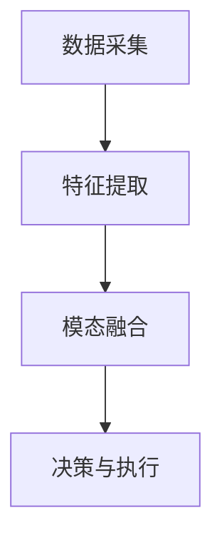
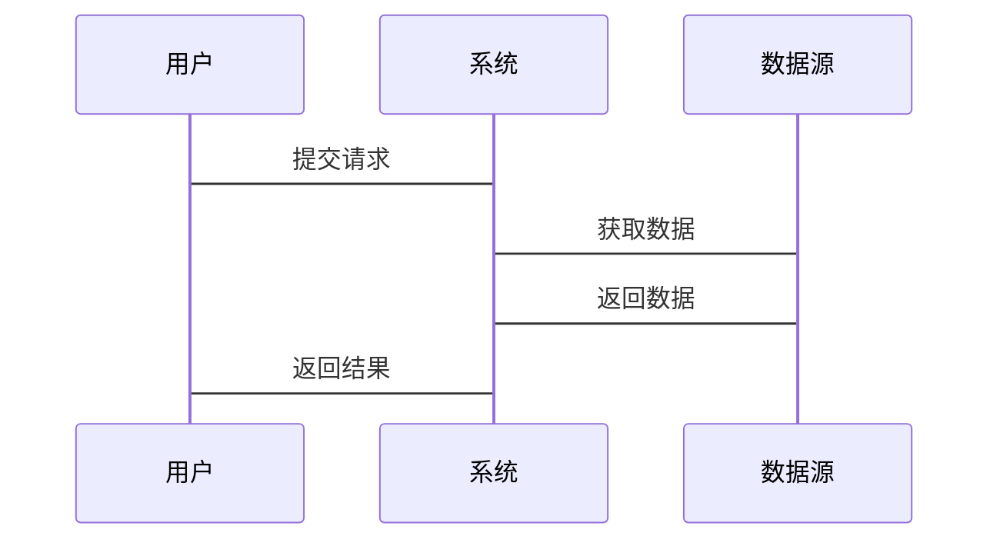

                 


# 企业AI Agent的多模态学习：整合文本、图像与语音数据

> 关键词：企业AI Agent，多模态学习，文本数据，图像数据，语音数据，人工智能，数据整合

> 摘要：随着人工智能技术的快速发展，企业AI Agent正逐渐成为企业智能化转型的重要工具。通过整合文本、图像和语音等多种数据类型，企业AI Agent能够更全面地理解和处理信息，从而提升企业的决策效率和竞争力。本文将深入探讨企业AI Agent的多模态学习方法，包括其核心概念、算法原理、系统架构设计以及实际应用案例，为读者提供全面的指导和启发。

---

## 第一部分: 企业AI Agent的多模态学习概述

### 第1章: 企业AI Agent与多模态学习概述

#### 1.1 企业AI Agent的基本概念
- **1.1.1 什么是企业AI Agent**
  - 企业AI Agent是一种能够感知环境、理解任务并执行复杂操作的智能实体。
  - 通过整合多种数据源（文本、图像、语音等），企业AI Agent能够提供更智能、更高效的解决方案。

- **1.1.2 AI Agent的分类与特点**
  - 分类：
    - **任务型AI Agent**：专注于完成特定任务（如客服助手、销售预测）。
    - **通用型AI Agent**：具备广泛的应用能力，能够处理多种任务。
  - 特点：
    - 智能性：能够理解上下文并做出决策。
    - 自适应性：能够根据反馈优化行为。
    - 可扩展性：能够处理多种数据类型和任务。

- **1.1.3 企业AI Agent的应用场景**
  - 客户服务：通过整合文本和语音数据，提供智能客服。
  - 企业数据分析：整合文本和图像数据，进行市场分析。
  - 内部流程优化：通过语音识别技术优化内部沟通效率。

#### 1.2 多模态学习的基本概念
- **1.2.1 多模态学习的定义**
  - 多模态学习是指在同一学习任务中，整合和利用多种数据模态（如文本、图像、语音等）进行学习和推理的方法。

- **1.2.2 多模态学习的核心思想**
  - 利用多种数据模态的优势互补，提升模型的表达能力和准确性。
  - 通过跨模态信息的融合，增强模型对复杂场景的理解能力。

- **1.2.3 多模态学习与单模态学习的区别**
  - 单模态学习仅依赖一种数据类型，模型的能力受限。
  - 多模态学习整合多种数据类型，模型能够更全面地理解任务。

#### 1.3 企业AI Agent中的多模态学习
- **1.3.1 多模态学习在企业AI Agent中的重要性**
  - 提高AI Agent的理解能力：通过整合文本、图像和语音数据，AI Agent能够更全面地理解用户需求。
  - 增强决策能力：多模态数据的整合能够提供更丰富的信息，帮助AI Agent做出更准确的决策。
  - 提升用户体验：通过多模态数据的处理，AI Agent能够提供更智能化、个性化的服务。

- **1.3.2 多模态学习的应用价值**
  - 提高企业效率：通过多模态数据的整合，企业能够更高效地处理和分析数据。
  - 增强竞争力：具备多模态学习能力的AI Agent能够为企业提供更优质的服务，提升市场竞争力。
  - 降低运营成本：通过自动化处理和分析多模态数据，企业能够降低运营成本。

- **1.3.3 本书的目标与结构**
  - 目标：通过系统化的方法，深入探讨企业AI Agent的多模态学习方法，为企业技术决策者和开发者提供实践指导。
  - 结构：从理论到实践，涵盖核心概念、算法原理、系统架构设计以及实际应用案例。

---

## 第2章: 企业AI Agent的背景与概念

### 2.1 企业AI Agent的发展背景

#### 2.1.1 人工智能的发展历程
- 人工智能技术的发展从20世纪50年代开始，经历了多个阶段，从规则驱动的专家系统到现在的深度学习模型。

#### 2.1.2 企业AI Agent的兴起
- 随着深度学习技术的进步，AI Agent逐渐从学术研究走向实际应用。
- 企业AI Agent的兴起得益于多模态数据的整合和处理技术的进步。

#### 2.1.3 多模态学习的技术进步
- 自然语言处理技术的进步：如BERT模型的出现，使得文本理解能力显著提升。
- 计算机视觉技术的进步：如卷积神经网络的发展，使得图像识别能力大幅增强。
- 语音识别技术的进步：如深度神经网络的应用，使得语音识别的准确率不断提高。

### 2.2 企业AI Agent的核心概念

#### 2.2.1 AI Agent的基本功能
- 数据感知：通过多种数据模态感知环境信息。
- 信息理解：对感知到的信息进行理解和分析。
- 决策与执行：基于理解和分析做出决策，并执行相应的操作。

#### 2.2.2 企业AI Agent的特点
- **跨模态处理能力**：能够同时处理文本、图像和语音等多种数据类型。
- **自适应性**：能够根据环境变化和用户反馈优化自身行为。
- **高效性**：能够在较短的时间内完成复杂的任务处理。

#### 2.2.3 企业AI Agent的应用场景
- **客户服务**：通过整合文本和语音数据，提供智能客服。
- **数据分析**：通过整合文本和图像数据，进行市场分析和预测。
- **内部流程优化**：通过语音识别技术优化内部沟通效率。

### 2.3 多模态学习的背景与挑战

#### 2.3.1 多模态数据的特点
- **多样性**：文本、图像和语音数据具有不同的结构和特征。
- **异构性**：不同数据模态之间存在语义和结构上的差异。
- **关联性**：不同数据模态之间存在语义上的关联性。

#### 2.3.2 多模态学习的技术挑战
- **数据融合的复杂性**：如何有效融合不同数据模态的信息是一个技术难题。
- **模型设计的复杂性**：需要设计能够处理多种数据模态的复杂模型。
- **计算资源的需求**：多模态学习需要大量的计算资源，对企业的技术能力提出了较高要求。

#### 2.3.3 企业中的多模态数据整合
- **数据源的多样性**：企业内部可能拥有多种数据源，如客户咨询记录（文本）、产品图片（图像）和语音通话记录。
- **数据格式的多样性**：不同数据源的数据格式和结构可能差异较大。
- **数据整合的复杂性**：如何将不同数据源的数据整合到一个统一的框架中，是一个技术挑战。

---

## 第3章: 多模态学习的核心概念与联系

### 3.1 多模态学习的核心概念

#### 3.1.1 多模态学习的定义
- 多模态学习是指在同一学习任务中，整合和利用多种数据模态（如文本、图像、语音等）进行学习和推理的方法。

#### 3.1.2 多模态学习的核心思想
- 利用多种数据模态的优势互补，提升模型的表达能力和准确性。
- 通过跨模态信息的融合，增强模型对复杂场景的理解能力。

#### 3.1.3 多模态学习的分类
- **基于任务的多模态学习**：根据不同任务需求，整合不同的数据模态。
- **基于模态的多模态学习**：根据不同数据模态的特点，设计不同的处理方法。

### 3.2 多模态学习的核心算法

#### 3.2.1 多模态融合的算法
- **早期融合（Early Fusion）**：在数据预处理阶段，将不同模态的数据进行融合。
- **晚期融合（Late Fusion）**：在特征提取阶段，将不同模态的特征进行融合。

#### 3.2.2 多模态学习的挑战
- 数据异构性：不同模态的数据具有不同的结构和特征。
- 跨模态语义对齐：如何在不同模态之间建立语义对齐是一个技术难题。
- 模型设计的复杂性：需要设计能够处理多种模态数据的复杂模型。

---

## 第4章: 多模态学习的算法原理

### 4.1 多模态学习的算法原理

#### 4.1.1 多模态神经网络的结构
- **模态特定网络**：针对每种数据模态设计专门的网络结构。
- **模态融合网络**：将不同模态的特征进行融合，形成一个统一的特征表示。

#### 4.1.2 多模态学习的数学模型
- **联合表示模型**：将不同模态的数据表示为一个统一的向量空间。
- **跨模态注意力机制**：通过注意力机制，赋予不同模态不同的权重，增强模型对重要模态信息的关注。

#### 4.1.3 多模态学习的训练方法
- **联合训练**：将多模态数据同时输入模型进行训练。
- **分阶段训练**：先分别训练每种模态的特征提取器，再进行模态融合。

---

## 第5章: 企业AI Agent的系统架构设计

### 5.1 企业AI Agent的系统架构

#### 5.1.1 系统功能设计
- **数据采集模块**：负责采集和预处理多种模态的数据。
- **特征提取模块**：对不同模态的数据进行特征提取。
- **模态融合模块**：将不同模态的特征进行融合，形成统一的特征表示。
- **决策与执行模块**：基于融合的特征，做出决策并执行相应的操作。

#### 5.1.2 系统架构图


#### 5.1.3 系统接口设计
- **数据接口**：与企业内部的各种数据源进行对接。
- **用户接口**：与企业员工或客户进行交互。
- **第三方接口**：与外部数据源或服务进行对接。

#### 5.1.4 系统交互流程


---

## 第6章: 项目实战

### 6.1 项目背景与目标
- **项目背景**：某企业希望构建一个能够处理文本、图像和语音数据的AI Agent，用于客户服务和内部流程优化。
- **项目目标**：提升企业的智能化水平，提高客户满意度和内部效率。

### 6.2 环境配置
- **操作系统**：Linux（Ubuntu 20.04）
- **编程语言**：Python 3.8
- **深度学习框架**：TensorFlow 2.5
- **自然语言处理库**：spaCy 3.5
- **计算机视觉库**：OpenCV 4.5
- **语音处理库**： librosa 0.8

### 6.3 核心实现代码
```python
import tensorflow as tf
import numpy as np
import librosa
import cv2
import spacy

# 文本处理
def process_text(text):
    nlp = spacy.load("en_core_web_sm")
    doc = nlp(text)
    return [token.text for token in doc]

# 图像处理
def process_image(image_path):
    img = cv2.imread(image_path)
    gray = cv2.cvtColor(img, cv2.COLOR_BGR2GRAY)
    return gray

# 语音处理
def process_audio(audio_path):
    audio, sr = librosa.load(audio_path, sr=None)
    mfccs = librosa.feature.mfcc(y=audio, sr=sr, n_mfcc=13)
    return mfccs

# 模态融合
def fuse_modalities(text_feats, image_feats, audio_feats):
    # 使用简单的拼接方式融合特征
    fused_feats = np.concatenate((text_feats, image_feats, audio_feats), axis=1)
    return fused_feats
```

### 6.4 功能实现与测试
- **文本处理**：对客户咨询记录进行分词和实体识别。
- **图像处理**：对产品图片进行目标检测和图像分类。
- **语音处理**：对语音通话记录进行情感分析和语音识别。
- **模态融合**：将文本、图像和语音特征进行融合，形成统一的特征向量。
- **模型训练**：使用融合的特征向量对模型进行训练，提升分类和预测的准确率。

### 6.5 实际案例分析
- **案例一**：客户服务中的多模态数据整合。
  - 输入：客户咨询记录（文本）、客户头像（图像）、语音通话记录。
  - 输出：智能客服系统能够根据客户的文本咨询、图像信息和语音情感，提供更个性化的服务。
- **案例二**：内部流程优化中的多模态数据整合。
  - 输入：员工沟通记录（文本）、会议记录（图像）、语音会议录音。
  - 输出：系统能够识别会议中的关键信息，并自动生成会议纪要。

---

## 第7章: 最佳实践与总结

### 7.1 最佳实践
- **数据预处理**：在整合多模态数据之前，需要对每种数据进行预处理，确保数据的干净和一致性。
- **模态融合策略**：根据具体任务需求，选择合适的模态融合策略（如早期融合或晚期融合）。
- **模型调优**：通过实验和测试，不断优化模型的结构和参数，提升模型的性能。
- **计算资源管理**：合理分配计算资源，确保系统的高效运行和扩展性。

### 7.2 总结与展望
- **总结**：企业AI Agent的多模态学习通过整合文本、图像和语音数据，显著提升了企业的智能化水平和竞争力。
- **展望**：随着人工智能技术的不断进步，企业AI Agent的多模态学习将更加智能化和多样化，为企业带来更多的创新机会和竞争优势。

---

## 作者：AI天才研究院/AI Genius Institute & 禅与计算机程序设计艺术 /Zen And The Art of Computer Programming

---

**全文完**

