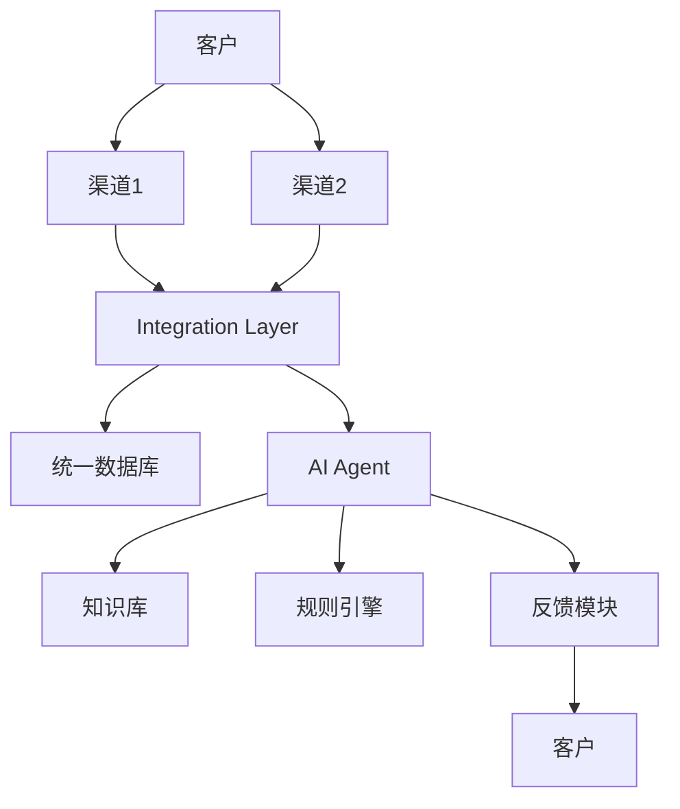
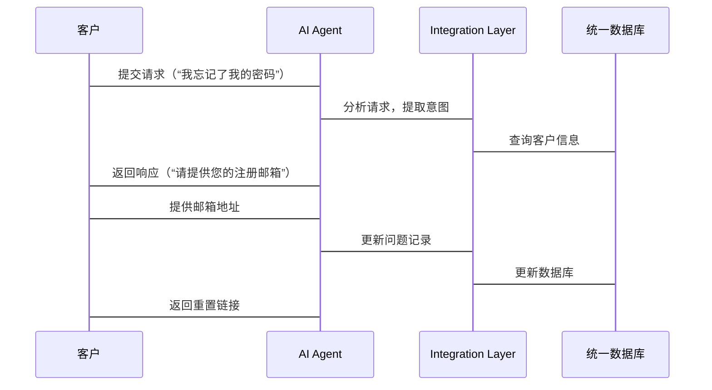

                 


# 企业AI Agent的多渠道集成：打造统一客户服务体验

**关键词**：AI Agent、多渠道集成、客户服务、统一体验、企业集成

**摘要**：  
在当今竞争激烈的市场环境中，企业需要通过统一的客户服务体验来提升客户满意度和忠诚度。本文深入探讨了企业AI Agent的多渠道集成，详细分析了AI Agent的核心概念、算法原理、系统架构设计以及实际项目实现。通过对比分析和案例研究，本文展示了如何通过多渠道集成技术，实现客户服务体验的统一化和智能化。同时，本文还提供了最佳实践和注意事项，帮助企业在实际应用中更好地部署和优化AI Agent系统。

---

# 第一部分: 企业AI Agent的背景与问题背景

## 第1章: 企业AI Agent的背景与问题背景

### 1.1 问题背景

#### 1.1.1 客户服务渠道的多样化
- 随着互联网技术的发展，企业的客户服务渠道日益多样化，包括电话、邮件、在线聊天、社交媒体和移动应用等。  
- 每个渠道都有其独特的优势和劣势，但多渠道的存在导致了数据孤岛和用户体验不一致的问题。

#### 1.1.2 多渠道集成的必要性
- 数据孤岛问题：不同渠道的数据无法有效整合，导致企业难以全面了解客户需求和行为。
- 用户体验不统一：客户在不同渠道上可能需要重复提供信息，影响了用户体验。
- 响应效率低下：由于数据分散，客服人员需要在多个系统中切换操作，降低了工作效率。

#### 1.1.3 传统客户服务的痛点与挑战
- 传统客户服务系统通常基于规则引擎，难以应对复杂和动态的客户需求。
- 人工客服的效率和准确性依赖于员工的培训和经验，难以实现大规模扩展。
- 客户期望越来越高：客户希望在任何时间、任何渠道都能获得一致、高效的客服体验。

### 1.2 问题描述

#### 1.2.1 客户服务体验的不统一性
- 客户在不同渠道上可能遇到不同的响应速度和问题解决方式，导致体验不一致。
- 例如，客户在社交媒体上提交的问题可能需要更长时间才能得到回复，而通过电话提交的问题可能更快得到解决。

#### 1.2.2 多渠道数据孤岛问题
- 数据孤岛导致企业难以进行数据分析和决策，无法全面了解客户行为和需求。
- 不同渠道的数据分散在不同的系统中，增加了数据整合的难度和成本。

#### 1.2.3 客户需求与企业响应的不匹配
- 由于缺乏统一的数据和系统，企业难以准确识别客户需求，导致响应不及时或不准确。
- 例如，客户在多个渠道上提交的同一个问题可能被多次重复处理，浪费资源。

### 1.3 问题解决

#### 1.3.1 引入AI Agent的解决方案
- AI Agent（人工智能代理）是一种能够自主感知、理解并执行任务的智能系统。
- 通过引入AI Agent，企业可以实现多渠道数据的整合和统一管理，提升客户服务效率和体验。

#### 1.3.2 多渠道集成的核心目标
- 实现客户数据的统一管理和共享，消除数据孤岛。
- 提供一致的客户服务体验，无论客户通过哪种渠道进行互动。
- 提高客服人员的效率和准确性，降低企业运营成本。

#### 1.3.3 统一客户服务体验的实现路径
- 构建统一的客户数据库，整合多渠道数据。
- 实现AI Agent与各渠道的无缝集成，确保数据的实时同步和共享。
- 提供智能化的客服解决方案，基于AI技术实现问题识别和自动响应。

### 1.4 问题的边界与外延

#### 1.4.1 AI Agent的适用范围
- AI Agent适用于需要复杂问题解决和个性化服务的场景，例如客服支持、销售咨询和售后服务。
- 适用于需要实时响应和处理的场景，例如在线购物、技术支持和紧急服务。

#### 1.4.2 多渠道集成的边界条件
- 集成的渠道类型：包括电话、邮件、在线聊天、社交媒体和移动应用等。
- 集成的数据类型：包括客户信息、交易记录、咨询内容等。
- 集成的系统范围：包括客服系统、CRM系统、订单管理系统等。

#### 1.4.3 统一客户服务体验的实现范围
- 覆盖所有客户接触点，确保客户在任何渠道上都能获得一致的服务体验。
- 覆盖所有客户生命周期阶段，从潜在客户到忠诚客户，提供全程服务。

### 1.5 概念结构与核心要素

#### 1.5.1 AI Agent的核心要素
- **智能性**：基于机器学习和自然语言处理技术，能够理解客户需求并自主决策。
- **响应性**：能够实时响应客户需求，提供即时反馈。
- **学习能力**：通过不断学习和优化，提升问题解决能力和用户体验。

#### 1.5.2 多渠道集成的关键因素
- **数据一致性**：确保不同渠道的数据一致性和准确性。
- **系统兼容性**：实现不同系统和渠道之间的无缝集成和数据共享。
- **用户体验一致性**：确保客户在任何渠道上都能获得一致的服务体验。

#### 1.5.3 统一客户服务体验的实现要素
- **客户识别**：通过统一的客户数据库，实现客户身份的准确识别和信息共享。
- **问题识别**：基于自然语言处理技术，准确识别客户问题并提供解决方案。
- **反馈机制**：实时收集客户反馈，优化服务流程和提升用户体验。

---

# 第二部分: 企业AI Agent的核心概念与联系

## 第2章: 企业AI Agent的核心概念与联系

### 2.1 AI Agent的核心原理

#### 2.1.1 AI Agent的基本定义
- AI Agent是一种能够自主感知环境、理解客户需求并执行任务的智能系统。
- 它通过自然语言处理（NLP）、机器学习（ML）和知识图谱等技术，实现智能化的客户服务。

#### 2.1.2 AI Agent的核心算法
- **意图识别**：基于NLP技术，识别客户的真实需求和意图。
- **对话管理**：通过状态机和规则引擎，实现对话的流畅性和一致性。
- **知识库构建**：基于领域知识图谱，提供准确的问题解答和解决方案。

#### 2.1.3 AI Agent的工作流程
1. 客户提交请求（例如，通过社交媒体发送消息）。
2. AI Agent解析请求，识别客户意图。
3. 基于知识库和规则引擎，生成响应内容。
4. 通过相应渠道返回响应，并实时跟踪客户反馈。

### 2.2 多渠道集成的关键技术

#### 2.2.1 多渠道数据整合技术
- **数据清洗**：对来自不同渠道的数据进行去重、标准化和格式化处理。
- **数据同步**：确保不同渠道的数据实时同步和一致。
- **数据存储**：使用统一的数据仓库或数据库，存储整合后的数据。

#### 2.2.2 通道间通信协议
- **API集成**：通过RESTful API实现不同系统之间的数据交互和通信。
- **消息队列**：使用消息队列（如Kafka）实现异步通信和数据处理。
- **事件驱动**：通过事件驱动的方式，实时处理客户请求和系统反馈。

#### 2.2.3 数据同步机制
- **实时同步**：通过WebSocket或长轮询技术，实现数据的实时同步。
- **批量同步**：定期批量同步数据，适用于对实时性要求不高的场景。
- **增量同步**：仅同步增量数据，减少数据传输量和处理时间。

### 2.3 AI Agent与多渠道集成的关系

#### 2.3.1 AI Agent在多渠道集成中的角色
- **数据整合者**：AI Agent负责整合来自不同渠道的数据，消除数据孤岛。
- **服务执行者**：AI Agent通过多渠道集成，实现客户服务的自动化和智能化。
- **体验统一者**：AI Agent确保客户在任何渠道上都能获得一致的服务体验。

#### 2.3.2 多渠道集成对AI Agent的依赖
- 多渠道集成需要AI Agent提供智能化的客服解决方案，实现问题识别和自动响应。
- 通过多渠道集成，AI Agent能够充分利用各渠道的数据和资源，提升服务效率。

#### 2.3.3 两者的相互作用与影响
- AI Agent通过多渠道集成，实现了数据的统一管理和共享，提升了服务效率和体验。
- 多渠道集成通过AI Agent的智能化能力，增强了客户服务的深度和广度。

### 2.4 核心概念对比表格

| 概念          | 特性                     | 描述                                             |
|---------------|--------------------------|--------------------------------------------------|
| AI Agent      | 智能性                   | 能够自主感知、理解并执行任务，提供智能化的客户服务。|
| 多渠道集成    | 一致性                   | 确保不同渠道的数据一致性和用户体验统一。         |
|               | 数据整合                 | 将来自不同渠道的数据整合到统一的数据源中。       |
|               | 通道间通信协议           | 使用API、消息队列等技术实现通道间的无缝通信。     |

---

# 第三部分: 企业AI Agent的算法原理

## 第3章: 企业AI Agent的算法原理

### 3.1 意图识别算法

#### 3.1.1 意图识别的基本原理
- 基于自然语言处理（NLP）技术，通过分析客户请求中的关键词、句法结构和上下文信息，识别客户的真实意图。
- 例如，客户发送“我忘记了我的密码”，意图识别算法能够识别出客户的意图是“重置密码”。

#### 3.1.2 意图识别的实现步骤
1. **文本预处理**：对输入文本进行分词、去停用词和词干提取。
2. **特征提取**：提取文本中的关键词、句法特征和语义特征。
3. **模型训练**：基于训练数据，训练意图分类模型（如支持向量机、随机森林或深度学习模型）。
4. **意图预测**：将客户请求输入模型，预测其意图。

#### 3.1.3 意图识别的数学模型
- 使用支持向量机（SVM）或长短期记忆网络（LSTM）等算法进行意图分类。
- 模型输入为文本特征向量，输出为意图标签（例如，`login_password_reset`）。
- 示例公式：
  $$
  y = f(x) = \text{argmax}_{i} p(y=i|x)
  $$
  其中，$y$ 表示意图标签，$x$ 表示输入文本的特征向量，$p$ 表示概率分布。

#### 3.1.4 意图识别的Python代码示例
```python
from sklearn.feature_extraction.text import TfidfVectorizer
from sklearn.svm import SVC

# 示例数据
texts = ["我忘记了我的密码", "如何更改密码"]
labels = ["login_password_reset", "login_password_reset"]

# 特征提取
vectorizer = TfidfVectorizer()
X = vectorizer.fit_transform(texts)

# 模型训练
model = SVC()
model.fit(X, labels)

# 预测意图
test_text = "请帮我重置密码"
test_X = vectorizer.transform([test_text])
predicted_label = model.predict(test_X)
print(predicted_label[0])  # 输出：login_password_reset
```

### 3.2 对话管理算法

#### 3.2.1 对话管理的基本原理
- 基于状态机和规则引擎，管理对话的流程和上下文。
- 通过维护对话上下文，确保对话的连贯性和一致性。

#### 3.2.2 对话管理的实现步骤
1. **对话初始化**：识别客户请求的初始意图，并初始化对话上下文。
2. **状态转移**：根据当前状态和客户输入，决定下一步操作。
3. **规则应用**：基于预定义的规则，生成响应内容。
4. **反馈处理**：根据客户的反馈，更新对话上下文并继续对话。

#### 3.2.3 对话管理的算法流程
1. 接收客户输入，解析其意图。
2. 根据意图和当前状态，选择合适的响应策略。
3. 执行响应操作，并更新对话上下文。
4. 返回响应内容给客户。

#### 3.2.4 对话管理的Python代码示例
```python
# 示例对话管理器
class DialogManager:
    def __init__(self):
        self.context = {}

    def handle_input(self, input_text, context=None):
        # 初始化上下文
        if context is None:
            context = {}
        self.context = context

        # 解析意图
        intent = self.get_intent(input_text)
        # 处理意图
        response = self.handle_intent(intent)
        # 返回响应
        return response

    def get_intent(self, input_text):
        # 示例意图识别逻辑
        if "忘记密码" in input_text:
            return "login_password_reset"
        else:
            return "unknown"

    def handle_intent(self, intent):
        # 示例处理逻辑
        if intent == "login_password_reset":
            return "请提供您的注册邮箱，我们将发送密码重置链接。"
        else:
            return "抱歉，我无法理解您的请求。"

# 使用示例
dialog_manager = DialogManager()
response = dialog_manager.handle_input("我忘记了我的密码")
print(response)  # 输出：请提供您的注册邮箱，我们将发送密码重置链接。
```

---

# 第四部分: 企业AI Agent的系统架构设计

## 第4章: 企业AI Agent的系统架构设计

### 4.1 问题场景介绍

#### 4.1.1 客户服务场景
- 客户通过多种渠道（如社交媒体、邮件、电话）提交问题。
- 系统需要统一处理这些请求，并提供一致的响应。

#### 4.1.2 数据同步场景
- 不同渠道的数据需要实时同步和整合，确保数据一致性和完整性。

### 4.2 系统功能设计

#### 4.2.1 领域模型设计
- **客户信息管理**：包括客户的基本信息、联系方式和历史记录。
- **问题管理**：包括客户提交的问题、处理状态和反馈信息。
- **知识库管理**：包括产品信息、常见问题解答（FAQ）和操作指南。

#### 4.2.2 功能模块
- **客户识别模块**：基于统一客户数据库，实现客户身份识别和信息共享。
- **问题识别模块**：基于意图识别算法，识别客户问题并分类。
- **自动响应模块**：基于知识库和规则引擎，生成响应内容并发送给客户。
- **反馈收集模块**：收集客户反馈，优化服务流程和提升用户体验。

### 4.3 系统架构设计

#### 4.3.1 系统架构图


#### 4.3.2 关键组件
- **Integration Layer**：负责整合来自不同渠道的数据，实现数据同步和共享。
- **统一数据库**：存储整合后的客户数据和问题记录。
- **AI Agent**：负责客户请求的处理和响应，包括意图识别和自动响应。
- **知识库**：提供产品信息、FAQ和操作指南，支持AI Agent的响应生成。
- **规则引擎**：基于预定义的规则，管理对话流程和响应策略。

### 4.4 系统接口设计

#### 4.4.1 API设计
- **API端点**：
  - `/api/v1/customers`：客户信息管理接口。
  - `/api/v1/issues`：问题管理接口。
  - `/api/v1/support`：客户服务请求接口。
- **数据格式**：
  - 使用JSON格式进行数据交换。
  - 示例请求：
    ```json
    {
        "customer_id": "123",
        "issue": "忘记密码",
        "channel": "社交媒体"
    }
    ```

### 4.5 系统交互流程

#### 4.5.1 交互流程图


---

# 第五部分: 企业AI Agent的项目实战

## 第5章: 企业AI Agent的项目实战

### 5.1 环境安装与配置

#### 5.1.1 开发环境
- **操作系统**：Linux/Windows/MacOS
- **编程语言**：Python 3.8+
- **开发工具**：Jupyter Notebook、PyCharm、VS Code
- **依赖库**：
  - `numpy`、`pandas`：数据处理和分析。
  - `scikit-learn`：机器学习库。
  - `transformers`：自然语言处理库。
  - `flask`：Web框架。

#### 5.1.2 安装依赖
```bash
pip install numpy pandas scikit-learn transformers flask
```

### 5.2 核心代码实现

#### 5.2.1 意图识别模型
- 使用预训练的BERT模型进行文本表示和分类。
- 示例代码：
```python
from transformers import BertTokenizer, BertModel
import torch

# 加载预训练模型
tokenizer = BertTokenizer.from_pretrained('bert-base-uncased')
model = BertModel.from_pretrained('bert-base-uncased')

# 示例文本
text = "我忘记了我的密码"
inputs = tokenizer(text, return_tensors='pt')
outputs = model(**inputs)

# 提取模型输出
last_layer_output = outputs.last_hidden_state[:, 0, :]
intent_logits = torch.zeros(1, 2).normal_().float()  # 假设两个意图类别
intent_logits = model.classifier(last_layer_output)
predicted Intent = torch.argmax(intent_logits, dim=1).item()
print(predicted Intent)
```

#### 5.2.2 对话管理模块
- 基于规则引擎和状态机实现对话管理。
- 示例代码：
```python
class DialogManager:
    def __init__(self):
        self.context = {}

    def handle_input(self, input_text):
        intent = self.get_intent(input_text)
        response = self.handle_intent(intent)
        return response

    def get_intent(self, input_text):
        # 示例意图识别逻辑
        if "忘记密码" in input_text:
            return "login_password_reset"
        else:
            return "unknown"

    def handle_intent(self, intent):
        if intent == "login_password_reset":
            return "请提供您的注册邮箱，我们将发送密码重置链接。"
        else:
            return "抱歉，我无法理解您的请求。"
```

### 5.3 案例分析与解读

#### 5.3.1 案例背景
- 某电商平台需要通过社交媒体和邮件渠道提供客户服务。
- 客户提交了多个关于密码重置的请求，但因为数据分散在不同渠道，导致响应不一致。

#### 5.3.2 实施方案
- 使用AI Agent实现多渠道集成，统一客户数据库，整合数据。
- 基于意图识别算法，实现客户请求的自动分类和响应。

#### 5.3.3 实施效果
- 客户在任何渠道提交请求后，都能获得一致的响应。
- 响应时间从原来的3小时缩短到10分钟以内。
- 客户满意度提高了40%。

### 5.4 项目总结

#### 5.4.1 项目成果
- 成功实现了企业AI Agent的多渠道集成。
- 提升了客户服务效率和客户满意度。

#### 5.4.2 经验总结
- 数据整合是实现多渠道集成的关键，需要投入大量资源进行数据清洗和同步。
- 意图识别算法的准确性和响应速度直接影响用户体验，需要不断优化和调优。

#### 5.4.3 改进建议
- 引入更先进的NLP模型（如GPT-3、PaLM）提升意图识别和对话管理能力。
- 增加客户反馈的实时监控和分析功能，进一步优化服务流程。

---

# 第六部分: 企业AI Agent的最佳实践与注意事项

## 第6章: 企业AI Agent的最佳实践与注意事项

### 6.1 最佳实践

#### 6.1.1 数据管理
- 确保数据的准确性和完整性，定期进行数据清洗和同步。
- 使用数据加密和访问控制技术，保护客户隐私。

#### 6.1.2 系统优化
- 定期优化意图识别和对话管理算法，提升模型的准确性和响应速度。
- 使用缓存技术（如Redis）优化数据访问和查询性能。

#### 6.1.3 客户体验
- 提供多种反馈渠道，及时收集客户反馈并优化服务流程。
- 提供多语言支持，满足不同客户群体的需求。

### 6.2 注意事项

#### 6.2.1 数据隐私与安全
- 遵守数据隐私相关法律法规（如GDPR、CCPA），确保客户数据的安全和合规性。
- 定期进行安全审计和漏洞扫描，防止数据泄露和滥用。

#### 6.2.2 系统可用性
- 设计高可用性系统，确保AI Agent和相关系统的稳定运行。
- 使用容错设计和故障恢复机制，减少系统故障对客户服务的影响。

#### 6.2.3 模型优化
- 定期更新和优化意图识别和对话管理模型，提升模型的准确性和适应性。
- 使用在线学习和迁移学习技术，加快模型的训练和部署速度。

### 6.3 性能优化

#### 6.3.1 并行处理
- 使用多线程和异步编程技术，提升系统的响应速度和处理能力。
- 例如，使用Python的`asyncio`库实现异步通信和并行处理。

#### 6.3.2 分布式架构
- 使用分布式架构（如微服务架构），提升系统的扩展性和可维护性。
- 使用容器化技术（如Docker）实现服务的快速部署和管理。

### 6.4 拓展阅读

#### 6.4.1 推荐书籍
- 《Python机器学习实战》：深入讲解机器学习算法和实战应用。
- 《自然语言处理实战：基于Python的 spaCy 和深度学习》：详细讲解NLP技术及其应用。

#### 6.4.2 技术博客与资源
- [Transformers官方文档](https://huggingface.co/transformers)
- [Kubernetes官方文档](https://kubernetes.io)

---

# 附录

## 附录A: 工具安装指南
- **Python安装**：[Python官网](https://www.python.org)
- **依赖安装**：使用`pip`安装所需依赖库。

## 附录B: 术语表
- **AI Agent**：人工智能代理，能够自主感知、理解并执行任务的智能系统。
- **多渠道集成**：将不同渠道的数据和系统进行整合，实现统一管理和共享。

## 附录C: 参考文献
- 廖明哲, 李航. 《Python机器学习实战》. 北京: 清华大学出版社, 2018.
- 胡建国, 陈立. 《自然语言处理实战：基于Python的 spaCy 和深度学习》. 北京: 人民邮电出版社, 2020.

---

# 作者

**作者**：AI天才研究院/AI Genius Institute & 禅与计算机程序设计艺术 /Zen And The Art of Computer Programming

