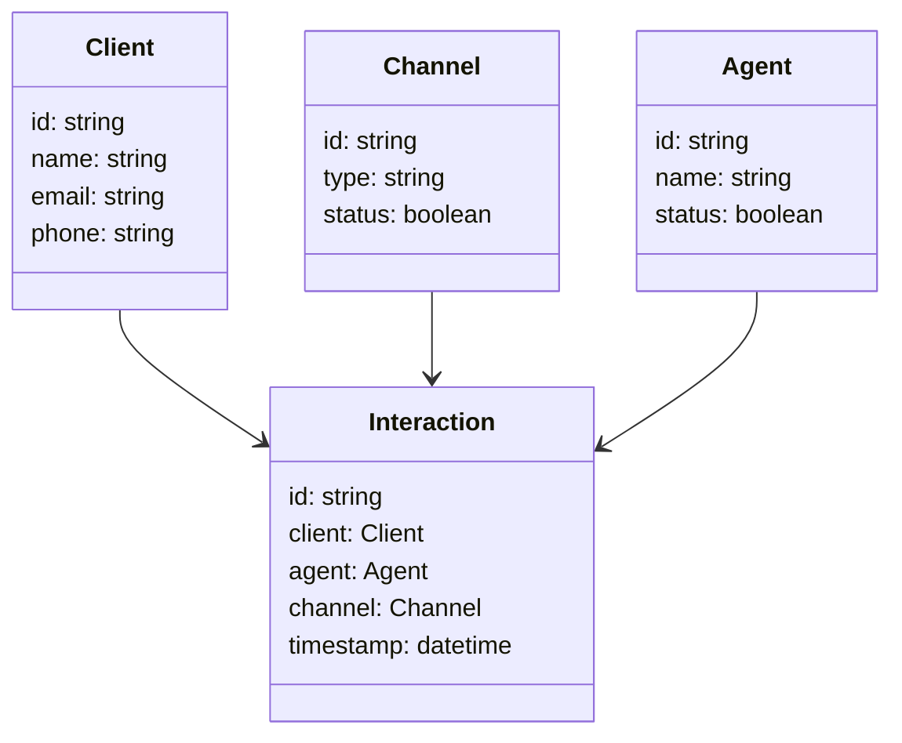
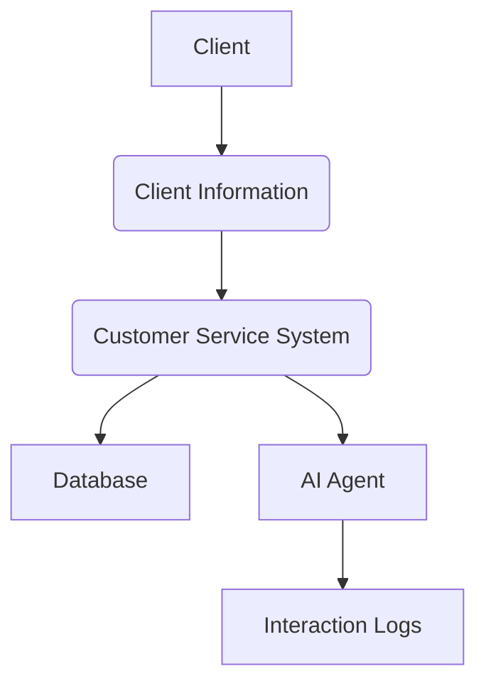

                 


# 企业AI Agent的多渠道集成：统一客户服务体验

## 关键词：企业AI Agent，多渠道集成，客户服务体验，自然语言处理，机器学习，系统架构设计

## 摘要：  
企业AI Agent的多渠道集成是实现统一客户服务体验的关键技术。通过整合多种沟通渠道（如邮件、聊天、电话、社交媒体等），AI Agent能够提供一致、高效、个性化的服务，显著提升客户满意度和企业竞争力。本文从AI Agent的核心概念、算法原理、系统架构设计到项目实战，全面探讨如何实现企业AI Agent的多渠道集成，并统一客户服务体验。

---

## 第一部分：企业AI Agent的多渠道集成概述

## 第1章：企业AI Agent与多渠道集成概述

### 1.1 企业AI Agent的定义与背景

#### 1.1.1 AI Agent的基本概念  
AI Agent（人工智能代理）是一种能够感知环境、执行任务并做出决策的智能系统。它通过与用户交互或与其他系统通信，帮助用户完成特定任务或提供信息服务。  

#### 1.1.2 企业AI Agent的独特性  
企业AI Agent是专门为企业的业务需求设计的，它能够处理复杂的业务逻辑、集成企业系统（如CRM、ERP）并提供定制化的服务。  

#### 1.1.3 多渠道集成的必要性  
随着客户使用多种渠道与企业互动（如邮件、聊天、电话、社交媒体等），企业需要通过多渠道集成，确保客户在不同渠道间享有一致的服务体验。

---

### 1.2 客户服务体验的重要性

#### 1.2.1 客户体验对企业价值的影响  
良好的客户服务体验能够提升客户忠诚度、增加客户满意度，并降低客户流失率。  

#### 1.2.2 统一客户服务体验的目标  
统一客户服务体验的核心目标是让客户在任何渠道与企业互动时，都能感受到一致的服务质量、信息一致性和高效响应。  

#### 1.2.3 多渠道集成对客户体验的提升  
通过多渠道集成，企业能够实现客户信息的统一管理、服务流程的无缝衔接以及个性化服务的提供。

---

### 1.3 本章小结  
本章介绍了企业AI Agent的基本概念及其在多渠道集成中的重要性，强调了统一客户服务体验对企业价值的提升作用。

---

## 第二部分：企业AI Agent的核心概念与原理

## 第2章：企业AI Agent的核心概念

### 2.1 AI Agent的基本原理

#### 2.1.1 AI Agent的定义与分类  
AI Agent可以根据功能和应用场景分为多种类型，如基于规则的AI Agent、基于机器学习的AI Agent、基于自然语言处理（NLP）的AI Agent等。  

#### 2.1.2 企业AI Agent的特征与优势  
企业AI Agent的核心特征包括智能化、自动化、可扩展性和高可用性。其优势在于能够高效处理大量数据、快速响应客户需求并提供个性化服务。  

#### 2.1.3 AI Agent与传统客服系统的区别  
与传统客服系统相比，AI Agent具有更高的效率、更强的智能性和更低的成本。它能够处理复杂的问题，并通过学习不断提升服务质量。

---

### 2.2 多渠道集成的核心概念

#### 2.2.1 多渠道集成的定义  
多渠道集成是指将多种沟通渠道（如邮件、聊天、电话、社交媒体等）整合到一个统一的系统中，确保客户在任何渠道都能享有一致的服务体验。  

#### 2.2.2 各种渠道的特点与优缺点  
- **邮件**：适合长文本交流，但响应速度较慢。  
- **聊天**：实时性高，适合快速响应客户需求。  
- **电话**：适合处理复杂问题，但成本较高。  
- **社交媒体**：适合品牌推广和客户互动，但信息碎片化严重。  

#### 2.2.3 集成的必要性与挑战  
集成的必要性在于提升客户体验和提高运营效率；而挑战则包括技术复杂性、数据同步问题以及不同渠道的兼容性问题。

---

### 2.3 本章小结  
本章深入探讨了企业AI Agent的核心概念及其在多渠道集成中的应用，分析了多渠道集成的必要性与挑战。

---

## 第三部分：企业AI Agent的算法原理与数学模型

## 第3章：AI Agent的算法原理

### 3.1 自然语言处理（NLP）算法

#### 3.1.1 NLP的基本原理  
NLP是一种人工智能技术，旨在让计算机能够理解、处理和生成人类语言。  

#### 3.1.2 常见的NLP算法及其应用  
- **分词**：将文本分割成词语或短语。  
- **实体识别**：识别文本中的实体（如人名、地名、组织名）。  
- **情感分析**：判断文本的情感倾向（正面、负面、中性）。  

#### 3.1.3 算法的优缺点  
NLP算法的优点是能够处理自然语言文本，但其缺点在于算法的复杂性和数据的依赖性。

---

### 3.2 机器学习在AI Agent中的应用

#### 3.2.1 机器学习的基本原理  
机器学习是一种人工智能技术，通过数据训练模型，使其能够从数据中学习并做出预测或决策。  

#### 3.2.2 常见的机器学习算法及其应用  
- **决策树**：用于分类和回归问题。  
- **支持向量机（SVM）**：用于分类问题。  
- **神经网络**：用于复杂模式识别问题。  

#### 3.2.3 算法的优缺点  
机器学习算法的优点是能够处理复杂数据，但其缺点在于需要大量数据和计算资源。

---

### 3.3 算法原理的数学模型

#### 3.3.1 NLP算法的数学模型  
例如，文本表示的向量空间模型（Vector Space Model）可以用以下公式表示：  
$$ \text{文本向量} = \sum_{i=1}^{n} w_i \cdot v_i $$  
其中，$w_i$ 是第$i$个词的权重，$v_i$ 是第$i$个词的向量表示。

#### 3.3.2 机器学习算法的数学模型  
例如，线性回归的数学模型可以用以下公式表示：  
$$ y = \beta_0 + \beta_1 x + \epsilon $$  
其中，$y$ 是目标变量，$x$ 是自变量，$\beta_0$ 是截距，$\beta_1$ 是回归系数，$\epsilon$ 是误差项。

---

### 3.4 本章小结  
本章详细讲解了自然语言处理和机器学习算法在企业AI Agent中的应用，分析了其数学模型和优缺点。

---

## 第四部分：企业AI Agent的系统分析与架构设计

## 第4章：系统分析与架构设计

### 4.1 系统分析

#### 4.1.1 问题场景介绍  
客户通过多种渠道与企业互动，但由于渠道之间的信息不一致，客户体验较差，导致客户满意度下降。  

#### 4.1.2 系统功能需求分析  
- 统一客户信息管理。  
- 实现多渠道的无缝集成。  
- 提供个性化的客户服务。  

#### 4.1.3 系统性能需求分析  
- 响应时间：实时响应客户请求。  
- 可扩展性：支持多种渠道的扩展。  
- 高可用性：确保系统稳定运行。  

---

### 4.2 系统架构设计

#### 4.2.1 领域模型设计（Mermaid类图）



#### 4.2.2 系统架构设计（Mermaid架构图）



---

### 4.3 本章小结  
本章通过系统分析和架构设计，明确了企业AI Agent的系统结构和功能需求。

---

## 第五部分：企业AI Agent的项目实战

## 第5章：项目实战

### 5.1 环境安装

#### 5.1.1 安装Python环境  
```bash
python --version
pip install --upgrade pip
```

#### 5.1.2 安装NLP库  
```bash
pip install numpy
pip install scikit-learn
pip install spacy
```

---

### 5.2 系统核心实现源代码

#### 5.2.1 NLP处理代码  
```python
import spacy

nlp = spacy.load("en_core_web_sm")

text = "The customer is satisfied with the service."
doc = nlp(text)

for token in doc:
    print(token.text, token.pos_)
```

#### 5.2.2 机器学习模型训练代码  
```python
from sklearn.tree import DecisionTreeClassifier
from sklearn.datasets import load_iris
from sklearn.model_selection import train_test_split

iris = load_iris()
X = iris.data
y = iris.target

X_train, X_test, y_train, y_test = train_test_split(X, y, test_size=0.2)

clf = DecisionTreeClassifier()
clf.fit(X_train, y_train)

print(clf.score(X_test, y_test))
```

---

### 5.3 案例分析与详细解读  
通过实际案例分析，展示了如何利用NLP和机器学习算法实现企业AI Agent的多渠道集成，并统一客户服务体验。

---

### 5.4 项目小结  
本章通过实际项目实战，详细讲解了企业AI Agent的实现过程，包括环境安装、代码实现和案例分析。

---

## 第六部分：企业AI Agent的最佳实践与总结

## 第6章：最佳实践与总结

### 6.1 最佳实践

#### 6.1.1 系统设计的注意事项  
- 确保系统架构的可扩展性和可维护性。  
- 定期更新模型以提升服务质量。  

#### 6.1.2 实际应用中的注意事项  
- 数据安全与隐私保护。  
- 客户反馈的及时收集与处理。  

---

### 6.2 小结  
本章总结了企业AI Agent的多渠道集成的关键点，并提出了实际应用中的注意事项和建议。

---

## 作者：AI天才研究院/AI Genius Institute & 禅与计算机程序设计艺术 /Zen And The Art of Computer Programming

---

以上是完整的博客文章目录和部分正文内容，您可以根据需要进一步扩展和详细阐述每个部分的内容。

