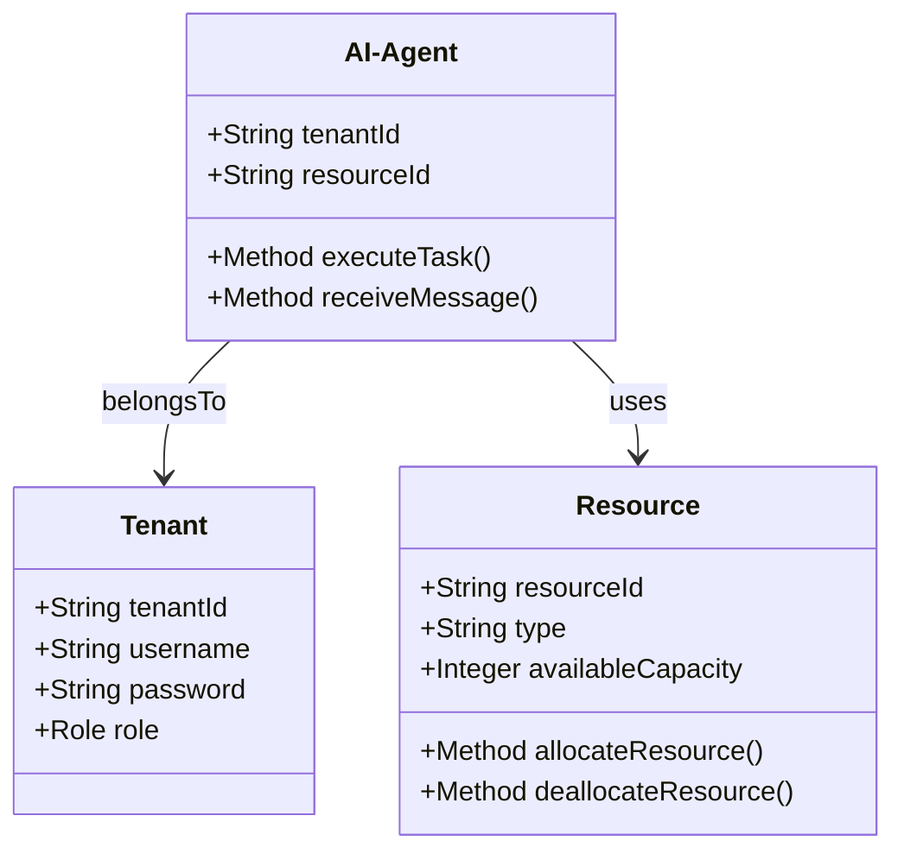

                 


# 企业AI Agent的多租户架构设计与实现

---

## 关键词：
企业AI Agent、多租户架构、通信机制、资源管理、系统架构、算法原理

---

## 摘要：
本文将深入探讨企业AI Agent的多租户架构设计与实现的关键问题。首先，我们从AI Agent的基本概念与技术特点入手，结合多租户架构的核心原理，分析两者结合的必要性与挑战。接着，详细阐述多租户架构下AI Agent的通信机制与资源管理策略，包括基于消息队列的通信设计、资源分配与调度算法。最后，通过实际案例分析，展示如何在企业级系统中实现多租户架构下的AI Agent，并总结设计与实现的最佳实践。

---

# 第一部分: 企业AI Agent的多租户架构设计概述

## 第1章: AI Agent的基本概念与技术特点

### 1.1 AI Agent的定义与核心要素

#### 1.1.1 AI Agent的定义
AI Agent（人工智能代理）是一种能够感知环境、自主决策并执行任务的智能实体。它通过与外部环境交互，利用传感器获取信息，并通过执行器采取行动，以实现特定目标。

#### 1.1.2 AI Agent的核心技术特点
1. **自主性**：AI Agent能够在没有外部干预的情况下自主运行。
2. **反应性**：能够实时感知环境变化并做出反应。
3. **学习能力**：通过机器学习算法不断优化自身行为。
4. **决策能力**：基于当前状态和目标，选择最优行动方案。

#### 1.1.3 AI Agent与传统AI的区别
传统AI（如专家系统）通常是在特定任务下运行，依赖于预定义的规则和知识库。而AI Agent具有更强的自主性和适应性，能够在动态环境中灵活调整行为。

---

### 1.2 企业级AI Agent的应用场景

#### 1.2.1 企业内部的AI Agent应用案例
1. **自动化运维**：AI Agent可以用于服务器监控、故障排查等运维任务。
2. **智能客服**：通过自然语言处理技术为用户提供智能问答服务。
3. **流程自动化**：AI Agent可以自动化处理企业内部的审批流程、数据录入等任务。

#### 1.2.2 多租户环境下的AI Agent挑战
在多租户架构中，AI Agent需要同时服务于多个租户，这带来了以下挑战：
1. **资源隔离**：如何确保不同租户之间的资源互不干扰。
2. **权限管理**：如何在多租户环境下实现细粒度的权限控制。
3. **性能优化**：在高并发场景下，如何保证AI Agent的性能。

#### 1.2.3 企业AI Agent的未来发展趋势
随着AI技术的不断进步，企业AI Agent将更加智能化、自动化，并与区块链、边缘计算等技术深度融合，实现更高效的多租户支持。

---

## 第2章: 多租户架构的基本概念与优势

### 2.1 多租户架构的定义与分类

#### 2.1.1 多租户架构的定义
多租户架构是一种软件架构模式，允许多个租户共享同一个系统资源（如服务器、数据库等），同时保持数据和功能的隔离性。

#### 2.1.2 多租户架构的三种实现模式
1. **单体架构**：所有租户共享同一个代码库和数据存储。
2. **沙箱架构**：通过虚拟化技术为每个租户提供独立的运行环境。
3. **分区架构**：将系统资源按租户进行划分，每个租户拥有独立的资源分区。

#### 2.1.3 多租户架构的优势与劣势
优势：
1. **资源利用率高**：通过共享资源降低成本。
2. **易于扩展**：可以通过增加资源扩展系统容量。
劣势：
1. **隔离性差**：租户之间的资源共享可能导致安全风险。
2. **复杂性高**：设计和实现多租户架构需要较高的技术复杂性。

---

### 2.2 多租户架构在企业系统中的应用

#### 2.2.1 SaaS模式下的多租户架构
在软件即服务（SaaS）模式中，多租户架构被广泛应用于云服务中。例如，Salesforce的CRM系统就是一个典型的多租户SaaS应用。

#### 2.2.2 PaaS模式下的多租户架构
在平台即服务（PaaS）模式中，多租户架构被用于提供统一的开发环境。例如，Heroku云平台为多个租户提供独立的应用运行环境。

#### 2.2.3 多租户架构在企业AI Agent中的应用
在企业AI Agent中，多租户架构可以实现多个租户共享AI模型和计算资源，同时保证数据隔离和性能优化。

---

## 第3章: 企业AI Agent的多租户架构设计原理

### 3.1 多租户架构与AI Agent的结合

#### 3.1.1 多租户架构如何支持AI Agent的运行
通过多租户架构，AI Agent可以共享计算资源（如GPU）和数据存储，同时通过租户隔离保证数据安全。

#### 3.1.2 AI Agent在多租户环境中的角色与职责
1. **数据处理**：AI Agent负责从多个租户收集数据并进行处理。
2. **模型训练**：在多租户环境中，AI Agent可以共享训练数据，提高模型泛化能力。
3. **任务执行**：AI Agent根据租户需求执行特定任务。

---

### 3.2 多租户架构下AI Agent的设计原则

#### 3.2.1 隔离性与安全性
- **数据隔离**：确保不同租户的数据互不干扰。
- **权限控制**：通过RBAC（基于角色的访问控制）实现细粒度权限管理。

#### 3.2.2 资源分配与调度
- **动态分配**：根据租户负载动态调整资源分配。
- **负载均衡**：通过负载均衡算法确保系统性能。

#### 3.2.3 可扩展性与可维护性
- **模块化设计**：将系统划分为多个独立模块，便于扩展和维护。
- **自动化部署**：通过容器化技术实现快速部署和扩展。

---

# 第二部分: 多租户架构下AI Agent的核心技术与实现

## 第4章: 多租户架构下的AI Agent通信机制

### 4.1 多租户环境中的通信模型

#### 4.1.1 请求分发与路由机制
通过消息队列和负载均衡技术实现请求的分发与路由。

#### 4.1.2 跨租户通信的实现方式
- **点对点通信**：租户之间直接通信。
- **通过中间件通信**：通过消息队列或服务网关实现通信。

#### 4.1.3 通信中的安全与权限控制
- **身份认证**：通过JWT（JSON Web Token）实现身份认证。
- **权限校验**：通过访问控制列表（ACL）实现权限校验。

---

### 4.2 基于消息队列的AI Agent通信设计

#### 4.2.1 消息队列在多租户环境中的应用
- **任务队列**：用于处理租户的任务请求。
- **事件队列**：用于发布租户之间的事件通知。

#### 4.2.2 消息队列的性能优化
- **分区队列**：将队列按租户或任务类型进行分区。
- **消费者分组**：将消费者分组以提高吞吐量。

#### 4.2.3 消息队列的可靠性和一致性保障
- **消息确认机制**：确保消息被正确消费。
- **事务机制**：通过事务保证消息的原子性。

---

## 第5章: 多租户架构下的AI Agent资源管理与调度

### 5.1 资源分配策略

#### 5.1.1 基于负载的资源分配
- **CPU分配**：根据租户的负载动态分配CPU资源。
- **内存分配**：根据租户的内存需求动态分配内存资源。

#### 5.1.2 基于优先级的资源分配
- **租户优先级**：根据租户的付费级别分配资源。
- **任务优先级**：根据任务的重要性和紧急程度分配资源。

#### 5.1.3 动态资源调整与扩展
- **弹性伸缩**：根据负载自动调整资源。
- **预分配与预留**：为关键任务预留资源。

---

### 5.2 资源调度算法

#### 5.2.1 基于负载均衡的资源调度
- **轮询调度**：按顺序分配任务。
- **随机调度**：随机选择可用资源。
- **加权调度**：根据资源的可用性加权分配任务。

#### 5.2.2 基于机器学习的资源调度
- **预测模型**：通过机器学习模型预测资源需求。
- **自适应调度**：根据实时负载动态调整调度策略。

---

## 第6章: 多租户架构下AI Agent的系统架构设计

### 6.1 问题场景介绍

#### 6.1.1 问题背景
在多租户架构下，AI Agent需要同时服务于多个租户，如何保证系统的性能、安全性和可扩展性是设计的关键。

#### 6.1.2 问题描述
- **资源竞争**：多个租户同时使用共享资源可能导致性能下降。
- **数据隔离**：如何确保租户之间的数据互不干扰。
- **任务调度**：如何高效地调度任务以满足租户需求。

---

### 6.2 系统功能设计

#### 6.2.1 系统功能模块
1. **任务管理模块**：负责任务的接收、分发和调度。
2. **资源管理模块**：负责资源的分配、监控和回收。
3. **通信模块**：负责租户之间的通信和事件通知。
4. **权限管理模块**：负责租户的权限控制和身份认证。

#### 6.2.2 系统功能设计的类图


---

### 6.3 系统架构设计

#### 6.3.1 系统架构设计的架构图


---

## 第7章: 多租户架构下AI Agent的项目实战

### 7.1 环境安装与配置

#### 7.1.1 系统环境
- 操作系统：Linux（如Ubuntu 20.04）
- 开发工具：IDE（如IntelliJ IDEA）
- 依赖管理工具：Maven
- 云平台：AWS EC2

#### 7.1.2 语言与框架
- 编程语言：Python（版本3.9+）
- 框架：FastAPI（用于API开发）
- 依赖管理：pipenv

---

### 7.2 系统核心实现源代码

#### 7.2.1 AI Agent的通信模块
```python
from fastapi import FastAPI
from pydantic import BaseModel
import logging
import json

app = FastAPI()

class Message(BaseModel):
    tenant_id: str
    content: str
    timestamp: int

@app.post("/api/v1/message")
async def send_message(message: Message):
    # 这里实现消息的存储和分发逻辑
    logging.info(f"Receive message from tenant {message.tenant_id}: {message.content}")
    return {"status": "success", "message_id": str(uuid.uuid4())}
```

---

### 7.3 代码应用解读与分析

#### 7.3.1 代码解读
- **API设计**：使用FastAPI框架实现RESTful API。
- **消息模型**：使用Pydantic定义消息模型。
- **日志记录**：通过Python的logging模块记录日志。

#### 7.3.2 代码分析
- **异步处理**：通过FastAPI的异步功能实现高效的通信。
- **数据持久化**：将消息存储到数据库中，确保消息的持久性。

---

## 第8章: 总结与展望

### 8.1 总结

#### 8.1.1 核心内容回顾
1. AI Agent的基本概念与技术特点。
2. 多租户架构的核心原理与设计原则。
3. 多租户架构下AI Agent的通信机制与资源管理策略。
4. 系统架构设计与项目实战经验。

#### 8.1.2 实践中的注意事项
- **资源隔离**：确保不同租户之间的资源互不干扰。
- **权限管理**：通过RBAC实现细粒度权限控制。
- **性能优化**：通过负载均衡和弹性伸缩优化系统性能。

---

### 8.2 未来展望

#### 8.2.1 多租户架构的未来发展趋势
- **边缘计算**：将AI Agent部署在边缘设备上，实现更低延迟和更高效率。
- **区块链技术**：通过区块链实现租户数据的可信共享。
- **容器化技术**：通过容器化实现AI Agent的快速部署和扩展。

#### 8.2.2 人工智能的未来发展方向
- **通用AI**：开发具有更强通用性的AI Agent。
- **人机协作**：实现更高效的人机协作模式。
- **自主学习**：开发能够自主学习和适应环境的AI Agent。

---

## 作者：AI天才研究院 & 禅与计算机程序设计艺术

