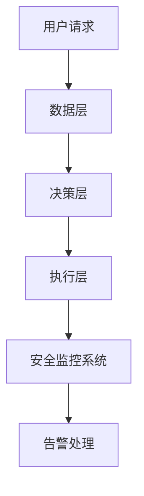
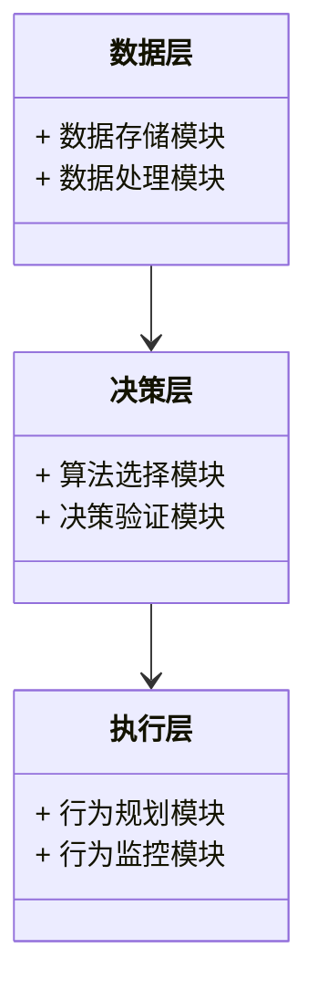

                 


# 企业AI Agent的多维安全防护体系设计与实现

## 关键词：企业安全、AI Agent、多维防护、威胁检测、安全策略、安全架构

## 摘要：  
随着人工智能技术的快速发展，企业AI Agent（智能代理）在提升企业智能化水平和效率方面发挥着越来越重要的作用。然而，AI Agent的广泛应用也带来了新的安全挑战。本文从企业AI Agent的核心概念出发，分析其在企业环境中的应用场景，并提出一套基于多维安全防护体系的设计与实现方案。通过对数据层、决策层和执行层的全面安全防护，结合实际案例分析，本文为企业AI Agent的安全防护提供了理论支持和实践指导。

---

## 第一部分: 企业AI Agent的多维安全防护体系概述

### 第1章: AI Agent的基本概念与应用场景

#### 1.1 AI Agent的定义与特点
- **AI Agent的定义**: AI Agent是一种能够感知环境、自主决策并执行任务的智能实体，具备自主性、反应性、目标导向和社交能力。
- **AI Agent的核心特点**:
  - 自主性：无需人工干预，自动完成任务。
  - 反应性：能够实时感知环境变化并做出响应。
  - 目标导向：以明确的目标为导向，优化决策过程。
  - 社交能力：能够与其他系统或人类进行交互协作。
- **AI Agent与传统AI的区别**:
  - 传统AI注重数据处理和模式识别，而AI Agent强调自主决策和执行能力。
  - AI Agent具备更强的适应性和动态性。

#### 1.2 企业中的AI Agent应用场景
- **企业智能化转型中的AI Agent**:
  - 企业内部流程自动化：如ERP系统中的智能助手。
  - 智能客服：通过自然语言处理技术为客户提供实时服务。
  - 智能决策支持：基于大数据分析提供决策建议。
- **AI Agent在企业决策中的作用**:
  - 数据分析与预测：通过机器学习算法预测市场趋势。
  - 资源优化：优化企业供应链、库存管理和资源分配。
  - 风险评估：识别潜在风险并提出应对策略。
- **AI Agent与企业业务流程的结合**:
  - 通过API接口与企业现有系统集成。
  - 提供实时监控和反馈机制，确保业务流程的高效运行。

#### 1.3 本章小结
本章从AI Agent的基本概念出发，分析了其在企业环境中的应用场景，并强调了AI Agent在企业智能化转型中的重要性。然而，随着AI Agent的广泛应用，其安全防护问题也日益突出，需要从多维度进行防护。

---

## 第二部分: 多维安全防护体系的核心概念与联系

### 第2章: 多维安全防护体系的背景与问题分析

#### 2.1 企业AI Agent面临的安全威胁
- **数据安全威胁**:
  - 数据泄露：AI Agent处理大量敏感数据，可能成为黑客攻击的目标。
  - 数据完整性破坏：恶意攻击可能导致数据篡改。
- **智能决策系统的攻击风险**:
  - 决策算法被操纵：攻击者可能通过干扰输入数据影响决策结果。
  - 模型窃取：攻击者可能通过逆向工程窃取AI Agent的核心算法。
- **第三方服务的安全隐患**:
  - 第三方服务的漏洞可能被利用，导致整个系统面临安全风险。

#### 2.2 多维安全防护体系的必要性
- **传统安全防护的局限性**:
  - 传统安全防护主要关注网络层和数据层的安全，难以应对AI Agent面临的复杂威胁。
  - 单一的安全防护措施难以覆盖AI Agent的全生命周期。
- **多维安全防护的核心目标**:
  - 保护AI Agent的全生命周期安全，包括数据安全、算法安全和执行安全。
  - 提供多层次、多维度的安全防护，确保AI Agent的正常运行。
- **多维安全防护的边界与外延**:
  - 数据层安全：保护数据的机密性、完整性和可用性。
  - 决策层安全：确保决策算法的鲁棒性和抗干扰性。
  - 执行层安全：保证执行动作的安全性和合规性。

#### 2.3 多维安全防护体系的核心要素
- **数据层安全**:
  - 数据加密：采用AES、RSA等加密算法保护数据。
  - 数据脱敏：对敏感数据进行匿名化处理，减少数据泄露风险。
- **决策层安全**:
  - 模型鲁棒性：通过对抗训练提高模型的抗干扰能力。
  - 多样性策略：采用多模型融合技术，降低单一模型被攻击的风险。
- **执行层安全**:
  - 行为监控：实时监控AI Agent的执行行为，发现异常行为立即告警。
  - 权限控制：严格限制AI Agent的执行权限，防止越权操作。

---

## 第三部分: 多维安全防护体系的模型与架构

### 第3章: 多维安全防护体系的模型与架构

#### 3.1 多维安全防护模型的结构
- **数据维度**:
  - 数据采集：确保数据来源的合法性和真实性。
  - 数据处理：采用数据清洗、特征提取等技术，提高数据质量。
  - 数据存储：采用分布式存储和加密存储技术，确保数据的安全性。
- **决策维度**:
  - 算法选择：选择鲁棒性强的算法，如集成学习、对抗训练等。
  - 决策验证：对决策结果进行多维度验证，确保决策的正确性。
  - 决策优化：通过在线学习和反馈机制不断优化决策模型。
- **执行维度**:
  - 行为规划：制定合理的执行计划，确保执行动作的合规性。
  - 行为执行：通过API接口或其他通信方式执行具体操作。
  - 行为监控：实时监控执行过程，发现异常立即采取措施。

#### 3.2 多维安全防护体系的ER实体关系图
```mermaid
erDiagram
    actor 用户角色 {
        string 用户ID
        string 权限
    }
    actor 第三方服务 {
        string 服务ID
        string 访问权限
    }
    actor 安全监控系统 {
        string 监控ID
        string 告警策略
    }
    用户角色 --> 数据层
    第三方服务 --> 数据层
    数据层 --> 决策层
    决策层 --> 执行层
    执行层 --> 安全监控系统
```

#### 3.3 多维安全防护体系的架构设计


---

## 第四部分: 系统分析与架构设计方案

### 第4章: 问题场景介绍与系统功能设计

#### 4.1 问题场景介绍
- **问题背景**:
  - 企业AI Agent面临数据泄露、算法被攻击、执行动作被篡改等多种安全威胁。
  - 如何构建一个多维安全防护体系，确保AI Agent的安全运行，是企业智能化转型中的关键问题。
- **项目介绍**:
  - 项目目标：构建一个多维安全防护体系，覆盖AI Agent的全生命周期。
  - 项目范围：包括数据层、决策层和执行层的安全防护。
  - 项目约束：确保防护体系不影响AI Agent的正常运行，同时具备可扩展性。

#### 4.2 系统功能设计
- **数据层功能**:
  - 数据采集与处理：采集企业内外部数据，进行清洗和特征提取。
  - 数据存储与管理：采用分布式存储技术，确保数据的安全性和可用性。
- **决策层功能**:
  - 算法选择与优化：选择鲁棒性强的算法，通过在线学习不断优化模型。
  - 决策验证与监控：对决策结果进行多维度验证，实时监控决策过程。
- **执行层功能**:
  - 行为规划与执行：制定合理的执行计划，通过API接口或其他通信方式执行具体操作。
  - 行为监控与告警：实时监控执行过程，发现异常行为立即告警。

#### 4.3 系统架构设计


---

## 第五部分: 项目实战与案例分析

### 第5章: 项目实战

#### 5.1 环境安装与配置
- **环境要求**:
  - 操作系统：Linux/Windows/MacOS
  - 开发工具：Python、Jupyter Notebook、IDE
  - 依赖库：TensorFlow、Scikit-learn、Flask

#### 5.2 核心代码实现
```python
import numpy as np
from sklearn.ensemble import RandomForestClassifier
from sklearn.model_selection import train_test_split
from sklearn.metrics import accuracy_score

# 数据处理
X = np.array([[1, 2], [3, 4], [5, 6], [7, 8]])
y = np.array([0, 1, 0, 1])

# 数据划分
X_train, X_test, y_train, y_test = train_test_split(X, y, test_size=0.25)

# 算法选择与训练
model = RandomForestClassifier()
model.fit(X_train, y_train)

# 模型验证
y_pred = model.predict(X_test)
print("Accuracy:", accuracy_score(y_test, y_pred))
```

#### 5.3 案例分析与详细解读
- **案例背景**:
  - 某企业AI Agent在运行过程中频繁受到网络攻击，导致决策失误和数据泄露。
- **解决方案**:
  - 数据层：采用数据加密和脱敏技术，确保数据的安全性。
  - 决策层：通过对抗训练提高模型的鲁棒性，防止算法被攻击。
  - 执行层：实时监控执行过程，发现异常行为立即告警并采取措施。

---

## 第六部分: 总结与展望

### 第6章: 总结与展望

#### 6.1 本章小结
- 本文从企业AI Agent的基本概念出发，分析了其在企业环境中的应用场景，并提出了一个多维安全防护体系的设计与实现方案。
- 通过数据层、决策层和执行层的全面安全防护，结合实际案例分析，本文为企业AI Agent的安全防护提供了理论支持和实践指导。

#### 6.2 注意事项与建议
- 定期进行安全演练，确保防护体系的有效性。
- 关注安全领域的最新动态，及时更新防护策略。

#### 6.3 未来展望
- 结合区块链技术，进一步提高数据的安全性和可信度。
- 研究更先进的算法，提高模型的鲁棒性和抗干扰能力。

---

## 作者：AI天才研究院/AI Genius Institute & 禅与计算机程序设计艺术 /Zen And The Art of Computer Programming

---

**[本文完]**

