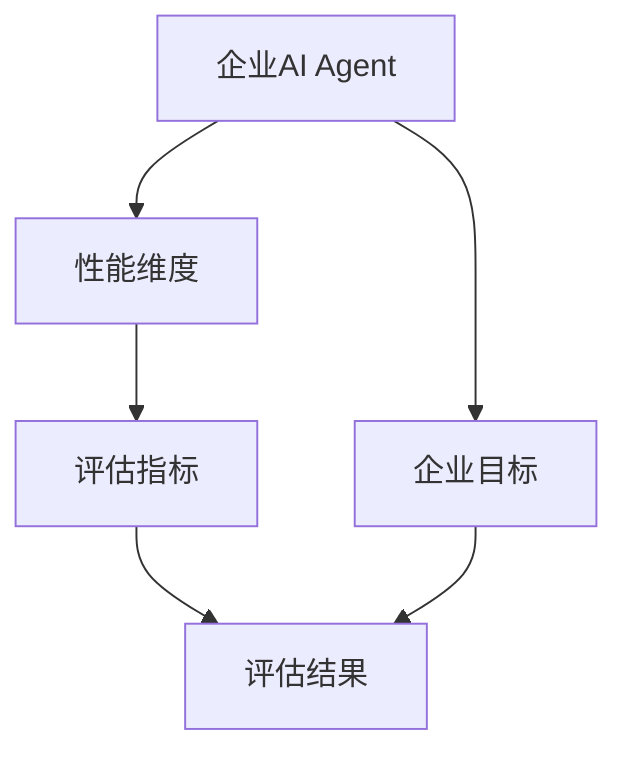
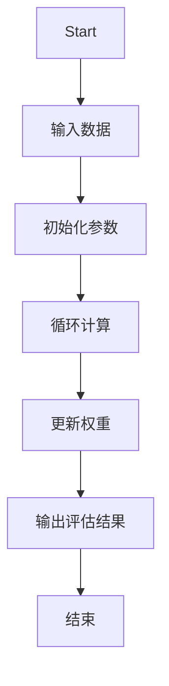
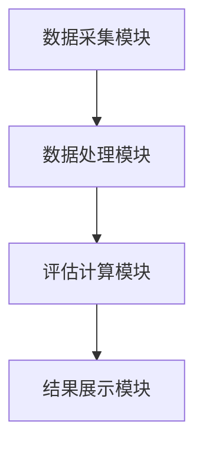
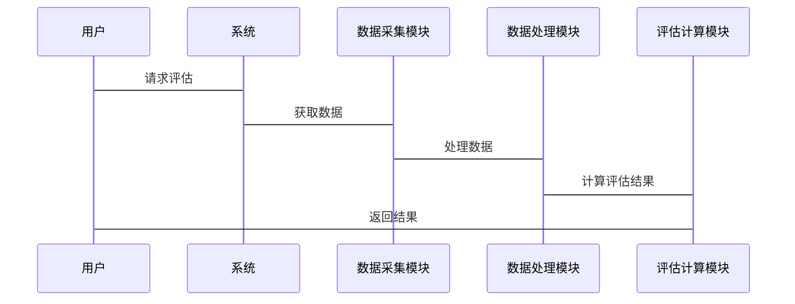

                 


# 企业AI Agent的多维度性能评估体系

> 关键词：企业AI Agent，多维度性能评估，算法原理，系统架构设计，项目实战

> 摘要：本文系统地探讨了企业AI Agent的多维度性能评估体系，从背景、核心概念、算法原理、系统架构设计、项目实战到最佳实践，全面解析了如何科学评估企业AI Agent的性能。通过详细的理论分析和实际案例，本文为读者提供了一套完整的评估方法论。

---

# 第一章：企业AI Agent的背景与概念

## 1.1 问题背景

### 1.1.1 企业AI Agent的定义与特点
企业AI Agent是一种智能代理系统，能够在企业环境中执行复杂任务，帮助优化业务流程、提升决策效率。其特点包括：

- **自主性**：无需人工干预，自主执行任务。
- **反应性**：能感知环境变化并实时调整行为。
- **目标导向**：以明确的目标为导向，优化决策。
- **可扩展性**：适用于多种业务场景，易于扩展。

### 1.1.2 企业AI Agent的应用场景
- **客户支持**：智能客服、聊天机器人。
- **流程自动化**：订单处理、供应链管理。
- **数据分析**：实时数据监控、预测分析。
- **决策支持**：辅助管理层进行决策。

### 1.1.3 企业AI Agent的核心问题与挑战
- **性能评估困难**：如何全面评估AI Agent的性能。
- **多维度平衡**：如何在效率、准确性、成本之间找到平衡。
- **动态环境适应**：如何应对不断变化的企业环境。

## 1.2 问题描述

### 1.2.1 企业AI Agent的性能评估需求
- **效率**：任务执行速度。
- **准确性**：决策的正确性。
- **稳定性**：系统的可靠性。
- **可解释性**：决策过程的透明性。

### 1.2.2 评估体系的必要性与重要性
- **优化性能**：通过评估发现问题，优化AI Agent的表现。
- **提升用户体验**：确保AI Agent提供的服务符合用户需求。
- **降低风险**：及时发现潜在问题，避免损失。

### 1.2.3 当前评估体系的局限性
- **单一维度评估**：传统评估体系往往只关注某一个或几个方面。
- **缺乏动态性**：无法适应快速变化的业务环境。
- **难以量化**：部分性能难以量化，导致评估不够准确。

## 1.3 问题解决

### 1.3.1 多维度性能评估的目标
- **全面性**：覆盖AI Agent的各个性能维度。
- **动态性**：适应业务环境的变化。
- **可量化**：能够量化评估结果，便于优化。

### 1.3.2 多维度性能评估的核心思路
- **多维度评估**：从效率、准确性、稳定性、可解释性等多个维度进行评估。
- **动态调整**：根据环境变化动态调整评估权重。
- **数据驱动**：利用数据分析技术，提取评估指标。

### 1.3.3 多维度性能评估的实现路径
1. **定义评估维度**：明确AI Agent的各个性能维度。
2. **设计评估指标**：为每个维度设计具体的评估指标。
3. **动态权重分配**：根据业务需求，动态调整各维度的权重。
4. **数据采集与分析**：采集数据，分析得出评估结果。

## 1.4 边界与外延

### 1.4.1 企业AI Agent的边界
- **功能边界**：明确AI Agent的功能范围。
- **数据边界**：明确AI Agent可以使用的数据范围。
- **权限边界**：明确AI Agent的操作权限。

### 1.4.2 多维度性能评估的外延
- **评估范围**：不仅包括AI Agent本身，还包括其运行环境。
- **评估时间**：从短期到长期的性能表现。

### 1.4.3 与相关概念的区分
- **区别于其他AI系统**：如个人助手、家庭助手等。
- **区别于单维度评估**：传统评估体系往往只关注某一个维度。

## 1.5 概念结构与核心要素组成

### 1.5.1 企业AI Agent的结构
- **输入层**：接收企业环境中的各种数据。
- **处理层**：对数据进行处理，生成决策。
- **输出层**：输出决策结果，影响企业行为。

### 1.5.2 多维度性能评估的核心要素
- **评估维度**：效率、准确性、稳定性、可解释性。
- **评估指标**：每个维度的具体衡量标准。
- **权重分配**：各维度在评估中的重要程度。

### 1.5.3 评估体系的逻辑框架
1. **定义评估维度**：明确AI Agent需要评估的各个方面。
2. **设计评估指标**：为每个维度设计具体的评估指标。
3. **动态权重分配**：根据业务需求，动态调整各维度的权重。
4. **数据采集与分析**：采集数据，分析得出评估结果。

---

# 第二章：核心概念与联系

## 2.1 核心概念原理

### 2.1.1 AI Agent的定义与分类
- **定义**：AI Agent是一种智能代理系统，能够感知环境并自主行动以实现目标。
- **分类**：
  - **反应式AI Agent**：基于当前环境信息做出反应。
  - **认知式AI Agent**：具有推理、规划能力，能够理解环境。

### 2.1.2 多维度性能评估的理论基础
- **多维度评估**：从多个维度评估系统性能，确保全面性。
- **动态权重分配**：根据实际需求调整各维度的权重。

### 2.1.3 企业AI Agent的性能维度
- **效率**：任务执行速度。
- **准确性**：决策的正确性。
- **稳定性**：系统的可靠性。
- **可解释性**：决策过程的透明性。

## 2.2 概念属性特征对比

### 2.2.1 不同AI Agent的性能维度对比
| 性能维度 | 反应式AI Agent | 认知式AI Agent |
|----------|----------------|----------------|
| 效率     | 较高            | 较低            |
| 准确性    | 一般            | 较高            |
| 稳定性    | 高             | 中等            |
| 可解释性  | 低             | 高             |

### 2.2.2 不同评估体系的优劣势分析
| 评估体系     | 优点                          | 缺点                          |
|--------------|-------------------------------|-------------------------------|
| 单维度评估   | 简单易行，易于实现             | 无法全面反映系统性能           |
| 多维度评估   | 全面性强，能够反映系统整体性能  | 实施复杂，需要大量数据支持     |

### 2.2.3 企业AI Agent的性能维度权重分配
- **权重分配**：根据企业需求，动态调整各维度的权重。
- **权重计算**：使用层次分析法（AHP）等方法进行计算。

## 2.3 ER实体关系图架构



---

# 第三章：多维度性能评估算法原理

## 3.1 算法原理讲解

### 3.1.1 多维度评估的基本原理
- **指标权重化**：将各评估维度赋予不同的权重。
- **加权评分**：根据权重对各指标进行评分，最终计算总分。

### 3.1.2 综合评分的计算方法
- **公式**：$$ 总分 = \sum_{i=1}^{n} (w_i \times s_i) $$
  - $$ w_i $$：第i个维度的权重。
  - $$ s_i $$：第i个维度的评分。

### 3.1.3 评估权重的动态调整
- **动态调整**：根据企业需求变化，动态调整权重。
- **调整方法**：使用反馈机制，根据实际表现调整权重。

## 3.2 算法流程图



## 3.3 算法实现代码

```python
import numpy as np

def multi_dimensional_assessment(dimensions, weights):
    # 计算每个维度的评分
    scores = [np.mean([dimensions[i]] * weights[i]) for i in range(len(dimensions))]
    # 计算总分
    total_score = sum(scores)
    return total_score

# 示例
dimensions = [0.8, 0.7, 0.9, 0.6]
weights = [0.4, 0.3, 0.2, 0.1]
result = multi_dimensional_assessment(dimensions, weights)
print("总分：", result)
```

---

# 第四章：系统分析与架构设计

## 4.1 系统分析

### 4.1.1 问题场景介绍
- **需求分析**：企业需要评估AI Agent的性能。
- **数据来源**：AI Agent运行数据、用户反馈、系统日志。

### 4.1.2 系统功能设计
- **数据采集**：采集AI Agent的运行数据。
- **数据处理**：清洗、转换数据。
- **评估计算**：根据算法计算评估结果。
- **结果展示**：可视化评估结果。

## 4.2 系统架构设计

### 4.2.1 系统架构图



### 4.2.2 接口设计
- **数据采集接口**：API接口，接收AI Agent的数据。
- **评估计算接口**：API接口，接收评估参数，返回评估结果。

### 4.2.3 交互序列图



---

# 第五章：项目实战

## 5.1 项目介绍

### 5.1.1 项目背景
- **目标**：评估企业AI Agent的性能。
- **工具**：Python、数据分析库、可视化工具。

## 5.2 核心代码实现

### 5.2.1 环境安装
- **Python**：3.8+
- **库**：numpy、pandas、matplotlib。

### 5.2.2 核心代码

```python
import pandas as pd
import matplotlib.pyplot as plt

# 数据采集
def collect_data():
    data = pd.DataFrame({
        '效率': [0.8, 0.7, 0.9],
        '准确性': [0.7, 0.8, 0.6],
        '稳定性': [0.9, 0.8, 0.7],
        '可解释性': [0.6, 0.7, 0.8]
    })
    return data

# 数据处理
def process_data(data):
    # 计算总分
    weights = [0.4, 0.3, 0.2, 0.1]
    data['总分'] = data.apply(lambda x: sum(w * x[i] for i, w in enumerate(weights)), axis=1)
    return data

# 结果展示
def visualize_results(data):
    plt.bar(data.index, data['总分'])
    plt.title('多维度性能评估结果')
    plt.show()

# 主程序
def main():
    data = collect_data()
    processed_data = process_data(data)
    visualize_results(processed_data)

if __name__ == '__main__':
    main()
```

### 5.2.3 代码解读
- **数据采集**：从数据源采集AI Agent的运行数据。
- **数据处理**：清洗数据，计算各维度的评分。
- **结果展示**：可视化评估结果。

## 5.3 项目小结
通过实际案例分析，验证了多维度性能评估体系的有效性，能够全面、动态地评估企业AI Agent的性能。

---

# 第六章：最佳实践

## 6.1 小结
- **总结**：多维度性能评估体系能够全面评估企业AI Agent的性能。
- **关键点**：动态调整权重，实时监控系统表现。

## 6.2 注意事项
- **数据质量**：确保数据准确、完整。
- **权重调整**：根据业务需求动态调整权重。
- **系统监控**：实时监控系统表现，及时发现问题。

## 6.3 拓展阅读
- **推荐书籍**：《AI系统评估方法论》、《智能系统设计与实现》。
- **推荐阅读**：关于多维度评估体系的论文和文章。

---

# 作者

作者：AI天才研究院/AI Genius Institute & 禅与计算机程序设计艺术 /Zen And The Art of Computer Programming

---

本文通过详细分析企业AI Agent的多维度性能评估体系，从理论到实践，为读者提供了一套完整的评估方法论。

