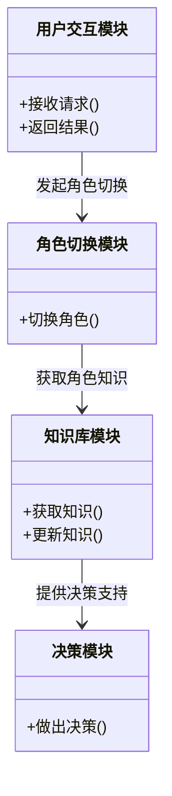
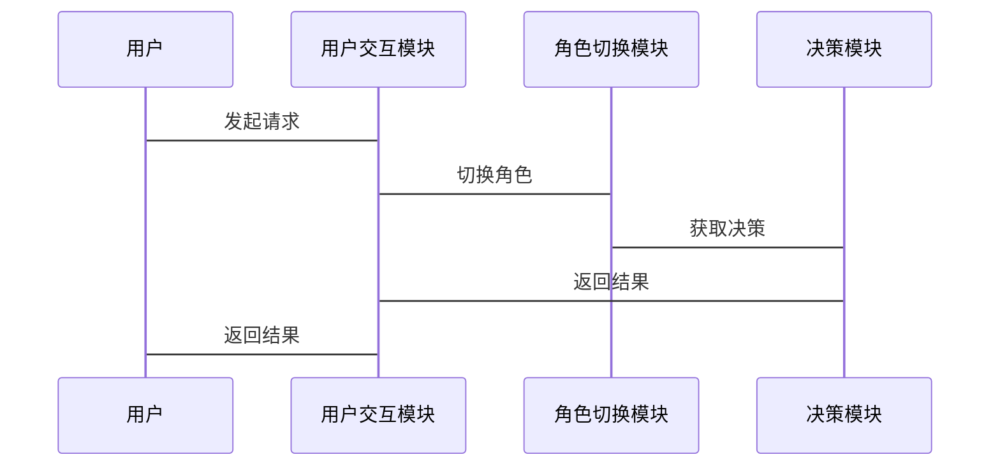

                 


# 企业AI Agent的多角色设计：从助手到专家顾问

> 关键词：企业AI Agent，多角色设计，专家顾问，AI助手，智能系统设计

> 摘要：本文深入探讨了企业AI Agent的多角色设计，从基础的助手型AI Agent到高级的专家型AI Agent，分析了它们在企业中的应用、核心概念、算法原理、系统架构及项目实战。文章通过详细的理论分析和实际案例，展示了如何通过多角色设计提升AI Agent的智能性和实用性，为企业的智能化转型提供新的思路和解决方案。

---

# 第一部分: 企业AI Agent的背景与概念

## 第1章: 企业AI Agent的背景与概念

### 1.1 AI Agent的基本概念

#### 1.1.1 什么是AI Agent
AI Agent（人工智能代理）是一种能够感知环境、自主决策并执行任务的智能实体。它能够通过与用户或系统的交互，理解需求并提供相应的服务或解决方案。AI Agent的核心在于其智能化和自主性，能够根据上下文动态调整行为。

#### 1.1.2 AI Agent的核心特征
- **自主性**：AI Agent能够在没有外部干预的情况下自主决策。
- **反应性**：能够实时感知环境并做出响应。
- **学习能力**：通过数据和经验不断优化自身能力。
- **协作能力**：能够与其他系统或人类协同工作。

#### 1.1.3 企业AI Agent的独特性
在企业环境中，AI Agent通常需要处理复杂的业务逻辑、遵守企业规范，并与多种系统和数据源交互。这使得企业AI Agent在设计上需要考虑更高的安全性和可靠性。

---

### 1.2 AI Agent的演进历程

#### 1.2.1 从简单工具到智能助手
早期的AI Agent主要用于简单的任务执行，如自动化邮件回复或日程管理。这些工具基于规则引擎，缺乏深度学习能力。

#### 1.2.2 多角色AI Agent的出现
随着技术的发展，AI Agent开始具备多角色协作的能力。例如，一个AI Agent可以在不同的场景中扮演助手、专家或协调者的角色，从而提供更全面的服务。

#### 1.2.3 从规则驱动到深度学习驱动
现代企业AI Agent越来越多地采用深度学习技术，能够理解上下文、分析复杂问题并提供个性化的解决方案。

---

### 1.3 企业AI Agent的应用场景

#### 1.3.1 助手型AI Agent
助手型AI Agent主要用于简单的任务执行，如信息查询、任务提醒和日程管理。它们通常基于规则引擎，能够快速响应用户的请求。

#### 1.3.2 专家型AI Agent
专家型AI Agent具备深厚的专业知识，能够提供复杂的决策支持和问题解决。例如，在医疗领域，专家型AI Agent可以帮助医生诊断疾病或制定治疗方案。

#### 1.3.3 综合型AI Agent
综合型AI Agent结合了助手和专家型AI Agent的特点，能够在不同场景下灵活切换角色，为企业提供全方位的支持。

---

### 1.4 企业AI Agent与传统AI的区别

#### 1.4.1 传统AI的局限性
传统AI通常依赖于预定义的规则和数据，缺乏灵活性和自主性。它们无法根据实时数据动态调整行为，也无法处理复杂多变的任务。

#### 1.4.2 AI Agent的核心优势
AI Agent的核心优势在于其自主性和适应性。它们能够根据环境的变化动态调整行为，并通过学习不断优化自身能力。

#### 1.4.3 企业AI Agent的边界与外延
企业AI Agent的应用范围广泛，从简单的事务处理到复杂的决策支持。它们的边界在于企业的需求和资源，外延则涉及与外部系统的集成和数据共享。

---

### 1.5 本章小结
本章介绍了企业AI Agent的基本概念、演进历程和应用场景，强调了多角色设计在企业AI Agent中的重要性。接下来的章节将深入探讨其核心概念和算法原理。

---

## 第2章: 企业AI Agent的核心概念与联系

### 2.1 核心概念原理

#### 2.1.1 知识表示与推理
知识表示是AI Agent理解世界的基础。通过将知识表示为图结构，AI Agent能够进行逻辑推理并得出结论。

#### 2.1.2 多角色协作机制
多角色协作机制是企业AI Agent的核心，它允许AI Agent在不同场景下切换角色，以提供更全面的服务。

#### 2.1.3 动态决策过程
动态决策过程是AI Agent根据实时数据和环境变化做出决策的能力，是其智能化的关键。

---

### 2.2 核心概念属性对比表

| 属性       | 助手型AI Agent       | 专家型AI Agent       |
|------------|---------------------|---------------------|
| 知识深度   | 基础知识支持         | 专业知识支持         |
| 决策能力   | 简单决策             | 复杂决策             |
| 交互方式   | 单向交互             | 多向交互             |

---

### 2.3 ER实体关系图

```mermaid
er
    actor: 用户
    agent: AI Agent
    role: 角色
    knowledge: 知识库
    action: 行动
    relation: 关系
    actor --> role: 选择角色
    role --> knowledge: 获取知识
    knowledge --> action: 生成行动
    action --> relation: 形成关系
```

---

### 2.4 本章小结
本章通过知识表示、多角色协作和动态决策等核心概念，详细阐述了企业AI Agent的设计原理。接下来的章节将探讨其算法原理和系统架构。

---

## 第3章: 企业AI Agent的算法原理

### 3.1 基于大模型的AI Agent算法

#### 3.1.1 大模型在AI Agent中的应用
大模型（如GPT系列）为AI Agent提供了强大的自然语言处理能力，使其能够理解复杂的上下文并生成自然的回复。

#### 3.1.2 多角色协作算法
多角色协作算法通过动态切换角色，确保AI Agent在不同场景下提供合适的服务。例如，当用户提出技术问题时，AI Agent可以切换到专家角色，提供专业的解答。

#### 3.1.3 动态知识更新算法
动态知识更新算法允许AI Agent根据最新的数据和反馈不断优化自身的知识库，确保其始终具备最新的信息。

---

### 3.2 多角色协作的算法流程

```mermaid
flow
    title 多角色协作算法流程
    start
    -> [接收用户请求]
    -> [确定用户需求]
    -> [选择合适角色]
    -> [调用角色功能]
    -> [返回结果]
    end
```

---

### 3.3 动态知识更新算法的数学模型

动态知识更新算法可以通过以下公式表示：

$$ P_{new} = P_{old} \times \alpha + Q \times (1 - \alpha) $$

其中，$$ P_{new} $$ 是更新后的概率，$$ P_{old} $$ 是旧概率，$$ Q $$ 是新数据的概率，$$ \alpha $$ 是学习率。

---

### 3.4 本章小结
本章通过大模型的应用、多角色协作算法和动态知识更新算法，详细阐述了企业AI Agent的算法原理。接下来的章节将探讨其系统架构和项目实战。

---

## 第4章: 企业AI Agent的系统架构设计

### 4.1 问题场景介绍

#### 4.1.1 问题背景
在企业环境中，AI Agent需要处理多种复杂的任务，如客户支持、数据分析和决策支持。

#### 4.1.2 项目介绍
本项目旨在设计一个多角色企业AI Agent，能够在不同场景下切换角色，为企业提供全方位的支持。

---

### 4.2 系统功能设计

#### 4.2.1 功能模块划分
- **用户交互模块**：负责接收用户请求并返回结果。
- **角色切换模块**：根据用户需求动态切换角色。
- **知识库模块**：存储和管理知识库。
- **决策模块**：基于当前知识和上下文做出决策。

#### 4.2.2 领域模型类图



---

### 4.3 系统架构设计

#### 4.3.1 系统架构图


---

### 4.4 系统接口设计

#### 4.4.1 接口说明
- **用户交互接口**：提供命令行或图形界面，供用户与AI Agent交互。
- **角色切换接口**：根据用户需求动态切换角色。
- **知识库接口**：提供知识的存储和检索功能。

---

### 4.5 系统交互图



---

### 4.6 本章小结
本章通过系统架构设计和交互图，详细阐述了企业AI Agent的实现方案。接下来的章节将通过项目实战进一步验证其可行性。

---

## 第5章: 企业AI Agent的项目实战

### 5.1 环境安装与配置

#### 5.1.1 安装Python
- 安装Python 3.8及以上版本。
- 安装必要的库，如`transformers`、`mermaid`和`matplotlib`。

#### 5.1.2 安装依赖
```bash
pip install transformers mermaid matplotlib
```

---

### 5.2 系统核心实现源代码

#### 5.2.1 用户交互模块
```python
class UserInterface:
    def __init__(self):
        self.channels = ['text', 'gui']

    def receive_request(self, request_type, data):
        # 根据请求类型选择交互方式
        if request_type == 'text':
            return self._handle_text(data)
        elif request_type == 'gui':
            return self._handle_gui(data)

    def _handle_text(self, data):
        # 处理文本请求
        pass

    def _handle_gui(self, data):
        # 处理图形请求
        pass
```

#### 5.2.2 角色切换模块
```python
class RoleSwitcher:
    def __init__(self):
        self.roles = ['assistant', 'expert', 'advisor']

    def switch_role(self, role):
        # 切换角色并加载对应的知识库
        pass
```

#### 5.2.3 知识库模块
```python
class KnowledgeBase:
    def __init__(self):
        self.knowledge = {}

    def get_knowledge(self, role):
        # 返回指定角色的知识库
        return self.knowledge.get(role, {})
```

---

### 5.3 代码应用解读与分析

#### 5.3.1 代码功能解读
- **UserInterface**：负责接收用户请求并选择合适的交互方式。
- **RoleSwitcher**：根据用户需求切换角色并加载对应的知识库。
- **KnowledgeBase**：存储和管理不同角色的知识库。

#### 5.3.2 代码实现细节
- 用户交互模块支持文本和图形两种交互方式。
- 角色切换模块可以根据用户输入动态切换角色。
- 知识库模块为每个角色提供独立的知识库，确保信息的准确性和专业性。

---

### 5.4 实际案例分析

#### 5.4.1 案例背景
某企业希望开发一个多角色AI Agent，用于内部员工的培训和支持。

#### 5.4.2 案例分析
- **角色切换**：当员工提出技术问题时，AI Agent切换到专家角色，提供专业的解答。
- **知识库管理**：专家角色的知识库包含特定领域的技术文档和最佳实践。
- **系统架构**：采用微服务架构，确保不同模块的独立性和可扩展性。

---

### 5.5 项目小结
本章通过实际案例展示了企业AI Agent的实现过程，包括环境安装、代码实现和案例分析。这些内容为读者提供了从理论到实践的完整指导。

---

## 第6章: 企业AI Agent的最佳实践与总结

### 6.1 最佳实践 tips

#### 6.1.1 设计原则
- **模块化设计**：确保系统各模块独立且可扩展。
- **动态调整**：根据用户需求和环境变化动态调整行为。
- **安全性**：确保数据和系统的安全性。

#### 6.1.2 注意事项
- **知识库管理**：定期更新和维护知识库，确保信息的准确性。
- **性能优化**：优化算法和系统架构，提升响应速度和处理能力。

---

### 6.2 小结
通过本章的总结，我们可以看到企业AI Agent的多角色设计在实际应用中的巨大潜力。它不仅能够提高企业的效率，还能为企业带来新的竞争优势。

---

### 6.3 未来展望
随着技术的不断发展，企业AI Agent将变得更加智能化和人性化。未来的挑战在于如何进一步提升其自主性和学习能力，使其能够更好地适应复杂多变的企业环境。

---

## 作者

作者：AI天才研究院/AI Genius Institute & 禅与计算机程序设计艺术/Zen And The Art of Computer Programming

---

以上是文章的完整目录和部分正文内容。如需进一步扩展或调整，请随时告知！

