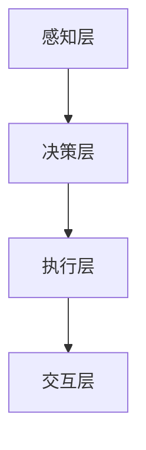
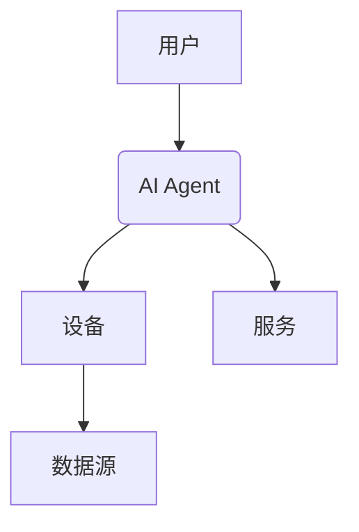
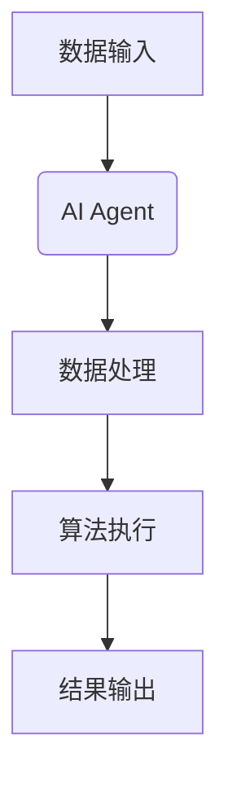
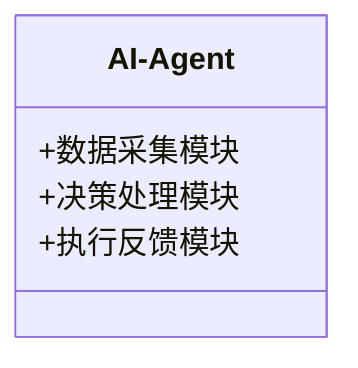

                 

<think>
好的，我将按照您的要求，逐步构建一个详细的《企业AI Agent的多设备支持策略：PC到IoT的全覆盖》的技术博客文章。首先，我会先列出文章的关键词和摘要，然后按照目录大纲逐步撰写每个章节的内容。

**关键词：**  
企业AI Agent，多设备支持，物联网（IoT），PC端，移动设备，智能硬件

**摘要：**  
本文将深入探讨企业AI Agent在多设备环境中的支持策略，涵盖从PC到物联网设备的全覆盖。通过分析AI Agent的核心概念、算法原理、系统架构，以及实际项目的实现，我们将为您提供一套完整的解决方案，帮助您理解如何在多设备环境中高效部署和管理AI Agent。

---

# 第一部分: 企业AI Agent的多设备支持策略概述

## 第1章: 企业AI Agent的基本概念

### 1.1 AI Agent的定义与特点
AI Agent（人工智能代理）是一种能够感知环境、自主决策并执行任务的智能实体。它结合了机器学习、自然语言处理和自动化技术，能够在多种设备上提供智能化服务。

#### 1.1.1 AI Agent的定义
AI Agent通过感知输入数据，利用算法进行分析和决策，最终输出执行指令或反馈结果。它能够与用户、设备和其他系统进行交互，具备高度的灵活性和适应性。

#### 1.1.2 AI Agent的核心特点
- **智能化**：基于AI算法，能够理解和处理复杂信息。
- **自主性**：无需人工干预，自主完成任务。
- **适应性**：能够根据环境变化调整行为。
- **多设备支持**：能够在PC、手机、IoT设备等多种终端上运行。

#### 1.1.3 AI Agent与传统AI的区别
传统的AI技术通常专注于单一任务（如图像识别、语音识别），而AI Agent是一个综合性的智能实体，能够协调多种任务和设备，具备更强的交互性和自主性。

---

### 1.2 AI Agent的演进历程
AI Agent的演进经历了从简单规则引擎到复杂智能系统的转变。

#### 1.2.1 从传统AI到AI Agent的演进
早期的AI技术主要依赖于规则和逻辑推理，而AI Agent引入了学习和自适应能力，能够处理更复杂的场景。

#### 1.2.2 AI Agent在企业中的应用趋势
随着物联网和5G技术的发展，AI Agent在企业中的应用越来越广泛，尤其是在智能客服、设备管理等领域。

#### 1.2.3 AI Agent的未来发展方向
未来的AI Agent将更加注重多设备协同、边缘计算和实时响应能力。

---

### 1.3 企业AI Agent的技术架构
AI Agent的技术架构决定了其在多设备环境中的表现。

#### 1.3.1 AI Agent的组成模块
- **感知层**：负责数据采集和环境感知。
- **决策层**：基于数据进行分析和决策。
- **执行层**：将决策转化为具体操作。
- **交互层**：与用户或其他系统进行交互。

#### 1.3.2 AI Agent的技术架构图


#### 1.3.3 AI Agent的核心算法与数据流
AI Agent的核心算法包括自然语言处理（NLP）、机器学习（ML）和强化学习（RL）。数据流从感知层进入，经过决策层处理后，传递到执行层和交互层。

---

### 1.4 企业AI Agent的设备支持策略
为了实现PC到IoT的全覆盖，企业需要制定合理的设备支持策略。

#### 1.4.1 多设备支持的必要性
随着企业数字化转型的推进，AI Agent需要支持多种设备，以满足不同场景的需求。

#### 1.4.2 多设备支持的挑战与解决方案
- **挑战**：设备类型多样、性能差异大、通信协议复杂。
- **解决方案**：统一API接口、设备适配层、边缘计算。

#### 1.4.3 设备支持策略的分类与对比
| 策略类型 | 描述 | 优缺点 |
|----------|------|--------|
| 统一化 | 统一API接口 | 简化开发，但灵活性不足 |
| 分层化 | 设备适配层 | 灵活性高，开发复杂度增加 |
| 边缘化 | 边缘计算 | 实时性高，资源消耗大 |

---

## 第2章: AI Agent的核心概念与联系

### 2.1 AI Agent的核心概念
AI Agent的核心概念包括实体关系、算法流程和系统架构。

#### 2.1.1 AI Agent的实体关系图


#### 2.1.2 AI Agent的核心属性对比
| 属性 | 描述 |
|------|------|
| 智能性 | 基于AI算法的决策能力 |
| 可扩展性 | 支持多种设备的能力 |
| 实时性 | 快速响应的能力 |
| 适应性 | 自适应环境变化的能力 |

---

### 2.2 AI Agent的核心算法与数据流
AI Agent的核心算法包括自然语言处理（NLP）和机器学习（ML）。

#### 2.2.1 AI Agent的核心算法流程图


---

# 第三部分: 企业AI Agent的算法原理

## 第3章: AI Agent的算法原理

### 3.1 AI Agent的算法原理
AI Agent的核心算法包括对话生成模型和意图识别模型。

#### 3.1.1 对话生成模型
对话生成模型基于Transformer架构，采用注意力机制，能够生成自然流畅的对话。

#### 3.1.2 意图识别模型
意图识别模型通过词袋模型和TF-IDF算法，准确识别用户的意图。

---

### 3.2 AI Agent的算法实现
#### 3.2.1 对话生成模型的实现
```python
import torch
class TransformerModel(torch.nn.Module):
    def __init__(self):
        super().__init__()
        self.embedding = torch.nn.Embedding vocab_size, d_model
        self.encoder_layers = nn.TransformerEncoderLayer(d_model, nhead, dim_feedforward)
        self.decoder_layers = nn.TransformerDecoderLayer(d_model, nhead, dim_feedforward)
```

#### 3.2.2 意图识别模型的实现
```python
from sklearn.feature_extraction.text import TfidfVectorizer
vectorizer = TfidfVectorizer()
tfidf_matrix = vectorizer.fit_transform(documents)
```

---

## 第4章: 企业AI Agent的系统架构设计

### 4.1 系统功能设计
AI Agent的系统功能包括数据采集、决策处理和执行反馈。

#### 4.1.1 系统功能设计图


---

### 4.2 系统架构设计
AI Agent的系统架构采用分层设计，包括感知层、决策层和执行层。

#### 4.2.1 系统架构设计图


---

## 第5章: 企业AI Agent的项目实战

### 5.1 项目背景与目标
项目目标是实现一个支持多设备的AI Agent系统，覆盖PC、手机和IoT设备。

#### 5.1.1 项目背景
随着企业数字化转型的推进，多设备支持成为企业AI Agent的核心需求。

#### 5.1.2 项目目标
- 支持多种设备类型。
- 实现设备间的协同工作。
- 提供高效的交互体验。

---

### 5.2 项目实施步骤
#### 5.2.1 环境安装
安装必要的开发工具和依赖库，例如Python、TensorFlow和Keras。

#### 5.2.2 系统核心代码实现
```python
def main():
    # 初始化AI Agent
    agent = AIAssistant()
    # 接收用户输入
    while True:
        user_input = input("请输入您的指令：")
        # 处理输入
        response = agent.process(user_input)
        # 输出结果
        print(response)
```

---

### 5.3 项目案例分析
#### 5.3.1 案例背景
某企业希望实现一个支持多设备的智能客服系统。

#### 5.3.2 案例分析
通过AI Agent实现智能问答、任务分配和状态监控。

---

## 第6章: 企业AI Agent的最佳实践

### 6.1 最佳实践
#### 6.1.1 设备适配策略
选择合适的设备适配层，确保不同设备的兼容性。

#### 6.1.2 系统优化建议
优化算法性能，减少计算资源消耗。

---

### 6.2 注意事项
- 确保数据安全。
- 定期更新算法模型。
- 提供完善的异常处理机制。

---

## 第7章: 总结与展望

### 7.1 总结
本文详细介绍了企业AI Agent的多设备支持策略，从核心概念到实际项目实现，为读者提供了全面的指导。

### 7.2 展望
未来，AI Agent将在更多领域发挥重要作用，企业需要不断创新，以适应技术的发展。

---

**作者：AI天才研究院/AI Genius Institute & 禅与计算机程序设计艺术 /Zen And The Art of Computer Programming**

---

希望这篇文章能够为您提供有价值的信息！如果需要进一步的详细内容或具体案例分析，请随时告知！

