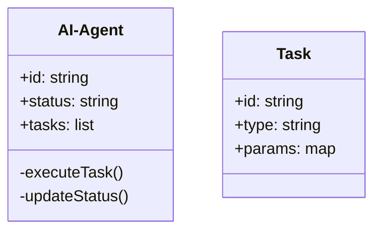
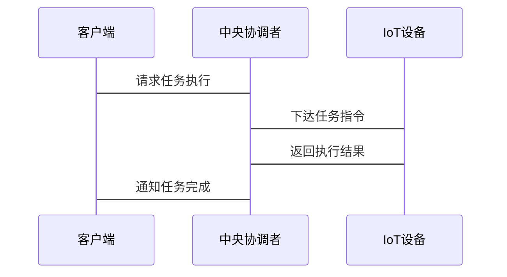

                 


# 企业AI Agent的多设备支持：PC、移动端到IoT设备

## 关键词：
企业AI Agent，多设备支持，PC，移动端，IoT设备，分布式计算，跨平台开发

## 摘要：
本文探讨企业AI Agent在多设备环境中的支持策略，涵盖PC、移动端和IoT设备。通过分析AI Agent的核心概念、算法原理、系统架构及项目实战，详细阐述如何实现跨设备协同与一致性。文章结合理论与实践，提供从环境安装到代码实现的全面指导，助力企业构建高效、智能的多设备AI解决方案。

---

# 第1章 企业AI Agent的背景与概念

## 1.1 AI Agent的基本概念

### 1.1.1 AI Agent的定义与特点
AI Agent（人工智能代理）是能够感知环境、自主决策并执行任务的智能实体。其特点包括：
- **自主性**：无需外部干预，自主完成任务。
- **反应性**：实时感知环境并做出响应。
- **目标导向**：基于目标驱动行为。
- **学习能力**：通过数据优化决策能力。

### 1.1.2 企业级AI Agent的核心属性
企业级AI Agent需具备以下核心属性：
- **高可用性**：确保在复杂环境中的稳定运行。
- **可扩展性**：支持设备数量和复杂度的扩展。
- **安全性**：保障数据和系统的安全性。

### 1.1.3 AI Agent与传统软件的区别
AI Agent与传统软件的区别主要体现在：
- **智能性**：AI Agent具备学习和决策能力。
- **自主性**：无需人工干预，自动执行任务。
- **动态适应性**：能根据环境变化调整行为。

## 1.2 企业AI Agent的应用场景

### 1.2.1 企业内部流程自动化
AI Agent可优化企业内部流程，如自动化审批、数据录入等，提升效率。

### 1.2.2 客户服务与支持
通过AI Agent提供智能客服，实时响应客户需求，提升用户体验。

### 1.2.3 数据分析与决策支持
AI Agent可分析企业数据，提供决策支持，优化业务流程。

## 1.3 多设备支持的必要性

### 1.3.1 设备多样性的挑战
企业环境中存在多种设备，如PC、手机、IoT设备，每类设备有不同的性能和接口。

### 1.3.2 不同设备的特点与需求
- **PC**：高性能计算，适合复杂任务。
- **移动端**：便携性高，适合移动场景。
- **IoT设备**：低功耗、实时性要求高。

### 1.3.3 企业AI Agent的跨设备一致性要求
AI Agent需在不同设备上保持行为一致，提供统一的用户体验。

---

# 第2章 多设备支持的技术背景

## 2.1 多设备环境的复杂性

### 2.1.1 设备类型与架构差异
不同设备的硬件架构差异显著，如x86、ARM等，导致开发复杂。

### 2.1.2 网络环境的多样性
设备间的网络环境差异大，如Wi-Fi、4G、5G等，影响通信效率。

### 2.1.3 跨平台开发的挑战
跨平台开发需处理不同操作系统的差异，增加开发复杂性。

## 2.2 AI Agent在多设备中的角色

### 2.2.1 中央协调者
AI Agent作为中央协调者，统一调度各设备资源。

### 2.2.2 分布式执行者
AI Agent可分布部署，各设备协同完成任务。

### 2.2.3 设备间协同机制
通过设备间的协同机制，实现任务分配、状态同步和结果反馈。

## 2.3 多设备支持的核心技术

### 2.3.1 跨平台通信协议
- **MQTT**：轻量级协议，适合IoT设备。
- **WebSocket**：实时通信，适合移动端和PC端。

### 2.3.2 设备间数据同步与一致性
通过分布式事务和版本控制，确保设备间数据一致性。

### 2.3.3 分布式计算与任务调度
利用分布式计算框架，如Kubernetes，优化任务调度。

---

# 第3章 AI Agent的核心算法原理

## 3.1 基于规则的AI Agent

### 3.1.1 规则引擎的实现
规则引擎通过条件判断和动作执行，实现简单任务的自动化。

### 3.1.2 规则的动态更新与优化
通过机器学习优化规则，提升决策准确性。

### 3.1.3 基于规则的决策树构建
构建决策树，简化规则引擎的逻辑。

## 3.2 基于机器学习的AI Agent

### 3.2.1 监督学习与无监督学习的对比
- **监督学习**：基于标记数据，适合分类任务。
- **无监督学习**：处理无标记数据，适合聚类任务。

### 3.2.2 强化学习在AI Agent中的应用
通过奖励机制，优化AI Agent的决策策略。

### 3.2.3 深度学习模型的选择与优化
选择适合任务的深度学习模型，如LSTM用于时间序列分析。

## 3.3 混合型AI Agent

### 3.3.1 规则与机器学习的结合
结合规则和机器学习，提升决策的准确性和灵活性。

### 3.3.2 混合型AI Agent的优势与挑战
优势：结合规则和机器学习的优点；挑战：模型复杂性和维护成本。

### 3.3.3 混合型模型的实现与优化
通过集成学习优化模型，提升性能和泛化能力。

---

# 第4章 多设备支持的算法实现

## 4.1 跨设备通信算法

### 4.1.1 跨设备通信协议的选择与实现
选择适合设备的通信协议，如MQTT和WebSocket。

### 4.1.2 跨设备数据传输的可靠性保障
通过断点续传和数据校验，确保数据完整性。

### 4.1.3 跨设备通信的延迟优化
优化通信协议和网络架构，降低延迟。

## 4.2 跨设备数据同步与一致性

### 4.2.1 分布式事务的实现
通过两阶段提交实现分布式事务。

### 4.2.2 数据同步的冲突解决
采用版本号和乐观锁机制解决数据冲突。

### 4.2.3 数据同步的性能优化
通过分片技术和压缩算法提升同步效率。

## 4.3 分布式计算与任务调度

### 4.3.1 分布式任务调度算法
基于负载均衡算法，优化任务分配。

### 4.3.2 分布式计算的资源分配
根据设备资源情况动态分配任务。

### 4.3.3 分布式计算的容错机制
通过冗余备份和故障恢复，确保系统可靠性。

---

# 第5章 系统分析与架构设计方案

## 5.1 问题场景介绍

### 5.1.1 问题背景
企业AI Agent需支持多设备环境，确保功能一致性和用户体验。

### 5.1.2 问题描述
设备间的通信、数据同步和任务调度复杂，需设计高效的解决方案。

### 5.1.3 问题解决
通过分布式架构和异步通信机制，实现多设备协同。

## 5.2 项目介绍

### 5.2.1 项目目标
构建支持多设备的AI Agent系统，实现高效协同。

### 5.2.2 项目范围
涵盖PC、移动端和IoT设备，支持多种通信协议。

## 5.3 系统功能设计

### 5.3.1 领域模型设计


### 5.3.2 系统架构设计


### 5.3.3 系统交互设计


## 5.4 系统接口设计

### 5.4.1 通信接口
- **API接口**：RESTful API，支持JSON格式数据。
- **消息队列**：Kafka或RabbitMQ，实现异步通信。

### 5.4.2 数据同步接口
- **同步协议**：基于HTTP的同步机制。
- **数据校验**：通过数字签名确保数据完整性。

### 5.4.3 任务调度接口
- **任务队列**：Redis队列，实现任务分发。
- **任务状态查询**：提供REST API查询任务进度。

---

# 第6章 项目实战

## 6.1 环境安装

### 6.1.1 开发环境
- **操作系统**：Ubuntu 20.04
- **开发工具**：VS Code
- **依赖安装**：Python 3.8，Flask框架，Kafka

### 6.1.2 项目初始化
```bash
pip install flask kafka-python
mkdir -p src/{agent,task,database}
```

## 6.2 系统核心实现

### 6.2.1 AI Agent实现
```python
class AI-Agent:
    def __init__(self):
        self.id = ""
        self.status = "idle"
        self.tasks = []

    def executeTask(self, task):
        # 执行任务
        pass

    def updateStatus(self, status):
        self.status = status
```

### 6.2.2 任务调度实现
```python
from kafka import KafkaProducer

def send_task(task):
    producer = KafkaProducer('task_queue')
    producer.send('task_topic', value=task.to_dict())
```

## 6.3 代码应用解读与分析

### 6.3.1 AI Agent类
AI Agent类负责接收任务、执行任务并更新状态。通过Kafka消息队列实现任务分发。

### 6.3.2 任务调度逻辑
任务调度逻辑通过Kafka生产者发送任务到队列，消费者从队列中取出任务并执行。

## 6.4 实际案例分析

### 6.4.1 案例背景
某企业需要优化内部审批流程，使用AI Agent实现自动化审批。

### 6.4.2 案例实现
- **前端**：Web界面提交申请。
- **后端**：AI Agent接收任务，调用API完成审批。
- **反馈**：通过WebSocket通知用户审批结果。

## 6.5 项目小结

### 6.5.1 项目总结
通过本项目，实现了AI Agent在多设备环境中的支持，验证了系统架构和算法设计的有效性。

### 6.5.2 经验与教训
- **经验**：采用分布式架构提升系统扩展性。
- **教训**：设备间的通信延迟对实时性影响较大，需优化通信协议。

---

# 第7章 最佳实践与总结

## 7.1 最佳实践 tips

### 7.1.1 系统设计建议
- **模块化设计**：便于维护和扩展。
- **容错设计**：确保系统健壮性。
- **性能优化**：通过缓存和异步处理提升性能。

### 7.1.2 开发注意事项
- **代码规范**：统一编码风格，便于团队协作。
- **日志记录**：便于调试和问题排查。
- **安全措施**：确保数据和系统的安全性。

## 7.2 小结

### 7.2.1 核心内容回顾
本文详细探讨了企业AI Agent在多设备环境中的支持策略，包括核心技术、算法实现、系统架构和项目实战。

### 7.2.2 未来展望
未来，随着IoT设备的普及，企业AI Agent的多设备支持将更加重要，需进一步优化算法和架构设计。

## 7.3 注意事项

### 7.3.1 系统维护
定期更新软件和依赖，确保系统安全性和稳定性。

### 7.3.2 设备兼容性
关注新设备的推出，及时更新系统支持。

### 7.3.3 性能监控
通过监控工具实时跟踪系统性能，及时优化。

## 7.4 拓展阅读

### 7.4.1 推荐书籍
- 《分布式系统：概念与设计》
- 《机器学习实战》

### 7.4.2 技术博客
- [分布式系统设计](https://example.com/dist-systems)
- [机器学习算法](https://example.com/ml-algorithms)

---

# 作者

作者：AI天才研究院/AI Genius Institute & 禅与计算机程序设计艺术 /Zen And The Art of Computer Programming

