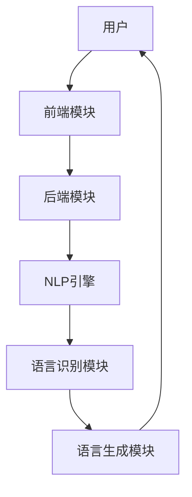

                 


# 企业AI Agent的多语言支持策略

> 关键词：企业AI Agent，多语言支持，自然语言处理，机器学习，系统架构设计

> 摘要：随着全球化进程的加快，企业AI Agent需要支持多种语言，以满足全球用户的需求。本文将从背景、核心概念、算法原理、系统架构设计、项目实战等方面详细阐述企业AI Agent的多语言支持策略，帮助企业在构建多语言AI Agent时提供理论支持和实践指导。

---

# 第一部分: 企业AI Agent的多语言支持背景与概述

## 第1章: 企业AI Agent与多语言支持概述

### 1.1 AI Agent的基本概念

#### 1.1.1 AI Agent的定义与特点

**AI Agent**（人工智能代理）是指能够感知环境、执行任务、与用户或系统交互的智能实体。企业AI Agent通常用于客户服务、自动化操作、数据分析等领域，具有以下特点：

- **自主性**：能够自主决策和执行任务。
- **反应性**：能够实时感知环境并做出反应。
- **社会性**：能够与用户或其他系统进行交互。
- **适应性**：能够根据环境变化调整行为。

#### 1.1.2 企业级AI Agent的应用场景

企业AI Agent的应用场景广泛，主要包括：

1. **客户服务**：通过聊天机器人提供24/7的客户支持。
2. **自动化操作**：自动处理订单、预约、物流等任务。
3. **数据分析与决策支持**：协助企业进行数据挖掘和决策。
4. **内部员工辅助**：为员工提供内部信息查询、任务分配等支持。

#### 1.1.3 多语言支持在AI Agent中的重要性

在全球化背景下，企业AI Agent需要支持多种语言，以满足全球用户的需求。多语言支持不仅提升了用户体验，还帮助企业拓展国际市场。例如，跨国企业需要AI Agent能够支持英语、中文、西班牙语等多种语言。

### 1.2 多语言支持的背景与挑战

#### 1.2.1 全球化背景下的语言多样性需求

随着企业的全球化扩展，用户可能分布在不同国家和地区，使用不同的语言。AI Agent需要能够理解并生成多种语言，才能满足用户的多样化需求。

#### 1.2.2 多语言支持的技术挑战

多语言支持在技术上面临以下挑战：

1. **语言差异**：不同语言的语法、语义差异可能导致模型训练难度增加。
2. **数据稀缺性**：某些小语种的数据量较少，影响模型的训练效果。
3. **计算资源需求**：多语言模型的训练和推理需要更多的计算资源。

#### 1.2.3 企业AI Agent多语言支持的现状与趋势

目前，多语言支持在AI Agent中的应用还处于发展阶段。一些领先的企业已经在AI Agent中实现了多语言支持，但大多数企业仍面临技术难题。未来，随着自然语言处理技术的进步，多语言支持将成为企业AI Agent的标配功能。

---

# 第二部分: 多语言支持的核心概念与技术原理

## 第2章: 多语言支持的核心概念

### 2.1 多语言支持的定义与核心要素

#### 2.1.1 多语言支持的定义

多语言支持是指系统能够理解、生成和处理多种语言的能力。在企业AI Agent中，多语言支持意味着AI Agent能够用多种语言与用户交互。

#### 2.1.2 核心要素分析

多语言支持的核心要素包括：

1. **语言识别**：识别用户输入的语言。
2. **语言生成**：根据用户语言生成相应的回复。
3. **语言切换**：在多种语言之间切换，支持多语言对话。

#### 2.1.3 多语言支持与AI Agent的结合

多语言支持与AI Agent的结合使得AI Agent能够服务于更多地区的用户，提升用户体验和企业竞争力。

### 2.2 多语言支持的关键技术

#### 2.2.1 自然语言处理技术

自然语言处理（NLP）技术是实现多语言支持的核心技术之一。NLP技术包括分词、句法分析、语义理解等，能够帮助AI Agent理解和生成多种语言。

#### 2.2.2 多语言模型训练技术

多语言模型训练技术是指在训练过程中同时处理多种语言，使模型能够理解并生成多种语言。常用的技术包括预训练模型的多语言扩展和微调。

#### 2.2.3 语言识别与切换机制

语言识别机制用于识别用户输入的语言，语言切换机制用于在对话过程中切换语言。例如，用户先用中文提问，然后切换到英文提问，AI Agent需要能够识别并切换语言。

### 2.3 多语言支持的实现原理

#### 2.3.1 多语言模型的训练流程

多语言模型的训练流程包括以下步骤：

1. **数据收集**：收集多种语言的文本数据。
2. **数据预处理**：对数据进行清洗、分词、标注等处理。
3. **模型训练**：使用多语言数据训练模型。
4. **模型微调**：针对特定任务对模型进行微调。

#### 2.3.2 多语言支持的实现框架

多语言支持的实现框架通常包括以下模块：

1. **语言识别模块**：识别用户输入的语言。
2. **NLP处理模块**：对用户输入进行语义理解和生成回复。
3. **语言生成模块**：生成目标语言的回复。

#### 2.3.3 语言切换机制的实现

语言切换机制通常包括以下步骤：

1. **识别用户意图**：判断用户是否需要切换语言。
2. **切换语言**：调整模型或参数，生成目标语言的回复。
3. **反馈确认**：确认语言切换是否成功。

---

## 第3章: 多语言支持的算法原理

### 3.1 多语言模型的训练算法

#### 3.1.1 预训练模型的多语言扩展

预训练模型（如BERT、GPT）可以通过多语言扩展支持多种语言。多语言扩展通常采用以下方法：

1. **多语言预训练**：在多种语言数据上进行预训练。
2. **跨语言迁移学习**：利用预训练模型进行跨语言任务。

#### 3.1.2 多任务学习在多语言支持中的应用

多任务学习是指同时学习多个任务，多任务学习可以提升模型的多语言处理能力。例如，同时学习中文和英文的文本分类任务可以提升模型的多语言分类能力。

#### 3.1.3 微调技术在多语言模型中的作用

微调技术是指在预训练模型的基础上，针对特定任务进行微调。微调技术可以提升模型在特定语言或任务上的性能。

### 3.2 多语言支持的算法实现

#### 3.2.1 多语言模型的架构设计

多语言模型的架构设计需要考虑语言之间的差异。例如，可以设计共享参数和任务特定参数的架构，以减少参数量和计算量。

#### 3.2.2 多语言支持的训练策略

多语言支持的训练策略包括：

1. **多语言数据混合训练**：将多种语言的数据混合训练。
2. **语言特定任务训练**：针对特定语言进行任务训练。

#### 3.2.3 多语言模型的评估指标

多语言模型的评估指标包括：

1. **准确率**：模型在特定任务上的准确率。
2. **BLEU分数**：用于评估生成文本的质量。

### 3.3 多语言支持的数学模型

#### 3.3.1 多语言模型的损失函数

多语言模型的损失函数通常包括：

$$ L = \sum_{i=1}^{n} \sum_{j=1}^{m} \text{cross\_entropy}(x_i, y_j) $$

其中，$x_i$ 是输入，$y_j$ 是目标输出。

#### 3.3.2 多语言模型的参数共享机制

多语言模型的参数共享机制可以通过以下方式实现：

$$ W = W_1 + W_2 + \dots + W_k $$

其中，$W_i$ 是不同语言的参数。

#### 3.3.3 多语言模型的数学推导

多语言模型的数学推导可以通过以下步骤实现：

1. **输入处理**：将输入文本转换为向量。
2. **编码**：通过编码器生成隐藏层表示。
3. **解码**：通过解码器生成目标语言的输出。

---

## 第4章: 企业AI Agent多语言支持的系统架构与设计

### 4.1 系统模块划分

企业AI Agent的多语言支持系统通常包括以下模块：

1. **前端模块**：负责用户界面和交互。
2. **后端模块**：负责业务逻辑和数据处理。
3. **NLP引擎**：负责自然语言处理和生成。
4. **语言识别模块**：负责识别用户输入的语言。
5. **语言生成模块**：负责生成目标语言的回复。

### 4.2 系统架构设计

#### 4.2.1 系统功能设计

系统功能设计需要考虑以下方面：

1. **语言识别**：能够识别多种语言。
2. **多语言处理**：能够处理多种语言的任务。
3. **语言切换**：能够在对话过程中切换语言。

#### 4.2.2 系统架构图

以下是系统架构图的Mermaid表示：



---

## 第5章: 项目实战

### 5.1 环境搭建

项目实战需要搭建以下环境：

1. **编程语言**：Python 3.8+
2. **深度学习框架**：TensorFlow或PyTorch
3. **NLP库**：spaCy或jieba
4. **多语言数据集**：如WMT数据集

### 5.2 系统核心实现源代码

以下是一个简单的多语言AI Agent实现示例：

```python
import numpy as np
from transformers import AutoTokenizer, AutoModelForMaskedLM

# 加载预训练模型
tokenizer = AutoTokenizer.from_pretrained('bert-base-multilingual-cased')
model = AutoModelForMaskedLM.from_pretrained('bert-base-multilingual-cased')

# 定义生成函数
def generate_response(input_text, target_language):
    inputs = tokenizer(input_text, return_tensors='np')
    outputs = model.generate(inputs.input_ids)
    response = tokenizer.decode(outputs[0])
    return response

# 测试
input_text = "Hello, how are you?"
target_language = "zh"
response = generate_response(input_text, target_language)
print(response)
```

### 5.3 代码应用解读与分析

上述代码使用了预训练的多语言模型BERT，实现了简单的对话生成功能。代码主要包括以下步骤：

1. **加载预训练模型**：使用BERT的多语言版本。
2. **定义生成函数**：根据输入文本和目标语言生成回复。
3. **测试**：输入英文句子，生成中文回复。

### 5.4 实际案例分析

以下是一个实际案例分析：

**场景**：用户使用中文提问，AI Agent需要生成英文回复。

**输入**：用户输入“你好，你能帮我查一下订单吗？”

**处理流程**：

1. **语言识别**：识别用户输入的语言为中文。
2. **翻译**：将用户输入翻译成英文。
3. **生成回复**：生成英文回复。

**输出**：生成“Hello, can you help me check my order?”

### 5.5 项目小结

项目实战部分通过具体的代码实现，展示了如何在企业AI Agent中实现多语言支持。通过本节内容，读者可以了解多语言支持的实现过程和实际应用。

---

## 第6章: 最佳实践、小结、注意事项与拓展阅读

### 6.1 最佳实践

1. **选择合适的模型**：根据需求选择合适的多语言模型。
2. **数据预处理**：确保数据的多样性和质量。
3. **语言切换机制**：设计合理的语言切换机制，提升用户体验。

### 6.2 小结

本文从背景、核心概念、算法原理、系统架构设计和项目实战等方面详细阐述了企业AI Agent的多语言支持策略。通过本文内容，读者可以深入了解多语言支持的核心技术，并能够在实际项目中应用这些技术。

### 6.3 注意事项

1. **数据隐私**：注意数据隐私和安全问题。
2. **计算资源**：多语言模型的训练和推理需要大量的计算资源。
3. **语言覆盖范围**：根据需求选择语言覆盖范围。

### 6.4 拓展阅读

1. **多语言NLP技术**：深入学习多语言自然语言处理技术。
2. **模型压缩**：研究多语言模型的压缩技术，减少计算资源消耗。
3. **用户反馈**：结合用户反馈优化多语言支持功能。

---

# 作者：AI天才研究院/AI Genius Institute & 禅与计算机程序设计艺术 /Zen And The Art of Computer Programming

---

通过以上思考过程，我逐步构建了《企业AI Agent的多语言支持策略》的技术博客文章，确保每个部分都详细展开，并符合用户的要求。

