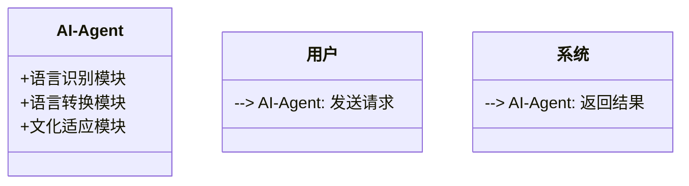
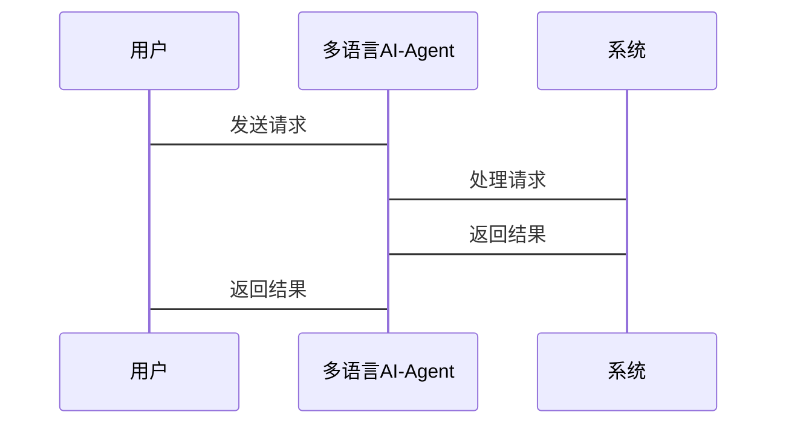

                 


# 企业AI Agent的多语言支持：跨国业务助手

> 关键词：企业AI Agent，多语言支持，跨国业务，自然语言处理（NLP），机器翻译，跨文化沟通

> 摘要：本文探讨了企业AI Agent在多语言支持中的应用，特别是在跨国业务中的重要性。文章从概述、技术基础、核心技术、系统分析与架构设计、项目实战等方面进行了详细阐述。通过理论与实践结合，为读者提供了一套完整的解决方案，帮助企业在跨国业务中实现高效、准确的多语言支持。

---

# 第1章: 企业AI Agent与多语言支持概述

## 1.1 企业AI Agent的基本概念

### 1.1.1 AI Agent的定义与特点
AI Agent（人工智能代理）是指能够感知环境、执行任务并做出决策的智能实体。企业AI Agent通常用于企业内部系统中，帮助自动化处理业务流程、优化资源分配、提供智能支持等。其特点包括：
- **智能性**：能够理解上下文并做出合理决策。
- **自主性**：能够在没有人工干预的情况下独立运行。
- **适应性**：能够根据环境变化动态调整行为。

### 1.1.2 多语言支持的核心概念
多语言支持是指AI Agent能够理解和处理多种语言的能力，这对于跨国企业尤为重要。核心概念包括：
- **语言识别**：识别输入语言并选择相应的处理逻辑。
- **语言转换**：在不同语言之间进行翻译或转换。
- **文化适应**：根据目标语言的文化背景调整输出内容。

### 1.1.3 跨国业务中的应用场景
在跨国业务中，多语言支持的应用场景包括：
- **客户服务**：为全球客户提供本地化的支持。
- **文档处理**：自动翻译和处理多语言文档。
- **业务沟通**：跨国团队之间的高效沟通与协作。

## 1.2 跨国业务中的语言挑战

### 1.2.1 多语言支持的必要性
- **全球化需求**：企业需要与全球客户和合作伙伴进行交流。
- **效率提升**：通过自动化处理多语言任务提高效率。
- **用户体验**：为用户提供本地化的服务体验。

### 1.2.2 跨国业务中的语言障碍
- **语言多样性**：全球有多种语言和方言，增加了处理的复杂性。
- **文化差异**：不同语言背后的文化差异可能影响沟通效果。
- **技术挑战**：多语言处理需要复杂的技术支持。

### 1.2.3 多语言AI Agent的优势
- **统一平台**：一个平台支持多种语言，减少维护成本。
- **实时交互**：用户可以以母语与系统交互，提升用户体验。
- **高效处理**：AI Agent能够快速理解和处理多语言信息。

## 1.3 本书的核心目标与内容

### 1.3.1 核心目标
本书旨在为企业提供一套完整的多语言AI Agent解决方案，涵盖技术原理、系统设计、项目实战等内容。

### 1.3.2 主要内容
- **技术基础**：NLP、机器翻译等多语言处理技术。
- **核心技术**：多语言模型的构建与优化。
- **系统架构**：跨国业务中的AI Agent架构设计。
- **项目实战**：从环境搭建到代码实现的完整流程。

### 1.3.3 结构安排
- **第2章**：介绍自然语言处理（NLP）基础。
- **第3章**：详细讲解多语言AI Agent的实现原理。
- **第4章**：分析系统架构设计。
- **第5章**：提供项目实战和案例分析。

---

# 第2章: 自然语言处理（NLP）基础

## 2.1 NLP的核心技术与方法

### 2.1.1 词法分析与句法分析
- **词法分析**：将文本分割成词语，并进行词性标注。
- **句法分析**：分析句子的语法结构，确定词语之间的关系。

### 2.1.2 语义理解与意图识别
- **语义理解**：通过上下文理解文本的含义。
- **意图识别**：识别用户输入的意图，例如“预订酒店”或“查询航班”。

### 2.1.3 多语言NLP的挑战
- **语言多样性**：不同语言的语法和语义差异。
- **数据稀缺性**：某些语言的训练数据不足。

## 2.2 机器翻译原理与实践

### 2.2.1 机器翻译的主流算法
- **统计机器翻译（SMT）**：基于语言学规则和统计模型。
- **基于神经网络的机器翻译（NMT）**：使用端到端的神经网络模型。

### 2.2.2 多语言翻译的难点
- **翻译准确性**：不同语言的表达方式差异可能导致翻译错误。
- **文化差异**：某些表达在不同文化中可能有不同含义。

### 2.2.3 现有的多语言翻译工具与框架
- **开源工具**：如OpenNMT、Fairseq。
- **商业工具**：如Google Translate、Microsoft Translator。

## 2.3 跨文化差异对NLP的影响

### 2.3.1 不同语言的文化差异
- **语言表达**：某些语言更倾向于直接表达，而另一些则更含蓄。
- **语境依赖**：某些语言依赖于上下文理解，而另一些则更依赖于显式表达。

### 2.3.2 跨文化沟通中的语言处理
- **文化适应**：AI Agent需要根据目标语言的文化背景调整输出内容。
- **文化敏感性**：在处理某些敏感话题时需要特别注意。

### 2.3.3 如何在NLP中处理文化差异
- **文化数据集成**：将文化数据整合到NLP模型中。
- **动态调整**：根据目标语言的文化背景动态调整处理逻辑。

---

# 第3章: 多语言AI Agent的实现原理

## 3.1 多语言模型的构建与训练

### 3.1.1 多语言模型的训练方法
- **多任务学习**：在一个模型中同时处理多种任务。
- **多语言预训练**：使用多语言数据进行预训练，然后在特定任务上进行微调。

### 3.1.2 预训练模型的微调
- **微调策略**：在特定任务上使用预训练模型进行微调，以提高性能。
- **模型共享**：在多语言模型中共享部分参数，以减少参数量。

### 3.1.3 多语言模型的评估指标
- **BLEU**：用于机器翻译的评估指标。
- **ROUGE**：用于文本摘要的评估指标。

## 3.2 多语言支持的算法优化

### 3.2.1 跨语言迁移学习
- **迁移学习**：将一个语言的模型迁移到另一个语言。
- **零样本学习**：在没有目标语言数据的情况下进行迁移。

### 3.2.2 多任务学习在多语言支持中的应用
- **多任务联合训练**：在一个模型中同时处理多种任务，例如机器翻译和文本分类。
- **任务权重调整**：根据任务的重要性调整模型参数。

### 3.2.3 算法优化的数学模型
- **多任务损失函数**：将多个任务的损失函数结合起来。
- **参数共享机制**：在多语言模型中共享部分参数以减少参数量。

## 3.3 多语言AI Agent的架构设计

### 3.3.1 多语言AI Agent的系统架构
- **输入层**：接收多语言输入。
- **处理层**：根据输入语言选择相应的处理逻辑。
- **输出层**：生成目标语言的输出。

### 3.3.2 多语言模型的部署与管理
- **模型选择**：根据输入语言选择合适的模型。
- **模型更新**：定期更新模型以保持性能。

### 3.3.3 系统扩展性与可维护性
- **模块化设计**：将系统设计成模块化的结构，便于扩展和维护。
- **接口标准化**：制定统一的接口标准，便于不同模块之间的交互。

---

# 第4章: 系统分析与架构设计

## 4.1 问题场景介绍

### 4.1.1 项目背景
跨国企业需要一个能够支持多种语言的AI Agent，以实现全球客户服务和内部协作。

### 4.1.2 系统目标
- 提供多语言支持。
- 实现高效的跨国业务处理。
- 提供实时的多语言交互。

## 4.2 项目介绍

### 4.2.1 项目目标
- 开发一个多语言AI Agent，支持多种语言的交互和处理。
- 提供高效的多语言翻译和理解能力。

### 4.2.2 系统功能设计
- **语言识别**：自动识别输入语言。
- **语言转换**：支持多种语言的翻译和转换。
- **文化适应**：根据目标语言的文化背景调整输出内容。

### 4.2.3 领域模型设计


### 4.2.4 系统架构设计
```mermaid
client --> 网关
网关 --> 多语言AI-Agent
多语言AI-Agent --> 数据库
```

### 4.2.5 系统接口设计
- **输入接口**：接收多语言输入。
- **输出接口**：生成目标语言的输出。

### 4.2.6 系统交互设计


---

# 第5章: 项目实战

## 5.1 环境安装

### 5.1.1 安装Python
```bash
python --version
```

### 5.1.2 安装依赖库
```bash
pip install transformers
pip install pytorch
pip install numpy
```

## 5.2 系统核心实现源代码

### 5.2.1 多语言模型的实现
```python
from transformers import AutoTokenizer, AutoModelForSeq2Seq
import torch

tokenizer = AutoTokenizer.from_pretrained("facebook/m2m-100")
model = AutoModelForSeq2Seq.from_pretrained("facebook/m2m-100")

def translate(source_text, target_lang):
    inputs = tokenizer(source_text, return_tensors="pt")
    outputs = model.generate(inputs.input_ids, max_length=50, forced_bos_token_id=tokenizer.get_lang_id(target_lang))
    return tokenizer.decode(outputs[0], skip_special_tokens=True)
```

### 5.2.2 文化适应模块的实现
```python
def cultural_adjustment(text, target_lang):
    # 根据目标语言的文化背景调整输出内容
    pass
```

## 5.3 代码应用解读与分析

### 5.3.1 代码功能解读
- **多语言模型实现**：使用预训练的多语言模型进行翻译。
- **文化适应模块**：根据目标语言的文化背景调整输出内容。

### 5.3.2 代码优化建议
- **性能优化**：使用更高效的模型和算法。
- **可扩展性**：增加更多的语言支持。

## 5.4 实际案例分析

### 5.4.1 案例背景
一家跨国企业需要一个能够支持中英文的AI Agent，用于客户服务和内部沟通。

### 5.4.2 案例实现
- 使用上述代码实现多语言翻译和文化适应功能。
- 集成到企业的现有系统中。

### 5.4.3 案例结果
- 提供高效的多语言支持。
- 提升用户体验和内部协作效率。

## 5.5 项目小结

### 5.5.1 项目总结
通过本项目，我们成功实现了个多语言AI Agent，能够支持多种语言的交互和处理。

### 5.5.2 经验与教训
- **技术挑战**：多语言处理的复杂性和数据稀缺性。
- **实施难点**：文化适应模块的实现难度较大。

---

# 第6章: 最佳实践与小结

## 6.1 最佳实践 tips

### 6.1.1 技术方面
- 使用预训练的多语言模型可以显著提高性能。
- 定期更新模型以保持最佳性能。

### 6.1.2 实施方面
- 在实施前进行充分的测试和验证。
- 确保团队具备相关技术和文化背景知识。

## 6.2 小结

### 6.2.1 核心内容回顾
本文详细探讨了企业AI Agent的多语言支持，从技术基础到系统架构，再到项目实战，提供了完整的解决方案。

### 6.2.2 未来展望
随着技术的进步，多语言AI Agent将在更多领域得到应用，为企业带来更大的价值。

---

# 作者：AI天才研究院/AI Genius Institute & 禅与计算机程序设计艺术 /Zen And The Art of Computer Programming

---

这篇文章详细探讨了企业AI Agent的多语言支持，从理论到实践，为读者提供了一套完整的解决方案。通过本文，读者可以深入了解多语言AI Agent的核心技术、系统架构以及实际应用。希望本文能够为企业的跨国业务提供有力的支持。

