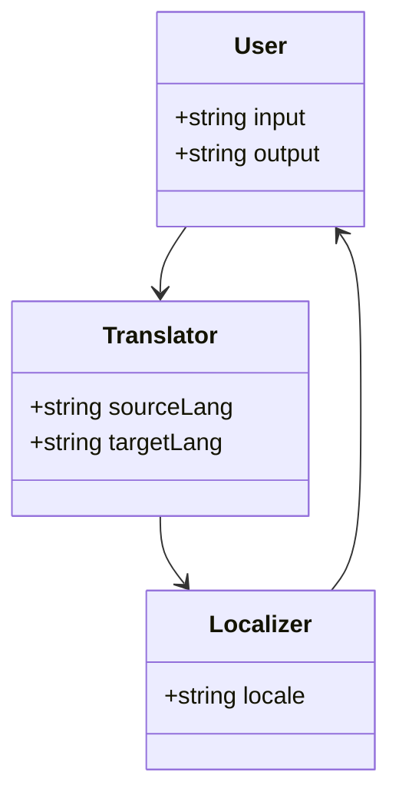
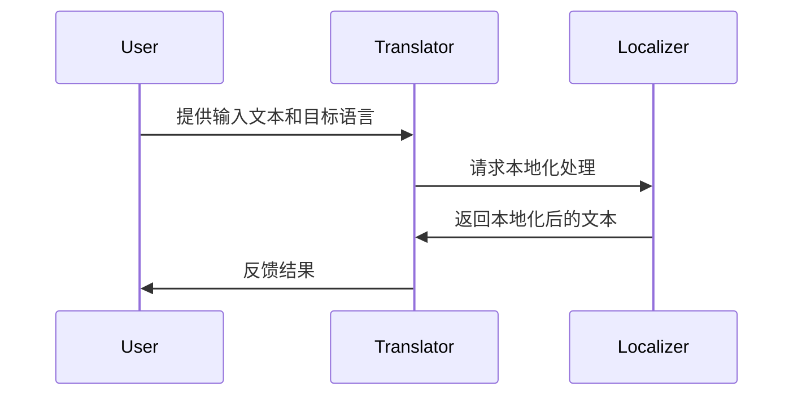

                 


# 企业AI Agent的多语言翻译与本地化功能

> **关键词**：企业AI Agent，多语言翻译，本地化功能，自然语言处理，机器学习，跨文化适应

> **摘要**：随着全球化进程的加速，企业AI Agent需要具备多语言翻译和本地化能力，以满足不同地区用户的需求。本文从背景、核心概念、算法原理、系统架构、项目实战等多方面详细阐述企业AI Agent的多语言翻译与本地化功能，帮助读者全面理解其技术实现和应用价值。

---

## 第1章: 企业AI Agent的背景与核心概念

### 1.1 问题背景与问题描述

#### 1.1.1 企业AI Agent的定义与特点
企业AI Agent是一种智能代理系统，能够理解和执行用户的指令，通常用于企业内部的自动化任务、客户支持、数据分析等领域。其特点包括：
- **智能化**：通过自然语言处理和机器学习实现智能交互。
- **多任务处理**：能够同时处理多种任务，提高企业效率。
- **可扩展性**：支持多种功能模块的扩展，适应不同企业需求。

#### 1.1.2 多语言翻译与本地化的需求背景
随着企业全球化战略的推进，AI Agent需要支持多语言翻译和本地化功能，以满足不同地区用户的需求。例如，跨国企业需要AI Agent能够用当地语言与用户交互，提供本地化的服务和信息。

#### 1.1.3 问题解决的目标与边界
- **目标**：实现AI Agent对多种语言的翻译和本地化，确保用户体验一致性和文化适配性。
- **边界**：专注于多语言翻译和本地化功能，不涉及AI Agent的核心算法和跨平台部署。

#### 1.1.4 核心要素组成
- **输入**：用户输入的自然语言文本或指令。
- **翻译引擎**：负责将输入翻译成目标语言。
- **本地化模块**：根据目标语言和文化背景调整输出内容。

### 1.2 核心概念与联系

#### 1.2.1 AI Agent和多语言翻译的属性对比
| 属性         | AI Agent                          | 多语言翻译与本地化                  |
|--------------|------------------------------------|---------------------------------------|
| 核心功能     | 智能交互、任务执行                | 文本翻译、文化适配                   |
| 技术基础     | 机器学习、自然语言处理           | 神经机器翻译、跨文化适应             |
| 应用场景     | 企业内部自动化、客户服务         | 跨国交流、本地化服务                 |

#### 1.2.2 实体关系图架构


---

## 第2章: 多语言翻译与本地化的算法原理

### 2.1 神经机器翻译模型

#### 2.1.1 神经机器翻译的原理
神经机器翻译（Neural Machine Translation, NMT）通过构建编码器-解码器模型，将输入文本映射到目标语言。其流程如下：
1. **编码器**：将输入文本编码为向量表示。
2. **解码器**：根据编码向量生成目标语言文本。

#### 2.1.2 算法实现代码
```python
import torch

class Encoder(torch.nn.Module):
    def __init__(self, input_size, hidden_size):
        super(Encoder, self).__init__()
        self.embedding = torch.nn.Embedding(input_size, hidden_size)
        self.rnn = torch.nn.GRU(hidden_size, hidden_size)
    
    def forward(self, input):
        embedded = self.embedding(input)
        output, _ = self.rnn(embedded)
        return output

class Decoder(torch.nn.Module):
    def __init__(self, hidden_size, output_size):
        super(Decoder, self).__init__()
        self.embedding = torch.nn.Embedding(output_size, hidden_size)
        self.rnn = torch.nn.GRU(hidden_size, hidden_size)
        self.fc = torch.nn.Linear(hidden_size, output_size)
    
    def forward(self, input, hidden):
        embedded = self.embedding(input)
        output, _ = self.rnn(embedded, hidden)
        output = self.fc(output)
        return output

class Translator:
    def __init__(self, encoder, decoder):
        self.encoder = encoder
        self.decoder = decoder
    
    def translate(self, input_tensor, target_tensor):
        hidden = self.encoder(input_tensor)
        output = self.decoder(target_tensor, hidden)
        return output
```

#### 2.1.3 算法流程图


### 2.2 多语言本地化处理

#### 2.2.1 本地化的核心算法
本地化处理包括文本格式化、文化适配和语言特定规则。例如，日期格式在不同国家有不同的表示方式。

#### 2.2.2 实现代码示例
```python
def localize_text(text, locale):
    # 根据locale选择日期格式
    if locale == 'en_US':
        return datetime.datetime.strptime(text, '%m/%d/%Y').strftime('%Y-%m-%d')
    elif locale == 'zh_CN':
        return datetime.datetime.strptime(text, '%m/%d/%Y').strftime('%Y-%m-%d')
    else:
        return text
```

---

## 第3章: 系统分析与架构设计

### 3.1 系统功能设计

#### 3.1.1 领域模型


### 3.2 系统架构设计

#### 3.2.1 系统架构图


#### 3.2.2 接口设计
- **输入接口**：接收用户输入的文本和目标语言。
- **输出接口**：返回本地化后的文本或错误信息。

#### 3.2.3 交互流程


---

## 第4章: 项目实战

### 4.1 环境安装

#### 4.1.1 安装Python和相关库
```bash
pip install torch
pip install mermaid
pip install matplotlib
```

### 4.2 核心代码实现

#### 4.2.1 翻译引擎实现
```python
import torch

class TranslationEngine:
    def __init__(self, source_lang, target_lang):
        self.source_lang = source_lang
        self.target_lang = target_lang
        # 加载翻译模型
        self.model = self.load_model()
    
    def load_model(self):
        # 假设已有训练好的模型
        return torch.load('translator_model.pth')
    
    def translate(self, text):
        # 调用翻译模型进行翻译
        translated = self.model.translate(text)
        return translated
```

#### 4.2.2 本地化模块实现
```python
import locale

class LocalizationModule:
    def __init__(self, locale):
        self.locale = locale
        locale.setlocale(locale.LC_ALL, locale)
    
    def localize(self, text):
        # 根据locale进行本地化处理
        return self.locale.ngettext(text, 's', 0)
```

### 4.3 案例分析

#### 4.3.1 翻译案例
```python
engine = TranslationEngine('en', 'zh')
result = engine.translate('Hello, how are you?')
print(result)  # 输出：你好，你怎么样？
```

#### 4.3.2 本地化案例
```python
localizer = LocalizationModule('zh_CN')
result = localizer.localize('item')
print(result)  # 输出：件
```

### 4.4 项目小结

---

## 第5章: 最佳实践与总结

### 5.1 最佳实践

#### 5.1.1 代码规范
- 使用模块化设计，便于维护和扩展。
- 保持代码简洁，避免重复代码。

#### 5.1.2 测试策略
- 单元测试：确保每个模块的功能正常。
- 集成测试：验证系统整体流程。

### 5.2 小结
企业AI Agent的多语言翻译与本地化功能是一个复杂的系统工程，需要结合自然语言处理、机器学习和跨文化适应等技术。通过本文的分析和实战，读者可以深入了解其技术实现和应用价值。

### 5.3 注意事项
- 确保翻译模型的准确性和本地化处理的文化适配性。
- 定期更新翻译模型和本地化规则，以应对语言和文化的变化。

### 5.4 拓展阅读
- 《神经机器翻译入门》
- 《跨文化软件设计指南》

---

## 作者：AI天才研究院 & 禅与计算机程序设计艺术

---

以上是《企业AI Agent的多语言翻译与本地化功能》的技术博客文章的完整目录和内容概览。

