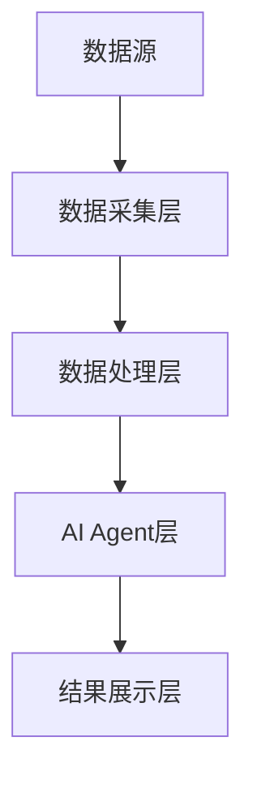
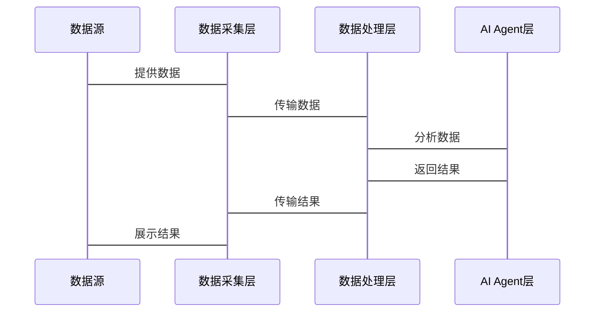

                 


# 企业AI Agent的大数据处理框架

## 关键词：AI Agent、大数据处理框架、算法原理、系统架构、项目实战、最佳实践

## 摘要：
本文详细探讨了企业AI Agent在大数据处理框架中的应用，从背景介绍到核心概念，再到算法原理和系统架构设计，最后通过项目实战和最佳实践，全面解析了企业AI Agent如何高效处理大数据问题。文章内容涵盖AI Agent与大数据处理框架的结合、核心算法、系统架构设计以及实际案例分析，为读者提供了深入的技术指导和实践参考。

---

# 第一部分: 企业AI Agent的大数据处理框架背景与概述

## 第1章: 企业AI Agent与大数据处理框架概述

### 1.1 企业AI Agent的背景与问题背景

#### 1.1.1 企业AI Agent的定义与核心问题
企业AI Agent是一种智能代理系统，用于在企业环境中执行特定任务，如数据处理、决策支持和自动化操作。其核心问题包括数据的高效处理、智能决策和任务的自动化执行。

#### 1.1.2 大数据处理框架的发展与现状
大数据处理框架经历了从传统数据处理到分布式计算的演变，目前主流的框架包括Hadoop、Spark和Flink等，它们在处理大规模数据时表现出色。

#### 1.1.3 企业AI Agent与大数据处理框架的结合
AI Agent与大数据处理框架的结合使得企业能够更高效地处理和分析数据，提升决策能力和运营效率。

### 1.2 问题描述与解决方案

#### 1.2.1 企业AI Agent面临的挑战
AI Agent需要处理复杂的数据流，同时需要实时决策，这对系统的处理能力和响应速度提出了高要求。

#### 1.2.2 大数据处理框架的核心问题
大数据处理框架面临数据量大、处理复杂、实时性要求高等问题，需要高效的算法和优化的架构。

#### 1.2.3 问题解决的思路与方法
通过结合AI Agent的智能性和大数据处理框架的高效性，采用分布式计算、流处理和机器学习等技术，解决数据处理中的复杂问题。

### 1.3 企业AI Agent大数据处理框架的边界与外延

#### 1.3.1 边界定义与限制
企业AI Agent仅处理特定范围内的数据，不涉及企业其他核心业务系统。

#### 1.3.2 外延与扩展方向
框架可以扩展到实时数据流处理、多模态数据融合和边缘计算等领域。

### 1.4 概念结构与核心要素组成

#### 1.4.1 概念结构图


#### 1.4.2 核心要素分析
企业AI Agent框架的核心要素包括数据源、数据处理层、智能决策层和执行层。

---

## 第2章: AI Agent与大数据处理框架的核心概念

### 2.1 AI Agent的核心概念与原理

#### 2.1.1 AI Agent的基本原理
AI Agent通过感知环境、分析数据并执行任务来实现智能化操作。

#### 2.1.2 AI Agent的类型与特点
AI Agent可以分为简单反射式、基于模型和实用基于效用三类，各有不同的特点和应用场景。

#### 2.1.3 AI Agent的核心算法与实现
常用算法包括决策树、随机森林和神经网络等，具体实现依赖于数据处理和计算框架。

### 2.2 大数据处理框架的核心概念与原理

#### 2.2.1 大数据处理框架的定义
大数据处理框架是用于管理和处理大规模数据的软件架构，支持分布式计算和并行处理。

#### 2.2.2 大数据处理框架的组成部分
包括数据存储层、计算引擎和管理控制层，各部分协同工作以实现高效数据处理。

#### 2.2.3 大数据处理框架的核心算法与实现
MapReduce和Spark的RDD（Resilient Distributed Dataset）是常见的实现方式，适用于不同的数据处理场景。

### 2.3 AI Agent与大数据处理框架的关系

#### 2.3.1 两者的联系与区别
AI Agent依赖大数据处理框架进行数据处理，而大数据处理框架通过AI Agent实现智能化分析。

#### 2.3.2 交互机制与数据流分析
AI Agent向大数据处理框架发送处理指令，框架返回处理结果，形成闭环的数据流。

#### 2.3.3 系统架构与功能模块
系统架构包括数据源、AI Agent、大数据处理框架和结果展示层，各模块协同工作。

### 2.4 核心概念属性特征对比表格

| **属性**       | **AI Agent**            | **大数据处理框架**        |
|----------------|-------------------------|---------------------------|
| 核心功能       | 数据分析与决策         | 数据存储与处理           |
| 处理方式       | 智能化、实时性         | 分布式、并行化           |
| 依赖条件       | 数据源、计算能力       | 数据存储、计算引擎       |
| 优化目标       | 提高决策准确性         | 提高处理效率             |

### 2.5 ER实体关系图架构

```mermaid
erd
  id: 企业AI Agent大数据处理框架
  entities:
    - 企业AI Agent
    - 大数据处理框架
    - 数据源
    - 处理结果
    - 任务指令
  relationships:
    - 企业AI Agent --> 数据源: 采集数据
    - 数据源 --> 大数据处理框架: 输入数据
    - 大数据处理框架 --> 处理结果: 输出结果
    - 企业AI Agent --> 任务指令: 发出指令
    - 处理结果 --> 企业AI Agent: 接收反馈
```

### 2.6 本章小结

---

## 第3章: AI Agent与大数据处理框架的算法原理

### 3.1 AI Agent的核心算法

#### 3.1.1 AI Agent的基本算法
AI Agent常用算法包括决策树、随机森林和神经网络，每种算法适用于不同的数据类型和场景。

#### 3.1.2 AI Agent的优化算法
通过参数调优和模型优化提升算法性能，如使用网格搜索和交叉验证。

#### 3.1.3 AI Agent的实现与代码
以下是一个简单的AI Agent实现示例：

```python
class AI_Agent:
    def __init__(self, data_source):
        self.data_source = data_source

    def process_data(self, data):
        # 数据预处理
        processed_data = self._preprocess(data)
        # 数据分析
        result = self._analyze(processed_data)
        return result

    def _preprocess(self, data):
        # 数据清洗和转换
        return data

    def _analyze(self, data):
        # 数据分析逻辑
        return data
```

### 3.2 大数据处理框架的核心算法

#### 3.2.1 MapReduce算法
MapReduce是一种分布式计算模型，适用于大规模数据处理。

#### 3.2.2 MapReduce算法的实现步骤
1. 分割数据
2. 映射处理
3. 进行归约
4. 合并结果

#### 3.2.3 MapReduce算法的代码实现

```python
from functools import reduce

def map_function(key, value):
    # 映射逻辑
    return key, value

def reduce_function(key, values):
    # 归约逻辑
    return key, sum(values)

data = [...]  # 输入数据
mapped_data = list(map(map_function, data.keys(), data.values()))
reduced_data = reduce(reduce_function, mapped_data)
```

### 3.3 数学模型与公式

#### 3.3.1 AI Agent的决策模型
决策树模型可以表示为：
$$
f(x) = \text{DecisionTree}(x)
$$

#### 3.3.2 MapReduce的数学模型
MapReduce的计算过程可以表示为：
$$
f(x) = \text{Map}(x) \circ \text{Reduce}(x)
$$

### 3.4 本章小结

---

## 第4章: 企业AI Agent大数据处理框架的系统分析与架构设计

### 4.1 系统架构设计

#### 4.1.1 系统架构图


#### 4.1.2 功能模块设计
系统主要功能模块包括数据采集、数据处理、智能决策和结果展示。

#### 4.1.3 系统接口设计
系统接口包括数据输入接口、任务指令接口和结果输出接口。

### 4.2 交互序列图



### 4.3 本章小结

---

## 第5章: 企业AI Agent大数据处理框架的项目实战

### 5.1 环境安装与配置

#### 5.1.1 安装大数据处理框架
安装Hadoop或Spark框架，配置环境变量。

#### 5.1.2 安装AI Agent依赖
安装Python机器学习库，如Scikit-learn和TensorFlow。

### 5.2 系统核心实现

#### 5.2.1 数据采集层实现
编写数据采集脚本，从数据库或API获取数据。

#### 5.2.2 数据处理层实现
使用Spark进行数据清洗和转换。

#### 5.2.3 AI Agent层实现
实现AI Agent的决策逻辑，调用训练好的模型进行预测。

### 5.3 案例分析与详细讲解

#### 5.3.1 实际案例分析
以电商企业的用户行为分析为例，展示如何利用企业AI Agent和大数据处理框架进行用户画像和推荐系统构建。

#### 5.3.2 代码实现与解读
提供关键代码片段，如数据处理和AI Agent的实现代码，详细解读每个部分的功能和作用。

### 5.4 本章小结

---

## 第6章: 企业AI Agent大数据处理框架的最佳实践与小结

### 6.1 最佳实践

#### 6.1.1 系统优化
定期优化算法和架构，提升处理效率。

#### 6.1.2 安全性
确保数据安全和系统安全，防止数据泄露和攻击。

#### 6.1.3 可扩展性
设计框架时考虑扩展性，方便未来业务扩展。

### 6.2 小结

#### 6.2.1 本章总结
企业AI Agent与大数据处理框架的结合为企业提供了强大的数据处理能力，能够高效地解决复杂问题。

#### 6.2.2 注意事项
在实际应用中，需要注意数据的质量和算法的可解释性，确保系统的稳定性和可靠性。

#### 6.2.3 未来展望
随着AI技术的发展，企业AI Agent和大数据处理框架的结合将更加紧密，推动企业智能化转型。

### 6.3 拓展阅读

#### 6.3.1 推荐书籍
《大数据处理与分析》、《AI Agent原理与应用》

#### 6.3.2 推荐博客和资源
建议读者关注技术博客和在线资源，获取最新的技术和工具信息。

---

## 作者：AI天才研究院 & 禅与计算机程序设计艺术

---

通过以上详细的内容组织和结构安排，我们可以看到企业AI Agent与大数据处理框架的结合为企业带来了巨大的价值，能够高效处理海量数据，支持智能决策，推动企业的数字化转型。

