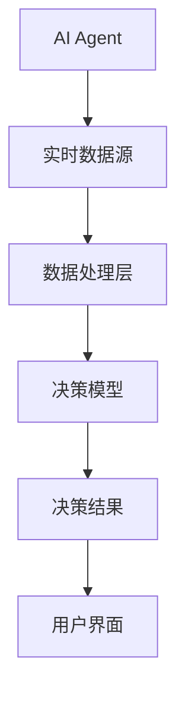
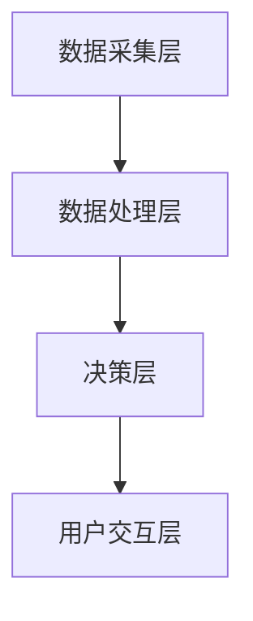
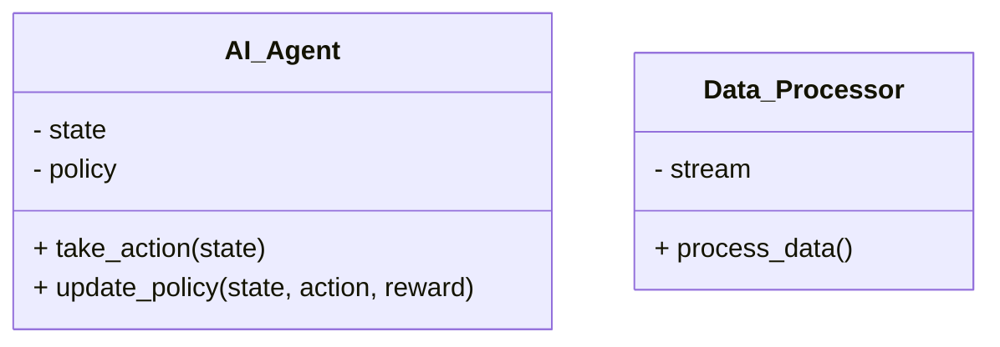
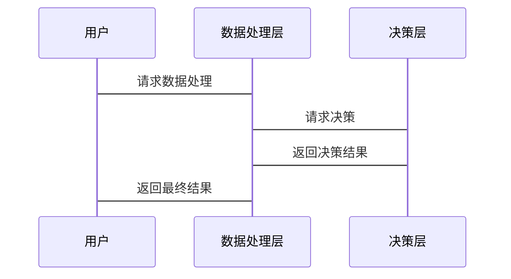

                 


# 企业AI Agent的实时决策支持系统

> **关键词**: AI Agent, 实时决策支持系统, 企业决策, 数据分析, 人工智能

> **摘要**: 本文详细探讨了企业AI Agent在实时决策支持系统中的应用。从问题背景到系统架构设计，再到实际项目实现，系统性地分析了AI Agent如何通过实时数据处理和智能决策模型为企业提供高效的支持。文章内容涵盖核心概念、算法原理、系统架构、项目实战以及最佳实践，旨在为技术从业者提供全面的技术指导和实践参考。

---

# 第1章: 问题背景与概念解析

## 1.1 问题背景介绍

### 1.1.1 企业决策支持系统的演变
企业决策支持系统（DSS）经历了从简单报表分析到复杂人工智能驱动的实时决策的演变。早期的DSS依赖于静态数据分析，无法应对实时变化的商业环境。随着AI技术的快速发展，企业需要更高效的决策支持系统来应对快速变化的市场。

### 1.1.2 AI技术对企业决策的支持作用
AI技术的引入使得决策支持系统具备了实时性、智能化和自适应性。通过机器学习、自然语言处理和强化学习等技术，AI Agent能够实时分析数据，提供精准的决策建议。

### 1.1.3 实时决策支持的必要性
在当今竞争激烈的商业环境中，实时决策支持能够帮助企业快速响应市场变化，优化资源配置，提高决策效率和准确性。

## 1.2 问题描述与目标

### 1.2.1 传统决策支持系统的局限性
传统DSS存在以下问题：
- 数据处理延迟，无法实时响应。
- 决策模型固定，缺乏灵活性。
- 无法处理非结构化数据。

### 1.2.2 AI Agent在实时决策中的优势
AI Agent具备以下优势：
- 实时数据处理能力。
- 自适应学习能力。
- 多任务处理能力。

### 1.2.3 实时决策支持系统的建设目标
实时决策支持系统的建设目标是通过AI Agent实现以下功能：
- 实时数据分析与处理。
- 智能化决策模型构建。
- 高效的决策反馈机制。

## 1.3 问题解决思路

### 1.3.1 AI Agent的核心功能
AI Agent的核心功能包括：
- 数据采集与处理。
- 模型训练与优化。
- 决策推理与执行。

### 1.3.2 实时数据处理的关键技术
实时数据处理的关键技术包括：
- 流数据处理技术。
- 分布式计算框架。
- 实时数据库管理。

### 1.3.3 系统架构设计的原则
系统架构设计应遵循以下原则：
- 高可用性。
- 高扩展性。
- 高实时性。

## 1.4 系统的边界与外延

### 1.4.1 系统的功能边界
系统功能边界包括：
- 内部数据处理。
- 外部数据接口。
- 用户交互界面。

### 1.4.2 系统的外部接口
系统的外部接口包括：
- 数据输入接口。
- 数据输出接口。
- 用户接口。

### 1.4.3 系统的扩展性与灵活性
系统的扩展性与灵活性体现在：
- 支持多种数据源。
- 支持多种决策模型。
- 支持多种用户交互方式。

## 1.5 概念结构与核心要素

### 1.5.1 系统的整体架构
系统的整体架构包括：
- 数据采集层。
- 数据处理层。
- 决策层。
- 用户交互层。

### 1.5.2 核心功能模块的组成
核心功能模块包括：
- 数据采集模块。
- 数据处理模块。
- 决策模型模块。
- 决策反馈模块。

### 1.5.3 系统的核心要素分析
系统的核心要素包括：
- 数据。
- 模型。
- 算法。
- 用户。

---

# 第2章: AI Agent与实时决策支持系统的核心原理

## 2.1 AI Agent的基本原理

### 2.1.1 AI Agent的定义与分类
AI Agent的定义是指具备感知环境、自主决策和执行任务的智能体。AI Agent可以分为基于规则的Agent和基于模型的Agent。

### 2.1.2 AI Agent的核心功能模块
AI Agent的核心功能模块包括：
- 感知模块。
- 决策模块。
- 执行模块。

### 2.1.3 AI Agent的决策机制
AI Agent的决策机制包括：
- 状态感知。
- 行动选择。
- 行动执行。

## 2.2 实时决策支持系统的原理

### 2.2.1 实时数据处理的核心流程
实时数据处理的核心流程包括：
- 数据采集。
- 数据清洗。
- 数据分析。
- 决策生成。

### 2.2.2 数据分析与决策模型的构建
数据分析与决策模型的构建包括：
- 数据特征提取。
- 模型训练。
- 模型评估。

### 2.2.3 决策结果的输出与反馈
决策结果的输出与反馈包括：
- 决策输出。
- 决策反馈。
- 模型优化。

## 2.3 AI Agent与实时决策支持系统的关联

### 2.3.1 AI Agent在实时决策中的角色
AI Agent在实时决策中的角色包括：
- 数据处理者。
- 决策制定者。
- 反馈接收者。

### 2.3.2 实时数据处理的关键技术
实时数据处理的关键技术包括：
- 流数据处理。
- 分布式计算。
- 实时数据库。

### 2.3.3 系统的实时性与响应速度
系统的实时性与响应速度是实时决策支持系统的核心指标。

---

# 第3章: 核心概念的属性与关系分析

## 3.1 核心概念的属性对比

### 3.1.1 AI Agent的属性分析
AI Agent的属性包括：
- 智能性。
- 自主性。
- 反应性。

### 3.1.2 实时决策支持系统的属性分析
实时决策支持系统的属性包括：
- 实时性。
- 智能性。
- 高效性。

### 3.1.3 系统功能模块的属性对比
系统功能模块的属性对比包括：
- 数据采集模块：实时性高。
- 数据处理模块：高效性。
- 决策模型模块：准确性。

## 3.2 实体关系图



---

## 3.3 系统架构图



---

## 3.4 系统接口设计

### 3.4.1 数据接口
数据接口包括：
- 数据输入接口。
- 数据输出接口。

### 3.4.2 用户接口
用户接口包括：
- 操作界面。
- 输出界面。

---

# 第4章: 算法原理讲解

## 4.1 实时决策支持系统的核心算法

### 4.1.1 强化学习算法
强化学习算法用于AI Agent的决策过程。通过状态-动作-奖励机制，AI Agent能够学习最优决策策略。

### 4.1.2 实时数据处理算法
实时数据处理算法包括：
- 流数据处理算法。
- 窗口处理算法。

---

## 4.2 算法实现的详细步骤

### 4.2.1 强化学习算法实现步骤
1. 初始化环境。
2. 与环境交互。
3. 获取奖励。
4. 更新策略。

### 4.2.2 实时数据处理算法实现步骤
1. 数据采集。
2. 数据清洗。
3. 数据分析。
4. 决策生成。

---

## 4.3 算法的数学模型与公式

### 4.3.1 强化学习的数学模型
$$ R = r_1 + r_2 + ... + r_n $$

### 4.3.2 实时数据处理的数学模型
$$ D = d_1, d_2, ..., d_n $$

---

## 4.4 算法实现的代码示例

### 4.4.1 强化学习算法的Python代码
```python
class Agent:
    def __init__(self):
        self.policy = {}  # 策略
    
    def take_action(self, state):
        if state in self.policy:
            return self.policy[state]
        else:
            return random.choice(actions)
    
    def update_policy(self, state, action, reward):
        self.policy[state] = action
```

### 4.4.2 实时数据处理算法的Python代码
```python
import pandas as pd

def process_data_stream(stream):
    df = pd.DataFrame(stream)
    processed_data = df.rolling(window=5).mean()
    return processed_data
```

---

# 第5章: 系统分析与架构设计方案

## 5.1 问题场景介绍

### 5.1.1 项目背景
项目背景：某企业需要构建一个实时决策支持系统，以提高其市场响应速度和决策效率。

### 5.1.2 项目目标
项目目标：通过AI Agent实现实时数据处理和智能决策。

## 5.2 系统功能设计

### 5.2.1 领域模型图


### 5.2.2 系统架构图


### 5.2.3 系统接口设计
系统接口设计包括：
- 数据接口。
- 用户接口。

## 5.3 系统交互序列图

### 5.3.1 系统交互流程


---

# 第6章: 项目实战

## 6.1 环境安装与配置

### 6.1.1 系统环境要求
系统环境要求：
- Python 3.8+
- TensorFlow 2.0+
- Pandas 1.0+

### 6.1.2 安装依赖包
安装依赖包：
```bash
pip install numpy pandas tensorflow matplotlib
```

## 6.2 核心代码实现

### 6.2.1 数据采集模块
```python
import pandas as pd
import requests

def fetch_data(api_url):
    response = requests.get(api_url)
    data = response.json()
    return data
```

### 6.2.2 数据处理模块
```python
def process_data(data):
    df = pd.DataFrame(data)
    processed_data = df.rolling(window=5).mean()
    return processed_data
```

### 6.2.3 决策模型模块
```python
import tensorflow as tf

def build_model(input_shape):
    model = tf.keras.Sequential()
    model.add(tf.keras.layers.Dense(64, activation='relu', input_shape=input_shape))
    model.add(tf.keras.layers.Dense(1, activation='sigmoid'))
    model.compile(optimizer='adam', loss='binary_crossentropy')
    return model
```

### 6.2.4 决策反馈模块
```python
def feedback_loop(action, reward):
    if reward > 0:
        print("决策成功！")
    else:
        print("决策失败，需要调整策略。")
```

## 6.3 代码应用解读与分析

### 6.3.1 数据采集模块解读
数据采集模块通过API获取实时数据，并将其转换为DataFrame格式。

### 6.3.2 数据处理模块解读
数据处理模块对获取的数据进行滑动平均处理，以平滑数据波动。

### 6.3.3 决策模型模块解读
决策模型模块使用神经网络模型进行分类预测，输出决策结果。

### 6.3.4 决策反馈模块解读
决策反馈模块根据决策结果和实际奖励，输出反馈信息，指导下一步决策。

## 6.4 实际案例分析与详细讲解剖析

### 6.4.1 案例背景
案例背景：某企业需要实时监控市场波动，快速做出投资决策。

### 6.4.2 数据采集与处理
数据采集与处理：通过API获取实时市场数据，并进行滑动平均处理。

### 6.4.3 模型训练与部署
模型训练与部署：使用历史数据训练神经网络模型，并将其部署到实时决策系统中。

### 6.4.4 决策结果与反馈
决策结果与反馈：根据模型输出的决策结果，执行投资操作，并根据实际收益调整模型策略。

## 6.5 项目小结

### 6.5.1 项目总结
项目总结：通过AI Agent实现的实时决策支持系统，能够有效提高企业的决策效率和准确性。

### 6.5.2 项目成果
项目成果：构建了一个高效的实时决策支持系统，能够在复杂环境下做出最优决策。

---

# 第7章: 最佳实践

## 7.1 小结与回顾

### 7.1.1 核心知识点回顾
核心知识点回顾：
- AI Agent的基本原理。
- 实时决策支持系统的实现方法。
- 系统架构设计的原则。

### 7.1.2 项目经验总结
项目经验总结：在实时决策支持系统的建设过程中，关键是要确保系统的实时性和智能化。

## 7.2 注意事项与建议

### 7.2.1 开发中的注意事项
开发中的注意事项：
- 确保系统的实时性。
- 保证数据的准确性和完整性。
- 定期更新和优化模型。

### 7.2.2 系统维护建议
系统维护建议：
- 定期检查系统性能。
- 及时修复系统故障。
- 不断优化系统功能。

## 7.3 拓展阅读

### 7.3.1 推荐书籍
推荐书籍：
- 《机器学习实战》。
- 《深度学习入门：基于Python的理论与实践》。

### 7.3.2 推荐资源
推荐资源：
- TensorFlow官方文档。
- PyTorch官方文档。

---

# 作者

**作者：AI天才研究院/AI Genius Institute & 禅与计算机程序设计艺术/Zen And The Art of Computer Programming**

