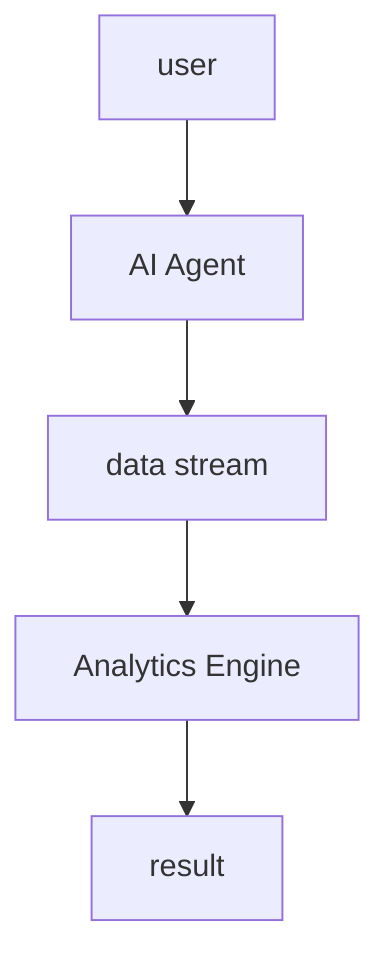
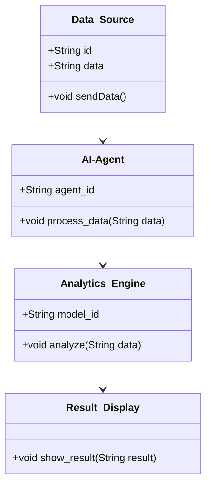
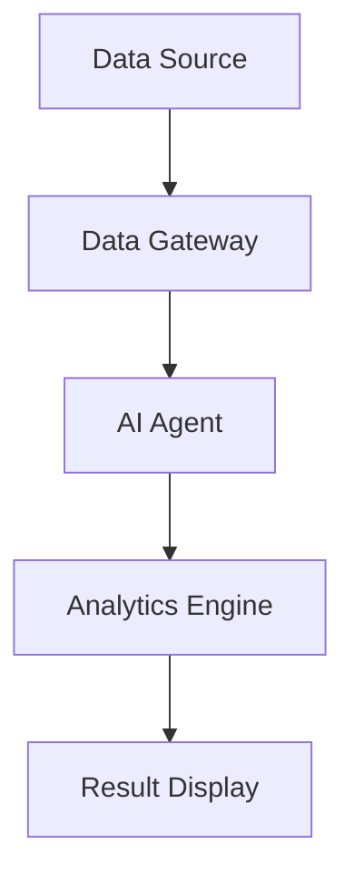
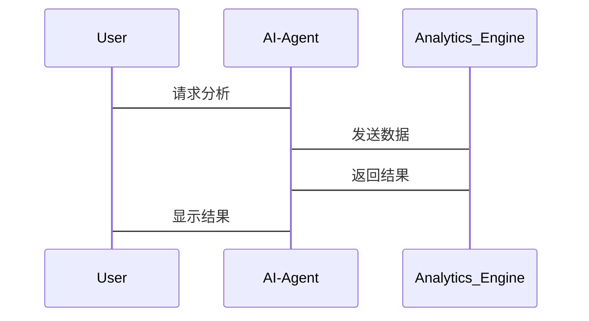

                 


# 《企业AI Agent的实时大数据分析平台》

> 关键词：企业AI Agent，实时大数据分析，流数据处理，机器学习，系统架构设计

> 摘要：本文将详细探讨企业AI Agent在实时大数据分析平台中的应用，从背景介绍、核心概念、算法原理、系统架构设计到项目实战，系统地分析和实现这一平台。通过本篇文章，读者将了解如何构建一个高效、可靠的实时数据分析平台，利用AI Agent技术为企业决策提供实时支持。

---

# 第一部分: 企业AI Agent的实时大数据分析平台背景与概述

## 第1章: 问题背景与目标

### 1.1 问题背景介绍

#### 1.1.1 企业实时数据分析的需求

随着企业数字化转型的推进，实时数据分析成为企业运营和决策的关键。企业需要快速处理大量数据，以应对市场变化和内部管理优化的需求。实时数据分析可以帮助企业做出及时反应，提升竞争力。

#### 1.1.2 AI Agent在企业中的应用现状

AI Agent（人工智能代理）是一种能够感知环境并采取行动以实现目标的智能实体。在企业中，AI Agent可以用于自动化任务处理、数据监控、决策支持等领域。当前，AI Agent的应用正在逐步扩大，尤其是在实时数据分析方面展现出巨大潜力。

#### 1.1.3 当前存在的主要问题与挑战

尽管AI Agent在企业中的应用前景广阔，但仍然面临诸多挑战。例如，数据源多样且复杂，实时处理的效率和准确性有待提升；AI Agent的智能性和适应性需要进一步优化；平台的可扩展性和安全性也是需要重点考虑的问题。

### 1.2 问题描述与目标设定

#### 1.2.1 企业实时大数据分析的核心需求

企业实时大数据分析的核心需求包括：快速处理海量数据，提供实时洞察；支持多种数据源的接入；具备高度的可扩展性和灵活性；确保数据安全与隐私保护。

#### 1.2.2 AI Agent在实时数据分析中的作用

AI Agent在实时数据分析中扮演着重要角色。它能够实时监控数据流，识别异常情况，提供预测性分析，并自动触发相应的行动。AI Agent的引入可以显著提升数据分析的效率和准确性。

#### 1.2.3 平台建设的目标与关键指标

平台建设的目标是构建一个高效、可靠的实时大数据分析平台，支持AI Agent的智能化操作。关键指标包括：实时处理能力、数据准确性、系统的可扩展性、安全性等。

## 第2章: 问题解决与边界定义

### 2.1 解决方案概述

#### 2.1.1 AI Agent的核心功能

AI Agent的核心功能包括数据采集、数据处理、决策制定和行动执行。它能够自动感知环境变化，并根据预设的规则和模型做出相应的决策。

#### 2.1.2 实时数据分析的关键技术

实时数据分析的关键技术包括流数据处理、分布式计算、事件驱动架构等。这些技术能够支持大规模数据的实时处理和分析。

#### 2.1.3 平台建设的整体架构思路

平台建设的整体架构思路包括数据源接入、数据处理与分析、AI Agent的智能决策、结果展示与反馈。整个平台需要具备高度的可扩展性和灵活性，以适应不同企业的需求。

### 2.2 边界与外延分析

#### 2.2.1 平台的功能边界

平台的功能边界包括数据采集、实时处理、智能分析和结果展示。不包括数据存储、数据清洗等非实时处理的部分。

#### 2.2.2 与现有系统的接口定义

平台需要与企业的现有系统（如ERP、CRM等）进行接口对接，确保数据的实时流动和信息共享。接口定义需要遵循统一的标准，确保系统的兼容性和数据的安全性。

#### 2.2.3 未来可能的扩展方向

未来，平台可以通过引入更高级的AI算法、增强数据可视化功能、扩展支持更多数据源等方式进行优化和扩展。

## 第3章: 核心概念与系统要素

### 3.1 核心概念解析

#### 3.1.1 AI Agent的基本概念

AI Agent是一种能够感知环境并采取行动以实现目标的智能实体。它可以在企业中自动化处理各种任务，如数据监控、预测分析等。

#### 3.1.2 实时大数据分析的定义

实时大数据分析是指对不断流动的数据进行实时处理和分析，以提供即时的洞察和决策支持。

#### 3.1.3 平台的整体架构组成

平台的整体架构组成包括数据源、数据处理层、AI Agent智能层、结果展示层和用户交互层。每一层都有其特定的功能和作用。

### 3.2 系统核心要素

#### 3.2.1 数据源与数据流

数据源包括企业内部的各种系统（如数据库、日志系统）和外部数据源（如API接口）。数据流则是指数据从源到处理层的流动过程。

#### 3.2.2 AI Agent的功能模块

AI Agent的功能模块包括数据采集、数据预处理、模型训练与推理、决策制定和行动执行。这些模块共同协作，完成实时数据分析的任务。

#### 3.2.3 平台的用户角色与权限

平台的用户角色包括普通用户、管理员和开发者。权限管理需要根据角色的不同，分配相应的操作权限，确保系统的安全性和数据的隐私性。

## 第4章: 核心概念关系与系统架构

### 4.1 概念属性对比

#### 4.1.1 AI Agent与传统数据分析工具的对比

AI Agent与传统数据分析工具的主要区别在于智能化和自动化能力。AI Agent能够自主决策和行动，而传统工具需要人工干预。

#### 4.1.2 实时数据分析与批量数据分析的对比

实时数据分析注重数据的即时处理和分析，适用于需要快速反应的场景；批量数据分析则是对历史数据进行处理，适用于需要深度分析和长期趋势分析的场景。

#### 4.1.3 平台功能模块的属性分析

平台功能模块的属性分析包括模块的功能、性能、交互方式等。不同的模块需要具备不同的属性，以满足平台的整体需求。

### 4.2 实体关系图

#### 4.2.1 ER实体关系图

以下是平台的核心实体关系图，使用 Mermaid 图表示：



该图展示了用户与AI Agent之间的交互，AI Agent处理数据流，经过分析引擎处理后，生成分析结果。

---

# 第二部分: 算法原理

## 第5章: 算法原理

### 5.1 算法原理概述

#### 5.1.1 流数据处理算法

流数据处理算法是实时数据分析的核心。常用的流数据处理算法包括滑动窗口算法、增量计算算法等。这些算法能够高效地处理实时数据流，确保数据的准确性和及时性。

#### 5.1.2 机器学习模型

机器学习模型在实时数据分析中扮演着重要角色。常用的模型包括时间序列预测模型、分类模型等。这些模型能够根据实时数据的变化，动态调整参数，提供准确的预测和分类结果。

#### 5.1.3 实时计算框架

实时计算框架是实现实时数据分析的重要技术。常用的框架包括Flink、Storm、Spark Streaming等。这些框架提供了高效的流数据处理能力和强大的计算能力，支持大规模实时数据分析。

### 5.2 算法实现与优化

#### 5.2.1 流数据处理算法实现

以下是流数据处理算法的实现示例，使用 Python 代码：

```python
from collections import deque

class SlidingWindow:
    def __init__(self, window_size):
        self.window_size = window_size
        self.window = deque()

    def add(self, data_point):
        self.window.append(data_point)
        if len(self.window) > self.window_size:
            self.window.popleft()

    def get_average(self):
        if not self.window:
            return 0
        return sum(self.window) / len(self.window)
```

该代码实现了一个滑动窗口算法，用于计算数据流的平均值。

#### 5.2.2 机器学习模型优化

机器学习模型的优化是实时数据分析中的重要环节。通过动态调整模型参数和优化算法，可以提升模型的预测准确性和计算效率。例如，使用在线学习算法，模型可以在实时数据流中不断更新，保持对最新数据的适应能力。

#### 5.2.3 算法复杂度分析

算法复杂度分析是评估算法性能的重要手段。通过分析算法的时间复杂度和空间复杂度，可以优化算法设计，提升系统的整体性能。例如，滑动窗口算法的时间复杂度为O(1)，空间复杂度为O(n)，其中n是窗口的大小。

### 5.3 算法数学模型与公式

#### 5.3.1 流数据处理的数学模型

流数据处理的数学模型可以表示为：

$$
\text{current\_sum} = \text{previous\_sum} - \text{oldest\_data\_point} + \text{new\_data\_point}
$$

其中，current\_sum 是当前窗口的和，previous\_sum 是前一窗口的和，oldest\_data\_point 是窗口中最早的数据点，new\_data\_point 是新进入窗口的数据点。

#### 5.3.2 机器学习模型的数学公式

机器学习模型的数学公式以线性回归为例：

$$
y = \beta_0 + \beta_1 x + \epsilon
$$

其中，y 是目标变量，x 是自变量，$\beta_0$ 和 $\beta_1$ 是模型参数，$\epsilon$ 是误差项。

---

# 第三部分: 系统分析与架构设计

## 第6章: 系统分析与架构设计

### 6.1 问题场景介绍

#### 6.1.1 系统需求分析

系统需求分析包括功能需求、性能需求、安全性需求等。例如，系统需要支持多数据源的接入，具备高吞吐量和低延迟的处理能力，确保数据的安全性和隐私性。

#### 6.1.2 项目介绍

本项目旨在构建一个高效、可靠的实时大数据分析平台，支持AI Agent的智能化操作。平台需要具备数据采集、实时处理、智能分析和结果展示等功能。

### 6.2 系统功能设计

#### 6.2.1 领域模型

以下是领域模型的Mermaid图：



该图展示了数据源、AI Agent、分析引擎和结果展示之间的关系。

#### 6.2.2 系统架构设计

以下是系统架构设计的Mermaid图：



该图展示了数据从数据源经过网关、AI Agent和分析引擎，最终在结果展示层显示的过程。

#### 6.2.3 接口设计

接口设计包括数据源接口、AI Agent接口、分析引擎接口和结果展示接口。每个接口都需要定义明确的接口规范，确保系统的兼容性和可扩展性。

#### 6.2.4 交互流程

以下是交互流程的Mermaid图：



该图展示了用户请求分析、AI Agent处理数据并返回结果的交互流程。

---

# 第四部分: 项目实战

## 第7章: 项目实战

### 7.1 环境安装

#### 7.1.1 安装依赖

以下是项目实战所需的依赖安装命令：

```bash
pip install numpy pandas matplotlib
```

#### 7.1.2 安装开发环境

安装Jupyter Notebook或其他开发工具，用于代码开发和调试。

### 7.2 核心代码实现

#### 7.2.1 数据采集代码

以下是数据采集代码示例：

```python
import requests
import json

def fetch_data(api_url):
    response = requests.get(api_url)
    if response.status_code == 200:
        return json.loads(response.text)
    else:
        return None
```

#### 7.2.2 数据处理与分析代码

以下是数据处理与分析代码示例：

```python
import pandas as pd
from sklearn import linear_model

def process_data(data):
    df = pd.DataFrame(data)
    model = linear_model.LinearRegression()
    model.fit(df[['feature']], df['target'])
    return model.predict(df[['feature']])
```

### 7.3 代码解读与分析

#### 7.3.1 数据采集代码解读

数据采集代码通过API接口获取实时数据，处理返回的状态码和响应内容，确保数据的准确性和完整性。

#### 7.3.2 数据处理与分析代码解读

数据处理与分析代码使用Pandas库进行数据处理，并使用Scikit-learn库进行机器学习模型的训练和预测。模型可以根据实时数据的变化进行动态调整，确保分析结果的准确性。

### 7.4 案例分析

#### 7.4.1 实际案例分析

以下是实际案例分析：

某电商平台使用本平台进行实时数据分析，通过AI Agent实时监控商品销售数据，预测销售趋势，并自动调整库存和促销策略。该平台显著提升了销售效率和客户满意度。

#### 7.4.2 代码实现细节

代码实现细节包括数据预处理、模型训练、结果展示等部分。每一部分都需要详细解读，确保读者能够理解代码的功能和实现方式。

### 7.5 项目小结

通过本项目实战，读者可以掌握实时大数据分析平台的核心技术和实现方法。项目从小到大逐步展开，帮助读者逐步理解平台的设计和实现过程。

---

# 第五部分: 总结

## 第8章: 总结

### 8.1 最佳实践 tips

- 在实时数据分析中，数据源的多样性和复杂性需要特别关注，确保数据的准确性和完整性。
- AI Agent的智能化和自动化能力是提升平台效率的关键，建议在设计中充分考虑其功能和性能。
- 系统架构的设计需要具备高度的可扩展性和灵活性，以适应不同企业的需求。

### 8.2 小结

本文详细探讨了企业AI Agent在实时大数据分析平台中的应用，从背景介绍、核心概念、算法原理、系统架构设计到项目实战，系统地分析和实现这一平台。通过本篇文章，读者可以了解如何构建一个高效、可靠的实时大数据分析平台，利用AI Agent技术为企业决策提供实时支持。

### 8.3 注意事项

- 数据安全和隐私保护是实时数据分析平台设计中的重要环节，需要特别注意。
- 系统的可扩展性和灵活性需要在设计阶段充分考虑，以应对未来的需求变化。
- 在实际应用中，需要根据企业的具体需求进行定制化开发，确保平台的功能和性能满足实际需求。

### 8.4 拓展阅读

- 深入学习实时数据处理技术，如Flink、Storm等框架。
- 研究更高级的AI算法，如深度学习、强化学习等，提升AI Agent的智能化水平。
- 关注实时数据分析领域的最新技术和应用案例，保持技术领先性。

---

# 作者

作者：AI天才研究院/AI Genius Institute & 禅与计算机程序设计艺术 /Zen And The Art of Computer Programming

