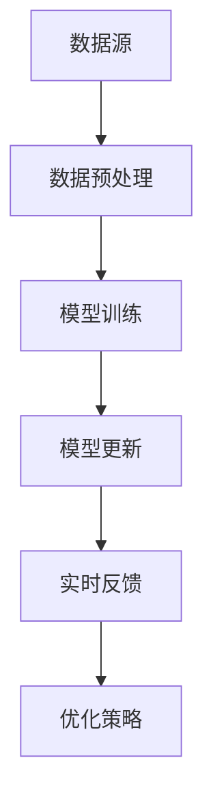
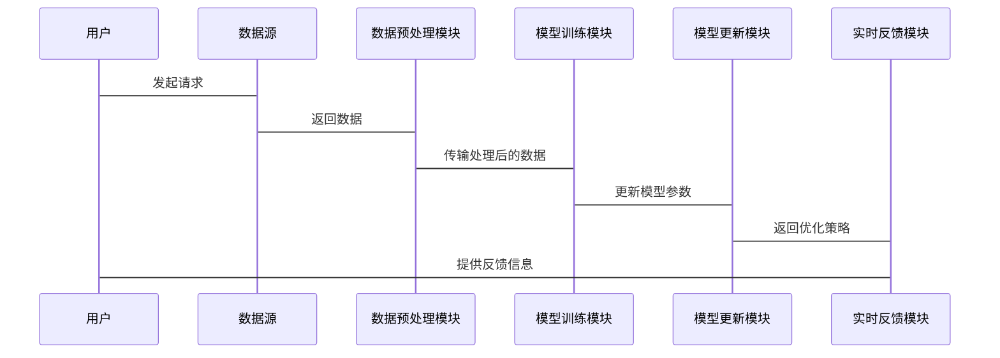

                 

# 企业AI Agent的实时学习能力：持续优化业务流程

## 关键词：
- AI Agent
- 实时学习
- 业务流程优化
- 强化学习
- 在线学习

## 摘要：
本文深入探讨了企业AI Agent的实时学习能力及其在优化业务流程中的应用。从概念解析到技术实现，从系统架构到项目实战，结合数学模型、算法流程图和Python代码示例，全面阐述了如何通过实时学习能力提升企业的智能化水平。文章还提供了最佳实践和未来展望，为技术实践者提供了有价值的参考。

## 第一部分：企业AI Agent的实时学习能力概述

## 第1章：企业AI Agent的背景与概念

### 1.1 企业AI Agent的定义与特点

#### 1.1.1 企业AI Agent的定义
企业AI Agent（Artificial Intelligence Agent）是一种能够感知环境、自主决策并执行任务的智能体。它能够理解业务需求，分析数据，并通过学习和优化来提升任务执行效率。

#### 1.1.2 企业AI Agent的核心特点
企业AI Agent具有以下几个核心特点：
1. **自主性**：能够在没有外部干预的情况下自主决策。
2. **反应性**：能够实时感知环境变化并做出相应反应。
3. **学习能力**：通过数据和经验不断优化自身的决策模型。
4. **适应性**：能够根据业务需求的变化进行自我调整。

#### 1.1.3 企业AI Agent与传统AI的区别
企业AI Agent与传统AI的区别主要体现在以下几个方面：
1. **自主性**：企业AI Agent具有更强的自主性，能够独立完成任务。
2. **实时性**：企业AI Agent具备实时学习和决策的能力，而传统AI则更多依赖预设的规则。
3. **适应性**：企业AI Agent能够根据环境变化进行自适应调整，而传统AI则相对固定。

### 1.2 实时学习能力的背景与重要性

#### 1.2.1 实时学习能力的定义
实时学习能力是指AI Agent能够在动态变化的环境中，实时接收反馈并快速调整其决策模型的能力。这种能力使得AI Agent能够更好地适应环境变化，提高任务执行效率。

#### 1.2.2 实时学习能力在企业中的应用场景
实时学习能力在企业中的应用场景十分广泛，主要包括：
1. **客户服务**：实时优化客户服务流程，提高客户满意度。
2. **供应链管理**：实时优化供应链中的库存管理和物流调度。
3. **风险管理**：实时监测和预测潜在风险，提前制定应对策略。
4. **销售预测**：实时分析市场动态，优化销售预测模型。

#### 1.2.3 实时学习能力对企业竞争力的影响
实时学习能力能够显著提升企业的竞争力，主要体现在以下几个方面：
1. **提高效率**：通过实时优化业务流程，减少资源浪费，提高效率。
2. **增强灵活性**：能够快速适应市场变化，增强企业的灵活性。
3. **提升决策质量**：通过实时学习和优化，提升决策的准确性和科学性。

## 第2章：企业AI Agent实时学习能力的核心概念

### 2.1 AI Agent的实时学习机制

#### 2.1.1 数据流驱动的学习过程
企业AI Agent的实时学习过程是通过数据流驱动的。系统实时接收数据，经过预处理、特征提取和模型训练，生成新的决策策略。

#### 2.1.2 模型更新与优化策略
模型更新与优化策略是实时学习的核心。通过不断更新模型参数，使得模型能够更好地适应新的数据分布。

#### 2.1.3 实时反馈机制的作用
实时反馈机制能够快速验证模型的决策效果，并根据反馈结果调整模型参数，从而实现持续优化。

### 2.2 实时学习能力的关键技术

#### 2.2.1 强化学习在实时学习中的应用
强化学习是一种通过试错机制来优化决策模型的方法。在实时学习中，强化学习能够帮助AI Agent在动态环境中找到最优策略。

#### 2.2.2 迁移学习与在线学习的区别
迁移学习是指将已有的知识应用到新的任务中，而在线学习则是指在数据流不断的情况下，实时更新模型参数。

#### 2.2.3 实时数据处理与模型更新的结合
实时数据处理与模型更新的结合能够确保模型始终基于最新的数据进行优化，从而提高决策的准确性和实时性。

## 第3章：企业AI Agent实时学习能力的数学模型与算法

### 3.1 强化学习算法

#### 3.1.1 Q-learning算法的数学模型
Q-learning算法的数学模型如下：
$$ Q(s, a) = r + \gamma \max_{a'} Q(s', a') $$
其中，$s$表示当前状态，$a$表示当前动作，$r$表示奖励，$\gamma$表示折扣因子。

#### 3.1.2 Deep Q-Network (DQN)的实现
Deep Q-Network (DQN)是一种基于深度学习的强化学习算法。通过神经网络来近似Q值函数，从而实现对复杂状态空间的处理。

#### 3.1.3 实际案例中的应用
以游戏AI为例，DQN算法能够通过不断试错，最终学会在游戏环境中做出最优决策。

### 3.2 在线学习算法

#### 3.2.1 随机梯度下降（SGD）的数学模型
随机梯度下降（SGD）的数学模型如下：
$$ \theta_{t+1} = \theta_t - \eta \nabla L(\theta_t) $$
其中，$\theta$表示模型参数，$\eta$表示学习率，$L$表示损失函数。

#### 3.2.2 增量式学习的实现
增量式学习是一种在线学习方法，通过每次接收一个样本，逐步更新模型参数。

#### 3.2.3 在线学习的优缺点分析
在线学习的优点是能够实时更新模型，适应数据分布的变化；缺点是需要处理数据流的实时性，对计算资源要求较高。

## 第4章：企业AI Agent实时学习能力的系统架构设计

### 4.1 系统功能设计

#### 4.1.1 数据采集与处理模块
数据采集与处理模块负责实时采集业务数据，并进行预处理，确保数据的准确性和可用性。

#### 4.1.2 模型训练与更新模块
模型训练与更新模块负责基于实时数据，训练和更新决策模型，确保模型始终处于最优状态。

#### 4.1.3 实时反馈与优化模块
实时反馈与优化模块负责接收系统的反馈信息，调整模型参数，优化决策策略。

### 4.2 系统架构图

### 4.3 系统接口设计

#### 4.3.1 数据接口规范
数据接口规范包括数据格式、数据传输协议等，确保数据能够顺利传输和处理。

#### 4.3.2 模型接口规范
模型接口规范包括模型输入输出格式、模型调用接口等，确保模型能够被正确调用和更新。

#### 4.3.3 用户接口规范
用户接口规范包括用户交互界面、用户权限管理等，确保系统能够被用户方便地使用和管理。

### 4.4 系统交互流程

## 第五部分：总结与展望

### 5.1 实时学习能力的最佳实践

#### 5.1.1 确保数据质量
数据质量是实时学习的基础，必须确保数据的准确性和完整性。

#### 5.1.2 选择合适的算法
根据具体的业务场景和数据特点，选择合适的算法和模型。

#### 5.1.3 实时监控与调整
实时监控系统的运行状态，及时发现和解决问题，确保系统的稳定性和高效性。

### 5.2 本文小结
本文从概念、技术、算法和系统架构等多个方面，全面探讨了企业AI Agent的实时学习能力。通过理论分析和实际案例的结合，为读者提供了丰富的知识和实践指导。

### 5.3 注意事项
在实际应用中，需要注意数据隐私、模型稳定性和系统安全性等问题，确保系统的可靠运行。

### 5.4 拓展阅读
读者可以进一步阅读相关领域的书籍和论文，深入了解实时学习的最新研究成果和技术进展。

## 参考文献
[1] Richard S. Sutton, Andrew G. Barto. 《Reinforcement Learning: An Introduction》
[2] Yoshua Bengio. 《Deep Learning》
[3] 李航. 《机器学习实战》

## 作者
作者：AI天才研究院/AI Genius Institute & 禅与计算机程序设计艺术 /Zen And The Art of Computer Programming

