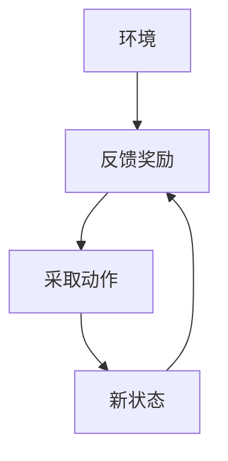
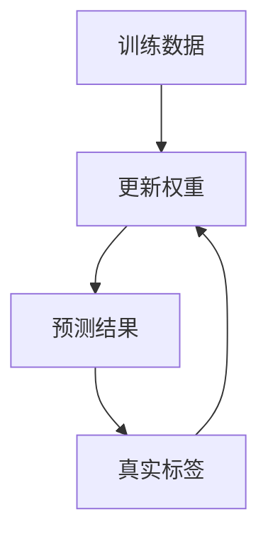
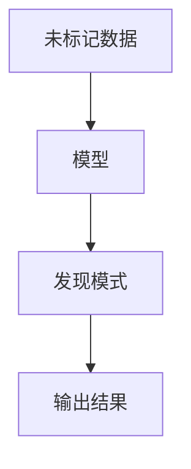
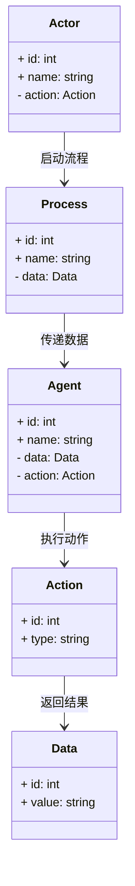
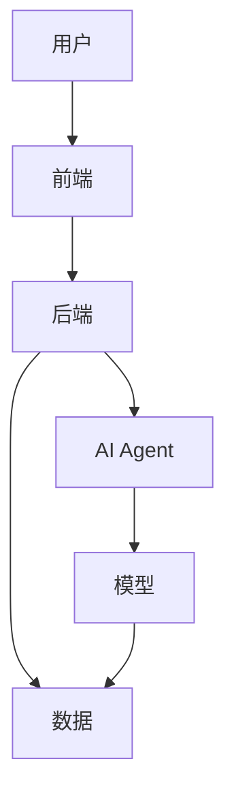
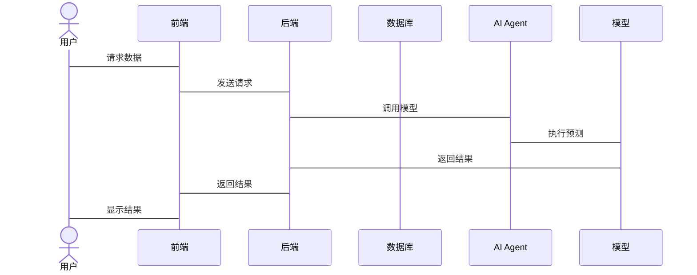
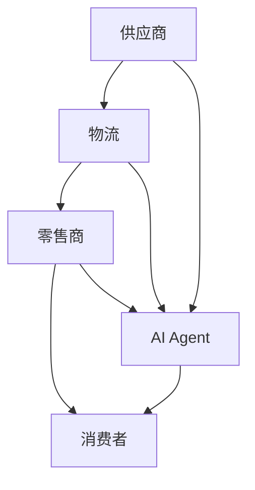

                 


# 企业AI Agent的实时学习能力：持续优化业务流程

## 关键词：AI Agent，实时学习，业务流程优化，强化学习，系统架构

## 摘要：本文探讨了企业AI Agent的实时学习能力在持续优化业务流程中的应用。通过分析AI Agent的核心概念、算法原理、系统架构以及实际案例，本文详细阐述了如何利用实时学习能力提升企业效率和竞争力。

---

# 第一部分：企业AI Agent的背景与概念

## 第1章：问题背景与描述

### 1.1 问题背景
企业传统业务流程面临以下痛点：
- 业务流程复杂，人工操作效率低。
- 数据孤岛问题严重，难以实时反馈优化建议。
- 业务需求变化快，传统静态流程难以快速响应。

AI Agent的引入为企业提供了实时学习能力，能够根据实时数据和反馈动态优化业务流程，显著提升企业效率和竞争力。

### 1.2 问题描述
企业需要一种能够实时学习、动态优化的智能系统，以解决以下问题：
- 业务流程中的不确定性问题。
- 数据驱动决策的实时性需求。
- 知识更新与共享的效率低下。

### 1.3 问题解决
AI Agent具备以下核心能力：
- 实时感知环境变化。
- 自主决策优化。
- 知识学习与共享。

通过实时学习能力，AI Agent可以动态调整业务流程，实现持续优化。

### 1.4 边界与外延
AI Agent的应用范围包括：
- 企业内部流程优化。
- 客户服务自动化。
- 供应链管理。

与传统自动化系统相比，AI Agent具备更强的适应性和学习能力。与其他AI技术相比，实时学习能力是其核心区别。

## 第2章：核心概念与联系

### 2.1 核心概念原理
AI Agent的基本原理包括：
- 感知环境：通过传感器或API获取实时数据。
- 判断决策：基于实时数据进行分析和决策。
- 执行操作：根据决策结果执行操作并反馈结果。

实时学习能力的实现依赖于强化学习、监督学习等算法。

### 2.2 核心概念属性特征对比
以下是不同AI技术的对比：

| 技术类型   | 是否需要实时反馈 | 是否具备自主学习能力 | 是否适用于动态环境 |
|------------|------------------|----------------------|--------------------|
| 监督学习     | 否               | 否                  | 否                |
| 强化学习     | 是               | 是                  | 是                |
| 半监督学习   | 部分             | 部分                | 部分              |

### 2.3 ER实体关系图
以下是AI Agent的实体关系图：

```mermaid
er
  actor: 用户
  process: 业务流程
  agent: AI Agent
  data: 数据
  action: 动作
  result: 结果

  actor --> process: 启动流程
  process --> agent: 传递数据
  agent --> action: 执行动作
  action --> result: 返回结果
  result --> actor: 提供反馈
```

---

# 第二部分：算法原理与系统架构

## 第3章：算法原理讲解

### 3.1 强化学习算法

以下是强化学习的流程图：



强化学习的数学模型如下：

$$
Q(s, a) = r + \gamma \max_{a'} Q(s', a')
$$

其中：
- \( Q(s, a) \)：状态s下动作a的Q值。
- \( r \)：奖励值。
- \( \gamma \)：折扣因子。
- \( s' \)：新状态。

### 3.2 监督学习算法

以下是监督学习的流程图：



监督学习的数学模型如下：

$$
y = f(x) + \epsilon
$$

其中：
- \( y \)：预测值。
- \( x \)：输入特征。
- \( f(x) \)：模型函数。
- \( \epsilon \)：误差项。

### 3.3 无监督学习算法

以下是无监督学习的流程图：



无监督学习的数学模型如下：

$$
p(x) = \sum_{k=1}^{K} \pi_k N(x|\mu_k, \Sigma_k)
$$

其中：
- \( p(x) \)：数据分布。
- \( N(x|\mu_k, \Sigma_k) \)：高斯分布。
- \( \pi_k \)：混合比例。

## 第4章：系统分析与架构设计

### 4.1 系统功能设计

以下是领域模型类图：



### 4.2 系统架构设计

以下是系统架构图：



### 4.3 接口设计与交互

以下是系统交互序列图：



---

# 第三部分：项目实战与优化建议

## 第5章：项目实战

### 5.1 环境安装
需要安装以下工具：
- Python 3.8+
- TensorFlow 2.0+
- Mermaid CLI

### 5.2 核心代码实现
以下是AI Agent的核心代码：

```python
class AI_Agent:
    def __init__(self):
        self.models = {}

    def train(self, data):
        # 训练模型
        pass

    def predict(self, input):
        # 预测输出
        pass

    def update(self, feedback):
        # 更新模型
        pass
```

### 5.3 代码解读与分析
该代码实现了AI Agent的基本功能：
- `__init__`：初始化模型。
- `train`：训练模型。
- `predict`：预测输出。
- `update`：更新模型。

### 5.4 案例分析
以下是AI Agent在供应链管理中的应用案例：



### 5.5 项目小结
通过实际案例分析，可以发现AI Agent能够显著优化业务流程，提升企业效率。

## 第6章：最佳实践

### 6.1 总结
- AI Agent的实时学习能力是优化业务流程的核心。
- 强化学习在动态环境中表现优异。
- 系统架构设计需要考虑可扩展性和可维护性。

### 6.2 注意事项
- 数据质量直接影响AI Agent的性能。
- 需要定期更新模型以适应环境变化。
- 注意数据隐私和安全问题。

### 6.3 未来趋势
- 更多行业将采用AI Agent优化业务流程。
- 自监督学习和无监督学习将得到更多应用。
- 多模态学习将成为新的研究方向。

### 6.4 拓展阅读
推荐阅读以下书籍和文章：
- 《强化学习（书籍）》
- 《机器学习实战》
- 《深度学习入门》

---

# 结语

企业AI Agent的实时学习能力为企业提供了持续优化业务流程的可能。通过本文的详细讲解，读者可以深入了解AI Agent的核心概念、算法原理和系统架构，并通过实际案例学习如何应用这些技术优化业务流程。

---

**作者：AI天才研究院 & 禅与计算机程序设计艺术**

