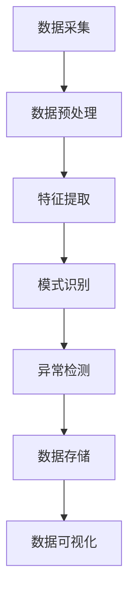
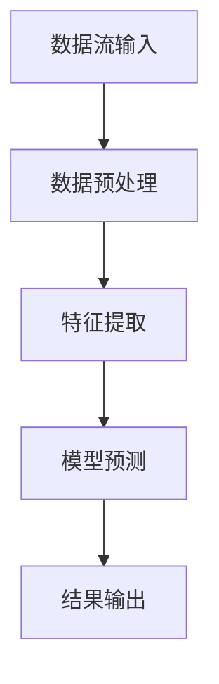
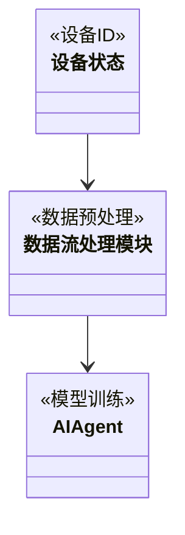
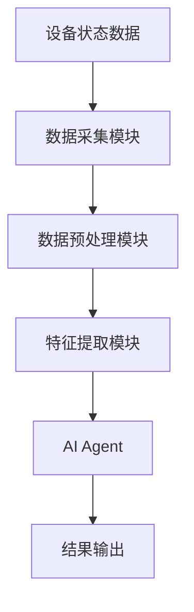
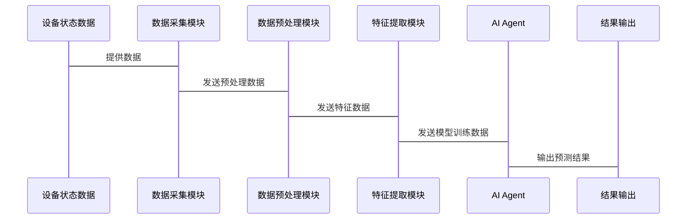

                 


# 企业AI Agent的实时数据流处理架构

## 关键词：企业AI Agent、实时数据流处理、流处理引擎、机器学习模型、分布式计算框架

## 摘要：  
本文详细探讨了企业AI Agent在实时数据流处理中的架构设计与实现。通过分析AI Agent的核心概念、实时数据流处理的算法原理、系统架构设计以及项目实战，本文为读者提供了一套完整的解决方案，帮助企业高效处理实时数据流，提升决策能力。

---

## 第1章: 企业AI Agent与实时数据流处理背景

### 1.1 企业AI Agent的定义与特点
#### 1.1.1 AI Agent的基本概念
AI Agent（人工智能代理）是指能够感知环境、自主决策并执行任务的智能实体。它通过传感器获取信息，利用推理能力做出决策，并通过执行器与环境交互。

#### 1.1.2 企业AI Agent的核心特点
企业AI Agent具有以下特点：
- **自主性**：能够在无外部干预的情况下自主运行。
- **反应性**：能够实时感知环境变化并做出响应。
- **目标导向**：具备明确的目标，能够优化决策以实现目标。
- **可扩展性**：能够处理不同类型和规模的任务。

#### 1.1.3 与传统AI的区别
与传统AI相比，AI Agent具有更强的自主性和适应性，能够与环境动态交互，而非仅仅依赖预设规则。

### 1.2 实时数据流处理的背景与意义
#### 1.2.1 数据流处理的基本概念
数据流处理是指对连续不断的数据流进行采集、处理、分析和响应的过程。实时数据流处理要求在数据生成的同时完成处理，以满足低延迟和高实时性的需求。

#### 1.2.2 实时数据流处理的重要性
在企业中，实时数据流处理能够帮助企业快速响应市场变化、优化运营效率并提升客户体验。例如，在金融领域，实时数据流处理可以用于股票交易的实时监控和风险预警。

#### 1.2.3 企业级实时数据流处理的挑战
企业级实时数据流处理面临以下挑战：
- **数据量大**：企业每天需要处理海量数据，对计算能力要求高。
- **实时性要求高**：需要在极短时间内完成数据处理和响应。
- **系统稳定性**：必须保证系统在高负载和故障情况下的稳定性。

### 1.3 企业AI Agent与实时数据流处理的结合
#### 1.3.1 AI Agent在实时数据流处理中的角色
AI Agent能够通过实时感知数据流中的信息，快速做出决策并执行相应的操作。例如，在物联网场景中，AI Agent可以实时监控设备状态，预测潜在故障并触发维护操作。

#### 1.3.2 企业应用场景分析
企业中的实时数据流处理场景包括：
- **金融交易**：实时监控市场动态，优化投资决策。
- **智能制造**：实时监控生产线状态，预测设备故障。
- **物流管理**：实时跟踪货物运输状态，优化配送路径。

#### 1.3.3 未来发展趋势
随着AI技术的进步和数据流处理技术的优化，企业AI Agent在实时数据流处理中的应用将更加广泛，决策能力也将更加智能化和精准化。

### 1.4 本章小结
本章介绍了企业AI Agent的定义和特点，分析了实时数据流处理的重要性和挑战，并探讨了AI Agent在实时数据流处理中的应用和未来发展趋势。

---

## 第2章: 企业AI Agent实时数据流处理的核心概念

### 2.1 数据流处理的流程与架构
#### 2.1.1 数据流的采集与预处理
数据流的采集是实时数据流处理的第一步，通常通过传感器、API或其他数据源获取。预处理包括数据清洗、格式转换和标准化。

#### 2.1.2 数据流的分析与处理
分析与处理阶段包括数据的特征提取、模式识别和异常检测。通过这些步骤，可以发现数据中的有价值信息。

#### 2.1.3 数据流的存储与可视化
处理后的数据需要存储在数据库中，并通过可视化工具展示，以便企业进行进一步的分析和决策。

#### 2.1.4 数据流处理的流程图


### 2.2 AI Agent在实时数据流处理中的作用
#### 2.2.1 AI Agent的感知能力
AI Agent通过传感器和API实时感知数据流中的信息，能够快速识别数据中的模式和异常。

#### 2.2.2 AI Agent的决策能力
AI Agent利用机器学习模型和推理算法，对实时数据进行分析并做出决策。例如，在金融领域，AI Agent可以实时分析市场动态并做出买卖决策。

#### 2.2.3 AI Agent的执行能力
AI Agent能够根据决策结果执行相应的操作，例如触发警报、调整设备参数或下单交易。

### 2.3 实时数据流处理的核心技术
#### 2.3.1 流处理引擎
流处理引擎是实时数据流处理的核心技术之一，负责对数据流进行实时处理。常见的流处理引擎包括Apache Flink和Kafka Streams。

#### 2.3.2 分布式计算框架
分布式计算框架（如Apache Spark和Hadoop）为实时数据流处理提供了强大的计算能力，能够处理海量数据。

#### 2.3.3 机器学习模型的实时更新
为了保证AI Agent的决策能力，机器学习模型需要实时更新。在线学习算法（如在线随机梯度下降）可以实现实时更新。

### 2.4 本章小结
本章详细介绍了实时数据流处理的核心概念，包括数据流的采集、处理和存储，AI Agent在其中的作用，以及实时数据流处理的核心技术。

---

## 第3章: 企业AI Agent实时数据流处理的核心算法与原理

### 3.1 实时数据流处理的算法原理
#### 3.1.1 流处理算法的基本原理
流处理算法的核心是处理无限的、实时到达的数据流。常见的流处理算法包括滑动窗口和滚动窗口。

#### 3.1.2 窗口机制与时间戳处理
为了处理实时数据流，流处理引擎通常使用窗口机制。窗口可以是时间窗口（如5分钟内所有数据）或事件窗口（如所有事件处理完成）。

#### 3.1.3 状态管理与维护
流处理引擎需要维护状态信息，例如计数器和聚合结果。状态管理的挑战在于如何高效地维护和更新状态。

### 3.2 AI Agent的机器学习模型实时更新
#### 3.2.1 在线学习的基本原理
在线学习是一种机器学习范式，能够在数据流不断到达的情况下实时更新模型。与批量学习不同，在线学习具有低延迟和高实时性的特点。

#### 3.2.2 模型更新的数学公式
在线随机梯度下降是一种常用在线学习算法，其更新公式如下：
$$\theta_{t+1} = \theta_t - \eta \cdot \nabla J(\theta_t)$$
其中，$\theta_t$是参数向量，$\eta$是学习率，$\nabla J(\theta_t)$是损失函数的梯度。

#### 3.2.3 模型评估与优化
为了保证模型的准确性，需要定期评估模型性能，并根据评估结果优化模型参数。

### 3.3 算法实现的流程图


### 3.4 本章小结
本章详细介绍了实时数据流处理的核心算法，包括流处理算法和在线学习算法的原理与实现。

---

## 第4章: 企业AI Agent实时数据流处理的系统架构设计

### 4.1 问题场景介绍
本章将设计一个企业级AI Agent实时数据流处理系统，用于实时监控和分析生产线上的设备状态数据。

### 4.2 系统功能设计
#### 4.2.1 领域模型


#### 4.2.2 系统架构设计


#### 4.2.3 系统接口设计
系统主要接口包括数据采集接口、数据处理接口和结果输出接口。

#### 4.2.4 系统交互序列图


### 4.3 本章小结
本章设计了一个企业级AI Agent实时数据流处理系统的架构，包括系统功能设计、架构设计和交互设计。

---

## 第5章: 企业AI Agent实时数据流处理的项目实战

### 5.1 环境安装
项目需要以下环境：
- **编程语言**：Python 3.8+
- **框架与工具**：Apache Flink、TensorFlow、Kafka
- **开发环境**：Jupyter Notebook或IDE

### 5.2 系统核心实现源代码
以下是AI Agent实时数据流处理的核心代码示例：
```python
import tensorflow as tf
from tensorflow.keras import layers

# 定义在线随机梯度下降模型
class OnlineSGDModel:
    def __init__(self, input_dim, lr=0.1):
        self.model = tf.keras.Sequential([
            layers.Dense(64, activation='relu', input_dim=input_dim),
            layers.Dense(1, activation='sigmoid')
        ])
        self.optimizer = tf.keras.optimizers.SGD(learning_rate=lr)
    
    def update(self, x, y):
        with tf.GradientTape() as tape:
            y_pred = self.model(x)
            loss = tf.reduce_mean(tf.square(y_pred - y))
        gradients = tape.gradient(loss, self.model.trainable_weights)
        self.optimizer.apply_gradients(zip(gradients, self.model.trainable_weights))

# 示例数据流处理
import numpy as np
import time

# 初始化模型
model = OnlineSGDModel(input_dim=64)
for _ in range(1000):
    x = np.random.randn(1, 64)
    y = np.random.randn(1, 1)
    model.update(x, y)
    time.sleep(1)
```

### 5.3 代码应用解读与分析
上述代码实现了一个在线随机梯度下降模型，能够在数据流实时到达的情况下更新模型参数。代码包括模型定义、数据处理和模型训练三部分。

### 5.4 实际案例分析
以金融交易场景为例，AI Agent可以实时监控市场动态并做出交易决策。通过上述代码实现的模型，可以在数据流实时到达的情况下更新交易策略。

### 5.5 本章小结
本章通过实际项目案例，详细讲解了企业AI Agent实时数据流处理的实现过程，包括环境搭建、代码实现和案例分析。

---

## 第6章: 企业AI Agent实时数据流处理的最佳实践

### 6.1 小结与总结
企业AI Agent实时数据流处理是一项复杂的系统工程，需要结合流处理引擎、分布式计算框架和在线学习算法。

### 6.2 注意事项
在实际应用中，需要注意以下几点：
- **数据质量**：实时数据流的质量直接影响模型的准确性。
- **系统稳定性**：确保系统在高负载和故障情况下的稳定性。
- **模型可解释性**：实时决策需要模型具有较高的可解释性。

### 6.3 拓展阅读
建议读者阅读以下文献，深入了解企业AI Agent实时数据流处理的相关技术：
- Apache Flink官方文档
- 《 Distributed Machine Learning Made Simple》
- 《Real-Time Processing with Apache Kafka》

### 6.4 本章小结
本章总结了企业AI Agent实时数据流处理的经验和注意事项，并提供了进一步阅读的建议。

---

## 作者：AI天才研究院/AI Genius Institute & 禅与计算机程序设计艺术 /Zen And The Art of Computer Programming  
邮箱：info@AIGeniusInstitute.com  
地址：北京市海淀区XXX街XXX号

