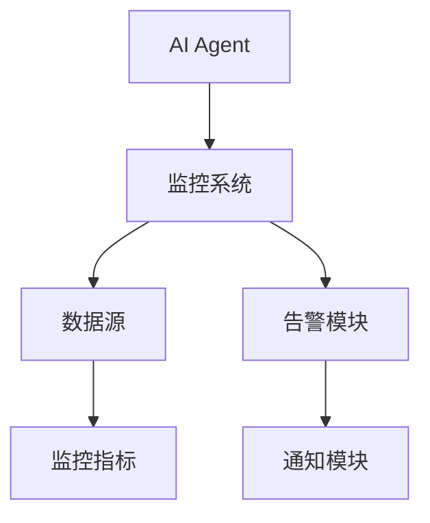
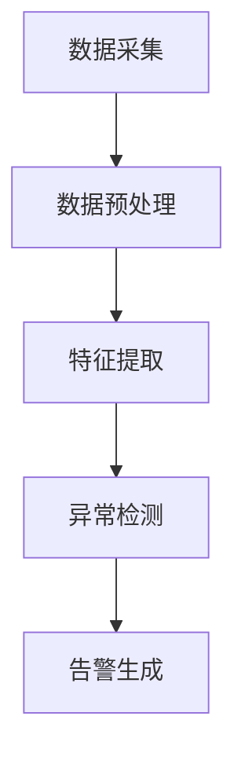
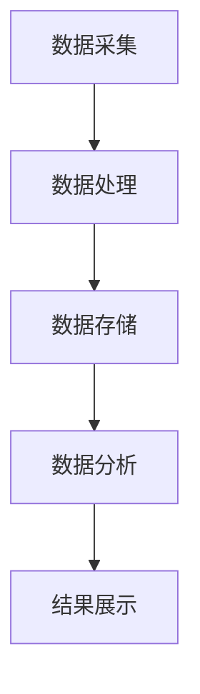
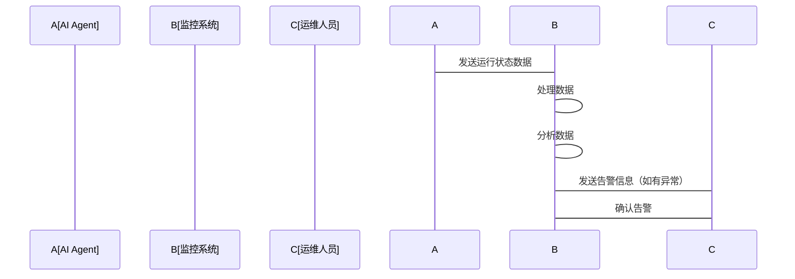

                 


# 企业AI Agent的实时监控系统

## 关键词：AI Agent，实时监控，系统架构，算法原理，项目实战

## 摘要：  
本文深入探讨了企业AI Agent的实时监控系统的设计与实现。通过分析AI Agent在企业中的应用背景，阐述了实时监控系统的重要性及其核心功能。从算法原理到系统架构，再到项目实战，详细讲解了如何构建一个高效可靠的实时监控系统，为企业的智能化运营提供了有力支持。

---

# 第1章: 问题背景与核心概念

## 1.1 问题背景

### 1.1.1 企业AI Agent的现状与挑战  
随着人工智能技术的快速发展，企业AI Agent（智能体）的应用越来越广泛。AI Agent能够自主决策、执行任务，并与人类或其他系统交互。然而，在实际应用中，AI Agent可能会面临各种问题，如系统故障、数据异常、行为偏离预期等。这些问题可能影响企业的正常运行，甚至导致重大损失。因此，实时监控AI Agent的运行状态变得至关重要。

### 1.1.2 问题的描述与解决方案  
AI Agent的实时监控系统需要解决以下问题：  
1. **实时性**：快速捕捉AI Agent的状态变化，避免因延迟导致的损失。  
2. **准确性**：确保监控数据的准确性和完整性。  
3. **可扩展性**：支持大规模AI Agent的监控需求。  
4. **可操作性**：提供直观的告警和可视化功能，便于运维人员快速响应。  

通过构建实时监控系统，企业可以实时掌握AI Agent的运行状态，及时发现并解决问题，确保系统的稳定运行。

### 1.1.3 问题的边界与外延  
实时监控系统的目标是监控AI Agent的运行状态，包括但不限于以下内容：  
- **性能指标**：如CPU、内存使用率，响应时间等。  
- **行为指标**：如决策的正确性、执行任务的完成率等。  
- **异常检测**：识别AI Agent的异常行为，如偏离预设策略、数据输入错误等。  
- **告警与通知**：当检测到异常时，及时通知相关人员采取措施。  

## 1.2 核心概念与联系  

### 1.2.1 AI Agent的基本原理  
AI Agent是一种能够感知环境、自主决策并执行任务的智能实体。它通常由以下部分组成：  
- **感知层**：通过传感器或API获取外部数据。  
- **决策层**：基于感知数据，利用算法做出决策。  
- **执行层**：根据决策结果执行操作。  

### 1.2.2 实时监控系统的定义与特征  
实时监控系统是一种能够持续采集、分析和展示AI Agent运行状态的系统。其主要特征包括：  
1. **实时性**：数据采集和分析必须在较短的时间内完成。  
2. **准确性**：监控数据必须真实反映AI Agent的状态。  
3. **可扩展性**：能够支持大量AI Agent的监控需求。  
4. **可操作性**：提供友好的用户界面和告警功能，便于运维人员使用。  

### 1.2.3 核心概念对比表  

| 概念       | AI Agent                  | 实时监控系统              |
|------------|---------------------------|---------------------------|
| 目标       | 执行任务、自主决策         | 监控运行状态、及时告警     |
| 输入       | 外部数据、用户指令         | AI Agent的状态数据         |
| 输出       | 行动、决策结果             | 告警信息、可视化数据       |
| 关键技术   | 机器学习、自然语言处理     | 实时数据采集、异常检测     |

### 1.2.4 ER实体关系图  



---

# 第2章: 算法原理与数学模型

## 2.1 算法原理  

### 2.1.1 实时监控的核心算法  
实时监控系统的核心算法包括数据采集、预处理、特征提取、异常检测和告警生成。以下是一个典型的实时监控算法流程图：  



**数据采集**：从AI Agent中获取运行状态数据，如CPU使用率、任务完成率等。  
**数据预处理**：清洗数据，去除噪声，确保数据的准确性和一致性。  
**特征提取**：从原始数据中提取关键特征，如平均响应时间、错误率等。  
**异常检测**：基于特征数据，使用算法检测异常。  
**告警生成**：当检测到异常时，触发告警机制，通知相关人员。  

### 2.1.2 算法实现  

#### 2.1.2.1 时间序列异常检测算法  
时间序列数据广泛应用于实时监控系统中，例如CPU使用率、网络流量等。以下是一个基于时间序列的异常检测算法：  

```python
def detect_anomaly(data):
    # 数据预处理
    processed_data = preprocess(data)
    
    # 特征提取
    features = extract_features(processed_data)
    
    # 异常检测
    is_anomaly = is_outlier(features)
    
    return is_anomaly
```

#### 2.1.2.2 ARIMA模型  
ARIMA（Autoregressive Integrated Moving Average）是一种常用的时间序列预测模型。其数学公式如下：  

$$ ARIMA(p, d, q) $$  

其中：  
- $p$：自回归阶数，表示过去的值对当前值的影响程度。  
- $d$：差分阶数，用于处理时间序列的非平稳性。  
- $q$：移动平均阶数，表示过去误差对当前值的影响程度。  

例如，假设我们有一个时间序列数据集$y_t$，我们可以使用ARIMA模型进行预测：  

$$ \hat{y}_{t} = \phi_1 y_{t-1} + \phi_2 y_{t-2} + \dots + \theta_1 \epsilon_{t-1} + \theta_2 \epsilon_{t-2} + \dots + c $$  

---

# 第3章: 系统架构与设计方案

## 3.1 系统架构设计  

### 3.1.1 项目介绍  
本系统旨在实时监控企业AI Agent的运行状态，包括性能指标、行为指标和异常检测。系统采用模块化设计，便于扩展和维护。  

### 3.1.2 系统架构图  



### 3.1.3 系统功能模块  

#### 3.1.3.1 数据采集模块  
负责从AI Agent中采集运行状态数据，包括CPU使用率、内存使用率、任务完成率等。  

#### 3.1.3.2 数据处理模块  
对采集到的数据进行清洗、转换和标准化处理，确保数据的准确性和一致性。  

#### 3.1.3.3 数据分析模块  
基于处理后的数据，提取关键特征，并使用异常检测算法识别异常。  

#### 3.1.3.4 结果展示模块  
将分析结果以可视化的方式展示给运维人员，包括实时图表、告警信息等。  

---

## 3.2 系统接口与交互设计  

### 3.2.1 系统接口设计  
系统接口包括：  
1. 数据采集接口：从AI Agent获取运行状态数据。  
2. 数据处理接口：对数据进行清洗和转换。  
3. 数据分析接口：执行异常检测算法。  
4. 结果展示接口：将分析结果展示给用户。  

### 3.2.2 系统交互流程  



---

# 第4章: 项目实战与案例分析

## 4.1 项目实战  

### 4.1.1 环境安装  
#### 4.1.1.1 Python与依赖库安装  
需要安装以下Python库：  
- `pandas`：数据处理库。  
- `numpy`：数值计算库。  
- `scikit-learn`：机器学习库。  
- `flask`：Web框架。  

安装命令：  
```bash
pip install pandas numpy scikit-learn flask
```

#### 4.1.1.2 开发环境配置  
建议使用Jupyter Notebook进行开发，方便数据可视化和调试。  

### 4.1.2 核心代码实现  

#### 4.1.2.1 数据采集模块  

```python
import requests

def fetch_data(agent_id):
    url = f"http://localhost:5000/agents/{agent_id}/status"
    response = requests.get(url)
    return response.json()
```

#### 4.1.2.2 数据处理模块  

```python
import pandas as pd

def preprocess(data):
    df = pd.DataFrame(data)
    df = df.dropna()
    return df
```

#### 4.1.2.3 数据分析模块  

```python
from sklearn.ensemble import IsolationForest

def detect_anomaly(features):
    model = IsolationForest(n_estimators=100, random_state=42)
    model.fit(features)
    return model.predict(features)
```

#### 4.1.2.4 结果展示模块  

```python
from flask import Flask

app = Flask(__name__)

@app.route('/')
def dashboard():
    return "AI Agent Monitor Dashboard"
```

### 4.1.3 项目总结  
通过以上代码实现，我们可以构建一个基本的实时监控系统。然而，实际应用中还需要考虑数据的实时性、系统的可扩展性以及界面的友好性。

---

## 4.2 案例分析  

### 4.2.1 案例背景  
假设某企业开发了一个智能客服AI Agent，用于处理客户的咨询和投诉。为了确保AI Agent的正常运行，企业需要实时监控其响应时间、准确率和用户满意度。

### 4.2.2 系统实现  
通过上述代码实现，我们可以在Flask框架下构建一个实时监控界面，展示AI Agent的运行状态。  

### 4.2.3 系统优化  
根据监控数据，发现AI Agent在高峰时段的响应时间较长，准确率下降。通过优化算法和增加服务器资源，可以有效解决这些问题。

---

# 第5章: 最佳实践与总结

## 5.1 最佳实践  

### 5.1.1 数据预处理的重要性  
实时监控系统的核心在于数据的准确性和实时性，因此数据预处理是关键步骤。建议使用数据清洗和标准化技术，确保数据的质量。  

### 5.1.2 系统可扩展性设计  
为了应对未来可能的扩展需求，系统架构应采用模块化设计，便于添加新的监控指标或算法。  

### 5.1.3 持续学习与优化  
实时监控系统是一个动态优化的过程，需要根据实际运行情况不断调整算法和系统架构，以提高系统的稳定性和性能。  

## 5.2 小结  

本文详细介绍了企业AI Agent的实时监控系统的设计与实现。从问题背景到算法原理，从系统架构到项目实战，全面探讨了实时监控系统的核心内容。通过实际案例分析，展示了系统的优势和应用场景。未来，随着人工智能技术的不断发展，实时监控系统将在企业智能化运营中发挥越来越重要的作用。

---

# 作者：AI天才研究院 & 禅与计算机程序设计艺术

---

**注**：以上内容为《企业AI Agent的实时监控系统》的技术博客文章的完整目录结构和部分章节内容示例，您可以根据实际需求扩展每一部分的具体内容。

