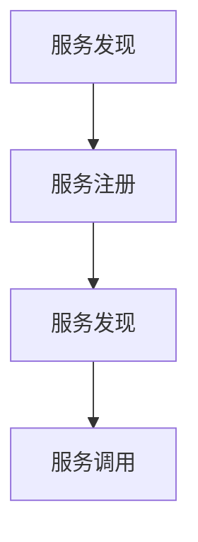
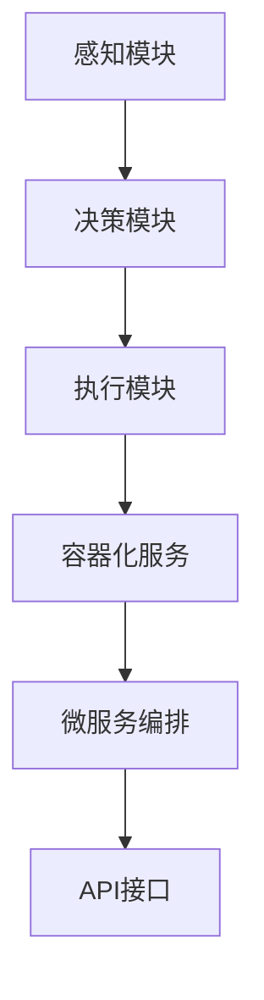
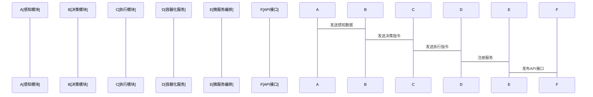

                 


# 企业AI Agent的容器化微服务编排策略

**关键词**：企业AI Agent、容器化、微服务、编排策略、Docker、Kubernetes、AI算法

**摘要**：  
随着人工智能技术的快速发展，企业AI Agent的应用场景日益广泛。为了应对复杂的业务需求和高效的资源管理，容器化微服务编排成为企业AI Agent部署和管理的关键策略。本文将深入探讨企业AI Agent的容器化微服务编排策略，从背景、技术原理、系统架构到算法实现和项目实战，全面分析如何通过容器化和微服务编排优化企业AI Agent的部署和管理。通过详细的技术分析和案例分享，本文将为企业AI Agent的容器化微服务编排提供有价值的参考和实践指导。

---

## 第1章: 企业AI Agent与容器化微服务编排概述

### 1.1 企业AI Agent的基本概念
企业AI Agent是一种能够感知环境、自主决策并执行任务的智能实体。它结合了人工智能、大数据和自动化技术，广泛应用于智能客服、智能推荐、自动化运维等领域。

#### 1.1.1 什么是企业AI Agent
企业AI Agent通过感知外部环境和内部状态，能够自主决策并执行任务。它通常由多个功能模块组成，包括感知模块、决策模块和执行模块。

#### 1.1.2 AI Agent的核心功能与特点
- **感知环境**：通过传感器、API等接口获取外部数据。
- **自主决策**：基于感知数据，利用AI算法进行推理和决策。
- **执行任务**：通过调用服务或触发动作完成任务。
- **自适应性**：能够根据环境变化动态调整行为。

#### 1.1.3 企业AI Agent的应用场景
- **智能客服**：基于自然语言处理（NLP）技术提供智能问答服务。
- **智能推荐**：根据用户行为推荐个性化内容。
- **自动化运维**：通过AI算法优化IT资源的分配和管理。

### 1.2 容器化与微服务的基本概念
容器化和微服务是现代软件架构的两大核心技术，容器化通过轻量级容器实现服务的独立部署，微服务通过将系统分解为多个独立服务实现灵活的扩展和管理。

#### 1.2.1 容器化技术简介
容器化是一种轻量级虚拟化技术，通过容器实现服务的独立运行环境。容器技术的核心是将应用程序及其依赖打包为一个可执行文件，确保在任何环境中都能一致运行。

#### 1.2.2 微服务架构的特点
微服务架构将应用程序分解为多个小型独立服务，每个服务负责特定的业务功能。微服务架构具有以下特点：
- **服务独立性**：每个服务独立运行，互不干扰。
- **可扩展性**：可以根据业务需求灵活扩展服务。
- **松耦合**：服务之间通过API进行通信，耦合度低。

#### 1.2.3 容器化微服务的优势
- **快速部署**：通过容器化技术实现快速部署和回滚。
- **资源利用率高**：容器轻量级，资源占用低。
- **高可用性**：通过微服务架构实现服务的高可用性。

### 1.3 企业AI Agent与容器化微服务的结合
企业AI Agent的容器化微服务编排是将AI Agent的功能模块化为多个微服务，并通过容器化技术实现服务的独立部署和管理。

#### 1.3.1 企业AI Agent的容器化需求
- **模块化**：将AI Agent的功能模块化为多个微服务。
- **独立部署**：通过容器化技术实现每个服务的独立部署。
- **动态扩展**：根据业务需求动态扩展服务。

#### 1.3.2 微服务编排在AI Agent中的作用
- **服务发现**：通过微服务编排实现服务的自动发现和注册。
- **流量控制**：通过微服务编排实现流量的动态分配和控制。
- **容错机制**：通过微服务编排实现服务的容错和自愈。

#### 1.3.3 企业AI Agent容器化微服务编排的必要性
- **提高效率**：通过容器化技术实现快速部署和扩展。
- **降低成本**：通过微服务架构实现资源的高效利用。
- **提高可靠性**：通过容器化微服务编排实现系统的高可用性。

---

## 第2章: 企业AI Agent容器化微服务编排的背景

### 2.1 企业AI Agent的发展历程
企业AI Agent的发展经历了从单体架构到微服务架构的演变过程。

#### 2.1.1 传统企业AI应用的局限性
- **单体架构**：代码耦合度高，难以扩展。
- **资源利用率低**：服务器资源浪费严重。
- **维护成本高**：代码耦合度高，维护困难。

#### 2.1.2 微服务架构的兴起
微服务架构通过将系统分解为多个独立服务，实现了系统的灵活性和可扩展性。

#### 2.1.3 容器化技术对企业AI Agent的推动作用
容器化技术通过轻量级容器实现服务的独立运行环境，为微服务架构的实现提供了技术支持。

### 2.2 容器化微服务编排的行业趋势
容器化微服务编排在企业中的应用越来越广泛。

#### 2.2.1 微服务编排的市场需求
- **快速部署**：企业需要快速响应市场需求。
- **动态扩展**：企业需要根据业务需求动态扩展服务。
- **高可用性**：企业需要系统的高可用性。

#### 2.2.2 容器化技术的普及与应用
容器化技术通过轻量级容器实现服务的独立运行环境，已经成为企业IT架构的主流技术。

#### 2.2.3 企业AI Agent与容器化微服务编排的结合趋势
- **智能化**：AI Agent的智能化需求推动了容器化微服务编排的发展。
- **自动化**：容器化微服务编排的自动化能力为AI Agent的部署和管理提供了技术支持。
- **高效性**：容器化微服务编排通过高效的资源利用提高了企业的运营效率。

### 2.3 企业AI Agent容器化微服务编排的挑战与机遇
容器化微服务编排在企业中的应用面临诸多挑战和机遇。

#### 2.3.1 容器化微服务编排的主要挑战
- **服务发现**：如何实现服务的自动发现和注册。
- **流量控制**：如何实现流量的动态分配和控制。
- **容错机制**：如何实现服务的容错和自愈。

#### 2.3.2 企业AI Agent容器化微服务编排的机遇
- **智能化**：AI Agent的智能化需求推动了容器化微服务编排的发展。
- **自动化**：容器化微服务编排的自动化能力为AI Agent的部署和管理提供了技术支持。
- **高效性**：容器化微服务编排通过高效的资源利用提高了企业的运营效率。

#### 2.3.3 如何应对挑战抓住机遇
- **技术选型**：选择合适的容器化技术和微服务编排工具。
- **团队协作**：加强团队协作，提高开发效率。
- **持续优化**：持续优化系统架构，提高系统的可靠性和可扩展性。

---

## 第3章: 企业AI Agent容器化微服务编排的核心概念与联系

### 3.1 核心概念原理
企业AI Agent容器化微服务编排的核心概念包括容器化技术、微服务架构和编排策略。

#### 3.1.1 企业AI Agent的核心功能模块
企业AI Agent的功能模块包括感知模块、决策模块和执行模块。

#### 3.1.2 容器化微服务编排的基本原理
容器化微服务编排通过容器化技术实现服务的独立运行环境，并通过微服务架构实现服务的动态扩展和管理。

#### 3.1.3 AI Agent与容器化微服务的交互机制
AI Agent通过容器化微服务编排实现服务的自动发现和注册，并通过API接口实现服务之间的通信。

### 3.2 核心概念属性特征对比表格
以下是企业AI Agent和容器化微服务编排的核心概念属性特征对比表格：

| 概念       | 特性1          | 特性2          | 特性3          |
|------------|----------------|----------------|----------------|
| 企业AI Agent | 感知环境       | 自主决策       | 执行任务       |
| 容器化微服务 | 独立运行环境   | 动态扩展       | 高可用性       |

### 3.3 ER实体关系图架构
以下是企业AI Agent容器化微服务编排的ER实体关系图：

```mermaid
erd
  A[企业AI Agent]
  B[功能模块]
  C[服务]
  D[容器]
  E[编排策略]

  A --> B
  B --> C
  C --> D
  D --> E
  E --> C
```

---

## 第4章: 企业AI Agent容器化微服务编排的技术原理与算法实现

### 4.1 技术原理
企业AI Agent容器化微服务编排的技术原理包括容器化技术、微服务架构和编排策略。

#### 4.1.1 容器化技术的实现原理
容器化技术通过轻量级容器实现服务的独立运行环境，容器化技术的核心是将应用程序及其依赖打包为一个可执行文件，确保在任何环境中都能一致运行。

#### 4.1.2 微服务架构的实现原理
微服务架构将应用程序分解为多个小型独立服务，每个服务负责特定的业务功能。微服务架构的核心是通过API接口实现服务之间的通信。

#### 4.1.3 编排策略的实现原理
编排策略通过定义服务的部署、扩展和管理策略，实现服务的动态部署和管理。

### 4.2 算法实现
企业AI Agent容器化微服务编排的算法实现包括服务发现、流量控制和容错机制。

#### 4.2.1 服务发现算法
服务发现算法通过容器化微服务编排实现服务的自动发现和注册。



#### 4.2.2 流量控制算法
流量控制算法通过定义服务的权重和流量分配策略，实现服务的动态扩展和负载均衡。

#### 4.2.3 容错机制算法
容错机制算法通过定义服务的容错策略，实现服务的自动恢复和自愈。

---

## 第5章: 企业AI Agent容器化微服务编排的系统架构与设计

### 5.1 系统架构设计
企业AI Agent容器化微服务编排的系统架构设计包括功能模块设计、系统架构图和交互序列图。

#### 5.1.1 功能模块设计
企业AI Agent的功能模块包括感知模块、决策模块和执行模块。

#### 5.1.2 系统架构图
以下是企业AI Agent容器化微服务编排的系统架构图：



#### 5.1.3 交互序列图
以下是企业AI Agent容器化微服务编排的交互序列图：



### 5.2 系统接口设计
企业AI Agent容器化微服务编排的系统接口设计包括API接口设计和服务发现接口设计。

#### 5.2.1 API接口设计
API接口设计通过定义服务的接口规范，实现服务之间的通信。

#### 5.2.2 服务发现接口设计
服务发现接口设计通过定义服务的发现和注册接口，实现服务的自动发现和注册。

### 5.3 系统交互设计
企业AI Agent容器化微服务编排的系统交互设计包括服务发现、服务注册和服务调用。

#### 5.3.1 服务发现交互
服务发现交互通过容器化微服务编排实现服务的自动发现和注册。

#### 5.3.2 服务注册交互
服务注册交互通过定义服务的注册流程，实现服务的自动注册和管理。

#### 5.3.3 服务调用交互
服务调用交互通过定义服务的调用流程，实现服务的动态调用和管理。

---

## 第6章: 企业AI Agent容器化微服务编排的项目实战与实现

### 6.1 项目背景
企业AI Agent容器化微服务编排的项目背景包括项目目标、项目需求和项目计划。

#### 6.1.1 项目目标
项目目标是实现企业AI Agent的容器化微服务编排，提高系统的可扩展性和高可用性。

#### 6.1.2 项目需求
项目需求包括功能需求、性能需求和接口需求。

#### 6.1.3 项目计划
项目计划包括项目阶段划分、项目任务分配和项目时间安排。

### 6.2 核心代码实现
企业AI Agent容器化微服务编排的核心代码实现包括容器化服务实现、微服务编排实现和API接口实现。

#### 6.2.1 容器化服务实现
容器化服务实现通过Docker技术实现服务的独立运行环境。

#### 6.2.2 微服务编排实现
微服务编排实现通过Kubernetes技术实现服务的动态部署和管理。

#### 6.2.3 API接口实现
API接口实现通过定义服务的接口规范，实现服务之间的通信。

### 6.3 项目实战分析
企业AI Agent容器化微服务编排的项目实战分析包括项目实施、项目测试和项目总结。

#### 6.3.1 项目实施
项目实施包括系统部署、系统测试和系统优化。

#### 6.3.2 项目测试
项目测试包括单元测试、集成测试和性能测试。

#### 6.3.3 项目总结
项目总结包括项目成果、项目经验教训和项目未来改进方向。

---

## 第7章: 企业AI Agent容器化微服务编排的最佳实践与总结

### 7.1 最佳实践
企业AI Agent容器化微服务编排的最佳实践包括技术选型、团队协作和持续优化。

#### 7.1.1 技术选型
技术选型包括容器化技术选型、微服务编排工具选型和AI算法选型。

#### 7.1.2 团队协作
团队协作包括开发团队协作、测试团队协作和运维团队协作。

#### 7.1.3 持续优化
持续优化包括系统架构优化、代码优化和性能优化。

### 7.2 项目总结
企业AI Agent容器化微服务编排的项目总结包括项目成果、项目经验教训和项目未来改进方向。

#### 7.2.1 项目成果
项目成果包括系统实现了容器化微服务编排，提高了系统的可扩展性和高可用性。

#### 7.2.2 项目经验教训
项目经验教训包括技术选型的重要性、团队协作的重要性、持续优化的重要性。

#### 7.2.3 项目未来改进方向
项目未来改进方向包括优化系统架构、优化代码性能、优化系统安全性。

### 7.3 展望未来
企业AI Agent容器化微服务编排的发展前景广阔，未来将更加智能化、自动化和高效化。

---

## 作者：AI天才研究院/AI Genius Institute & 禅与计算机程序设计艺术 /Zen And The Art of Computer Programming

---

**摘要**：  
企业AI Agent的容器化微服务编排策略通过将AI Agent的功能模块化为多个微服务，并通过容器化技术实现服务的独立部署和管理。本文从背景、技术原理、系统架构到算法实现和项目实战，全面分析了如何通过容器化和微服务编排优化企业AI Agent的部署和管理。通过详细的技术分析和案例分享，本文为企业AI Agent的容器化微服务编排提供了有价值的参考和实践指导。

