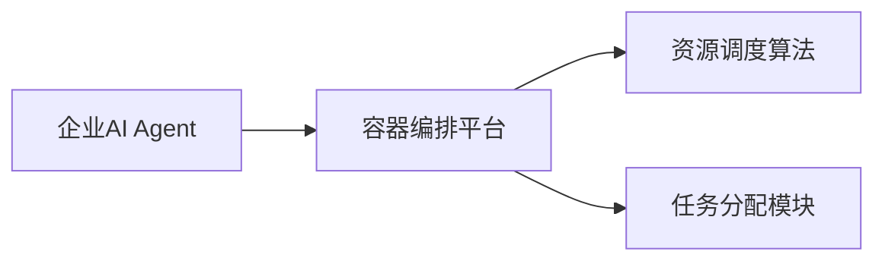
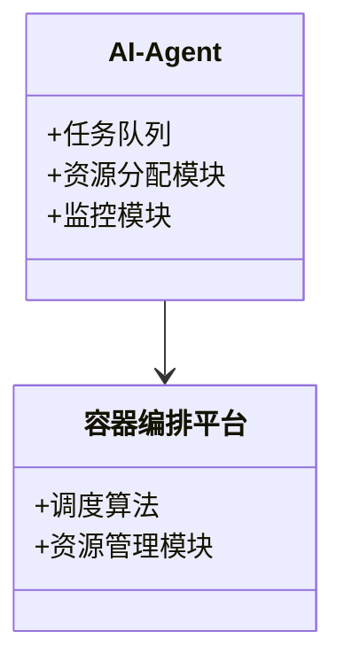
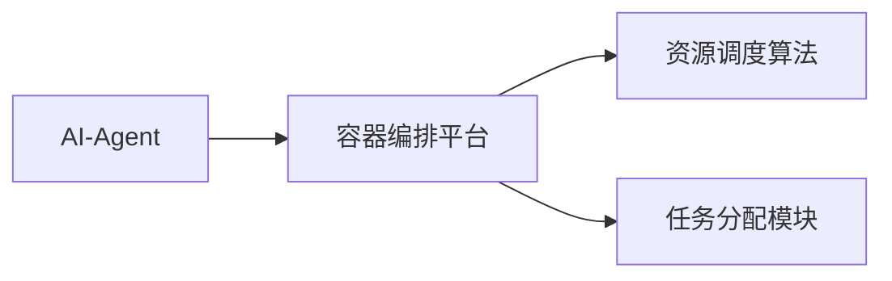
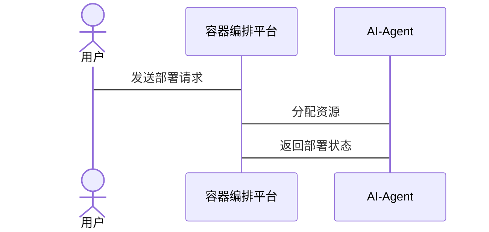

                 


# 企业AI Agent的容器编排与管理策略

## 关键词：
企业AI Agent、容器编排、资源调度算法、分布式系统、协同机制

## 摘要：
本文深入探讨了在企业环境中AI Agent的容器编排与管理策略。通过分析AI Agent的容器化部署需求，结合容器编排技术的核心原理，提出了适用于企业环境的优化策略。本文从背景介绍、核心概念、算法原理、系统架构到实际案例，全面解析了企业AI Agent的容器编排与管理，为技术人员提供了理论与实践相结合的指导。

---

# 第一部分: 企业AI Agent的容器编排与管理背景

# 第1章: 企业AI Agent的容器编排与管理概述

## 1.1 企业AI Agent的概念与背景
### 1.1.1 AI Agent的基本概念
AI Agent（人工智能代理）是指能够感知环境并采取行动以实现目标的智能实体。企业AI Agent通常用于自动化任务处理、数据挖掘、智能决策支持等领域。

### 1.1.2 企业AI Agent的应用场景
- **自动化运维**：通过AI Agent实现自动化的监控、日志分析和故障处理。
- **智能客服**：基于自然语言处理的智能客服系统。
- **供应链优化**：利用AI Agent优化库存管理和物流调度。

### 1.1.3 容器编排的引入
容器编排技术（如Kubernetes）能够高效管理AI Agent的部署和运行，解决了传统虚拟机管理的复杂性。

## 1.2 容器编排技术的发展与现状
### 1.2.1 容器技术的起源与发展
容器技术起源于虚拟化技术，Docker的出现推动了容器技术的普及。

### 1.2.2 容器编排工具的演进
从早期的手动配置到自动化编排工具（如Kubernetes、Docker Swarm），容器编排技术不断完善。

### 1.2.3 当前主流容器编排工具对比
| 工具名称 | 核心功能 | 适用场景 | 优缺点 |
|----------|----------|----------|--------|
| Kubernetes | 容器编排、扩展、负载均衡 | 企业级应用 | 功能强大，学习曲线陡峭 |
| Docker Swarm | 容器编排、服务发现 | 小型项目 | 简单易用，功能相对有限 |
| Apache Mesos | 资源管理、任务调度 | 大型集群 | 高度可扩展 |

## 1.3 企业AI Agent容器编排的挑战与机遇
### 1.3.1 企业AI Agent的复杂性
AI Agent需要处理高并发请求、数据量大、计算资源需求高等问题。

### 1.3.2 容器编排在AI Agent管理中的优势
- **弹性扩展**：根据负载自动调整资源分配。
- **高效资源利用**：容器化部署能够充分利用计算资源。
- **快速迭代**：支持快速部署和回滚。

### 1.3.3 未来发展趋势与挑战
- **智能化调度**：结合AI算法优化资源分配。
- **安全问题**：容器安全性和隔离性需要进一步提升。
- **成本控制**：降低容器编排的资源消耗。

## 1.4 本章小结
本章介绍了企业AI Agent的背景和容器编排技术的发展，分析了容器编排在AI Agent管理中的优势和挑战，为后续章节奠定了基础。

---

# 第二部分: 企业AI Agent的容器编排核心概念

# 第2章: 容器编排与AI Agent的核心概念

## 2.1 容器编排的基本原理
### 2.1.1 容器编排的定义与特点
容器编排是指通过工具自动化管理容器的部署、运行和扩展，具有自动化、弹性扩展、高可用性等特点。

### 2.1.2 容器编排的主要功能
- **服务发现**：自动识别和注册服务。
- **负载均衡**：分配流量以避免单点故障。
- **自动扩缩容**：根据负载自动调整资源。

### 2.1.3 容器编排与AI Agent的结合
AI Agent需要高效处理任务，容器编排提供了灵活的资源管理能力。

## 2.2 AI Agent的容器化部署
### 2.2.1 AI Agent的容器化需求
AI Agent通常需要高性能计算资源，容器化部署能够快速响应需求。

### 2.2.2 容器化部署的优势
- **快速部署**：通过镜像快速启动服务。
- **资源隔离**：每个容器独立运行，互不干扰。

### 2.2.3 容器化部署的流程
1. 构建Docker镜像。
2. 配置Kubernetes部署文件（如yaml）。
3. 执行`kubectl apply -f deployment.yaml`命令部署服务。

## 2.3 容器编排与AI Agent的协同机制
### 2.3.1 容器编排与AI Agent的交互流程
AI Agent通过API向容器编排平台发送请求，容器编排平台根据资源情况分配资源。

### 2.3.2 协同机制的核心要素
- **通信协议**：如HTTP、gRPC。
- **任务队列**：管理待处理任务。
- **资源监控**：实时监控资源使用情况。

### 2.3.3 协同机制的优化策略
- **动态调整**：根据负载动态分配资源。
- **优先级调度**：根据任务优先级分配资源。

## 2.4 核心概念对比表
| 概念       | 容器编排 | AI Agent |
|------------|---------|----------|
| 核心目标   | 资源管理 | 智能决策 |
| 实现方式   | 调度算法 | 机器学习 |
| 依赖技术   | 容器技术 | 大数据处理 |

## 2.5 实体关系图


---

# 第三部分: 企业AI Agent容器编排的算法原理

# 第3章: 容器编排算法与AI Agent调度策略

## 3.1 容器编排算法的基本原理
### 3.1.1 资源分配算法
资源分配算法需要考虑CPU、内存、磁盘等资源的使用情况。

### 3.1.2 调度算法
调度算法负责将任务分配到合适的节点上，常用的算法包括随机调度、轮询调度等。

## 3.2 AI Agent的资源调度算法
### 3.2.1 基于负载的调度算法
根据节点的负载情况动态分配资源。

### 3.2.2 基于优先级的调度算法
根据任务优先级分配资源，优先处理高优先级任务。

## 3.3 算法原理的数学模型
资源分配问题可以表示为：
$$ \text{Minimize} \sum_{i=1}^{n} w_i \cdot x_i $$
$$ \text{Subject to} \sum_{i=1}^{n} x_i \leq C $$
其中，\(w_i\)是任务权重，\(x_i\)是分配资源，\(C\)是总资源限制。

## 3.4 算法实现的流程图


## 3.5 算法优化策略
### 3.5.1 动态调整资源分配
根据实时负载调整资源分配策略。

### 3.5.2 群智算法
利用群体智能优化资源分配，提高系统的整体效率。

## 3.6 本章小结
本章通过数学模型和流程图详细介绍了容器编排算法与AI Agent调度策略，为后续的系统设计提供了理论基础。

---

# 第四部分: 企业AI Agent容器编排的系统架构

# 第4章: 企业AI Agent容器编排的系统架构设计

## 4.1 系统功能设计
### 4.1.1 领域模型设计


### 4.1.2 系统架构设计


## 4.2 系统接口设计
### 4.2.1 API接口设计
- `/api/v1/deploy`：部署AI Agent。
- `/api/v1/undeploy`：停止AI Agent服务。

### 4.2.2 交互流程图


## 4.3 系统实现细节
### 4.3.1 环境安装
```bash
# 安装Kubernetes
curl -s "https://get.helm-3.io/v3.9.0/helm-3.9.0-linux-amd64.tar.gz" | tar xz
sudo mv helm-3.9.0-linux-amd64/helm /usr/local/bin/helm
helm install stable/kafka-helm charts/
```

### 4.3.2 核心代码实现
```python
def allocate_resources(tasks):
    resources = []
    for task in tasks:
        # 根据任务优先级分配资源
        if task['priority'] > 5:
            resources.append(task['id'] * 2)
        else:
            resources.append(task['id'])
    return resources
```

## 4.4 系统优化建议
### 4.4.1 资源利用率优化
采用动态调整策略，提高资源利用率。

### 4.4.2 安全性优化
增强容器的安全性，防止恶意攻击。

## 4.5 本章小结
本章通过系统架构设计和接口设计，详细阐述了企业AI Agent容器编排的实现方案，为实际应用提供了参考。

---

# 第五部分: 企业AI Agent容器编排的项目实战

# 第5章: 企业AI Agent容器编排的项目实战

## 5.1 项目介绍
### 5.1.1 项目背景
通过案例分析展示容器编排在企业AI Agent中的实际应用。

## 5.2 项目实施步骤
### 5.2.1 环境搭建
安装Kubernetes和Docker环境。

### 5.2.2 核心代码实现
编写AI Agent的容器化部署脚本。

### 5.2.3 测试与优化
通过测试验证系统性能，并进行优化。

## 5.3 项目案例分析
### 5.3.1 案例1：智能客服系统的容器编排
通过容器编排实现智能客服的自动部署和扩展。

### 5.3.2 案例2：供应链优化的容器编排
利用容器编排优化供应链管理系统的资源分配。

## 5.4 项目小结
本章通过实际案例展示了容器编排在企业AI Agent中的应用，帮助读者更好地理解和实践。

---

# 第六部分: 企业AI Agent容器编排的最佳实践

# 第6章: 企业AI Agent容器编排的最佳实践

## 6.1 最佳实践
### 6.1.1 系统设计
- **模块化设计**：提高系统的可维护性和扩展性。
- **容错设计**：确保系统在故障时能够自动恢复。

### 6.1.2 调试与优化
- **日志管理**：统一管理日志，便于排查问题。
- **性能监控**：实时监控系统性能，及时发现瓶颈。

## 6.2 小结
通过最佳实践，读者可以进一步优化企业AI Agent的容器编排系统，提高系统的稳定性和性能。

---

# 作者：AI天才研究院/AI Genius Institute & 禅与计算机程序设计艺术 /Zen And The Art of Computer Programming

---

以上是《企业AI Agent的容器编排与管理策略》的文章大纲，涵盖了从背景介绍到实际案例分析的完整内容，为读者提供了理论与实践相结合的指导。

