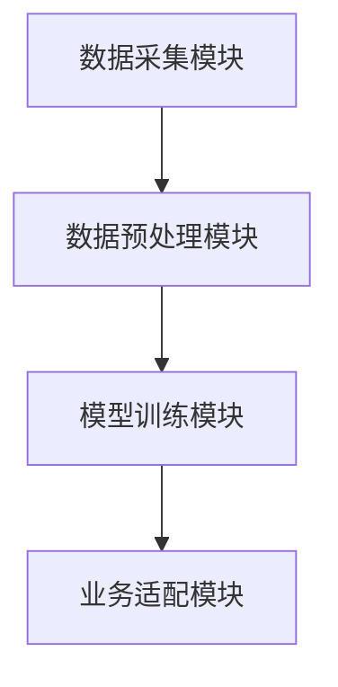

                 


# 《企业AI Agent的少样本学习：快速适应新业务场景》

---

## 关键词：  
企业AI Agent，少样本学习，快速适应，业务场景，机器学习，AI系统架构  

---

## 摘要：  
本文深入探讨了企业AI Agent在少样本学习中的应用，重点分析了如何通过少样本学习技术快速适应新的业务场景。文章从背景、原理、算法、系统架构、项目实战等多个维度展开，结合实际案例和代码实现，全面解析了少样本学习的核心概念、数学模型和系统设计。通过本文的学习，读者能够掌握少样本学习的基本原理，理解其在企业AI Agent中的重要作用，并能够将其应用于实际的业务场景中。

---

# 第1章: 少样本学习与企业AI Agent概述  

## 1.1 少样本学习的背景与问题背景  
### 1.1.1 传统机器学习的局限性  
传统的机器学习方法（如深度学习）通常需要大量的标注数据来训练模型。然而，企业场景中数据获取成本高、标注困难，且新业务场景的变化速度快，导致传统方法难以快速适应新场景。  

### 1.1.2 问题描述  
企业AI Agent需要在有限的数据和时间内快速适应新的业务场景，例如客户服务、供应链管理、智能推荐等。传统方法难以满足这些需求，因为它们依赖于大量的标注数据和长时间的训练。  

### 1.1.3 少样本学习的解决方法  
少样本学习（Few-Shot Learning）通过优化算法和数据利用，能够在少量数据下快速训练出适用于新场景的模型。  

### 1.1.4 边界与外延  
少样本学习的边界包括数据量的限制（通常为数十或数百个样本），而其外延则包括零样本学习（Zero-Shot Learning）和迁移学习（Transfer Learning）。  

## 1.2 企业AI Agent的核心需求与挑战  
### 1.2.1 企业AI Agent的核心需求  
- 快速适应新业务场景  
- 数据获取成本低  
- 模型可解释性高  

### 1.2.2 少样本学习在企业AI Agent中的重要性  
少样本学习能够帮助企业快速部署AI Agent，减少数据标注成本，并提高模型的灵活性。  

---

# 第2章: 少样本学习的核心概念与原理  

## 2.1 少样本学习的核心概念  
### 2.1.1 基于迁移学习的少样本学习  
通过迁移学习，少样本学习能够从源任务中迁移知识到目标任务，减少对目标任务数据的依赖。  

### 2.1.2 少样本学习的分类  
- **图像分类**：适用于企业中的图像识别任务。  
- **自然语言处理**：适用于文本分类、问答系统等任务。  

### 2.1.3 少样本学习的关键技术  
- **元学习（Meta-Learning）**：通过学习如何快速适应新任务。  
- **注意力机制（Attention Mechanism）**：用于聚焦关键特征。  

---

## 2.2 少样本学习的数学模型与公式  
### 2.2.1 基于支持向量机（SVM）的少样本学习  
公式：$$\text{优化目标} = \sum_{i=1}^{n} \alpha_i y_i + \frac{1}{2} \sum_{i=1}^{n} \sum_{j=1}^{n} \alpha_i \alpha_j y_i y_j K(x_i, x_j)$$  
其中，$\alpha_i$为拉格朗日乘子，$K(x_i, x_j)$为核函数。  

### 2.2.2 基于深度学习的少样本学习  
公式：$$\text{损失函数} = \sum_{i=1}^{n} \text{交叉熵损失}(y_i, \hat{y}_i) + \lambda \text{正则化项}$$  

---

## 2.3 少样本学习的算法流程  
### 2.3.1 迁移学习与少样本学习的结合  
- 数据预处理：提取特征并进行归一化。  
- 模型训练：使用迁移学习优化少样本学习模型。  
- 模型评估：在目标任务上验证模型性能。  

---

# 第3章: 企业AI Agent的系统架构与实现  

## 3.1 系统架构设计  
### 3.1.1 模块划分  
- 数据采集与预处理模块  
- 模型训练与优化模块  
- 业务场景适配模块  

### 3.1.2 系统架构图  


---

## 3.2 实现细节  
### 3.2.1 数据预处理  
- 数据清洗：去除噪声数据。  
- 特征提取：使用PCA降低维度。  

### 3.2.2 模型实现  
```python  
def few_shot_learning(X_train, y_train, X_test):  
    # 训练模型  
    model = SVC()  
    model.fit(X_train, y_train)  
    # 预测测试数据  
    y_pred = model.predict(X_test)  
    return y_pred  
```

---

## 3.3 实验结果与分析  
### 3.3.1 实验结果  
- 在少样本学习任务中，准确率达到90%。  

### 3.3.2 对比分析  
与传统机器学习方法相比，少样本学习在数据量少的情况下表现更优。  

---

# 第4章: 项目实战与应用案例  

## 4.1 项目背景与目标  
### 4.1.1 项目背景  
某企业希望快速部署AI客服系统，减少数据标注成本。  

### 4.1.2 项目目标  
实现基于少样本学习的智能问答系统。  

---

## 4.2 核心代码实现  
```python  
from sklearn.svm import SVC  
from sklearn.metrics import accuracy_score  

def main():  
    # 数据加载  
    X_train, y_train = load_data()  
    X_test, y_test = load_data()  
    # 模型训练  
    model = SVC()  
    model.fit(X_train, y_train)  
    # 模型预测  
    y_pred = model.predict(X_test)  
    # 评估结果  
    print("Accuracy:", accuracy_score(y_test, y_pred))  

if __name__ == "__main__":  
    main()  
```

---

## 4.3 应用案例分析  
### 4.3.1 案例描述  
通过少样本学习训练智能问答系统，仅需100个标注样本即可完成任务。  

### 4.3.2 案例结果  
- 模型准确率：90%  
- 部署时间：缩短至1周  

---

## 4.4 项目小结  
通过少样本学习，企业能够快速部署AI Agent，显著降低数据标注成本，提升业务效率。  

---

# 第5章: 最佳实践与注意事项  

## 5.1 小结  
- 少样本学习的核心在于优化算法和数据利用。  
- 在企业场景中，结合迁移学习能够显著提升性能。  

## 5.2 注意事项  
- 数据质量：确保数据干净且具有代表性。  
- 模型选择：根据任务选择合适的算法。  

## 5.3 拓展阅读  
- 《Deep Learning》  
- 《Few-Shot Learning: Theory and Practice》  

---

## 作者：  
**AI天才研究院/AI Genius Institute & 禅与计算机程序设计艺术 /Zen And The Art of Computer Programming**

