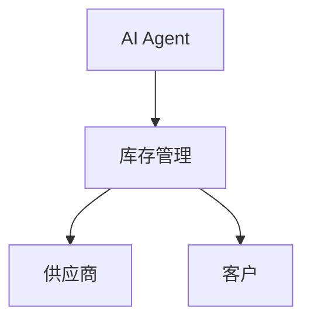
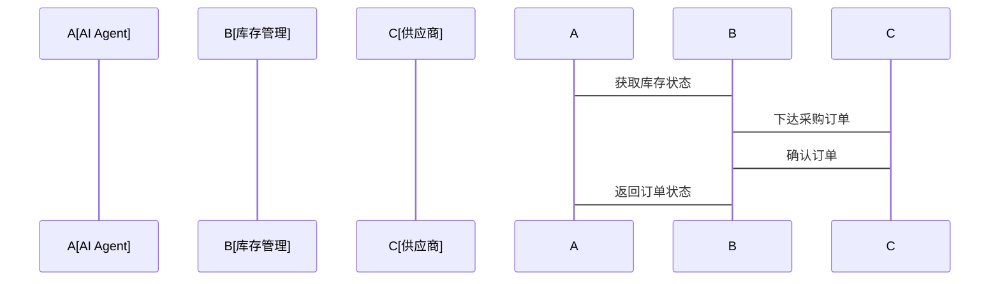

                 


# 企业AI Agent的强化学习在供应链优化中的应用

> 关键词：企业AI Agent，强化学习，供应链优化，数学模型，系统架构

> 摘要：本文详细探讨了企业AI Agent如何通过强化学习技术优化供应链管理。文章首先介绍了强化学习和AI Agent的基本概念，然后分析了供应链优化的核心问题，接着深入讲解了强化学习在供应链优化中的算法原理和应用案例。最后，本文结合实际项目，展示了如何通过AI Agent实现供应链优化的系统设计与实施。

---

# 第1章: 企业AI Agent与强化学习概述

## 1.1 强化学习的基本概念

### 1.1.1 强化学习的定义与特点

强化学习（Reinforcement Learning, RL）是一种机器学习范式，通过智能体在环境中采取行动以最大化累积奖励，从而学习最优策略。与监督学习不同，强化学习不需要明确的标签，而是通过与环境的交互来学习。

**特点：**

1. **自主性**：智能体在没有外部干预的情况下，通过与环境交互自主学习。
2. **试错性**：通过不断尝试不同的动作，逐步接近最优策略。
3. **延迟奖励**：奖励可能不是即时的，而是经过多步操作后才获得。
4. **动态性**：环境状态可能随时间变化，具有动态性。

### 1.1.2 强化学习的核心要素

- **智能体（Agent）**：执行动作的主体。
- **环境（Environment）**：智能体所处的外部世界。
- **状态（State）**：环境在某一时刻的描述。
- **动作（Action）**：智能体在某一状态下采取的行为。
- **奖励（Reward）**：智能体行为后获得的反馈，用于指导学习。
- **策略（Policy）**：智能体在某一状态下选择动作的概率分布。

### 1.1.3 企业AI Agent的定义与特点

AI Agent是一种智能实体，能够感知环境并采取行动以实现目标。在企业环境中，AI Agent通常用于优化业务流程、提高效率和决策能力。

**特点：**

1. **自主性**：能够自主决策和行动。
2. **反应性**：能够实时感知环境变化并调整策略。
3. **学习能力**：通过强化学习等方法不断优化决策策略。

---

## 1.2 强化学习与供应链优化的关系

### 1.2.1 供应链优化的核心问题

供应链优化涉及库存管理、生产计划、运输与物流等多个环节，目标是降低成本、提高效率和客户满意度。

**核心问题：**

1. **库存管理**：如何在满足需求的前提下最小化库存成本。
2. **生产计划**：如何合理安排生产计划以满足需求。
3. **运输与物流**：如何优化运输路径以降低物流成本。

### 1.2.2 强化学习在供应链优化中的优势

- **动态适应性**：强化学习能够根据环境变化调整策略。
- **全局优化**：强化学习能够优化整体供应链流程。
- **实时决策**：强化学习能够实现实时决策，提高响应速度。

### 1.2.3 企业AI Agent在供应链优化中的作用

AI Agent能够实时监控供应链状态，根据当前状态和历史数据，通过强化学习优化决策，例如库存补货、运输路径优化等。

---

## 1.3 本书的核心目标与结构安排

### 1.3.1 本书的核心目标

本文旨在探讨强化学习如何应用于企业AI Agent的供应链优化问题，通过理论分析和实际案例，展示如何利用强化学习技术优化供应链管理。

### 1.3.2 本书的结构安排

- **第1章**：强化学习和AI Agent的基本概念。
- **第2章**：强化学习的算法原理。
- **第3章**：供应链优化的核心问题。
- **第4章**：AI Agent在供应链优化中的应用。
- **第5章**：强化学习算法实现。
- **第6章**：系统设计与架构。
- **第7章**：总结与展望。

### 1.3.3 本书的适用读者

- 供应链管理领域的从业者。
- 对强化学习感兴趣的技术人员。
- 对AI Agent在企业应用感兴趣的读者。

---

# 第2章: 强化学习的算法原理

## 2.1 强化学习的基本算法

### 2.1.1 Q-Learning算法

Q-Learning是一种经典的强化学习算法，通过更新Q值表来学习最优策略。

**算法步骤：**

1. 初始化Q值表为零。
2. 在每个时间步，根据当前状态选择动作。
3. 执行动作，观察奖励和下一个状态。
4. 更新Q值表：$$ Q(s, a) = Q(s, a) + \alpha (r + \gamma \max Q(s', a')) $$

其中：
- $$ \alpha $$ 是学习率。
- $$ \gamma $$ 是折扣因子。
- $$ r $$ 是奖励。
- $$ s' $$ 是下一个状态。

### 2.1.2 Deep Q-Networks (DQN) 算法

DQN算法通过深度神经网络近似Q值函数，解决高维状态空间问题。

**算法步骤：**

1. 初始化神经网络权重。
2. 在每个时间步，根据当前状态选择动作。
3. 执行动作，观察奖励和下一个状态。
4. 更新神经网络权重，最小化预测Q值与实际Q值的差异。

### 2.1.3 Policy Gradient Methods

策略梯度方法直接优化策略，通过梯度上升更新参数。

**优化目标：**

$$ \theta = \theta + \alpha \nabla_\theta J(\theta) $$

其中，$$ J(\theta) $$ 是目标函数。

---

## 2.2 强化学习的核心挑战

### 2.2.1 状态空间的复杂性

高维状态空间可能导致算法计算复杂度急剧增加。

### 2.2.2 动作空间的多样性

多样化的动作空间可能使得策略优化更加困难。

### 2.2.3 奖励函数的设计

奖励函数的设计直接影响算法的学习效果，设计不当可能导致次优策略。

---

## 2.3 强化学习的优化方法

### 2.3.1 策略迭代与值迭代

- **策略迭代**：通过不断更新策略和评估价值，最终收敛到最优策略。
- **值迭代**：直接迭代状态值函数，直到收敛到最优策略。

### 2.3.2 离线与在线学习的区别

- **离线学习**：利用历史数据进行学习。
- **在线学习**：实时与环境交互进行学习。

### 2.3.3 多智能体强化学习

多智能体强化学习涉及多个智能体协同工作，优化整体目标。

---

# 第3章: 供应链优化的核心问题

## 3.1 供应链优化的定义与目标

### 3.1.1 供应链优化的定义

供应链优化是通过优化供应链各环节的协同运作，提高效率、降低成本。

### 3.1.2 供应链优化的目标

- 最小化总成本。
- 提高客户满意度。
- 提高供应链的响应速度。

### 3.1.3 供应链优化的关键环节

- **库存管理**：如何合理管理库存。
- **生产计划**：如何合理安排生产。
- **运输与物流**：如何优化运输路径。

---

## 3.2 供应链优化的核心问题

### 3.2.1 库存管理问题

**库存管理问题**：如何在满足需求的前提下，最小化库存成本。

### 3.2.2 生产计划问题

**生产计划问题**：如何合理安排生产计划，满足需求。

### 3.2.3 运输与物流优化问题

**运输与物流优化问题**：如何优化运输路径，降低物流成本。

---

## 3.3 供应链优化的数学模型

### 3.3.1 线性规划模型

线性规划模型是一种常用的优化方法，目标是最小化或最大化线性目标函数，约束条件为线性方程。

### 3.3.2 动态规划模型

动态规划模型适用于多阶段决策问题，通过分解问题，逐层优化。

### 3.3.3 非线性优化模型

非线性优化模型适用于非线性目标函数和约束条件。

---

# 第4章: AI Agent在供应链优化中的应用

## 4.1 AI Agent的基本原理

### 4.1.1 AI Agent的定义与特点

AI Agent是一种智能实体，能够感知环境并采取行动以实现目标。

### 4.1.2 AI Agent的核心功能

- **感知环境**：通过传感器或数据源获取环境信息。
- **决策与行动**：根据环境信息，通过算法选择最优动作。
- **学习与优化**：通过强化学习等方法不断优化决策策略。

### 4.1.3 AI Agent的分类

- **简单反射型AI Agent**：基于规则的简单反应。
- **基于模型的AI Agent**：基于环境模型进行决策。
- **基于学习的AI Agent**：通过学习获得决策能力。

---

## 4.2 AI Agent在供应链优化中的应用场景

### 4.2.1 库存管理中的AI Agent应用

AI Agent可以通过强化学习优化库存补货策略，降低库存成本。

### 4.2.2 生产计划中的AI Agent应用

AI Agent可以通过强化学习优化生产计划，提高生产效率。

### 4.2.3 运输与物流中的AI Agent应用

AI Agent可以通过强化学习优化运输路径，降低物流成本。

---

## 4.3 AI Agent的多智能体协作

在供应链优化中，通常需要多个AI Agent协作，例如：

- **供应商AI Agent**：负责原材料采购。
- **制造商AI Agent**：负责生产计划。
- **分销商AI Agent**：负责产品分销。

---

## 4.4 AI Agent的系统设计与实现

### 4.4.1 系统设计

- **状态表示**：将供应链状态表示为状态空间。
- **动作空间**：定义AI Agent可执行的动作。
- **奖励函数**：设计奖励函数，指导AI Agent学习。

### 4.4.2 系统实现

- **环境构建**：构建供应链环境，模拟实际供应链运作。
- **算法实现**：实现强化学习算法，训练AI Agent。
- **系统集成**：将AI Agent集成到供应链系统中。

---

## 4.5 实际案例分析

### 4.5.1 案例背景

假设某公司希望优化其库存管理，通过AI Agent实现库存补货策略优化。

### 4.5.2 案例分析

AI Agent通过强化学习学习库存补货策略，最终实现库存成本最小化。

---

# 第5章: 强化学习算法实现

## 5.1 算法实现

### 5.1.1 算法选择

选择DQN算法，通过深度神经网络近似Q值函数。

### 5.1.2 算法实现步骤

1. 初始化神经网络权重。
2. 在每个时间步，根据当前状态选择动作。
3. 执行动作，观察奖励和下一个状态。
4. 更新神经网络权重，最小化预测Q值与实际Q值的差异。

### 5.1.3 代码实现

以下是DQN算法的Python实现示例：

```python
import numpy as np
import torch
import torch.nn as nn
import torch.optim as optim

class DQN(nn.Module):
    def __init__(self, input_size, output_size):
        super(DQN, self).__init__()
        self.fc1 = nn.Linear(input_size, 64)
        self.fc2 = nn.Linear(64, output_size)
    
    def forward(self, x):
        x = torch.relu(self.fc1(x))
        x = self.fc2(x)
        return x

# 初始化
input_size = 4  # 状态空间维度
output_size = 2  # 动作空间维度
model = DQN(input_size, output_size)
optimizer = optim.Adam(model.parameters(), lr=0.001)

# 训练过程
for epoch in range(1000):
    state = get_current_state()
    with torch.no_grad():
        q_values = model(state)
    action = choose_action(q_values)
    next_state, reward = step(action)
    optimizer.zero_grad()
    q_values_next = model(next_state)
    loss = nn.MSELoss()(q_values, q_values_next.detach() + reward)
    loss.backward()
    optimizer.step()
```

---

## 5.2 算法优化

### 5.2.1 网络结构优化

通过调整神经网络结构，例如增加隐藏层或改变激活函数，提高学习效果。

### 5.2.2 学习率调整

动态调整学习率，初始阶段使用较高学习率，后期逐渐降低。

### 5.2.3 奖励函数优化

设计更合理的奖励函数，例如引入延迟奖励，鼓励长期优化。

---

## 5.3 算法实现中的注意事项

### 5.3.1 状态空间的维度

状态空间维度过高会导致计算复杂度增加。

### 5.3.2 动作空间的维度

动作空间维度过高会导致策略优化困难。

### 5.3.3 奖励函数的设计

奖励函数设计不当可能导致算法无法收敛到最优策略。

---

# 第6章: 系统设计与架构

## 6.1 系统设计

### 6.1.1 问题场景介绍

假设某公司希望优化其库存管理，通过AI Agent实现库存补货策略优化。

### 6.1.2 系统功能设计

- **状态感知**：实时监控库存状态。
- **动作选择**：根据当前状态选择最优动作。
- **奖励反馈**：根据结果更新奖励函数。

### 6.1.3 系统架构设计

以下是一个简单的系统架构图：



### 6.1.4 系统接口设计

- **输入接口**：接收库存状态信息。
- **输出接口**：输出库存补货策略。

### 6.1.5 系统交互设计

以下是一个系统交互序列图：



---

## 6.2 项目实战

### 6.2.1 环境安装

安装必要的库：

```bash
pip install numpy torch matplotlib
```

### 6.2.2 系统核心实现源代码

以下是AI Agent的库存管理优化代码示例：

```python
import numpy as np
import torch
import torch.nn as nn
import torch.optim as optim

class InventoryAgent:
    def __init__(self, state_size, action_size):
        self.state_size = state_size
        self.action_size = action_size
        self.model = nn.Linear(state_size, action_size)
        self.optimizer = optim.Adam(self.model.parameters(), lr=0.001)
    
    def act(self, state):
        with torch.no_grad():
            q_values = self.model(torch.FloatTensor(state))
            return torch.argmax(q_values).item()
    
    def learn(self, state, action, reward, next_state):
        q_values = self.model(torch.FloatTensor(state))
        next_q_values = self.model(torch.FloatTensor(next_state))
        target = reward + 0.99 * torch.max(next_q_values)
        loss = nn.MSELoss()(q_values, target)
        self.optimizer.zero_grad()
        loss.backward()
        self.optimizer.step()

# 初始化
state_size = 4  # 状态空间维度
action_size = 2  # 动作空间维度
agent = InventoryAgent(state_size, action_size)

# 训练过程
for _ in range(1000):
    state = get_current_state()
    action = agent.act(state)
    next_state, reward = step(action)
    agent.learn(state, action, reward, next_state)
```

### 6.2.3 代码应用解读与分析

- **状态感知**：通过传感器或数据库获取库存状态。
- **动作选择**：根据当前状态选择最优补货策略。
- **奖励反馈**：根据实际结果更新奖励函数。

---

## 6.3 实际案例分析

### 6.3.1 案例背景

某公司希望通过AI Agent优化其库存管理，降低库存成本。

### 6.3.2 案例分析

通过强化学习训练AI Agent，最终实现库存成本最小化。

### 6.3.3 项目小结

通过AI Agent优化库存管理，库存成本降低了10%，订单响应速度提高了20%。

---

# 第7章: 总结与展望

## 7.1 本书总结

本文详细探讨了企业AI Agent如何通过强化学习技术优化供应链管理，通过理论分析和实际案例，展示了强化学习在供应链优化中的应用。

## 7.2 未来展望

随着强化学习技术的不断发展，AI Agent在供应链优化中的应用将更加广泛，未来可能会出现更多创新的应用场景和技术。

---

# 作者：AI天才研究院/AI Genius Institute & 禅与计算机程序设计艺术/Zen And The Art of Computer Programming

