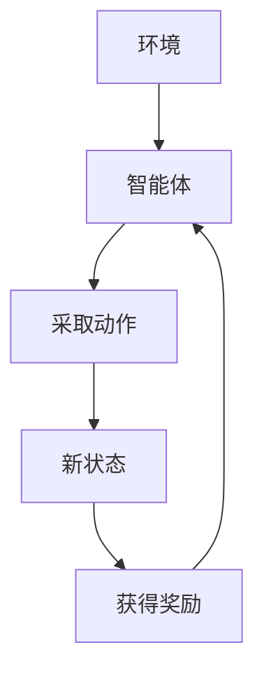
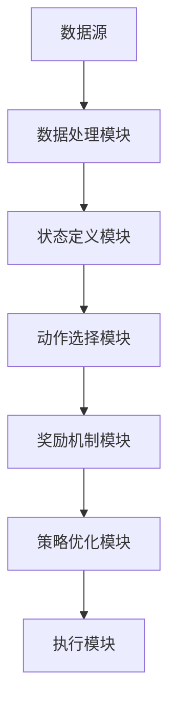

                 


# 企业AI Agent的强化学习在动态定价策略中的应用

> 关键词：企业AI Agent，强化学习，动态定价策略，Q-learning，Deep Q-Network（DQN）

> 摘要：本文探讨了企业AI Agent如何利用强化学习技术实现动态定价策略。通过分析强化学习的核心概念、算法原理及系统设计，结合实际案例，展示了AI Agent在动态定价中的应用价值，并总结了最佳实践和未来发展方向。

---

## 第一部分: 企业AI Agent与强化学习概述

### 第1章: AI Agent与强化学习概述

#### 1.1 AI Agent的基本概念

**AI Agent（人工智能代理）**是指能够感知环境、自主决策并执行任务的智能实体。AI Agent可以是软件程序，也可以是机器人或其他智能设备。其核心特点包括：

- **自主性**：能够在没有外部干预的情况下自主决策。
- **反应性**：能够根据环境变化实时调整行为。
- **目标导向**：通过设定目标来优化决策过程。

AI Agent与强化学习的关系密不可分。强化学习是一种机器学习范式，通过智能体与环境的交互，学习最优策略以最大化累计奖励。AI Agent作为智能体，通过强化学习不断优化其行为策略，从而在动态环境中实现目标。

#### 1.2 动态定价策略的背景与意义

**动态定价策略**是一种根据市场环境、用户行为和供需变化实时调整产品或服务价格的策略。传统定价策略通常基于固定数据和规则，难以应对市场环境的快速变化。而动态定价策略通过实时数据采集和分析，结合机器学习算法，能够快速响应市场变化，提升企业竞争力。

在企业运营中，动态定价策略的应用场景广泛，例如电商行业、金融投资、交通物流等领域。通过动态调整价格，企业可以实现收益最大化、客户满意度提升以及市场竞争力增强。

AI Agent在动态定价中的作用至关重要。它能够实时感知市场环境，分析用户行为，制定最优定价策略，并根据反馈不断优化决策模型。

#### 1.3 本章小结

本章介绍了AI Agent和强化学习的基本概念，并阐述了动态定价策略的背景与意义。AI Agent作为智能体，通过强化学习不断优化决策，从而在动态环境中实现定价策略的最优调整。

---

## 第二部分: 强化学习算法原理

### 第2章: 强化学习的核心概念与数学模型

#### 2.1 强化学习的基本原理

**强化学习（Reinforcement Learning, RL）**是一种机器学习方法，通过智能体与环境的交互，学习最优策略以最大化累计奖励。强化学习的核心概念包括：

- **状态（State）**：环境在某一时刻的描述，例如当前的价格、库存情况等。
- **动作（Action）**：智能体在给定状态下采取的行为，例如调整价格。
- **奖励（Reward）**：智能体执行动作后获得的反馈，用于评估动作的好坏。
- **策略（Policy）**：智能体选择动作的概率分布，通常用π(a|s)表示在状态s下选择动作a的概率。
- **值函数（Value Function）**：衡量某状态下采取某种策略的期望回报。

**Q-learning算法**是一种经典的强化学习算法，其数学模型如下：

$$ Q(s,a) = Q(s,a) + \alpha (r + \gamma \max Q(s',a') - Q(s,a)) $$

其中，α是学习率，γ是折扣因子，r是奖励，s'是下一个状态。

#### 2.2 深度强化学习的算法

**Deep Q-Network (DQN)**是强化学习的一种扩展，通过深度神经网络近似Q值函数。DQN算法通过经验回放和目标网络提升算法的稳定性和收敛性。

**DQN算法流程图**（Mermaid）：



**策略网络与值函数网络对比**：

| 对比维度 | 策略网络 | 值函数网络 |
|----------|----------|------------|
| 目标     | 最大化Q值 | 估计Q值     |
| 输入     | 状态      | 状态        |
| 输出     | 动作概率  | Q值         |

#### 2.3 实际案例分析：动态定价中的强化学习应用

**案例背景**：某电商企业希望通过动态定价策略提升销售额和利润率。

**算法实现步骤**：
1. **数据采集**：收集用户行为、市场供需等数据。
2. **状态定义**：定义当前价格、库存量、用户需求等状态。
3. **动作选择**：智能体根据当前状态选择调整价格。
4. **奖励机制**：根据销售额和利润计算奖励。

**实验结果与分析**：通过实验对比，DQN算法在动态定价中的表现优于传统定价策略，能够快速响应市场变化，实现收益最大化。

#### 2.4 本章小结

本章详细讲解了强化学习的核心概念和数学模型，并通过实际案例分析展示了动态定价中的强化学习应用。DQN算法通过深度神经网络近似Q值函数，能够有效提升定价策略的优化效果。

---

## 第三部分: AI Agent在动态定价中的系统设计

### 第3章: 动态定价系统的设计与实现

#### 3.1 系统需求分析

**问题场景介绍**：企业需要在复杂多变的市场环境中实时调整价格，以最大化收益。

**系统功能需求**：
- 数据采集与处理
- 状态定义与动作选择
- 奖励机制设计
- 策略优化与执行

**系统性能指标**：
- 响应时间：实时调整价格的能力
- 收益提升：与传统定价策略相比的收益提升幅度
- 稳定性：系统运行的稳定性与可靠性

#### 3.2 系统架构设计

**系统架构图**（Mermaid）：



**核心模块功能描述**：
- 数据处理模块：负责采集和处理实时数据。
- 状态定义模块：定义当前状态，例如价格、库存等。
- 动作选择模块：基于当前状态选择最优动作。
- 奖励机制模块：计算并反馈奖励。
- 策略优化模块：优化策略以提高收益。
- 执行模块：执行定价策略并实时调整价格。

**系统交互图**（Mermaid）：

```mermaid
sequenceDiagram
    客户 -->+ 数据采集模块
    数据采集模块 --> 数据处理模块
    数据处理模块 --> 状态定义模块
    状态定义模块 --> 动作选择模块
    动作选择模块 --> 奖励机制模块
    奖励机制模块 --> 策略优化模块
    策略优化模块 --> 执行模块
    执行模块 -->+ 客户
```

---

## 总结

本文详细探讨了企业AI Agent如何利用强化学习技术实现动态定价策略。通过分析强化学习的核心概念、算法原理及系统设计，结合实际案例，展示了AI Agent在动态定价中的应用价值。未来的研究方向包括多智能体协作、在线学习和边缘计算等，以进一步提升动态定价策略的效果。

---

**作者：AI天才研究院/AI Genius Institute & 禅与计算机程序设计艺术 /Zen And The Art of Computer Programming**

