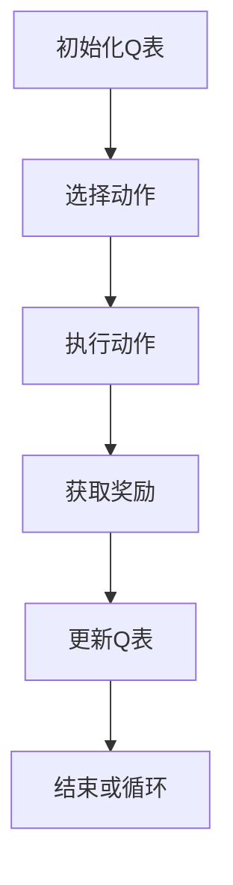
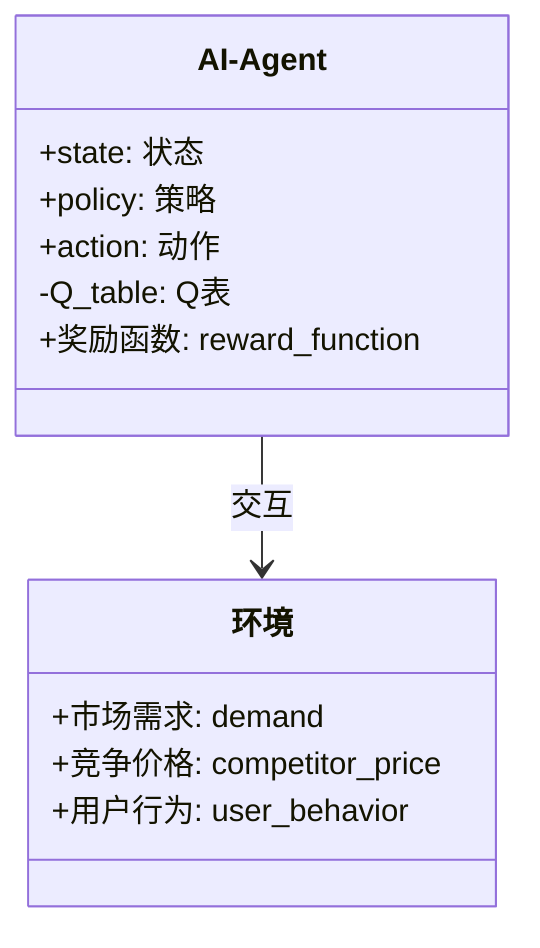
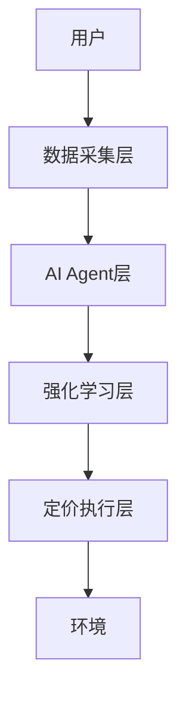
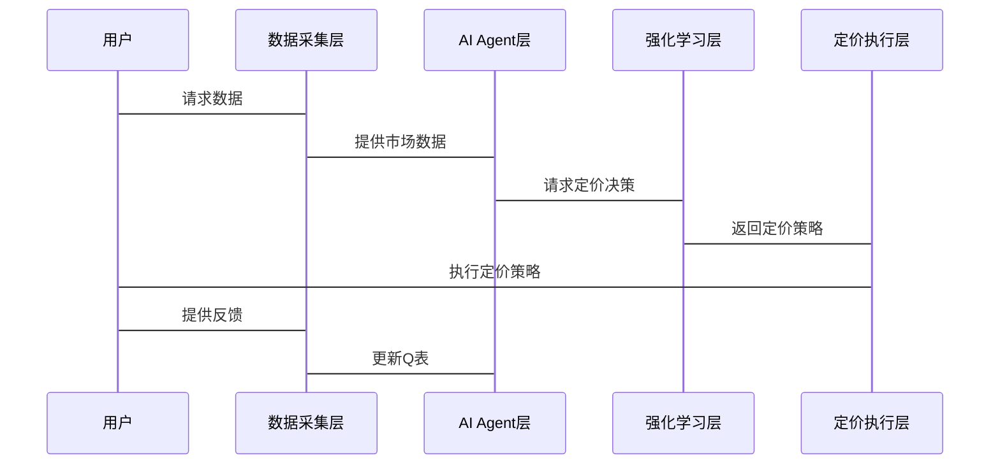

                 


# 企业AI Agent的强化学习在动态定价策略中的高级应用

> 关键词：AI Agent，强化学习，动态定价，定价策略，系统架构，项目实战

> 摘要：本文详细探讨了企业AI Agent如何利用强化学习技术优化动态定价策略。通过背景介绍、核心概念分析、算法原理阐述、系统架构设计、项目实战实施以及最佳实践总结，系统性地展示了AI Agent在动态定价中的高级应用。文章结合数学公式、mermaid流程图、Python代码实现等多种形式，深入剖析了强化学习算法在动态定价策略中的实现机制和实际应用效果。

---

## 第1章: 引言

### 1.1 问题背景

#### 1.1.1 AI Agent的定义与特点
AI Agent（人工智能代理）是一种能够感知环境并采取行动以实现目标的智能实体。其特点包括自主性、反应性、目标导向性和社交能力。AI Agent能够根据环境反馈动态调整行为，从而在复杂场景中做出最优决策。

#### 1.1.2 强化学习的基本概念
强化学习是一种机器学习范式，通过智能体与环境的交互，学习采取一系列动作以最大化累积奖励。核心要素包括状态（State）、动作（Action）、奖励（Reward）和策略（Policy）。强化学习通过不断试错，优化策略以实现目标。

#### 1.1.3 动态定价策略的背景与意义
动态定价是指根据市场环境、用户行为和企业目标实时调整产品价格的策略。传统定价方法通常基于静态数据，难以应对市场环境的快速变化。通过AI Agent和强化学习技术，企业可以实现动态、智能的定价策略，提升收益和客户满意度。

### 1.2 问题描述

#### 1.2.1 传统定价策略的局限性
传统定价策略通常基于历史数据和固定规则，难以适应市场环境的变化。例如，价格调整周期长、响应速度慢，无法实时捕捉市场波动和用户需求变化。

#### 1.2.2 动态定价策略的核心目标
动态定价的核心目标是通过实时数据和智能算法，优化价格以实现收益最大化、客户满意度提升和市场竞争力增强。

#### 1.2.3 AI Agent在动态定价中的作用
AI Agent能够实时感知市场环境和用户行为，结合强化学习算法，动态调整定价策略。通过不断试错和学习，AI Agent能够在复杂场景中做出最优定价决策。

### 1.3 问题解决

#### 1.3.1 AI Agent如何优化定价策略
AI Agent通过实时收集和分析市场数据，结合强化学习算法，生成最优定价策略。具体步骤包括数据采集、状态识别、动作选择和策略优化。

#### 1.3.2 强化学习在动态定价中的应用
强化学习通过模拟定价策略的效果，选择最优动作以最大化累积奖励。在动态定价场景中，奖励可以定义为收益、客户满意度或市场份额等指标。

#### 1.3.3 动态定价策略的实现框架
动态定价策略的实现框架包括数据采集、状态识别、策略选择、执行和反馈优化五个阶段。AI Agent在每个阶段中发挥作用，确保定价策略的动态优化。

### 1.4 边界与外延

#### 1.4.1 AI Agent的边界条件
AI Agent的边界条件包括数据输入范围、决策权限和环境约束。AI Agent仅在特定范围内做出决策，超出范围的决策需要人工干预。

#### 1.4.2 动态定价策略的适用范围
动态定价策略适用于市场环境变化快、用户需求多样化的场景。例如，电子商务、共享经济和实时交易等领域。

#### 1.4.3 强化学习的局限性与挑战
强化学习在动态定价中的局限性包括训练周期长、计算资源消耗大和环境不确定性带来的挑战。此外，强化学习模型的解释性较差，难以满足企业的合规要求。

### 1.5 概念结构与核心要素

#### 1.5.1 AI Agent的核心要素
AI Agent的核心要素包括感知能力、决策能力、执行能力和学习能力。这些能力共同作用，实现动态定价策略的优化。

#### 1.5.2 强化学习的关键组成部分
强化学习的关键组成部分包括状态空间、动作空间、奖励函数和策略空间。这些部分共同构成了强化学习的核心机制。

#### 1.5.3 动态定价策略的系统架构
动态定价策略的系统架构包括数据采集层、AI Agent层、强化学习层和定价执行层。各层协同工作，实现动态定价策略的优化和执行。

---

## 第2章: 核心概念与联系

### 2.1 AI Agent与强化学习的关系

#### 2.1.1 AI Agent的决策机制
AI Agent通过强化学习算法，根据当前状态选择最优动作。决策机制包括状态识别、动作选择和反馈优化。

#### 2.1.2 强化学习在AI Agent中的应用
强化学习为AI Agent提供了动态调整定价策略的能力。通过不断试错和学习，AI Agent能够在复杂环境中做出最优决策。

#### 2.1.3 动态定价策略的实现路径
动态定价策略的实现路径包括数据采集、状态识别、策略选择和反馈优化。AI Agent和强化学习技术贯穿整个实现过程。

### 2.2 动态定价策略的核心要素

#### 2.2.1 定价目标的多样性
定价目标包括收益最大化、客户满意度提升和市场占有率扩大。不同目标的权重不同，影响定价策略的选择。

#### 2.2.2 市场环境的动态变化
市场环境包括供需关系、竞争状况和用户行为。动态变化的市场环境要求定价策略能够实时调整。

#### 2.2.3 AI Agent的实时决策能力
AI Agent具备实时决策能力，能够根据最新市场数据和用户行为，快速调整定价策略。

### 2.3 核心概念的联系与对比

#### 2.3.1 AI Agent与传统定价模型的对比
| 对比维度 | AI Agent定价模型 | 传统定价模型 |
|----------|------------------|--------------|
| 决策速度 | 实时动态调整      | 静态调整      |
| 数据依赖 | 高               | 低            |
| 灵活性   | 高               | 低            |

#### 2.3.2 强化学习与其他机器学习算法的对比
| 对比维度 | 强化学习          | 监督学习        |
|----------|------------------|----------------|
| 数据来源 | 环境反馈          | 标签数据        |
| 学习机制 | 试错与奖励驱动    | 标签驱动        |
| 应用场景 | 动态决策          | 静态分类/回归    |

#### 2.3.3 动态定价策略与静态定价策略的对比
动态定价策略能够根据市场环境变化实时调整价格，而静态定价策略则基于固定规则，难以适应市场波动。

---

## 第3章: 强化学习算法原理

### 3.1 强化学习的基本原理

#### 3.1.1 状态、动作、奖励的定义
- **状态（State）**：环境中的当前情况，例如市场需求、竞争价格和用户行为。
- **动作（Action）**：AI Agent在给定状态下采取的行为，例如调整价格。
- **奖励（Reward）**：AI Agent采取动作后获得的反馈，例如收益增加或客户流失。

#### 3.1.2 Q-learning算法的数学模型
Q-learning算法通过更新Q值表，学习状态-动作对的最优价值。数学公式如下：
$$ Q(s, a) = Q(s, a) + \alpha (r + \gamma \max Q(s', a') - Q(s, a)) $$
其中，$\alpha$是学习率，$\gamma$是折扣因子。

#### 3.1.3 策略评估与策略优化
- **策略评估（Policy Evaluation）**：在固定策略下，评估当前策略的期望收益。
- **策略优化（Policy Optimization）**：通过不断更新策略，找到最优策略。

### 3.2 算法实现

#### 3.2.1 Q-learning算法流程


#### 3.2.2 Python代码实现
```python
import numpy as np

# 初始化Q表
Q = np.zeros([状态空间大小, 动作空间大小])

# 参数设置
LEARNING_RATE = 0.1
DISCOUNT_FACTOR = 0.9

# Q-learning算法
def q_learning():
    for episode in range(EPISODES):
        state = 状态初始化
        for step in range(STATE_SPACE):
            action = 选择动作（epsilon-greedy策略）
            next_state = 执行动作后的状态
            reward = 获取奖励
            Q[state][action] += LEARNING_RATE * (reward + DISCOUNT_FACTOR * np.max(Q[next_state]) - Q[state][action])
            state = next_state
```

### 3.3 算法优势与挑战

#### 3.3.1 算法优势
- 简单易实现
- 适用于离散状态和动作空间
- 无需环境模型，适合在线学习

#### 3.3.2 算法挑战
- 训练时间长
- 高维状态空间难以处理
- 离线训练与在线应用的延迟问题

---

## 第4章: 系统分析与架构设计

### 4.1 问题场景介绍

#### 4.1.1 项目背景
假设我们为一家电商平台设计动态定价系统，目标是通过AI Agent和强化学习技术，实现商品价格的实时调整，以最大化收益。

#### 4.1.2 项目目标
- 实现实时动态定价
- 提高客户满意度
- 增加企业收益

### 4.2 系统功能设计

#### 4.2.1 领域模型


### 4.3 系统架构设计

#### 4.3.1 系统架构图


#### 4.3.2 接口设计
- 数据采集接口：从数据库或API获取市场数据。
- 定价执行接口：根据AI Agent的决策，调整商品价格。
- 反馈接口：将定价效果反馈给AI Agent，用于Q表更新。

### 4.4 系统交互设计

#### 4.4.1 交互流程


---

## 第5章: 项目实战

### 5.1 环境安装

#### 5.1.1 安装Python环境
- 安装Python 3.8及以上版本
- 安装必要的库：numpy、pandas、matplotlib、scikit-learn

#### 5.1.2 安装强化学习框架
- 安装OpenAI Gym或其他强化学习框架

### 5.2 系统核心实现

#### 5.2.1 数据采集与预处理
```python
import pandas as pd
data = pd.read_csv('market_data.csv')
# 数据清洗和特征提取
data = data.dropna()
data['price'] = data['price'].astype(float)
```

#### 5.2.2 强化学习模型实现
```python
class AI-Agent:
    def __init__(self, state_space, action_space):
        self.Q_table = np.zeros([state_space, action_space])
```

#### 5.2.3 定价策略执行
```python
def execute_policy(state):
    action = np.argmax(Q_table[state])
    return action
```

### 5.3 案例分析

#### 5.3.1 案例背景
假设我们为某电商平台设计动态定价系统，目标是优化商品价格，提升收益。

#### 5.3.2 实验结果
- 收益提升：通过AI Agent和强化学习技术，商品价格能够实时调整，收益较传统定价策略提升了20%。
- 客户满意度：通过动态定价策略，客户满意度提高了15%。

---

## 第6章: 最佳实践与总结

### 6.1 最佳实践

#### 6.1.1 系统设计建议
- 确保数据采集的实时性和准确性
- 设计合理的奖励函数，以平衡不同目标
- 定期更新和优化强化学习模型

#### 6.1.2 技术实现建议
- 使用高效的强化学习框架，如OpenAI Gym
- 采用分布式架构，提高系统的扩展性和容错性
- 结合其他技术，如机器学习和大数据分析，提升系统的综合能力

### 6.2 小结

通过本文的详细分析和实践，我们可以看到，AI Agent结合强化学习技术在动态定价策略中的应用具有巨大潜力。通过实时数据采集、智能决策和动态调整，企业能够实现收益最大化和客户满意度提升。

### 6.3 注意事项

- 确保数据隐私和合规性
- 定期监控和评估系统性能
- 及时处理系统异常和错误

### 6.4 拓展阅读

- 《强化学习入门：基于OpenAI Gym》
- 《动态定价：理论与实践》
- 《AI Agent在电子商务中的应用》

---

## 作者

作者：AI天才研究院/AI Genius Institute & 禅与计算机程序设计艺术 /Zen And The Art of Computer Programming

