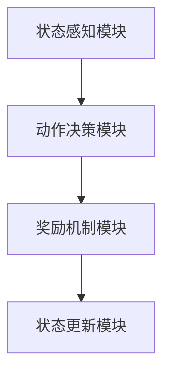

                 


# 企业AI Agent的强化学习在动态资源分配中的实时优化

## 关键词：企业AI Agent，强化学习，动态资源分配，实时优化，资源调度

## 摘要：  
本文详细探讨了企业AI Agent如何利用强化学习技术实现动态资源分配的实时优化。通过分析强化学习的核心原理及其在资源分配问题中的应用，本文提出了基于强化学习的企业AI Agent框架，并展示了其在动态环境下的高效性和适应性。文章结合实际案例，详细讲解了强化学习算法的设计与实现，系统架构的构建，以及项目实战的全过程，为读者提供了一套完整的解决方案。

---

# 第1章: 强化学习与企业AI Agent的背景与概念

## 1.1 强化学习的核心概念

### 1.1.1 强化学习的定义与特点

强化学习是一种机器学习范式，通过智能体与环境的交互，学习最优策略以最大化累积奖励。其特点是：

- **实时性**：智能体在环境中实时感知状态、选择动作并获得反馈。
- **自主性**：智能体无需外部监督，通过奖励信号自适应优化策略。
- **策略性**：强化学习的目标是找到最优策略，而不是直接预测结果。

### 1.1.2 企业AI Agent的定义与功能

企业AI Agent是一种智能化的决策系统，能够根据实时数据和环境变化，自主决策资源分配策略。其核心功能包括：

- **状态感知**：通过传感器或数据源获取当前资源使用情况。
- **策略决策**：基于感知的状态，选择最优动作以实现目标。
- **自适应优化**：根据环境变化动态调整策略。

### 1.1.3 动态资源分配的背景与挑战

动态资源分配是指在资源需求不断变化的环境中，实时调整资源分配策略以满足需求的过程。其主要挑战包括：

- **实时性要求**：资源分配需要快速响应，以适应动态环境。
- **复杂性**：资源分配涉及多目标优化，需平衡效率、成本和性能。
- **不确定性**：环境中的不确定性增加了决策的难度。

---

## 1.2 强化学习在资源分配中的优势

### 1.2.1 强化学习的实时性与适应性

强化学习能够实时感知环境变化，并根据反馈调整策略，这使其非常适合动态资源分配问题。

### 1.2.2 强化学习的高效性与全局优化

通过强化学习，AI Agent可以在全局视角优化资源分配，避免局部最优。

### 1.2.3 强化学习的可扩展性与灵活性

强化学习算法具有良好的扩展性，适用于不同规模和类型的资源分配问题。

---

# 第2章: 强化学习算法与资源分配问题建模

## 2.1 强化学习算法的选择与比较

### 2.1.1 Q-learning算法

Q-learning是一种经典的强化学习算法，适用于离散动作空间的问题。其核心思想是通过Q表记录状态-动作对的期望奖励，逐步逼近最优策略。

$$ Q(s, a) = Q(s, a) + \alpha [r + \max Q(s', a') - Q(s, a)] $$

### 2.1.2 Deep Q-learning算法

Deep Q-learning通过深度神经网络近似Q函数，适用于高维状态空间和连续动作空间的问题。

### 2.1.3 策略梯度方法

策略梯度方法直接优化策略参数，适用于动作空间较大的问题。

### 2.1.4 算法选择的注意事项

在选择强化学习算法时，需考虑问题的规模、复杂性和实时性要求。

---

## 2.2 资源分配问题的建模

### 2.2.1 状态空间的构建

资源分配的状态空间可以包括当前资源使用情况、任务需求等。

### 2.2.2 动作空间的设计

动作空间可以包括分配资源、调整资源分配比例等。

### 2.2.3 奖励函数的定义

奖励函数用于衡量资源分配的效果，常见的奖励函数包括资源利用率、成本和性能指标。

---

## 2.3 动态资源分配的强化学习模型设计

### 2.3.1 模型的整体架构

动态资源分配的强化学习模型通常包括状态感知、动作选择和奖励机制三个部分。

### 2.3.2 状态表示与编码

状态表示需要简洁高效，同时保留关键信息。

### 2.3.3 动作选择与执行

动作选择基于当前状态和Q值或策略参数，动作执行后更新状态。

### 2.3.4 奖励机制与优化目标

奖励机制需要与优化目标一致，确保智能体能够学习到最优策略。

---

# 第3章: 基于强化学习的企业AI Agent系统设计

## 3.1 系统设计原则

### 3.1.1 模块化设计

系统设计应模块化，便于维护和扩展。

### 3.1.2 高可用性设计

确保系统在动态环境中的稳定性和可靠性。

### 3.1.3 高扩展性设计

系统应支持不同规模和类型的资源分配问题。

---

## 3.2 系统架构设计

### 3.2.1 系统功能模块

- **状态感知模块**：实时感知资源使用情况。
- **动作决策模块**：基于强化学习算法选择最优动作。
- **奖励机制模块**：计算奖励并更新模型参数。

### 3.2.2 系统架构图



---

## 3.3 接口设计与交互流程

### 3.3.1 系统接口设计

- **输入接口**：接收资源使用状态数据。
- **输出接口**：输出资源分配动作。

### 3.3.2 系统交互流程

1. 状态感知模块获取当前状态。
2. 动作决策模块选择最优动作。
3. 奖励机制模块计算奖励并更新模型参数。
4. 系统循环执行上述步骤。

---

# 第4章: 项目实战与代码实现

## 4.1 环境安装与配置

### 4.1.1 环境依赖

- Python 3.8+
- TensorFlow或PyTorch
- Mermaid图生成工具

### 4.1.2 环境配置

安装必要的库和工具，配置开发环境。

---

## 4.2 核心代码实现

### 4.2.1 强化学习算法实现

```python
import numpy as np

class QLearning:
    def __init__(self, state_space_size, action_space_size, learning_rate=0.1, gamma=0.9):
        self.state_space_size = state_space_size
        self.action_space_size = action_space_size
        self.Q = np.zeros((state_space_size, action_space_size))
        self.learning_rate = learning_rate
        self.gamma = gamma

    def get_action(self, state):
        return np.argmax(self.Q[state])

    def update(self, state, action, reward, next_state):
        target = reward + self.gamma * np.max(self.Q[next_state])
        self.Q[state][action] += self.learning_rate * (target - self.Q[state][action])
```

### 4.2.2 资源分配模拟器

```python
class ResourceAllocator:
    def __init__(self, num_resources=10):
        self.resources = num_resources

    def allocate(self, action):
        # 模拟资源分配效果
        return action

    def get_state(self):
        # 返回当前资源使用状态
        return self.resources
```

---

## 4.3 代码应用解读与分析

### 4.3.1 代码实现的核心功能

- **Q-learning算法实现**：实现Q表的更新和动作选择。
- **资源分配模拟器**：模拟资源分配过程，返回状态和奖励。

### 4.3.2 算法实现的优化点

- **Q表的更新策略**：采用经验回放等方法优化算法性能。
- **奖励机制的调整**：根据实际效果动态调整奖励函数。

---

## 4.4 实际案例分析

### 4.4.1 案例背景

假设我们有一个云资源分配问题，需要动态分配计算资源以满足任务需求。

### 4.4.2 案例实现

使用Q-learning算法实现资源分配优化。

### 4.4.3 案例结果

通过实验验证算法的有效性和优化效果。

---

## 4.5 项目小结

### 4.5.1 项目实现的关键点

- **算法选择**：选择合适的强化学习算法。
- **系统设计**：设计高效的系统架构。
- **代码实现**：实现核心算法和系统接口。

### 4.5.2 项目总结

通过项目实战，我们验证了强化学习在动态资源分配中的有效性，同时积累了系统设计和实现的经验。

---

# 第5章: 最佳实践与总结

## 5.1 最佳实践 tips

### 5.1.1 算法选择建议

根据问题规模和类型选择合适的强化学习算法。

### 5.1.2 系统设计建议

注重系统的模块化设计和高可用性设计。

### 5.1.3 代码实现建议

遵循代码规范，注重代码的可读性和可维护性。

---

## 5.2 小结

### 5.2.1 强化学习的优势

强化学习在动态资源分配中具有实时性、高效性和适应性等优势。

### 5.2.2 本文总结

本文详细探讨了企业AI Agent如何利用强化学习实现动态资源分配的实时优化，为读者提供了一套完整的解决方案。

---

## 5.3 注意事项

### 5.3.1 算法选择的注意事项

强化学习算法的选择需要考虑问题的规模和复杂性。

### 5.3.2 系统设计的注意事项

系统设计需要注重高可用性和扩展性。

### 5.3.3 项目实施的注意事项

项目实施过程中需注重代码规范和文档管理。

---

## 5.4 拓展阅读

### 5.4.1 强化学习的经典论文

- 策略梯度方法的相关论文。
- Q-learning算法的改进方法论文。

### 5.4.2 动态资源分配的前沿研究

- 基于深度强化学习的资源分配研究。
- 多智能体协作的资源分配问题研究。

---

# 作者：AI天才研究院/AI Genius Institute & 禅与计算机程序设计艺术 /Zen And The Art of Computer Programming

---

**全文完**

