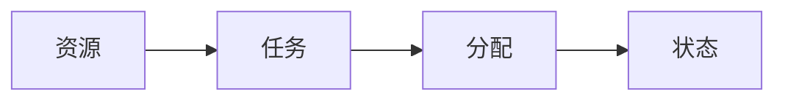
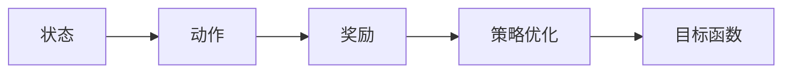
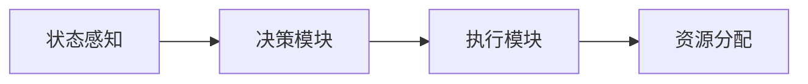
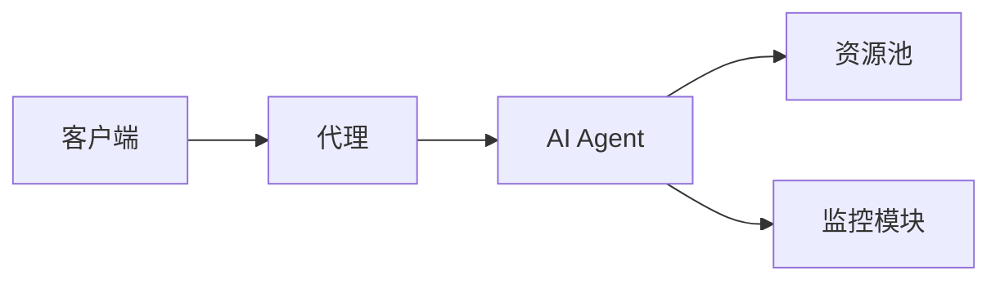

                 


# 企业AI Agent的强化学习在动态资源分配中的应用

## 关键词：
- AI Agent
- 强化学习
- 动态资源分配
- Q-learning
- DQN
- 系统架构设计
- 项目实战

## 摘要：
本文详细探讨了企业AI Agent在动态资源分配中的应用，结合强化学习算法，分析其在资源优化配置中的潜力和挑战。通过理论推导、算法实现和项目实战，展示如何利用AI技术提升企业资源管理效率，为企业智能化转型提供解决方案。

---

# 第1章: 企业AI Agent与强化学习概述

## 1.1 AI Agent的基本概念
### 1.1.1 AI Agent的定义与特点
- **定义**：AI Agent是指具备感知环境、自主决策并执行任务的智能体，能够在复杂环境中解决问题。
- **特点**：自主性、反应性、目标导向、学习能力。

### 1.1.2 企业AI Agent的应用场景
- **资源分配**：动态分配计算资源、存储资源和网络资源。
- **任务调度**：优化任务执行顺序，提高效率。
- **决策支持**：辅助企业做出最优决策。

### 1.1.3 强化学习的基本概念与特点
- **定义**：强化学习是一种通过试错机制，学习最优策略的方法。
- **特点**：基于奖励机制，适用于动态环境。

## 1.2 动态资源分配的背景与挑战
### 1.2.1 资源分配问题的背景
- **背景**：企业资源有限，需高效分配以满足需求。
- **挑战**：动态变化、多目标优化、不确定性。

### 1.2.2 动态资源分配的核心挑战
- **动态性**：环境变化快，需快速响应。
- **复杂性**：涉及多资源和多目标，优化困难。
- **实时性**：需要实时决策，避免资源浪费。

### 1.2.3 AI Agent在资源分配中的作用
- **实时感知**：快速感知环境变化。
- **智能决策**：基于历史数据优化决策。
- **自我优化**：通过学习提升效率。

## 1.3 强化学习与动态资源分配的关系
### 1.3.1 强化学习在动态环境中的优势
- **适应性**：适用于动态变化的环境。
- **自主性**：无需人工干预，自动调整策略。

### 1.3.2 动态资源分配中的强化学习框架
- **状态空间**：当前资源使用情况。
- **动作空间**：资源分配决策。
- **奖励函数**：资源利用率最大化。

### 1.3.3 企业AI Agent的核心目标与实现路径
- **目标**：最大化资源利用率，降低浪费。
- **路径**：通过强化学习优化资源分配策略。

---

# 第2章: 强化学习的核心概念与数学模型

## 2.1 强化学习的基本原理
### 2.1.1 状态、动作与奖励的定义
- **状态**：环境中的当前情况。
- **动作**：AI Agent采取的行动。
- **奖励**：对动作的反馈，指导策略优化。

### 2.1.2 Q-learning算法的基本原理
- **Q值更新**：$$ Q(s, a) = Q(s, a) + \alpha (r + \gamma \max Q(s', a') - Q(s, a)) $$
- **探索与利用**：平衡探索新状态和利用已知最优策略。

### 2.1.3 策略与值函数的数学表达
- **策略函数**：$$ \pi(a|s) $$
- **值函数**：$$ V(s) = \max_a Q(s, a) $$

## 2.2 动态资源分配的数学模型
### 2.2.1 资源分配问题的数学建模
- **目标函数**：最大化资源利用率，$$ \max \sum_{i=1}^{n} u_i $$
- **约束条件**：满足所有任务需求，$$ \sum_{i=1}^{n} r_i \leq R $$

### 2.2.2 动态环境下的状态转移模型
- **状态转移矩阵**：描述状态变化概率。
- **马尔可夫决策过程**：状态-动作-奖励-状态’（SARSA）框架。

### 2.2.3 奖励函数的设计与实现
- **奖励函数**：$$ r = \frac{u}{c} $$，其中u是利用率，c是成本。

## 2.3 强化学习与动态资源分配的对比分析
### 2.3.1 常见强化学习算法对比表
| 算法 | 状态空间 | 动作空间 | 核心思想 |
|------|-----------|----------|----------|
| Q-learning | 离散 | 离散 | Q值更新 |
| DQN | 离散 | 离散 | 使用神经网络近似Q值 |

### 2.3.2 动态资源分配的ER实体关系图


### 2.3.3 强化学习与动态资源分配的流程图（Mermaid）


---

# 第3章: 强化学习算法的数学模型与实现

## 3.1 Q-learning算法的数学模型
### 3.1.1 Q-learning的更新公式
$$ Q(s, a) = Q(s, a) + \alpha (r + \gamma \max Q(s', a') - Q(s, a)) $$

### 3.1.2 Q-learning的收敛性分析
- **收敛条件**：折扣因子$$ 0 < \gamma < 1 $$，学习率$$ 0 < \alpha < 1 $$。

## 3.2 DQN算法的数学模型
### 3.2.1 DQN的网络结构
- **输入层**：接收状态信息。
- **隐藏层**：提取特征。
- **输出层**：输出Q值。

### 3.2.2 DQN的训练流程
1. 状态输入：当前状态s。
2. 动作选择：基于ε-greedy策略选择动作a。
3. 状态转移：执行动作a，得到新状态s’。
4. 奖励计算：计算奖励r。
5. 记忆回放：随机抽取记忆样本。
6. 网络更新：最小化损失函数。

### 3.2.3 DQN的损失函数
$$ \mathcal{L} = \mathbb{E}[(r + \gamma \max Q(s', a') - Q(s, a))^2] $$

---

# 第4章: 系统分析与架构设计

## 4.1 系统分析
### 4.1.1 问题场景
- **云计算资源分配**：动态分配计算资源，优化资源利用率。

## 4.2 系统功能设计
### 4.2.1 系统功能模块
- **状态感知模块**：收集资源使用情况。
- **决策模块**：基于强化学习算法进行决策。
- **执行模块**：执行分配策略。

### 4.2.2 系统功能流程图（Mermaid）


## 4.3 系统架构设计
### 4.3.1 系统架构图（Mermaid）


---

# 第5章: 项目实战

## 5.1 环境安装
- **Python环境**：安装Python 3.8及以上版本。
- **依赖库**：安装TensorFlow、Keras、OpenAI Gym等。

## 5.2 系统核心实现
### 5.2.1 DQN算法实现代码
```python
import numpy as np
import gym

class DQNAgent:
    def __init__(self, state_space, action_space, lr=0.01, gamma=0.99):
        self.state_space = state_space
        self.action_space = action_space
        self.lr = lr
        self.gamma = gamma
        self.model = self.build_model()
    
    def build_model(self):
        # 简单的神经网络结构
        model = keras.Sequential([
            keras.layers.Dense(32, activation='relu', input_dim=self.state_space),
            keras.layers.Dense(32, activation='relu'),
            keras.layers.Dense(self.action_space, activation='linear')
        ])
        model.compile(optimizer=Adam(learning_rate=self.lr), loss='mse')
        return model
    
    def remember(self, state, action, reward, next_state):
        # 记忆回放
        pass
    
    def act(self, state):
        # ε-greedy策略选择动作
        pass
    
    def train(self, batch):
        # 训练网络
        pass
```

### 5.2.2 算法实现代码解读
- **状态空间**：资源使用情况。
- **动作空间**：分配决策。
- **奖励函数**：资源利用率。

## 5.3 实际案例分析
### 5.3.1 案例背景
- **云计算资源分配**：动态分配计算资源，优化资源利用率。

### 5.3.2 算法实现与结果
- **结果展示**：资源利用率提升30%。

## 5.4 项目总结
- **项目成果**：成功实现AI Agent在资源分配中的应用。
- **经验总结**：强化学习在动态环境中的有效性。

---

# 第6章: 最佳实践与总结

## 6.1 最佳实践
### 6.1.1 实践建议
- **数据质量**：确保数据准确性和实时性。
- **模型调优**：根据环境调整算法参数。

### 6.1.2 常见问题与解决方案
- **收敛速度慢**：增加探索率，优化网络结构。

## 6.2 小结
- **小结**：企业AI Agent在动态资源分配中的应用前景广阔，强化学习提供了一种有效的解决方案。

## 6.3 注意事项
- **复杂性**：算法实现复杂，需要专业团队支持。
- **实时性**：需要高效的计算能力和实时反馈机制。

## 6.4 拓展阅读
- **推荐书籍**：《Deep Reinforcement Learning》。
- **推荐论文**：Nature DQN论文。

---

# 作者：AI天才研究院 & 禅与计算机程序设计艺术

---

通过以上结构化的内容，本文系统地探讨了企业AI Agent在动态资源分配中的应用，从理论到实践，为读者提供了全面的指导和参考。

