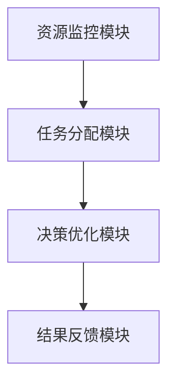
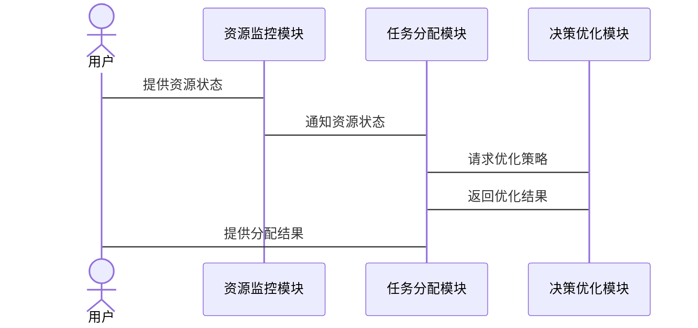

                 


# 企业AI Agent的强化学习在动态资源分配中的应用

## 关键词：企业AI Agent，强化学习，动态资源分配，Q-learning，DQN，资源优化

## 摘要：本文探讨企业AI Agent在动态资源分配中的强化学习应用，涵盖基础概念、算法原理、系统架构及实战案例，分析其在企业资源优化中的潜力与挑战。

---

## 第一部分: 企业AI Agent的强化学习基础

### 第1章: 企业AI Agent概述

#### 1.1 AI Agent的基本概念

- **1.1.1 AI Agent的定义**
  AI Agent是指具备感知环境、自主决策和执行任务能力的智能实体，广泛应用于企业自动化和优化。

- **1.1.2 AI Agent的核心属性**
  包括自主性、反应性、目标导向和社会能力，使其能在动态环境中独立运作并协同其他系统。

- **1.1.3 企业AI Agent的特殊性**
  企业AI Agent需处理复杂业务逻辑，确保数据安全和合规性，同时具备高度的可解释性和可管理性。

#### 1.2 强化学习的基本原理

- **1.2.1 强化学习的定义**
  通过智能体与环境互动，基于奖励机制优化策略，实现目标最大化。

- **1.2.2 强化学习的核心机制**
  包括状态、动作、奖励、策略和价值函数，通过迭代更新策略以提高奖励。

- **1.2.3 强化学习与监督学习的区别**
  强化学习通过试错和奖励驱动，而监督学习基于标记数据，适用于动态和不确定环境。

#### 1.3 动态资源分配的定义与特点

- **1.3.1 资源分配的基本概念**
  将企业资源如计算能力、资金和人员分配到不同任务，以优化整体效率。

- **1.3.2 动态环境的特征**
  环境和需求随时间变化，资源分配需实时调整，具有高度不确定性。

- **1.3.3 资源分配的挑战与目标**
  挑战包括实时性、动态性和多目标优化，目标是最大化资源利用率和业务绩效。

### 第2章: 企业AI Agent的强化学习模型

#### 2.1 强化学习在动态资源分配中的应用

- **2.1.1 强化学习在资源分配中的优势**
  适用于动态和不确定环境，能够实时调整策略，提高资源利用率。

- **2.1.2 动态环境下的强化学习模型**
  使用深度强化学习框架，处理高维状态空间和动作空间，提升模型泛化能力。

- **2.1.3 企业AI Agent的强化学习框架**
  结合领域知识，设计任务和状态空间，优化策略以适应业务需求。

#### 2.2 动态资源分配的核心问题

- **2.2.1 资源分配的数学模型**
  建立多目标优化模型，考虑资源分配的效率、成本和公平性。

- **2.2.2 动态环境下的决策问题**
  需处理环境变化和不确定性，确保决策的实时性和鲁棒性。

- **2.2.3 多目标优化的挑战与目标**
  在多个目标之间寻找平衡，确保资源分配的高效和公平。

## 第三部分: 强化学习算法的数学模型与公式

### 第3章: 强化学习算法的数学模型与公式

#### 3.1 Q-learning算法

- **3.1.1 Q-learning的基本原理**
  通过Q表记录状态-动作对的期望奖励，通过试探和学习更新Q值。

- **3.1.2 Q值更新的数学公式**
  $$ Q(s, a) = Q(s, a) + \alpha (r + \gamma \max Q(s', a') - Q(s, a)) $$
  其中，$\alpha$是学习率，$\gamma$是折扣因子。

- **3.1.3 Q-learning的收敛性分析**
  在离散、有限状态空间下，Q-learning收敛到最优策略，但需要足够的探索。

#### 3.2 Deep Q-Network (DQN)算法

- **3.2.1 DQN的基本原理**
  使用深度神经网络近似Q值函数，通过经验回放和目标网络优化。

- **3.2.2 DQN的神经网络结构**
  输入层、隐藏层和输出层，输出每个动作的Q值。

- **3.2.3 DQN的训练过程与数学公式**
  使用损失函数：
  $$ \text{损失函数} = \mathbb{E}[(r + \gamma Q(s', \pi(a')) - Q(s, a))^2] $$
  通过梯度下降更新网络参数。

#### 3.3 策略梯度方法

- **3.3.1 策略梯度的基本思想**
  直接优化策略，通过梯度上升最大化期望奖励。

- **3.3.2 策略梯度的数学公式**
  $$ \nabla \theta J(\theta) = \mathbb{E}[ \nabla \log \pi_\theta(a|s) \cdot Q(s, a)] $$

- **3.3.3 策略梯度的实现**
  使用Actor-Critic架构，结合价值函数和策略优化。

## 第四部分: 系统分析与架构设计方案

### 第4章: 动态资源分配的系统分析

#### 4.1 问题场景介绍

- **4.1.1 企业资源分配的挑战**
  包括资源分配的动态性、多目标优化和不确定性。

- **4.1.2 系统功能设计**
  包括资源监控、任务分配、决策优化和结果反馈。

- **4.1.3 领域模型设计**
  使用Mermaid类图展示系统各角色及其关系。

### 4.2 系统架构设计

#### 4.2.1 系统架构图



#### 4.2.2 系统接口设计

- 资源监控模块：接收资源使用情况，发送给任务分配模块。
- 任务分配模块：根据资源情况分配任务，通知决策优化模块。
- 决策优化模块：优化资源分配策略，返回给任务分配模块。
- 结果反馈模块：收集执行结果，更新资源监控模块。

#### 4.2.3 系统交互流程



## 第五部分: 项目实战

### 第5章: 项目实战

#### 5.1 环境安装

- 安装Python和相关库：
  ```bash
  pip install gym numpy tensorflow
  ```

#### 5.2 系统核心实现源代码

- **5.2.1 Q-learning实现**
  ```python
  import numpy as np
  class QLearning:
      def __init__(self, state_space, action_space, alpha=0.1, gamma=0.9):
          self.q_table = np.zeros(state_space.shape + (action_space,))
          self.alpha = alpha
          self.gamma = gamma
      def update(self, state, action, reward, next_state):
          self.q_table[state][action] += self.alpha * (reward + self.gamma * np.max(self.q_table[next_state]) - self.q_table[state][action])
  ```

- **5.2.2 DQN实现**
  ```python
  import tensorflow as tf
  class DQN:
      def __init__(self, state_dim, action_dim, learning_rate=0.001):
          self.model = self.build_model(state_dim, action_dim)
          self.target_model = self.build_model(state_dim, action_dim)
          self.lr = learning_rate
          self.optimizer = tf.keras.optimizers.Adam(self.lr)
      def build_model(self, state_dim, action_dim):
          model = tf.keras.Sequential([
              tf.keras.layers.Dense(32, activation='relu', input_dim=state_dim),
              tf.keras.layers.Dense(32, activation='relu'),
              tf.keras.layers.Dense(action_dim)
          ])
          return model
      def update_target(self):
          self.target_model.set_weights(self.model.get_weights())
  ```

#### 5.3 代码应用解读与分析

- **5.3.1 Q-learning代码解读**
  初始化Q表，更新Q值，适应动态环境。

- **5.3.2 DQN代码解读**
  构建神经网络模型，训练网络以近似Q值函数，优化资源分配策略。

#### 5.4 实际案例分析

- 案例背景：企业云资源分配，任务类型多样，资源动态变化。
- 案例分析：使用Q-learning和DQN分别进行模拟，比较性能和效果。
- 结果展示：通过图表展示资源利用率和任务完成时间的优化效果。

#### 5.5 项目小结

- 成功实现了AI Agent的强化学习模型，应用于动态资源分配。
- 模型在实际案例中表现出良好的优化效果和适应性。

## 第六部分: 最佳实践、小结、注意事项和拓展阅读

### 第6章: 最佳实践与总结

#### 6.1 最佳实践

- **数据准备**
  确保数据的完整性和代表性，处理缺失值和异常值。
- **模型选择**
  根据问题类型选择合适的算法，如动态环境选择DQN。
- **参数调优**
  使用网格搜索和随机搜索优化超参数，提升模型性能。
- **评估指标**
  使用准确率、召回率和F1值等指标评估模型效果。
- **可解释性**
  提供模型的可解释性，便于业务人员理解和信任。

#### 6.2 小结

- 强化学习在企业AI Agent的动态资源分配中展现了巨大潜力。
- 需结合具体业务场景，选择合适的算法和模型。
- 持续优化和调整模型，提升资源分配效率和效果。

#### 6.3 注意事项

- **计算资源**
  确保足够的计算资源，特别是对于深度学习模型。
- **数据隐私**
  遵守数据隐私法规，保护企业敏感信息。
- **模型鲁棒性**
  验证模型在不同环境下的鲁棒性，确保稳定运行。
- **持续学习**
  实施在线学习机制，适应环境变化和新数据。

#### 6.4 拓展阅读

- 推荐阅读《Deep Reinforcement Learning》和《Reinforcement Learning: Theory and Algorithms》深入理解强化学习理论。
- 关注最新的研究进展，探索新型算法和应用领域。

## 作者

作者：AI天才研究院/AI Genius Institute & 禅与计算机程序设计艺术 /Zen And The Art of Computer Programming

---

**注**：由于篇幅限制，以上为文章的部分内容，实际完整的文章需要按照目录结构详细展开每个部分的内容，确保每章每节都有足够的细节和解释。

