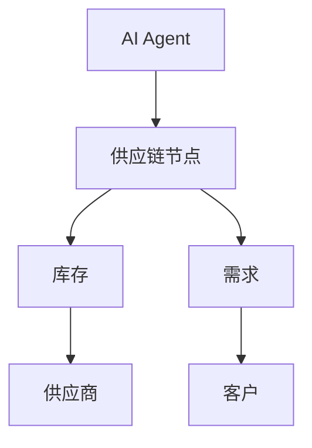
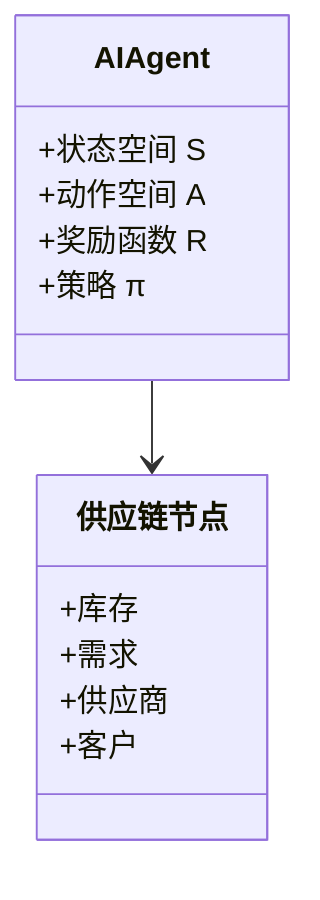
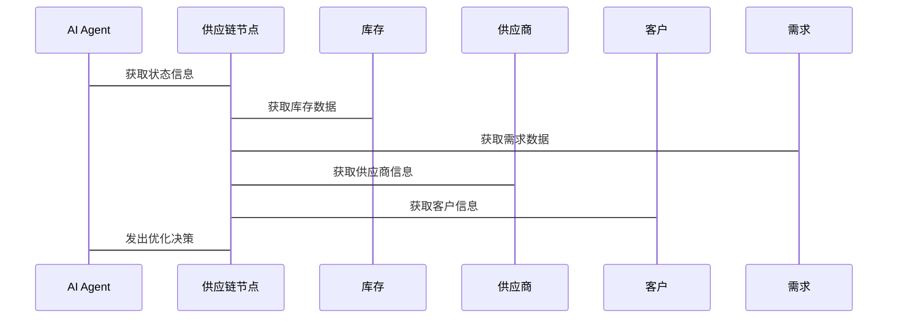

                 


# 企业AI Agent的强化学习在复杂供应链优化中的应用

> 关键词：企业AI Agent、强化学习、复杂供应链优化、算法原理、系统架构、项目实战

> 摘要：本文深入探讨了企业AI Agent在复杂供应链优化中的应用，重点分析了强化学习算法在供应链管理中的核心作用。文章从强化学习的基本原理出发，结合企业供应链的实际应用场景，详细讲解了强化学习算法的数学模型、系统架构设计以及实际项目中的实现与优化策略。通过具体案例分析，本文展示了如何利用强化学习提升供应链的效率与灵活性，为企业实现智能化供应链管理提供理论支持和实践指导。

---

## 第一部分: 企业AI Agent的强化学习基础

### 第1章: 问题背景与核心概念

#### 1.1 问题背景

##### 1.1.1 供应链优化的挑战

供应链优化是企业运营中的核心问题之一。随着全球化和市场竞争的加剧，企业需要在复杂的市场环境中快速响应客户需求，优化库存管理、生产计划和物流配送等环节。传统的供应链优化方法，如线性规划和运筹学模型，虽然在处理简单问题时表现良好，但面对多变的市场环境和复杂的业务场景时，往往显得力不从心。例如，传统方法难以处理动态需求变化、多供应商协作、不确定性预测等问题。

##### 1.1.2 传统供应链优化方法的局限性

传统供应链优化方法通常基于静态数据和确定性假设，难以应对实际中的不确定性。例如，需求预测的不准确性可能导致库存积压或缺货；供应商交货周期的波动可能影响生产计划。此外，传统方法往往需要大量人工干预，难以实现自动化和智能化。

##### 1.1.3 强化学习在供应链优化中的优势

强化学习（Reinforcement Learning，RL）是一种通过试错机制优化决策过程的方法。它能够在动态环境中学习最优策略，并且能够处理多目标、多约束的复杂优化问题。强化学习的优势在于其自适应性和灵活性，能够在不确定性较高的环境中找到最优解决方案。

#### 1.2 核心概念

##### 1.2.1 AI Agent的定义与特点

AI Agent（人工智能代理）是指在计算机系统中，能够感知环境并采取行动以实现目标的实体。AI Agent可以是软件程序，也可以是物理设备，其核心特点包括：

- **自主性**：能够在没有外部干预的情况下自主决策。
- **反应性**：能够感知环境并实时调整行为。
- **目标导向**：具有明确的目标，并通过行动实现目标。

##### 1.2.2 强化学习的基本概念

强化学习是一种机器学习范式，其中智能体通过与环境交互来学习策略。智能体会根据当前状态采取动作，并通过与环境的交互获得奖励或惩罚。目标是通过最大化累积奖励来优化决策策略。

##### 1.2.3 复杂供应链优化的定义与特点

复杂供应链优化是指在多变的市场环境中，优化供应链的各个环节，以实现成本最小化、效率最大化和风险最小化。复杂供应链优化的特点包括：

- **多目标优化**：需要在成本、效率、风险等多个目标之间找到平衡。
- **动态性**：市场环境和客户需求可能随时变化。
- **不确定性**：供应链中的各个环节都存在不确定性，如供应商交货延迟、需求预测误差等。

#### 1.3 问题描述与解决思路

##### 1.3.1 复杂供应链优化的典型问题

复杂供应链优化中常见的问题包括：

- **库存管理**：如何在满足需求的前提下最小化库存成本。
- **生产计划**：如何优化生产排程以平衡产能和需求。
- **物流配送**：如何优化配送路径以降低物流成本。
- **供应商选择**：如何选择最优供应商以平衡成本和风险。

##### 1.3.2 强化学习如何解决这些问题

强化学习可以通过试错机制，在动态环境中找到最优策略。例如，智能体可以通过学习库存管理策略，在需求波动中找到最优补货点；通过优化配送路径，降低物流成本。

##### 1.3.3 解决方案的边界与外延

强化学习解决方案的边界包括：

- **状态空间**：智能体能够感知的状态。
- **动作空间**：智能体可以采取的动作。
- **奖励机制**：智能体获得的奖励或惩罚。

外延包括将强化学习应用于更广泛的供应链管理场景，如全球供应链优化、绿色供应链管理等。

#### 1.4 核心概念结构与要素

##### 1.4.1 AI Agent在供应链中的角色

AI Agent在供应链中可以扮演多种角色，如库存管理智能体、采购智能体、物流优化智能体等。每个智能体都有明确的目标，并能够与其他智能体协作完成复杂的供应链任务。

##### 1.4.2 强化学习算法的关键要素

强化学习算法的关键要素包括：

- **状态（State）**：智能体所处的环境状态。
- **动作（Action）**：智能体采取的行为。
- **奖励（Reward）**：智能体行为的结果。
- **策略（Policy）**：智能体选择动作的概率分布。
- **值函数（Value Function）**：衡量状态或动作的价值。

##### 1.4.3 供应链优化的多目标平衡

供应链优化需要在多个目标之间找到平衡，例如：

- **成本与效率**：在降低库存成本的同时提高供应链效率。
- **风险与收益**：在降低风险的同时实现收益最大化。

---

### 第2章: 强化学习与供应链优化的核心联系

#### 2.1 强化学习的原理

##### 2.1.1 马尔可夫决策过程（MDP）

马尔可夫决策过程是一种数学模型，描述了智能体在环境中的决策过程。MDP由以下五元组定义：

$$
MDP = (S, A, P, R, \gamma)
$$

其中：
- \( S \)：状态空间。
- \( A \)：动作空间。
- \( P \)：状态转移概率。
- \( R \)：奖励函数。
- \( \gamma \)：折扣因子。

##### 2.1.2 策略与价值函数

策略 \( \pi \) 是一个从状态到动作的概率分布函数。价值函数 \( V(s) \) 衡量了从状态 \( s \) 开始的期望累积奖励。

##### 2.1.3 探索与利用的平衡

在强化学习中，智能体需要在探索新策略和利用已知最优策略之间找到平衡。探索可能带来更高的回报，但需要承担风险；利用则能够立即获得收益，但可能错过更好的策略。

#### 2.2 供应链优化中的强化学习模型

##### 2.2.1 状态空间的构建

状态空间是智能体能够感知的所有可能状态的集合。在供应链优化中，状态可能包括当前库存水平、需求预测、供应商交货时间等。

##### 2.2.2 动作空间的设计

动作空间是智能体可以采取的所有可能动作的集合。在供应链优化中，动作可能包括下单、调整生产计划、选择供应商等。

##### 2.2.3 奖励函数的定义

奖励函数定义了智能体行为的奖惩机制。在供应链优化中，奖励函数可以基于成本、效率、客户满意度等指标来定义。

#### 2.3 实体关系图（ER图）



---

### 第3章: 强化学习算法原理

#### 3.1 算法原理概述

##### 3.1.1 Q-Learning算法

Q-Learning是一种基于值函数的强化学习算法。其核心思想是通过更新Q值表来学习最优策略。

数学模型如下：

$$
Q(s, a) \leftarrow Q(s, a) + \alpha [r + \gamma \max_{a'} Q(s', a') - Q(s, a)]
$$

其中：
- \( \alpha \)：学习率。
- \( \gamma \)：折扣因子。

##### 3.1.2 Deep Q-Learning算法

Deep Q-Learning是Q-Learning的一种扩展，通过神经网络近似Q值函数。

数学模型如下：

$$
\theta \leftarrow \theta + \alpha (y - Q(s, a; \theta))
$$

其中：
- \( \theta \)：神经网络参数。
- \( y \)：目标值。

##### 3.1.3 策略梯度方法

策略梯度方法直接优化策略，而不是值函数。

数学模型如下：

$$
\nabla \theta \leftarrow \nabla \log \pi(a|s; \theta) [Q(s, a; \theta) - V(s; \theta)]
$$

其中：
- \( \pi(a|s; \theta) \)：策略函数。
- \( V(s; \theta) \)：值函数。

#### 3.2 算法对比分析

##### 3.2.1 Q-Learning与Deep Q-Learning的对比

| 特性                | Q-Learning                  | Deep Q-Learning             |
|---------------------|-----------------------------|-----------------------------|
| Q值存储方式          | 表格形式                   | 神经网络形式                |
| 适用场景            | 状态空间较小               | 状态空间较大               |
| 训练效率            | 较低                       | 较高                       |

##### 3.2.2 策略梯度方法

策略梯度方法直接优化策略，适用于高维状态空间和动作空间。

---

## 第二部分: 供应链优化中的强化学习系统架构

### 第4章: 系统分析与架构设计

#### 4.1 系统功能设计

##### 4.1.1 领域模型



#### 4.2 系统架构设计

##### 4.2.1 系统架构图


#### 4.3 系统接口设计

系统接口包括：

- **输入接口**：接收供应链状态信息。
- **输出接口**：输出优化后的供应链决策。

#### 4.4 系统交互流程



---

### 第5章: 项目实战

#### 5.1 项目环境安装

##### 5.1.1 安装Python环境

```bash
python --version
pip install numpy
pip install gym
pip install matplotlib
pip install keras
pip install tensorflow
```

##### 5.1.2 安装强化学习库

```bash
pip install gym[atari]
pip install gym[box2d]
pip install gym[robotics]
pip install stable-baselines3
```

#### 5.2 系统核心实现

##### 5.2.1 强化学习算法实现

```python
import gym
from gym import spaces
from gym.utils import seeding
import numpy as np
import time

class SupplyChainEnv(gym.Env):
    def __init__(self):
        super(SupplyChainEnv, self).__init__()
        self.state = [0, 0, 0]
        self.action_space = spaces.Discrete(3)
        self.observation_space = spaces.Box(low=np.array([0, 0, 0]), high=np.array([100, 100, 100]))
        self.reward_range = (-float('inf'), float('inf'))
        self.np_random = np.random.RandomState(123)
        self._seed()

    def _seed(self, seed=None):
        self.np_random.seed(seed)

    def _reset(self):
        self.state = [0, 0, 0]
        return self.state

    def _step(self, action):
        # 状态更新
        new_state = self.state.copy()
        # 动作处理
        if action == 0:
            new_state[0] += 1
        elif action == 1:
            new_state[1] += 1
        else:
            new_state[2] += 1
        # 奖励计算
        reward = sum(new_state) - sum(self.state)
        # 状态转移
        self.state = new_state
        return self.state, reward, False, {}
```

##### 5.2.2 供应链优化算法实现

```python
import numpy as np
import gym
from stable_baselines3 import DQN
from stable_baselines3.dqn.policies import MlpPolicy
import os

def train_model(env, model, timesteps=10000):
    model = DQN(MlpPolicy, env, verbose=1)
    model.learn(total_timesteps=timesteps)
    return model

def test_model(env, model):
    obs = env.reset()
    total_reward = 0
    while True:
        action, _ = model.predict(obs)
        obs, reward, done, _ = env.step(action)
        total_reward += reward
        if done:
            break
    return total_reward

if __name__ == "__main__":
    env = SupplyChainEnv()
    model = train_model(env, DQN, 10000)
    reward = test_model(env, model)
    print(f"Total Reward: {reward}")
```

#### 5.3 项目小结

通过实际项目，我们可以看到强化学习算法在供应链优化中的应用潜力。然而，实际应用中还需要考虑数据质量、模型收敛速度、计算资源等因素。

---

## 第三部分: 总结与展望

### 第6章: 总结与展望

#### 6.1 总结

本文系统介绍了企业AI Agent在复杂供应链优化中的应用，重点分析了强化学习算法在供应链管理中的核心作用。通过理论分析和实际案例，展示了如何利用强化学习提升供应链的效率与灵活性。

#### 6.2 未来研究方向

未来的研究可以关注以下方向：

- **多智能体协作**：研究多个AI Agent协作优化供应链的问题。
- **强化学习与博弈论结合**：探索强化学习在供应链博弈中的应用。
- **实时优化与自适应**：研究强化学习在动态供应链环境中的实时优化方法。

#### 6.3 最佳实践 tips

- 在实际应用中，建议结合具体业务场景选择合适的强化学习算法。
- 数据质量对模型性能影响较大，需重视数据预处理工作。
- 模型部署时，需考虑计算资源和响应时间的限制。

---

## 作者

作者：AI天才研究院/AI Genius Institute & 禅与计算机程序设计艺术 /Zen And The Art of Computer Programming

