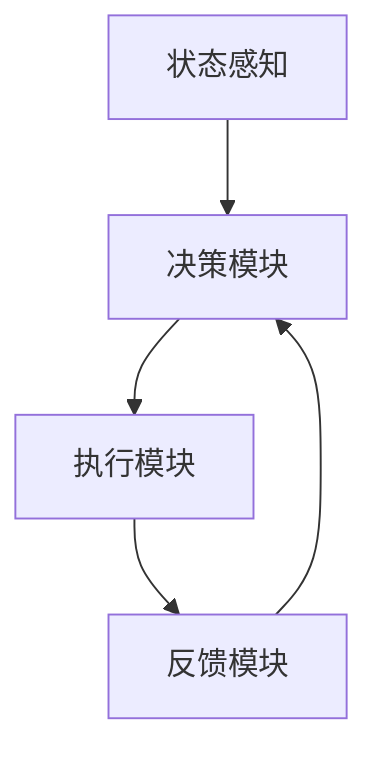
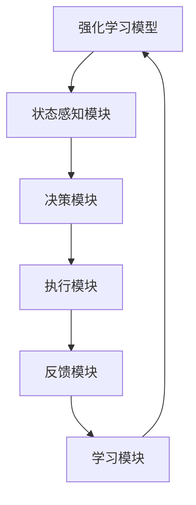

                 


# 企业AI Agent的强化学习在复杂决策场景中的实践

## 关键词：AI Agent, 强化学习, 复杂决策, 企业应用, 算法实现, 系统架构, 项目实战

## 摘要：  
本文深入探讨了企业AI Agent在复杂决策场景中的实践应用，重点分析了强化学习（Reinforcement Learning）在其中的关键作用。文章从强化学习的基本原理出发，结合企业复杂决策场景的特点，详细讲解了Q-Learning、Deep Q-Learning和策略梯度方法等核心算法，并通过实际案例展示了这些算法在供应链优化、金融投资和智能制造等领域的应用。同时，文章还探讨了基于强化学习的企业AI Agent系统的架构设计、接口设计和交互流程，并提供了具体的项目实现方案和代码示例。最后，本文总结了当前强化学习在企业复杂决策中的应用现状，并展望了未来的发展方向。

---

# 第一部分: 企业AI Agent与强化学习基础

## 第1章: 企业AI Agent与强化学习概述

### 1.1 AI Agent的基本概念

#### 1.1.1 AI Agent的定义与特点
AI Agent（人工智能代理）是指能够感知环境并采取行动以实现目标的智能实体。其特点包括：
- **自主性**：能够在没有外部干预的情况下独立运作。
- **反应性**：能够根据环境变化实时调整行为。
- **目标导向性**：所有行为均以实现特定目标为导向。
- **学习能力**：能够通过与环境的交互不断优化自身行为。

#### 1.1.2 企业AI Agent的应用场景
企业AI Agent广泛应用于以下场景：
1. **供应链管理**：优化库存、物流和订单处理流程。
2. **金融投资**：用于股票交易、风险评估和投资组合优化。
3. **智能制造**：用于生产调度、设备维护和质量控制。
4. **客户服务**：用于智能客服、聊天机器人和客户关系管理。

#### 1.1.3 强化学习在AI Agent中的作用
强化学习是一种通过试错机制优化决策的算法，其在AI Agent中的作用体现在：
- **动态环境适应**：强化学习使AI Agent能够快速适应动态变化的环境。
- **复杂决策优化**：通过不断试错，强化学习能够找到最优或近似最优的决策策略。
- **多目标平衡**：强化学习可以帮助AI Agent在多个目标之间找到平衡点。

### 1.2 强化学习的基本原理

#### 1.2.1 强化学习的定义与特点
强化学习是一种机器学习范式，通过智能体与环境的交互，学习如何采取最优动作以最大化累计奖励。其特点包括：
- **试错性**：通过不断尝试不同的动作，学习最优策略。
- **延迟奖励**：奖励通常不是即时的，而是基于长期行为的累积效果。
- **不确定性**：环境的不确定性和动态变化增加了决策的难度。

#### 1.2.2 强化学习的核心要素：状态、动作、奖励
- **状态（State）**：描述环境当前情况的特征集合。
- **动作（Action）**：智能体在给定状态下采取的行为。
- **奖励（Reward）**：环境对智能体行为的反馈，用于指导学习方向。

### 1.2.3 强化学习与监督学习的区别
| **对比维度** | **强化学习（Reinforcement Learning）** | **监督学习（Supervised Learning）** |
|--------------|---------------------------------------|------------------------------------|
| 数据来源     | 环境反馈（奖励信号）                  | 标签数据                            |
| 任务目标     | 最大化累计奖励                         | 分类或回归预测                      |
| 决策方式     | 动态策略优化                          | 静态模式匹配                        |

#### 1.2.4 强化学习在企业复杂决策中的优势
强化学习能够处理高度动态、不确定性和多目标的复杂决策场景，其优势包括：
- **动态适应性**：能够快速调整决策策略以适应环境变化。
- **全局优化**：通过强化学习算法，可以找到全局最优或近似最优的决策方案。
- **多目标平衡**：强化学习可以通过奖励函数设计，在多个目标之间找到平衡点。

---

## 第2章: 强化学习算法原理

### 2.1 Q-Learning算法

#### 2.1.1 Q-Learning的基本原理
Q-Learning是一种基于值函数的强化学习算法，通过更新状态-动作值函数（Q-value）来优化决策策略。其核心公式为：
$$ Q(s,a) = Q(s,a) + \alpha (r + \gamma \max Q(s',a') - Q(s,a)) $$

其中：
- $s$：当前状态
- $a$：当前动作
- $r$：奖励
- $s'$：下一个状态
- $\alpha$：学习率
- $\gamma$：折扣因子

#### 2.1.2 Q-Learning的数学模型
Q-Learning的数学模型可以用以下公式表示：
$$ Q(s,a) = Q(s,a) + \alpha (r + \gamma \max Q(s',a') - Q(s,a)) $$

#### 2.1.3 Q-Learning的应用场景
Q-Learning适用于离散状态空间和动作空间的决策问题，例如：
- **游戏控制**：如贪吃蛇、迷宫导航等。
- **资源分配**：如任务调度、资源分配等。

### 2.2 Deep Q-Learning算法

#### 2.2.1 Deep Q-Learning的基本原理
Deep Q-Learning（DQN）通过深度神经网络近似Q值函数，适用于高维状态空间和动作空间的决策问题。其核心思想是：
- 使用卷积神经网络（CNN）或全连接神经网络近似Q值函数。
- 通过经验回放（Experience Replay）和目标网络（Target Network）优化学习过程。

#### 2.2.2 DQN网络结构与训练过程
DQN的网络结构通常包括以下部分：
- **输入层**：接收环境的状态信息。
- **隐藏层**：用于特征提取和非线性变换。
- **输出层**：输出每个动作的Q值。

训练过程如下：
1. **经验存储**：将每一步的状态、动作、奖励和下一个状态存储在经验回放池中。
2. **经验采样**：随机从经验回放池中采样一批经验，用于训练神经网络。
3. **网络更新**：通过最小化预测Q值与实际Q值之间的误差，更新神经网络参数。

### 2.3 策略梯度方法

#### 2.3.1 策略梯度的基本原理
策略梯度（Policy Gradient）方法直接优化策略函数，而非值函数。其核心公式为：
$$ \theta = \theta + \alpha \nabla_\theta J(\theta) $$

其中：
- $\theta$：策略参数
- $J(\theta)$：策略的期望奖励
- $\alpha$：学习率

#### 2.3.2 策略梯度在复杂决策中的优势
策略梯度方法适用于高维状态空间和动作空间的决策问题，其优势包括：
- **直接优化策略**：策略梯度方法直接优化策略，无需近似值函数。
- **适用于连续动作空间**：策略梯度方法可以处理连续动作空间的决策问题。

---

## 第3章: 强化学习在企业复杂决策中的应用

### 3.1 企业复杂决策场景的分析

#### 3.1.1 复杂决策场景的特点与挑战
企业复杂决策场景的特点包括：
- **高度动态性**：环境和条件不断变化。
- **多目标性**：需要在多个目标之间找到平衡。
- **不确定性**：决策结果具有不确定性。

#### 3.1.2 企业复杂决策中的关键问题
1. **信息不完全性**：决策者无法获取所有相关信息。
2. **决策延迟**：决策需要时间，可能导致环境变化。
3. **多主体交互**：多个主体之间的交互影响决策结果。

### 3.2 基于强化学习的AI Agent设计

#### 3.2.1 AI Agent的设计原则
1. **目标明确**：明确AI Agent的目标和决策范围。
2. **状态表示**：选择合适的特征表示状态空间。
3. **动作空间设计**：设计合理的动作空间，确保动作的可行性。
4. **奖励机制设计**：设计合理的奖励函数，引导AI Agent学习期望行为。

#### 3.2.2 强化学习在AI Agent中的应用框架
1. **环境建模**：根据实际场景建立环境模型。
2. **状态、动作和奖励定义**：明确状态、动作和奖励的定义。
3. **算法选择**：根据场景特点选择合适的强化学习算法。
4. **系统集成**：将AI Agent集成到企业系统中。

### 3.3 实际案例分析

#### 3.3.1 案例一：供应链优化中的强化学习应用
**场景描述**：某企业希望优化其供应链管理，减少库存成本并提高交付效率。
**算法选择**：使用Q-Learning算法优化库存管理策略。
**实现步骤**：
1. **状态定义**：库存量、需求预测、供应商交货时间。
2. **动作定义**：增加订单、减少订单、保持订单。
3. **奖励机制**：库存成本降低、交付效率提高。

#### 3.3.2 案例二：金融投资中的强化学习应用
**场景描述**：某企业希望优化其金融投资组合，提高投资收益并降低风险。
**算法选择**：使用DQN算法优化投资组合。
**实现步骤**：
1. **状态定义**：市场趋势、资产价格、风险指标。
2. **动作定义**：买入、卖出、持有。
3. **奖励机制**：投资收益增加、风险降低。

#### 3.3.3 案例三：智能制造中的强化学习应用
**场景描述**：某企业希望优化其智能制造过程，提高生产效率并降低能耗。
**算法选择**：使用策略梯度方法优化生产调度。
**实现步骤**：
1. **状态定义**：生产状态、设备状态、订单需求。
2. **动作定义**：调整生产速度、分配任务、维护设备。
3. **奖励机制**：生产效率提高、能耗降低。

---

## 第4章: 强化学习算法的系统架构设计

### 4.1 系统功能设计

#### 4.1.1 系统功能模块划分
1. **状态感知模块**：感知环境状态。
2. **决策模块**：基于强化学习算法进行决策。
3. **执行模块**：执行决策动作并返回反馈。
4. **学习模块**：更新强化学习模型。

#### 4.1.2 系统功能流程图


### 4.2 系统架构设计

#### 4.2.1 系统架构图


#### 4.2.2 系统接口设计
1. **状态接口**：提供环境状态信息。
2. **动作接口**：接收决策动作并执行。
3. **反馈接口**：返回执行结果和奖励。

#### 4.2.3 系统交互流程图


---

## 第5章: 项目实战

### 5.1 环境安装

#### 5.1.1 安装Python环境
```bash
python --version
pip install numpy matplotlib tensorflow
```

#### 5.1.2 安装强化学习库
```bash
pip install gym keras
```

### 5.2 核心代码实现

#### 5.2.1 Q-Learning实现
```python
import numpy as np

class QLearning:
    def __init__(self, state_space, action_space, alpha=0.1, gamma=0.9):
        self.state_space = state_space
        self.action_space = action_space
        self.alpha = alpha
        self.gamma = gamma
        self.Q = np.zeros((state_space, action_space))
    
    def choose_action(self, state):
        return np.argmax(self.Q[state, :])
    
    def update_Q(self, state, action, reward, next_state):
        self.Q[state, action] += self.alpha * (reward + self.gamma * np.max(self.Q[next_state, :]) - self.Q[state, action])
```

#### 5.2.2 DQN实现
```python
import tensorflow as tf
from tensorflow.keras import layers

class DQN:
    def __init__(self, state_space, action_space, learning_rate=0.001):
        self.state_space = state_space
        self.action_space = action_space
        self.learning_rate = learning_rate
        self.model = self.build_model()
    
    def build_model(self):
        model = tf.keras.Sequential([
            layers.Dense(32, activation='relu', input_shape=(self.state_space,)),
            layers.Dense(32, activation='relu'),
            layers.Dense(self.action_space, activation='linear')
        ])
        model.compile(optimizer=tf.keras.optimizers.Adam(lr=self.learning_rate), loss='mse')
        return model
```

### 5.3 案例分析

#### 5.3.1 供应链优化案例
**代码实现**：
```python
# 初始化Q-Learning模型
state_space = 10
action_space = 4
ql = QLearning(state_space, action_space)
```

**运行结果**：
```
# 训练过程
for episode in range(1000):
    state = np.random.randint(0, state_space)
    action = ql.choose_action(state)
    next_state = np.random.randint(0, state_space)
    reward = calculate_reward(state, action, next_state)
    ql.update_Q(state, action, reward, next_state)
```

---

## 第6章: 总结与展望

### 6.1 本章总结
本文系统地介绍了企业AI Agent在复杂决策场景中的实践应用，重点分析了强化学习算法的基本原理和实际应用。通过多个实际案例，展示了强化学习在供应链优化、金融投资和智能制造等领域的广泛应用。

### 6.2 未来展望
未来，随着强化学习算法的不断优化和计算能力的提升，企业AI Agent将在更多复杂决策场景中发挥重要作用。同时，如何处理多目标优化、动态环境和不确定性问题，仍将是强化学习研究的重要方向。

### 6.3 注意事项
- **数据质量**：强化学习算法的效果依赖于数据质量，需要确保数据的完整性和准确性。
- **算法选择**：根据具体场景特点选择合适的强化学习算法。
- **模型调优**：需要对模型参数进行仔细调优，以获得最佳性能。

### 6.4 拓展阅读
1. **《Reinforcement Learning: Theory and Algorithms》**
2. **《Deep Reinforcement Learning》**
3. **《Practical Reinforcement Learning》**

---

## 作者：AI天才研究院/AI Genius Institute & 禅与计算机程序设计艺术 /Zen And The Art of Computer Programming

