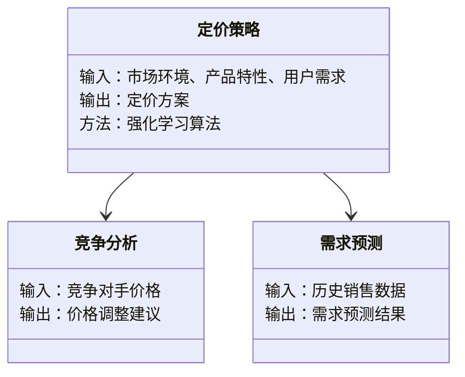

                 


# 企业AI Agent的强化学习在定价策略中的应用

## 关键词：AI Agent, 强化学习, 定价策略, 电商定价, 金融定价, 算法实现

## 摘要：本文系统地探讨了企业AI Agent如何利用强化学习技术优化定价策略。首先，我们介绍了AI Agent和强化学习的基本概念及其在定价策略中的应用背景。接着，详细分析了强化学习的数学模型与算法原理，重点讲解了Q-learning和Deep Q-Networks (DQN) 的实现。然后，我们深入探讨了定价策略的核心要素与数据特征，结合实际案例分析了AI Agent在电商和金融定价中的应用。最后，通过项目实战部分，我们从环境搭建到代码实现，详细讲解了如何将强化学习应用于定价策略，并总结了最佳实践和未来研究方向。

---

# 第一部分: 企业AI Agent的强化学习基础

## 第1章: AI Agent与强化学习概述

### 1.1 AI Agent的基本概念

#### 1.1.1 AI Agent的定义与特点
AI Agent（人工智能代理）是指能够感知环境并采取行动以实现目标的智能实体。AI Agent可以是软件程序、机器人或其他智能系统，其核心目标是通过与环境交互来最大化效用函数的值。以下是AI Agent的主要特点：

- **自主性**：AI Agent能够自主决策，无需外部干预。
- **反应性**：能够实时感知环境并做出反应。
- **目标导向**：通过实现目标来优化效用函数。
- **学习能力**：能够通过经验改进决策策略。

#### 1.1.2 强化学习的基本概念
强化学习（Reinforcement Learning, RL）是一种机器学习范式，其中智能体通过与环境交互来学习策略，以最大化累积奖励。以下是强化学习的核心概念：

- **状态（State）**：智能体所处环境的当前情况。
- **动作（Action）**：智能体在给定状态下采取的行动。
- **奖励（Reward）**：智能体采取动作后获得的反馈，用于指导策略优化。
- **策略（Policy）**：智能体在给定状态下选择动作的概率分布。
- **值函数（Value Function）**：衡量某状态下采取某个动作的价值。

#### 1.1.3 AI Agent在企业中的应用背景
AI Agent在企业中的应用广泛，尤其是在定价策略方面。传统定价方法依赖于人工经验，难以适应快速变化的市场环境。而AI Agent通过强化学习能够动态调整定价策略，实时优化收益。

---

### 1.2 强化学习的核心原理

#### 1.2.1 强化学习的基本框架
强化学习的基本框架包括智能体、环境、状态、动作和奖励五个核心部分。智能体通过与环境交互，感知状态，采取动作，获得奖励，并不断优化策略。

**基本框架的数学表示：**
- 状态空间：S，表示所有可能的状态。
- 动作空间：A，表示所有可能的动作。
- 奖励函数：R(s, a)，表示在状态s下采取动作a后获得的奖励。
- 策略：π(a|s)，表示在状态s下采取动作a的概率。

#### 1.2.2 状态、动作、奖励的定义
在定价策略中，状态、动作和奖励的具体定义如下：

- **状态（State）**：市场环境、产品特性、用户需求等。
- **动作（Action）**：定价策略，例如调整价格、折扣策略等。
- **奖励（Reward）**：收益最大化。

#### 1.2.3 策略与价值函数的区分
策略函数π(s)表示在状态s下采取动作a的概率，而价值函数V(s)表示在状态s下采取最优策略的期望奖励。

---

### 1.3 AI Agent在定价策略中的应用前景

#### 1.3.1 定价策略的核心问题
定价策略的核心问题包括：

- **市场需求预测**：如何准确预测不同价格下的需求量。
- **竞争分析**：如何应对竞争对手的价格变化。
- **成本优化**：如何在保证利润的前提下降低生产成本。

#### 1.3.2 AI Agent在定价中的优势
AI Agent在定价中的优势包括：

- **动态调整能力**：能够实时根据市场变化调整定价策略。
- **个性化定价能力**：可以根据用户特征实现个性化定价。
- **长期收益优化能力**：通过强化学习实现长期收益的最大化。

#### 1.3.3 应用场景与挑战
AI Agent在定价中的应用场景包括电商定价、金融定价等。以下是主要挑战：

- **数据隐私问题**：如何在保护用户隐私的前提下进行数据收集和分析。
- **算法的实时性要求**：如何在实时环境中快速做出决策。
- **多目标优化问题**：如何在收益最大化的同时兼顾用户体验。

---

## 第2章: 强化学习的数学模型与算法原理

### 2.1 强化学习的数学模型

#### 2.1.1 状态空间与动作空间的定义
状态空间和动作空间是强化学习的核心组成部分。以下是具体定义：

- **状态空间（State Space）**：所有可能的状态的集合，表示智能体所处的环境。
- **动作空间（Action Space）**：所有可能的动作的集合，表示智能体在给定状态下可以采取的行动。

#### 2.1.2 奖励函数的数学表达
奖励函数R(s, a)表示在状态s下采取动作a后获得的奖励。奖励函数的设计直接影响智能体的决策策略。

$$
R(s, a) = \begin{cases}
r_1 & \text{如果 } s \text{ 和 } a \text{ 满足条件1} \\
r_2 & \text{如果 } s \text{ 和 } a \text{ 满足条件2} \\
\end{cases}
$$

#### 2.1.3 策略函数的数学表示
策略函数π(a|s)表示在状态s下采取动作a的概率。以下是具体的数学表达：

$$
\pi(a|s) = \text{softmax}(\theta \cdot \phi(s, a))
$$

其中，θ是参数向量，φ(s, a)是特征函数。

---

### 2.2 Q-learning算法的原理

#### 2.2.1 Q-learning的基本流程
Q-learning是一种基于值函数的强化学习算法，其基本流程如下：

1. 初始化Q表，所有状态-动作对的Q值初始化为0。
2. 进入循环：
   - 选择当前状态s下的动作a。
   - 执行动作a，观察下一个状态s’，并获得奖励R(s, a)。
   - 更新Q表：Q(s, a) = Q(s, a) + α(R(s, a) + γ * max_{a'} Q(s', a') - Q(s, a))
   - 转移到状态s’。
3. 重复步骤2，直到满足终止条件。

#### 2.2.2 Q值的更新公式
以下是Q值的更新公式：

$$
Q(s, a) = Q(s, a) + \alpha \left( R(s, a) + \gamma \max_{a'} Q(s', a') - Q(s, a) \right)
$$

其中，α是学习率，γ是折扣因子。

#### 2.2.3 探索与利用的平衡
Q-learning算法中，探索与利用的平衡是通过ε-greedy策略实现的。以下是具体实现：

- **探索**：以概率ε随机选择动作。
- **利用**：以概率1-ε选择Q值最大的动作。

---

### 2.3 Deep Q-Networks (DQN) 的实现

#### 2.3.1 DQN的网络结构
DQN网络结构包括两个部分：策略网络和价值网络。以下是具体的网络结构：

- **输入层**：接收状态s的特征向量。
- **隐藏层**：包含多个神经元，用于提取特征。
- **输出层**：输出所有可能动作的Q值。

#### 2.3.2 经验回放机制
经验回放机制是DQN的核心创新，通过存储经验并随机采样来减少数据相关性。以下是具体实现：

1. 经验元组存储：将每一步的状态、动作、奖励和下一个状态存储在经验回放池中。
2. 随机采样：从经验回放池中随机抽取一批经验元组，用于网络更新。

#### 2.3.3 网络更新策略
DQN采用双网络结构，通过分别更新策略网络和价值网络来实现稳定训练。以下是具体的更新策略：

- **策略网络更新**：使用当前策略网络进行动作选择。
- **价值网络更新**：使用目标策略网络进行价值评估。

---

## 第3章: 定价策略的核心要素与数据特征

### 3.1 定价策略的核心要素

#### 3.1.1 产品特性与市场定位
产品特性包括产品的功能、质量、品牌等，市场定位包括目标市场、竞争对手分析等。以下是具体分析：

- **产品特性**：影响定价策略的核心因素。
- **市场定位**：确定目标客户群体和市场位置。

#### 3.1.2 用户需求与价格弹性
用户需求与价格弹性是定价策略的重要影响因素。以下是具体分析：

- **用户需求**：不同用户群体的需求不同，价格弹性也不同。
- **价格弹性**：价格变化对需求量的影响程度。

#### 3.1.3 竞争环境与成本结构
竞争环境与成本结构是定价策略的外部和内部影响因素。以下是具体分析：

- **竞争环境**：竞争对手的价格策略、市场占有率等。
- **成本结构**：生产成本、运营成本等。

---

### 3.2 数据特征与强化学习的关系

#### 3.2.1 状态空间的数据特征
状态空间的数据特征直接影响强化学习算法的性能。以下是具体分析：

- **连续性**：状态空间是否连续或离散。
- **维度性**：状态空间的维度对算法复杂度的影响。

#### 3.2.2 动作空间的特征分析
动作空间的特征分析包括动作的类型和数量。以下是具体分析：

- **动作类型**：离散动作或连续动作。
- **动作数量**：动作空间的大小对算法性能的影响。

#### 3.2.3 奖励函数的设计依据
奖励函数的设计依据包括目标函数和约束条件。以下是具体分析：

- **目标函数**：收益最大化。
- **约束条件**：市场竞争、用户满意度等。

---

### 3.3 强化学习在定价中的独特优势

#### 3.3.1 动态调整能力
强化学习能够实时根据市场变化调整定价策略，实现动态优化。

#### 3.3.2 个性化定价能力
强化学习可以根据用户特征实现个性化定价，提升用户体验和收益。

#### 3.3.3 长期收益优化能力
强化学习通过长期的策略优化，实现收益的最大化。

---

## 第4章: AI Agent在定价策略中的应用案例分析

### 4.1 案例分析: 电商定价

#### 4.1.1 电商定价的核心问题
电商定价的核心问题包括市场需求预测、竞争分析和成本优化。以下是具体分析：

- **市场需求预测**：如何预测不同价格下的需求量。
- **竞争分析**：如何应对竞争对手的价格变化。
- **成本优化**：如何在保证利润的前提下降低生产成本。

#### 4.1.2 AI Agent的应用场景
AI Agent在电商定价中的应用场景包括实时价格监控、个性化定价和促销策略优化。以下是具体分析：

- **实时价格监控**：实时跟踪竞争对手的价格变化，调整自身定价策略。
- **个性化定价**：根据用户特征实现个性化定价，提升用户体验和收益。
- **促销策略优化**：通过强化学习优化促销策略，提升销售量和收益。

#### 4.1.3 实际案例的分析与总结
以下是某电商平台应用AI Agent进行定价的案例分析：

1. **需求预测**：通过强化学习算法预测不同价格下的需求量。
2. **价格调整**：根据需求预测和市场竞争情况，实时调整价格。
3. **收益优化**：通过强化学习优化定价策略，实现收益最大化。

---

### 4.2 案例分析: 金融定价

#### 4.2.1 金融定价的特殊性
金融定价的特殊性包括高风险、高波动性和复杂性。以下是具体分析：

- **高风险**：金融市场的波动性和不确定性较高。
- **高波动性**：金融资产的价格波动频繁且剧烈。
- **复杂性**：金融市场受到多种因素的影响，如宏观经济、政策变化等。

#### 4.2.2 AI Agent的应用优势
AI Agent在金融定价中的应用优势包括实时性、动态性和智能化。以下是具体分析：

- **实时性**：能够实时根据市场变化调整定价策略。
- **动态性**：能够根据市场波动动态优化定价策略。
- **智能化**：通过强化学习实现智能化定价。

#### 4.2.3 实际案例的分析与总结
以下是某金融机构应用AI Agent进行定价的案例分析：

1. **市场分析**：通过强化学习算法分析市场环境，预测价格变化趋势。
2. **价格调整**：根据市场分析结果，实时调整定价策略。
3. **收益优化**：通过强化学习优化定价策略，实现收益最大化。

---

## 第5章: 系统架构设计与实现

### 5.1 系统功能设计

#### 5.1.1 领域模型
以下是定价策略领域的模型：



#### 5.1.2 系统架构
以下是系统架构图：

```mermaid
rectangle 系统边界 {
    定价策略模块
    竞争分析模块
    需求预测模块
    数据库
}
定价策略模块 --> 竞争分析模块
定价策略模块 --> 需求预测模块
定价策略模块 --> 数据库
```

---

## 第6章: 项目实战与代码实现

### 6.1 环境安装与配置

#### 6.1.1 Python环境配置
以下是Python环境配置步骤：

1. 安装Python：从官网下载并安装Python 3.8或更高版本。
2. 安装依赖库：使用pip安装所需的依赖库，如numpy、pandas、keras、tensorflow等。

#### 6.1.2 强化学习框架选择
以下是强化学习框架选择建议：

- **TensorFlow**：适合初学者，功能强大，支持分布式训练。
- **Keras**：适合快速实现简单的强化学习模型。
- **PyTorch**：适合高级用户，支持动态计算，适合研究和实验。

---

### 6.2 系统核心实现源代码

#### 6.2.1 强化学习算法实现
以下是DQN算法的Python实现代码：

```python
import numpy as np
import gym
from tensorflow.keras import layers

# 定义环境
env = gym.make('CartPole-v0')
state_space = env.observation_space.shape[0]
action_space = env.action_space.n

# 定义DQN网络
def build_dqn_model():
    model = keras.Sequential()
    model.add(layers.Dense(24, activation='relu', input_shape=(state_space,)))
    model.add(layers.Dense(24, activation='relu'))
    model.add(layers.Dense(action_space, activation='linear'))
    return model

# 初始化网络
model = build_dqn_model()
target_model = build_dqn_model()

# 定义超参数
GAMMA = 0.99
LEARNING_RATE = 0.001
BATCH_SIZE = 64
MEMORY_SIZE = 1000

# 定义经验回放池
memory = []

# 定义训练函数
def train_step(batch_size):
    # 从经验回放池中随机采样
    mini_batch = np.random.choice(len(memory), batch_size)
    # 获取样本
    states = np.array([memory[i][0] for i in mini_batch])
    actions = np.array([memory[i][1] for i in mini_batch])
    rewards = np.array([memory[i][2] for i in mini_batch])
    next_states = np.array([memory[i][3] for i in mini_batch])
    # 训练策略网络
    target = rewards + GAMMA * np.max(target_model.predict(next_states), axis=1)
    target = target.reshape(-1, 1)
    # 更新策略网络
    model.fit(states, target, epochs=1, verbose=0)
    # 同步目标网络
    target_model.set_weights(model.get_weights())

# 开始训练
for episode in range(1000):
    state = env.reset()
    total_reward = 0
    while True:
        # 选择动作
        if np.random.random() < 0.1:
            action = env.action_space.sample()
        else:
            action = np.argmax(model.predict(np.array(state).reshape(1, -1)))
        # 执行动作
        next_state, reward, done, _ = env.step(action)
        # 存储经验
        memory.append((state, action, reward, next_state))
        # 训练网络
        if len(memory) >= BATCH_SIZE:
            train_step(BATCH_SIZE)
        # 更新状态
        state = next_state
        total_reward += reward
        if done:
            break
    print(f"Episode {episode}, Total Reward: {total_reward}")
```

#### 6.2.2 定价策略实现
以下是定价策略的Python实现代码：

```python
import numpy as np
import gym
from tensorflow.keras import layers

# 定义环境
env = gym.make('CartPole-v0')
state_space = env.observation_space.shape[0]
action_space = env.action_space.n

# 定义DQN网络
def build_dqn_model():
    model = keras.Sequential()
    model.add(layers.Dense(24, activation='relu', input_shape=(state_space,)))
    model.add(layers.Dense(24, activation='relu'))
    model.add(layers.Dense(action_space, activation='linear'))
    return model

# 初始化网络
model = build_dqn_model()
target_model = build_dqn_model()

# 定义超参数
GAMMA = 0.99
LEARNING_RATE = 0.001
BATCH_SIZE = 64
MEMORY_SIZE = 1000

# 定义经验回放池
memory = []

# 定义训练函数
def train_step(batch_size):
    # 从经验回放池中随机采样
    mini_batch = np.random.choice(len(memory), batch_size)
    # 获取样本
    states = np.array([memory[i][0] for i in mini_batch])
    actions = np.array([memory[i][1] for i in mini_batch])
    rewards = np.array([memory[i][2] for i in mini_batch])
    next_states = np.array([memory[i][3] for i in mini_batch])
    # 训练策略网络
    target = rewards + GAMMA * np.max(target_model.predict(next_states), axis=1)
    target = target.reshape(-1, 1)
    # 更新策略网络
    model.fit(states, target, epochs=1, verbose=0)
    # 同步目标网络
    target_model.set_weights(model.get_weights())

# 开始训练
for episode in range(1000):
    state = env.reset()
    total_reward = 0
    while True:
        # 选择动作
        if np.random.random() < 0.1:
            action = env.action_space.sample()
        else:
            action = np.argmax(model.predict(np.array(state).reshape(1, -1)))
        # 执行动作
        next_state, reward, done, _ = env.step(action)
        # 存储经验
        memory.append((state, action, reward, next_state))
        # 训练网络
        if len(memory) >= BATCH_SIZE:
            train_step(BATCH_SIZE)
        # 更新状态
        state = next_state
        total_reward += reward
        if done:
            break
    print(f"Episode {episode}, Total Reward: {total_reward}")
```

---

## 第7章: 总结与展望

### 7.1 本章总结
本文系统地探讨了企业AI Agent如何利用强化学习技术优化定价策略。通过分析强化学习的数学模型和算法原理，结合实际案例，详细讲解了AI Agent在电商定价和金融定价中的应用。同时，通过项目实战部分，我们从环境搭建到代码实现，详细讲解了如何将强化学习应用于定价策略。

### 7.2 未来研究方向
未来的研究方向包括：

- **多智能体强化学习**：研究多智能体协同优化的定价策略。
- **深度强化学习**：探索更复杂的深度强化学习模型在定价中的应用。
- **实时定价优化**：研究如何在实时环境下实现高效的定价优化。

### 7.3 最佳实践 tips
以下是最佳实践 tips：

- **数据质量**：确保数据的准确性和完整性。
- **模型选择**：根据具体场景选择合适的强化学习算法。
- **实时性要求**：在实时环境下，需要优化算法的运行效率。

---

## 作者：AI天才研究院/AI Genius Institute & 禅与计算机程序设计艺术 /Zen And The Art of Computer Programming

