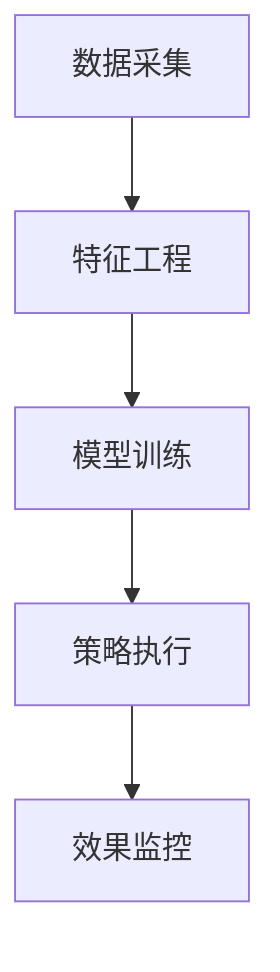
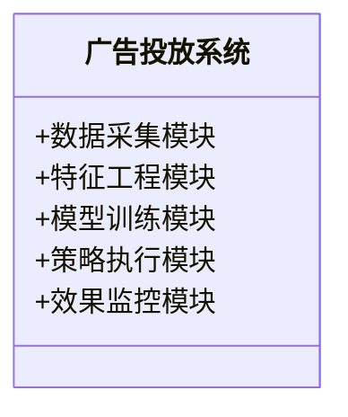
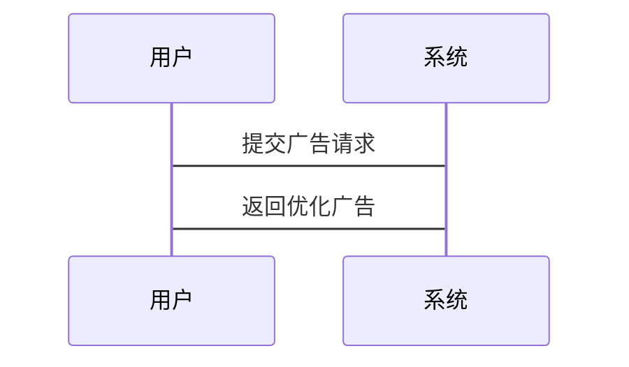
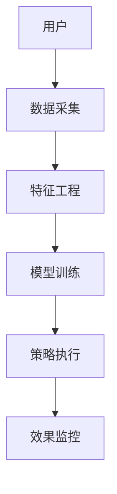

                 


# 企业AI Agent的强化学习在广告投放优化中的实践

## 关键词：企业AI Agent，强化学习，广告投放优化，深度强化学习，广告策略优化

## 摘要：  
本文深入探讨了企业AI Agent在广告投放优化中的应用，重点分析了强化学习技术的核心原理及其在广告优化中的实际应用场景。通过详细讲解Q-learning、Deep Q-Network等强化学习算法，结合广告投放优化系统的架构设计与实战案例，展示了如何利用AI Agent技术提升广告投放效率与效果。文章最后总结了当前广告投放优化的挑战与未来发展方向，为企业的广告优化策略提供了有价值的参考。

---

## 第一章：AI Agent与强化学习概述

### 1.1 AI Agent的基本概念

#### 1.1.1 AI Agent的定义与特点
AI Agent（人工智能代理）是指能够感知环境、自主决策并执行任务的智能实体。与传统程序不同，AI Agent具有以下特点：
- **自主性**：能够自主决策，无需人工干预。
- **反应性**：能够实时感知环境并做出响应。
- **目标导向性**：基于目标驱动行为。
- **学习能力**：能够通过经验改进自身性能。

#### 1.1.2 AI Agent的核心要素与分类
AI Agent的核心要素包括：
- **感知**：通过传感器或数据源获取环境信息。
- **决策**：基于感知信息做出决策。
- **执行**：通过执行器将决策转化为行动。
- **学习**：通过经验优化自身行为。

AI Agent的分类主要基于其智能水平：
- **反应式Agent**：基于当前感知做出反应，不依赖历史信息。
- **认知式Agent**：具有复杂推理能力，能够处理抽象概念。
- **学习式Agent**：能够通过经验改进性能。

#### 1.1.3 AI Agent在企业中的应用场景
AI Agent在企业中的应用场景广泛，包括：
- **广告投放优化**：通过AI Agent实时优化广告投放策略。
- **客户行为预测**：利用AI Agent分析客户行为，预测需求。
- **供应链管理**：优化供应链流程，提高效率。

### 1.2 强化学习的基本原理

#### 1.2.1 强化学习的定义与特点
强化学习（Reinforcement Learning, RL）是一种机器学习范式，通过智能体与环境的交互来学习最优策略。其特点包括：
- **目标导向性**：通过最大化累积奖励来优化策略。
- **自主决策**：智能体在环境中自主决策。
- **经验学习**：通过试错学习优化策略。

#### 1.2.2 强化学习的核心概念：状态、动作、奖励
- **状态（State）**：环境的当前情况，表示智能体感知的信息。
- **动作（Action）**：智能体在给定状态下采取的行为。
- **奖励（Reward）**：智能体采取动作后获得的反馈，用于指导学习。

#### 1.2.3 强化学习与监督学习的区别
- **监督学习**：基于标记数据进行学习，输入已知输出。
- **强化学习**：基于与环境的交互进行学习，输入无标记数据，输出通过奖励反馈优化。

### 1.3 强化学习在广告投放中的应用前景

#### 1.3.1 广告投放优化的核心问题
广告投放优化的核心问题是如何在有限的预算内，最大化广告的点击率、转化率和收益。传统方法依赖人工经验，而强化学习能够通过自动化决策提高优化效果。

#### 1.3.2 强化学习在广告投放中的优势
- **自动化决策**：通过强化学习算法自动优化广告投放策略。
- **实时响应**：能够实时根据用户行为调整广告投放。
- **长期优化**：通过累积奖励优化长期收益。

#### 1.3.3 当前广告投放优化的挑战与机遇
- **挑战**：广告投放环境复杂多变，用户行为难以预测。
- **机遇**：强化学习能够通过数据驱动优化广告策略，提高广告投放效率。

### 1.4 本章小结
本章介绍了AI Agent和强化学习的基本概念及其在广告投放中的应用前景。AI Agent通过强化学习技术能够实现广告投放的自动化优化，为广告投放带来了新的可能性。

---

## 第二章：强化学习算法原理与数学模型

### 2.1 Q-learning算法

#### 2.1.1 Q-learning的基本原理
Q-learning是一种经典的强化学习算法，通过学习状态-动作值函数（Q值）来优化决策策略。其核心思想是通过不断更新Q值来逼近最优策略。

#### 2.1.2 Q-learning的更新公式
Q-learning的更新公式为：
$$Q(s,a) = Q(s,a) + \alpha [r + \max_{a'} Q(s',a') - Q(s,a)]$$
其中：
- \( Q(s,a) \)：当前状态\( s \)下采取动作\( a \)的Q值。
- \( \alpha \)：学习率，控制更新步长。
- \( r \)：获得的奖励。
- \( \max_{a'} Q(s',a') \)：下一个状态下的最大Q值。

#### 2.1.3 Q-learning的优缺点
- **优点**：实现简单，适用于离线学习。
- **缺点**：需要探索未知状态，可能需要较长的学习时间。

### 2.2 Deep Q-Network (DQN)算法

#### 2.2.1 DQN的基本原理
DQN通过深度神经网络近似Q值函数，能够处理高维状态空间和动作空间。其核心思想是将Q值函数表示为状态的非线性函数。

#### 2.2.2 DQN的网络结构与训练流程
DQN的网络结构包括：
- **输入层**：接收状态输入。
- **隐藏层**：进行特征提取。
- **输出层**：输出所有可能动作的Q值。

DQN的训练流程包括：
1. 从经验回放缓存中随机采样一批经验。
2. 使用目标网络计算目标Q值。
3. 使用主网络近似当前Q值。
4. 计算损失函数并反向传播。

#### 2.2.3 DQN在广告投放中的应用
DQN可以应用于广告投放的实时决策，通过不断更新Q值函数优化广告投放策略。

### 2.3 其他强化学习算法简介

#### 2.3.1 策略梯度法（Policy Gradient）
策略梯度法直接优化策略参数，通过梯度上升最大化期望奖励。

#### 2.3.2 Actor-Critic算法
Actor-Critic算法结合了策略梯度法和Q-learning，通过两个网络分别优化策略和价值函数。

#### 2.3.3 多智能体强化学习
多智能体强化学习适用于多个智能体协作的场景，能够优化复杂的广告投放策略。

### 2.4 强化学习算法的数学模型

#### 2.4.1 Q-learning的数学推导
通过数学推导可以证明，Q-learning算法能够收敛到最优Q值。

#### 2.4.2 DQN的网络结构与损失函数
DQN的损失函数为：
$$\mathcal{L} = \mathbb{E}[ (r + \gamma \max_a Q(s',a) - Q(s,a))^2 ]$$
其中：
- \( \gamma \)：折扣因子，控制未来奖励的重要性。

#### 2.4.3 强化学习中的探索与利用策略
探索与利用策略通过平衡探索新状态和利用已知最优策略来优化学习效果。

### 2.5 本章小结
本章详细介绍了Q-learning和DQN算法的原理及其数学模型，探讨了强化学习在广告投放中的应用。

---

## 第三章：广告投放优化的系统架构与设计

### 3.1 广告投放优化系统架构

#### 3.1.1 系统模块划分
广告投放优化系统主要包括：
- 数据采集模块：采集用户行为数据。
- 特征工程模块：提取特征并构建特征向量。
- 模型训练模块：训练强化学习模型。
- 策略执行模块：根据模型输出决策。
- 效果监控模块：监控广告投放效果。

#### 3.1.2 系统架构的Mermaid图


### 3.2 广告投放优化的系统功能设计

#### 3.2.1 领域模型的Mermaid类图


#### 3.2.2 系统功能模块的详细描述
- **数据采集模块**：实时采集用户行为数据，包括点击、转化等。
- **特征工程模块**：提取用户特征、广告特征和时间特征。
- **模型训练模块**：训练强化学习模型，优化广告投放策略。
- **策略执行模块**：根据模型输出决策，实时调整广告投放。
- **效果监控模块**：监控广告投放效果，评估优化效果。

### 3.3 系统接口设计

#### 3.3.1 系统接口的定义与交互流程
- **输入接口**：接收用户行为数据和广告投放请求。
- **输出接口**：输出广告投放决策和优化结果。

#### 3.3.2 接口设计的Mermaid序列图


### 3.4 系统架构设计的Mermaid架构图


### 3.5 本章小结
本章详细描述了广告投放优化系统的架构设计，包括系统模块划分、功能设计和接口设计。

---

## 第四章：项目实战与代码实现

### 4.1 项目环境的安装与配置

#### 4.1.1 Python环境的搭建
安装Python和必要的库：
```bash
pip install numpy pandas tensorflow matplotlib
```

#### 4.1.2 必要库的安装
安装强化学习相关的库：
```bash
pip install gym tensorflow keras
```

### 4.2 广告投放优化的项目实战

#### 4.2.1 广告数据的准备与特征工程
- **数据采集**：从日志文件中提取用户行为数据。
- **特征提取**：提取用户特征、广告特征和时间特征。

#### 4.2.2 强化学习模型的训练与优化
- **模型训练**：训练DQN模型，优化广告投放策略。
- **策略执行**：根据模型输出决策，实时调整广告投放。

#### 4.2.3 实际案例分析与优化效果展示
- **案例分析**：分析某次广告投放的优化效果。
- **优化效果**：展示优化前后的广告点击率和转化率变化。

### 4.3 系统核心实现源代码

#### 4.3.1 数据采集模块的代码
```python
import pandas as pd

def collect_data():
    # 模拟数据采集
    data = pd.DataFrame({
        'user_id': [1, 2, 3],
        'ad_id': [1, 2, 3],
        'click': [1, 0, 1]
    })
    return data
```

#### 4.3.2 特征工程模块的代码
```python
from sklearn.preprocessing import StandardScaler

def process_features(data):
    # 提取特征
    features = data[['user_id', 'ad_id']]
    scaler = StandardScaler()
    features_scaled = scaler.fit_transform(features)
    return features_scaled
```

#### 4.3.3 强化学习模型的训练代码
```python
import tensorflow as tf
from tensorflow.keras import layers

def build_dqn_model(input_dim):
    model = tf.keras.Sequential()
    model.add(layers.Dense(64, activation='relu', input_dim=input_dim))
    model.add(layers.Dense(32, activation='relu'))
    model.add(layers.Dense(1, activation='linear'))
    model.compile(optimizer='adam', loss='mse')
    return model
```

#### 4.3.4 策略执行模块的代码
```python
def execute_strategy(model, features):
    # 预测Q值
    q_values = model.predict(features)
    # 选择最优动作
    action = tf.argmax(q_values, axis=1).numpy()[0]
    return action
```

### 4.4 本章小结
本章通过实际案例展示了广告投放优化系统的实现过程，包括数据采集、特征工程、模型训练和策略执行。

---

## 第五章：总结与展望

### 5.1 总结
本文深入探讨了企业AI Agent在广告投放优化中的应用，详细介绍了强化学习算法的核心原理和系统架构设计。通过实际案例展示了强化学习在广告投放优化中的巨大潜力。

### 5.2 当前广告投放优化的挑战与未来发展方向
- **挑战**：广告投放环境复杂多变，用户行为难以预测。
- **未来发展方向**：结合多智能体强化学习，优化复杂的广告投放策略。

### 5.3 本文的实践意义与贡献
本文为企业的广告优化策略提供了有价值的参考，展示了如何利用AI Agent技术提升广告投放效率与效果。

### 5.4 本文的局限性与改进方向
本文的局限性在于目前的强化学习算法仍需进一步优化，未来可以结合更多的实际场景进行研究。

### 5.5 本文的最佳实践Tips
- **数据质量**：确保数据的准确性和完整性。
- **模型调优**：通过不断调优模型参数提高优化效果。
- **实时监控**：实时监控广告投放效果，及时调整优化策略。

### 5.6 本文的注意事项
- **数据隐私**：注意保护用户数据隐私。
- **算法选择**：根据实际场景选择合适的强化学习算法。

### 5.7 本文的拓展阅读
建议读者进一步阅读强化学习的经典论文和相关书籍，深入理解强化学习的核心思想和技术。

### 5.8 本文的结束语
本文通过理论分析和实践案例，展示了强化学习在广告投放优化中的巨大潜力。未来，随着技术的进步，AI Agent将在广告投放优化中发挥越来越重要的作用。

---

## 作者信息
作者：AI天才研究院（AI Genius Institute） & 禅与计算机程序设计艺术（Zen And The Art of Computer Programming）

---

**感谢您的阅读！希望本文能够为您提供有价值的技术参考！**

