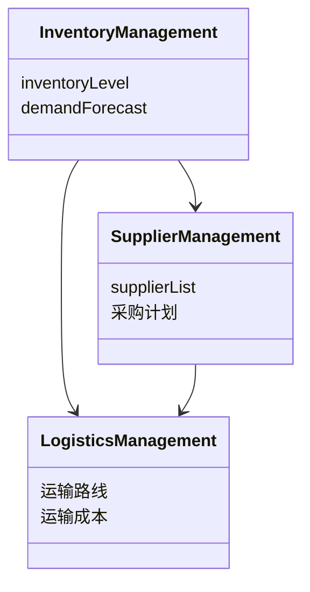
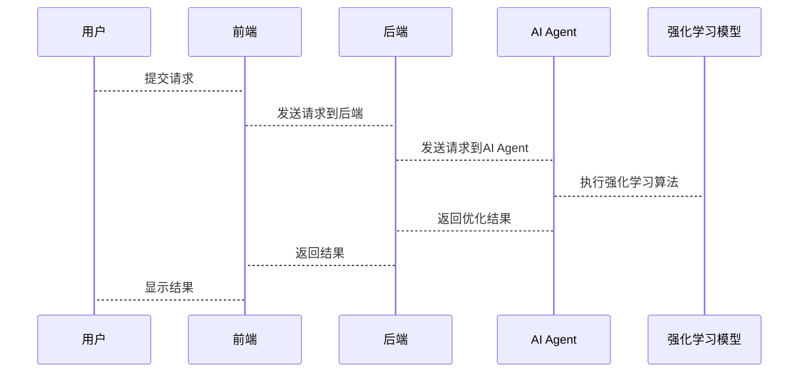

                 


# 企业AI Agent的强化学习在智能供应链优化中的应用

> 关键词：强化学习, AI Agent, 供应链优化, 智能供应链, 企业应用

> 摘要：本文深入探讨了AI Agent在企业供应链优化中的应用，重点分析了强化学习在供应链智能决策中的作用。通过详细讲解强化学习的核心原理、算法模型、系统架构以及实际应用案例，本文为读者提供了从理论到实践的全面解读，展示了AI Agent如何通过强化学习技术提升企业供应链的效率和竞争力。

---

# 第一部分: 企业AI Agent的强化学习基础

## 第1章: 强化学习与AI Agent概述

### 1.1 强化学习的基本概念

#### 1.1.1 强化学习的定义
强化学习（Reinforcement Learning，简称RL）是一种机器学习范式，其中智能体通过与环境交互来学习策略，以最大化累积奖励。与监督学习和无监督学习不同，强化学习强调通过试错和经验积累来优化决策。

#### 1.1.2 AI Agent的定义与特点
AI Agent（人工智能代理）是能够感知环境并采取行动以实现目标的智能实体。AI Agent具有以下特点：
- **自主性**：能够在没有外部干预的情况下自主决策。
- **反应性**：能够实时感知环境并做出反应。
- **目标导向**：所有行动都以实现特定目标为导向。
- **学习能力**：能够通过经验改进决策策略。

#### 1.1.3 强化学习在AI Agent中的作用
强化学习为AI Agent提供了决策优化的框架，通过不断试错和经验积累，帮助AI Agent在复杂环境中做出最优决策。

---

### 1.2 强化学习的核心原理

#### 1.2.1 状态、动作、奖励的定义
- **状态（State）**：环境在某一时刻的特征描述，表示AI Agent所处的环境情况。
- **动作（Action）**：AI Agent在某一状态下采取的行动，旨在改变环境状态。
- **奖励（Reward）**：环境对AI Agent采取动作的反馈，表示该动作的好坏程度。

#### 1.2.2 AI Agent在供应链优化中的优势
- **实时决策**：AI Agent能够实时感知供应链中的库存、需求和物流等信息，并迅速做出决策。
- **动态适应**：通过强化学习，AI Agent能够动态适应供应链中的不确定性，优化库存管理和物流调度。
- **全局优化**：AI Agent能够从全局视角优化供应链的各个环节，提升整体效率。

#### 1.2.3 强化学习在供应链优化中的应用前景
随着企业对供应链效率要求的提高，强化学习和AI Agent技术的应用将越来越广泛，尤其是在复杂供应链网络中的优化决策。

---

### 1.3 本章小结
本章介绍了强化学习和AI Agent的基本概念，分析了强化学习在供应链优化中的核心作用，并展望了其在企业应用中的潜力。

---

# 第二部分: 强化学习算法与数学模型

## 第2章: 强化学习的数学模型

### 2.1 状态空间与动作空间的数学表示

#### 2.1.1 状态空间的定义与表示
状态空间可以表示为一个集合 \( S = \{s_1, s_2, ..., s_n\} \)，其中每个状态 \( s_i \) 表示环境的一个可能情况。

#### 2.1.2 动作空间的定义与表示
动作空间可以表示为一个集合 \( A = \{a_1, a_2, ..., a_m\} \)，其中每个动作 \( a_j \) 表示AI Agent在某一状态下可能采取的行动。

#### 2.1.3 状态转移概率矩阵的数学表达
状态转移概率矩阵 \( P \) 是一个 \( |S| \times |S| \) 的矩阵，其中 \( P_{i,j} \) 表示从状态 \( s_i \) 采取某个动作后转移到状态 \( s_j \) 的概率。

---

### 2.2 Q-learning算法的数学推导

#### 2.2.1 Q值的更新公式
Q-learning算法的核心是通过不断更新Q值 \( Q(s, a) \) 来优化决策策略。Q值的更新公式为：
$$ Q(s, a) \leftarrow Q(s, a) + \alpha [r + \gamma \max Q(s', a') - Q(s, a)] $$
其中：
- \( \alpha \) 是学习率，控制更新的速度。
- \( \gamma \) 是折扣因子，表示未来奖励的折扣程度。
- \( r \) 是当前步的奖励。
- \( s' \) 是下一步的状态。

#### 2.2.2 离策学习与在策学习的数学区别
- **离策学习（Off-policy Learning）**：学习策略与当前策略无关，例如Q-learning。
- **在策学习（On-policy Learning）**：学习策略与当前策略相关，例如SARSA算法。

#### 2.2.3 奖励函数的数学表达
奖励函数 \( R(s, a, s') \) 表示在状态 \( s \) 下采取动作 \( a \) 后转移到状态 \( s' \) 所获得的奖励。

---

### 2.3 Deep Q-learning的数学模型

#### 2.3.1 神经网络的输入输出表示
Deep Q-learning使用深度神经网络近似Q函数。网络输入是状态 \( s \)，输出是各个动作的Q值。

#### 2.3.2 网络权重更新的数学公式
深度Q网络的权重更新公式为：
$$ \theta \leftarrow \theta + \eta (r + \gamma \max Q(s', a') - Q(s, a)) \nabla Q(s, a) $$
其中：
- \( \theta \) 是网络权重。
- \( \eta \) 是学习率。
- \( \nabla Q(s, a) \) 是Q值的梯度。

#### 2.3.3 深度Q网络的结构与优化目标
深度Q网络的优化目标是最小化预测Q值与实际Q值之间的误差。

---

### 2.4 本章小结
本章详细讲解了强化学习的数学模型，包括状态空间、动作空间、Q值更新公式以及深度Q网络的实现。

---

# 第三部分: 供应链优化的强化学习建模

## 第3章: 供应链优化问题建模

### 3.1 供应链优化的核心问题

#### 3.1.1 需求预测与库存管理
供应链优化需要准确的需求预测，以优化库存管理，减少过剩库存和缺货情况。

#### 3.1.2 供应商选择与采购策略
通过强化学习优化供应商选择和采购策略，降低采购成本，提高供应链效率。

#### 3.1.3 运输与物流优化
优化物流路径和运输计划，降低物流成本，提高供应链的响应速度。

---

### 3.2 强化学习在供应链优化中的建模方法

#### 3.2.1 状态空间的构建
状态空间可以包括当前库存水平、供应商交货时间、物流成本等。

#### 3.2.2 动作空间的设计
动作空间可以包括调整采购数量、选择不同的供应商、优化物流路径等。

#### 3.2.3 奖励函数的定义
奖励函数可以根据供应链的整体效率进行设计，例如：
- 奖励：库存成本降低、物流成本降低、订单交货时间缩短。
- 惩罚：库存过剩、缺货、物流延误。

---

### 3.3 供应链优化的强化学习模型设计

#### 3.3.1 模型的输入输出设计
- 输入：当前状态（库存、需求、物流信息）。
- 输出：最优动作（采购数量、供应商选择、物流路径）。

#### 3.3.2 状态转移函数的实现
状态转移函数根据当前状态和动作，计算下一步状态。

#### 3.3.3 动作选择策略的设计
动作选择策略可以根据Q值或概率分布选择最优动作。

---

### 3.4 本章小结
本章详细讲解了供应链优化问题的建模方法，包括状态空间、动作空间和奖励函数的设计。

---

# 第四部分: 系统架构与实现

## 第4章: 供应链优化系统的架构设计

### 4.1 供应链优化问题的场景描述

#### 4.1.1 问题背景
企业在供应链管理中面临库存积压、物流成本高等问题，需要通过技术手段优化供应链效率。

#### 4.1.2 项目介绍
本项目旨在通过强化学习技术，构建一个智能供应链优化系统，帮助企业在复杂环境中做出最优决策。

---

### 4.2 系统功能设计

#### 4.2.1 领域模型设计
- **领域模型**：库存管理、供应商管理、物流管理。
- **关系图**：通过Mermaid类图展示领域模型的关系。



#### 4.2.2 系统架构设计
- **分层架构**：数据层、业务逻辑层、用户界面层。
- **架构图**：通过Mermaid架构图展示系统架构。


---

### 4.3 系统接口设计

#### 4.3.1 接口设计
- **库存接口**：获取库存数据，更新库存状态。
- **供应商接口**：获取供应商信息，更新供应商关系。
- **物流接口**：获取物流信息，优化物流路径。

#### 4.3.2 交互流程图
通过Mermaid序列图展示系统的交互流程。



---

### 4.4 本章小结
本章详细讲解了供应链优化系统的架构设计，包括领域模型、系统架构和接口设计。

---

# 第五部分: 项目实战

## 第5章: 供应链优化系统的实现

### 5.1 环境安装与配置

#### 5.1.1 环境安装
- **Python**：安装Python 3.8及以上版本。
- **TensorFlow**：安装TensorFlow和Keras。
- **强化学习库**：安装OpenAI Gym或其他强化学习库。

#### 5.1.2 代码安装
- **依赖管理**：使用pip安装所需的依赖库。

### 5.2 系统核心实现

#### 5.2.1 强化学习模型的实现

```python
import numpy as np
import gym

class DeepQNetwork:
    def __init__(self, input_dim, output_dim):
        self.weights = np.random.randn(input_dim, output_dim) * 0.01

    def forward(self, x):
        return np.dot(x, self.weights)

    def backward(self, x, y_true, y_pred):
        return x.T.dot(y_pred - y_true)

# 初始化环境
env = gym.make('CustomSupplyChainEnv')
observation_space = env.observation_space.shape[0]
action_space = env.action_space.shape[0]

# 初始化神经网络
dqn = DeepQNetwork(observation_space, action_space)

# 训练过程
for episode in range(num_episodes):
    state = env.reset()
    while True:
        # 选择动作
        action = np.argmax(dqn.forward(state))
        # 执行动作
        next_state, reward, done, _ = env.step(action)
        # 更新Q值
        target = reward + gamma * np.max(dqn.forward(next_state))
        loss = dqn.backward(state, target, dqn.forward(state))
        # 终止条件
        if done:
            break
```

#### 5.2.2 系统功能实现
- **库存管理**：实时更新库存状态，优化库存水平。
- **供应商选择**：根据历史数据和当前状态选择最优供应商。
- **物流优化**：计算最优物流路径，降低运输成本。

#### 5.2.3 代码解读
上述代码展示了强化学习模型的实现过程，包括神经网络的前向传播和反向传播，以及训练过程中的状态更新和奖励计算。

---

### 5.3 项目实战分析

#### 5.3.1 实际案例分析
通过实际案例分析，展示如何应用强化学习技术优化供应链。

#### 5.3.2 代码实现与解读
详细解读代码实现，包括数据输入、模型训练和结果输出。

#### 5.3.3 项目小结
总结项目实现的经验和教训，提出改进建议。

---

### 5.4 本章小结
本章通过实际案例分析和代码实现，展示了强化学习在供应链优化中的具体应用。

---

# 第六部分: 最佳实践与总结

## 第6章: 最佳实践与总结

### 6.1 本章小结
总结本文的主要内容，包括强化学习在供应链优化中的应用、算法实现和系统设计。

---

### 6.2 注意事项
- **数据质量**：强化学习的效果依赖于数据的质量和多样性。
- **模型选择**：根据具体问题选择合适的强化学习算法。
- **系统优化**：优化系统的运行效率和稳定性。

---

### 6.3 拓展阅读
推荐相关领域的书籍和论文，帮助读者进一步深入学习。

---

# 作者：AI天才研究院/AI Genius Institute & 禅与计算机程序设计艺术 /Zen And The Art of Computer Programming

---

**附录：代码实现细节与优化建议**（可选）

---

通过本文的详细讲解，读者可以全面理解强化学习在供应链优化中的应用，并能够将其应用到实际的企业场景中，提升供应链的效率和竞争力。

