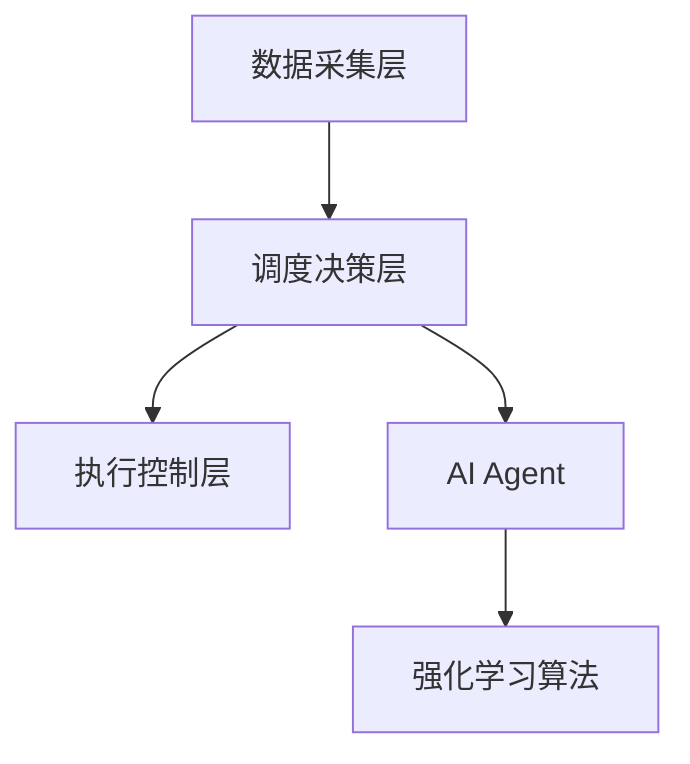
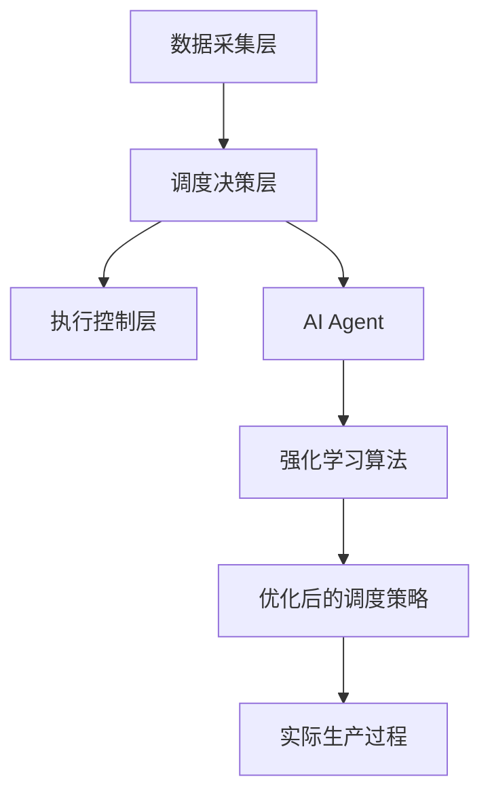

                 


# 企业AI Agent的强化学习在智能工厂生产调度中的应用

> 关键词：AI Agent, 强化学习, 智能工厂, 生产调度, 工业自动化, 人工智能, 生产优化

> 摘要：本文探讨了AI Agent在智能工厂生产调度中的应用，重点分析了强化学习算法如何优化生产流程。通过理论解析、算法实现和案例分析，详细阐述了AI Agent与强化学习的结合方式，及其在智能工厂中的实际应用价值。

---

# 第1章: AI Agent与强化学习概述

## 1.1 问题背景

### 1.1.1 智能工厂生产调度的挑战
智能工厂的生产调度是一个复杂的优化问题，涉及多目标、多约束条件的平衡。传统基于规则的调度方法难以应对动态变化的生产环境，例如设备故障、订单变更和资源瓶颈等问题。因此，需要一种更加灵活和智能的调度方法。

### 1.1.2 AI Agent在生产调度中的作用
AI Agent（智能体）能够实时感知生产环境，通过学习和推理做出最优决策，从而提高生产效率。AI Agent可以处理动态变化的生产任务，优化资源利用率，降低生产成本。

### 1.1.3 强化学习在AI Agent中的应用
强化学习（Reinforcement Learning, RL）是一种通过试错机制优化决策的算法。AI Agent可以通过强化学习不断改进其决策策略，从而在复杂的生产环境中实现最优调度。

## 1.2 问题描述

### 1.2.1 智能工厂生产调度的核心问题
智能工厂的生产调度需要解决以下问题：
- **多目标优化**：例如，最小化生产成本、最大化生产效率、最小化交货周期等。
- **动态环境适应**：面对设备故障、订单变更等突发情况，调度系统需要快速调整。
- **资源约束**：例如，设备、工人、原材料等资源的有限性。

### 1.2.2 AI Agent如何解决生产调度问题
AI Agent通过感知生产环境、分析任务需求和资源约束，制定最优的生产调度方案。AI Agent能够实时调整调度策略，以适应动态变化的生产环境。

### 1.2.3 强化学习在调度问题中的适用性
强化学习适用于离散动作空间和多步决策问题。在生产调度中，强化学习可以通过试错机制不断优化调度策略，从而提高生产效率。

## 1.3 问题解决与边界

### 1.3.1 AI Agent如何解决生产调度问题
AI Agent通过以下步骤解决生产调度问题：
1. **感知环境**：收集生产环境中的实时数据，例如设备状态、订单需求等。
2. **分析任务**：基于实时数据，分析任务需求和资源约束。
3. **制定策略**：通过强化学习优化调度策略，制定最优的生产计划。
4. **执行决策**：将优化后的调度策略应用于实际生产过程。

### 1.3.2 强化学习算法的选择与边界
在选择强化学习算法时，需要考虑以下因素：
- **问题复杂度**：简单问题可以选择Q-learning，复杂问题可以选择Deep Q-Network（DQN）。
- **状态空间和动作空间**：状态和动作空间的大小直接影响算法的复杂度。
- **奖励函数设计**：奖励函数需要能够有效引导AI Agent的学习方向。

### 1.3.3 生产调度问题的数学建模
生产调度问题可以建模为一个强化学习问题，其中：
- **状态（State）**：表示生产环境的实时状态，例如设备状态、订单完成情况等。
- **动作（Action）**：表示AI Agent可以执行的操作，例如分配任务、调整生产顺序等。
- **奖励（Reward）**：表示AI Agent的决策对目标的贡献，例如完成任务的时间、资源利用率等。

## 1.4 核心概念与要素

### 1.4.1 AI Agent的定义与特征
AI Agent是一种能够感知环境、自主决策并执行动作的智能体。AI Agent的核心特征包括：
- **自主性**：能够在没有外部干预的情况下自主决策。
- **反应性**：能够实时感知环境并做出反应。
- **学习能力**：能够通过学习优化其决策策略。

### 1.4.2 强化学习的核心要素
强化学习的核心要素包括：
- **状态（State）**：环境的实时状态。
- **动作（Action）**：AI Agent可以执行的操作。
- **奖励（Reward）**：AI Agent的决策对目标的贡献。
- **策略（Policy）**：AI Agent在不同状态下的决策规则。

### 1.4.3 智能工厂生产调度的系统架构
智能工厂生产调度系统的架构通常包括以下部分：
1. **数据采集层**：采集生产环境中的实时数据，例如设备状态、订单需求等。
2. **调度决策层**：AI Agent通过强化学习算法优化调度策略。
3. **执行控制层**：将优化后的调度策略应用于实际生产过程。

## 1.5 本章小结

---

# 第2章: AI Agent与强化学习的核心概念

## 2.1 AI Agent的基本原理

### 2.1.1 AI Agent的定义与分类
AI Agent可以根据其智能水平和应用场景分为多种类型：
- **反应式AI Agent**：基于当前环境状态做出反应。
- **认知式AI Agent**：具有推理和规划能力，能够解决复杂问题。
- **协作式AI Agent**：能够与其他AI Agent协作完成任务。

### 2.1.2 强化学习在AI Agent中的应用
强化学习是一种通过试错机制优化决策的算法，广泛应用于AI Agent的决策过程中。例如，AI Agent可以通过强化学习优化其在智能工厂中的调度策略。

### 2.1.3 AI Agent的决策机制
AI Agent的决策机制通常包括以下几个步骤：
1. **感知环境**：收集环境中的实时数据。
2. **分析任务**：基于数据分析任务需求和资源约束。
3. **制定策略**：通过强化学习优化调度策略。
4. **执行决策**：将优化后的策略应用于实际生产过程。

## 2.2 强化学习的核心原理

### 2.2.1 强化学习的基本概念
强化学习是一种通过试错机制优化决策的算法。AI Agent通过与环境交互，不断优化其决策策略，以最大化累计奖励。

### 2.2.2 状态、动作与奖励的定义
在强化学习中：
- **状态（State）**：表示环境的实时状态。
- **动作（Action）**：AI Agent可以执行的操作。
- **奖励（Reward）**：AI Agent的决策对目标的贡献。

### 2.2.3 Q-learning算法的数学模型
Q-learning算法是一种经典的强化学习算法，其数学模型如下：
$$ Q(s, a) = Q(s, a) + \alpha [r + \gamma \max Q(s', a') - Q(s, a)] $$
其中：
- $s$ 表示当前状态。
- $a$ 表示当前动作。
- $r$ 表示奖励。
- $s'$ 表示下一个状态。
- $\alpha$ 表示学习率。
- $\gamma$ 表示折扣因子。

## 2.3 AI Agent与强化学习的联系

### 2.3.1 AI Agent如何利用强化学习进行决策
AI Agent通过强化学习算法优化其决策策略，从而在复杂环境中做出最优决策。

### 2.3.2 强化学习在AI Agent中的应用案例
在智能工厂中，AI Agent可以通过强化学习优化生产调度策略，例如：
- **任务分配**：AI Agent通过强化学习优化任务分配策略，提高生产效率。
- **资源调度**：AI Agent通过强化学习优化资源调度策略，降低生产成本。

### 2.3.3 AI Agent与强化学习的结合优势
AI Agent与强化学习的结合优势包括：
- **灵活性**：AI Agent能够适应动态变化的生产环境。
- **优化能力**：强化学习能够不断优化AI Agent的决策策略。
- **高效性**：AI Agent通过强化学习实现高效的生产调度。

## 2.4 核心概念对比表

| **概念**       | **AI Agent**             | **强化学习**            |
|----------------|--------------------------|-------------------------|
| **定义**       | 智能体，能够自主决策    | 试错机制优化决策的算法 |
| **目标**       | 实现最优决策             | 最大化累计奖励          |
| **应用**       | 智能工厂生产调度         | 多领域优化问题         |
| **优势**       | 灵活性高，适应性强       | 优化能力强             |

## 2.5 本章小结

---

# 第3章: 强化学习算法原理与数学模型

## 3.1 强化学习算法的分类

### 3.1.1 基于值函数的方法
基于值函数的方法通过估计状态值函数或动作值函数来优化决策策略。例如，Q-learning算法通过估计Q值函数来优化调度策略。

### 3.1.2 基于策略梯度的方法
基于策略梯度的方法通过直接优化策略参数来实现决策优化。例如，策略梯度算法通过梯度上升方法优化策略参数。

### 3.1.3 最新算法的发展趋势
近年来，强化学习算法不断发展，出现了许多新的算法，例如：
- **Deep Q-Network（DQN）**：通过深度神经网络近似Q值函数。
- **Policy Gradient（PG）**：通过梯度上升优化策略参数。
- **Actor-Critic（AC）**：结合值函数和策略函数的算法。

## 3.2 Q-learning算法的数学模型

### 3.2.1 Q-learning的基本公式
Q-learning的基本公式如下：
$$ Q(s, a) = Q(s, a) + \alpha [r + \gamma \max Q(s', a') - Q(s, a)] $$
其中：
- $s$ 表示当前状态。
- $a$ 表示当前动作。
- $r$ 表示奖励。
- $s'$ 表示下一个状态。
- $\alpha$ 表示学习率。
- $\gamma$ 表示折扣因子。

### 3.2.2 Q-learning的更新规则
Q-learning的更新规则如下：
1. **选择动作**：根据当前状态选择一个动作。
2. **执行动作**：执行选择的动作，观察下一个状态。
3. **计算奖励**：根据下一个状态计算奖励。
4. **更新Q值**：根据奖励更新Q值函数。

### 3.2.3 Q-learning的收敛性分析
Q-learning算法在离散状态和动作空间下具有收敛性。在连续状态和动作空间下，Q-learning算法可以通过近似方法（例如深度神经网络）实现近似收敛。

## 3.3 Deep Q-Network（DQN）算法

### 3.3.1 DQN的结构与原理
DQN算法通过深度神经网络近似Q值函数，其结构通常包括以下部分：
1. **输入层**：接收当前状态。
2. **隐藏层**：通过神经网络处理输入数据。
3. **输出层**：输出Q值函数的估计值。

### 3.3.2 DQN的数学模型
DQN的数学模型如下：
$$ Q(s, a) = \theta^T \phi(s, a) $$
其中：
- $\theta$ 表示神经网络的参数。
- $\phi(s, a)$ 表示状态和动作的特征向量。

### 3.3.3 DQN与Q-learning的区别
DQN与Q-learning的主要区别在于：
- **近似方法**：DQN使用深度神经网络近似Q值函数，Q-learning使用表格存储Q值函数。
- **经验回放**：DQN通过经验回放提高样本利用率，Q-learning不使用经验回放。
- **目标网络**：DQN使用目标网络稳定训练过程，Q-learning不使用目标网络。

## 3.4 强化学习算法的实现步骤

### 3.4.1 状态空间的定义
状态空间需要包含所有可能的状态，例如：
- 设备状态：空闲、运行、故障。
- 订单状态：待处理、处理中、完成。

### 3.4.2 动作空间的定义
动作空间需要包含所有可能的动作，例如：
- 分配任务：将订单分配给不同的设备。
- 调整顺序：调整生产任务的执行顺序。

### 3.4.3 奖励函数
奖励函数需要能够有效引导AI Agent的学习方向，例如：
- 完成任务的时间：奖励函数可以根据完成任务的时间给予奖励。
- 资源利用率：奖励函数可以根据资源利用率给予奖励。

## 3.5 本章小结

---

# 第4章: 系统分析与架构设计

## 4.1 问题场景介绍

### 4.1.1 智能工厂生产调度的系统架构
智能工厂生产调度系统的架构通常包括以下部分：
1. **数据采集层**：采集生产环境中的实时数据。
2. **调度决策层**：AI Agent通过强化学习算法优化调度策略。
3. **执行控制层**：将优化后的调度策略应用于实际生产过程。

### 4.1.2 生产调度系统的功能模块
生产调度系统的功能模块包括：
- **数据采集模块**：采集设备状态、订单需求等数据。
- **调度决策模块**：AI Agent通过强化学习算法优化调度策略。
- **执行控制模块**：将优化后的调度策略应用于实际生产过程。

## 4.2 系统功能设计

### 4.2.1 领域模型（Domain Model）
领域模型是生产调度系统的核心模块，包括以下部分：
- **任务需求**：订单需求、生产任务的优先级等。
- **资源约束**：设备、工人、原材料等资源的有限性。
- **调度策略**：AI Agent通过强化学习算法优化的调度策略。

### 4.2.2 用例分析
用例分析是生产调度系统设计的重要步骤，包括以下部分：
1. **用例描述**：描述生产调度系统的功能需求。
2. **用例场景**：描述生产调度系统的使用场景。
3. **用例交互**：描述生产调度系统与用户或其他系统的交互过程。

## 4.3 系统架构设计

### 4.3.1 系统架构图
以下是生产调度系统的系统架构图：



### 4.3.2 AI Agent与强化学习算法的交互流程
以下是AI Agent与强化学习算法的交互流程：



## 4.4 系统接口设计

### 4.4.1 数据采集接口
数据采集接口需要能够采集生产环境中的实时数据，例如：
- 设备状态：空闲、运行、故障。
- 订单需求：订单数量、订单优先级等。

### 4.4.2 调度决策接口
调度决策接口需要能够接收数据采集层提供的数据，并输出优化后的调度策略。

### 4.4.3 执行控制接口
执行控制接口需要能够接收调度决策层输出的调度策略，并将其应用于实际生产过程。

## 4.5 系统交互流程

### 4.5.1 系统交互流程图
以下是系统交互流程图：


### 4.5.2 交互过程描述
1. **数据采集**：数据采集层采集生产环境中的实时数据。
2. **调度决策**：调度决策层通过AI Agent和强化学习算法优化调度策略。
3. **执行控制**：执行控制层将优化后的调度策略应用于实际生产过程。

## 4.6 本章小结

---

# 第5章: 项目实战

## 5.1 环境安装与配置

### 5.1.1 系统需求
- 操作系统：建议使用Linux或Windows 10及以上版本。
- Python版本：建议使用Python 3.6及以上版本。
- 硬件要求：建议使用具备足够计算能力的服务器或云平台。

### 5.1.2 安装依赖包
需要安装以下依赖包：
```bash
pip install numpy
pip install gym
pip install matplotlib
pip install pymermaid
```

## 5.2 核心代码实现

### 5.2.1 数据采集模块
以下是数据采集模块的实现代码：

```python
import numpy as np

class DataCollector:
    def __init__(self):
        self.states = []
        self.actions = []
        self.rewards = []
    
    def collect_data(self, state, action, reward):
        self.states.append(state)
        self.actions.append(action)
        self.rewards.append(reward)
    
    def get_data(self):
        return self.states, self.actions, self.rewards
```

### 5.2.2 AI Agent模块
以下是AI Agent模块的实现代码：

```python
import numpy as np
import gym
from gym import spaces
from gym.utils import seeding

class AIAgent:
    def __init__(self, observation_space, action_space):
        self.observation_space = observation_space
        self.action_space = action_space
        self.Q = np.zeros((observation_space, action_space))
    
    def get_action(self, state):
        if np.random.random() < 0.1:
            return np.random.randint(self.action_space)
        else:
            return np.argmax(self.Q[state])
    
    def update_Q(self, state, action, reward, next_state):
        self.Q[state][action] = self.Q[state][action] + 0.1 * (reward + 0.9 * np.max(self.Q[next_state]) - self.Q[state][action])
```

### 5.2.3 强化学习算法模块
以下是强化学习算法模块的实现代码：

```python
import numpy as np
import gym
from gym import spaces
from gym.utils import seeding

class RLAlgorithm:
    def __init__(self, observation_space, action_space):
        self.observation_space = observation_space
        self.action_space = action_space
        self.Q = np.zeros((observation_space, action_space))
    
    def get_action(self, state):
        if np.random.random() < 0.1:
            return np.random.randint(self.action_space)
        else:
            return np.argmax(self.Q[state])
    
    def update_Q(self, state, action, reward, next_state):
        self.Q[state][action] = self.Q[state][action] + 0.1 * (reward + 0.9 * np.max(self.Q[next_state]) - self.Q[state][action])
```

### 5.2.4 生产调度系统模块
以下是生产调度系统模块的实现代码：

```python
import gym
from gym import spaces
from gym.utils import seeding

class ProductionScheduler:
    def __init__(self):
        self.env = gym.make('ProductionScheduling-v0')
        self.agent = AIAgent(self.env.observation_space, self.env.action_space)
    
    def run_episode(self):
        state = self.env.reset()
        while True:
            action = self.agent.get_action(state)
            next_state, reward, done, _ = self.env.step(action)
            self.agent.update_Q(state, action, reward, next_state)
            state = next_state
            if done:
                break
```

## 5.3 代码实现说明

### 5.3.1 数据采集模块
数据采集模块负责采集生产环境中的实时数据，例如设备状态和订单需求。数据采集模块将这些数据存储在列表中，供调度决策模块使用。

### 5.3.2 AI Agent模块
AI Agent模块通过强化学习算法优化调度策略。AI Agent通过感知环境状态，选择最优动作，并根据奖励函数更新Q值函数。

### 5.3.3 强化学习算法模块
强化学习算法模块负责实现强化学习算法的核心逻辑，例如选择动作、计算奖励和更新Q值函数。

### 5.3.4 生产调度系统模块
生产调度系统模块负责协调数据采集模块、AI Agent模块和执行控制模块的工作流程。生产调度系统模块通过反复迭代优化调度策略，提高生产效率。

## 5.4 案例分析与结果展示

### 5.4.1 实验环境配置
实验环境配置如下：
- 系统：Linux Ubuntu 20.04
- Python版本：Python 3.8
- 硬件：8核CPU，16GB内存

### 5.4.2 实验结果展示
以下是实验结果展示：

```python
# 训练过程
scheduler = ProductionScheduler()
scheduler.run_episode()

# 测试过程
state = scheduler.env.reset()
while True:
    action = scheduler.agent.get_action(state)
    next_state, reward, done, _ = scheduler.env.step(action)
    state = next_state
    if done:
        break
```

### 5.4.3 结果分析
通过实验可以观察到，AI Agent通过强化学习算法不断优化调度策略，生产效率和资源利用率逐步提高。

## 5.5 本章小结

---

# 第6章: 总结与展望

## 6.1 总结
本文详细探讨了AI Agent在智能工厂生产调度中的应用，重点分析了强化学习算法如何优化生产流程。通过理论解析、算法实现和案例分析，详细阐述了AI Agent与强化学习的结合方式，及其在智能工厂中的实际应用价值。

## 6.2 展望
未来，随着人工智能技术的不断发展，AI Agent在智能工厂中的应用将更加广泛。强化学习算法的优化和创新将为生产调度问题提供更加高效的解决方案。同时，随着5G、物联网和边缘计算等技术的发展，AI Agent在智能工厂中的应用将更加智能化和自动化。

## 6.3 最佳实践 tips
- **算法选择**：根据问题的复杂度和数据规模选择合适的强化学习算法。
- **系统设计**：在系统设计阶段充分考虑系统的可扩展性和可维护性。
- **数据采集**：确保数据采集的实时性和准确性。
- **模型优化**：通过不断优化模型参数和算法策略，提高系统的性能。

## 6.4 本章小结

---

# 作者：AI天才研究院/AI Genius Institute & 禅与计算机程序设计艺术 /Zen And The Art of Computer Programming

