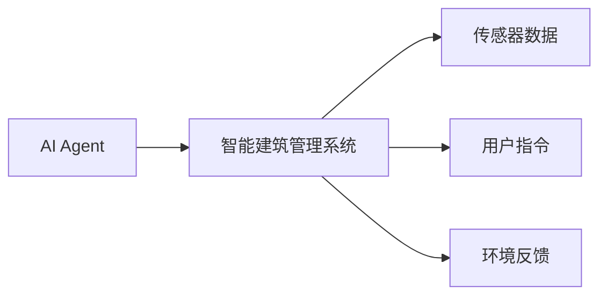
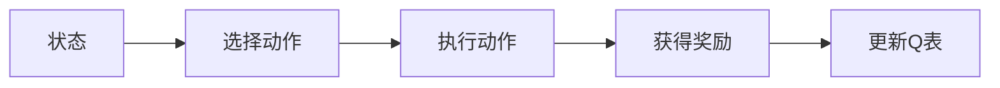
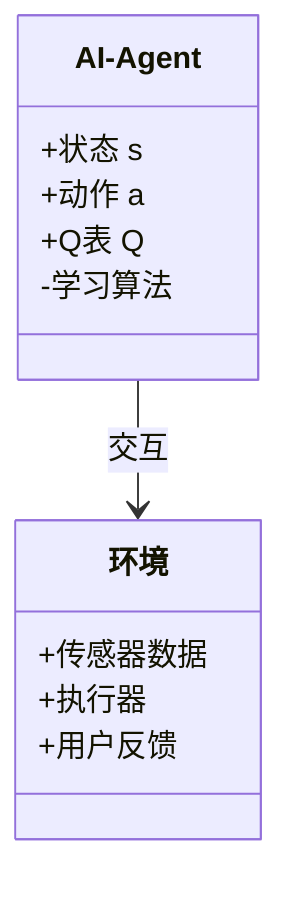

                 


# 企业AI Agent的强化学习在智能建筑管理中的应用

## 关键词：AI Agent、强化学习、智能建筑管理、Q-Learning、系统架构

## 摘要：  
本文探讨了AI Agent结合强化学习在智能建筑管理中的应用，通过详细分析核心概念、算法原理和系统架构，展示了如何利用强化学习优化智能建筑的能源管理、设备调度和用户服务。文章还通过实际案例，演示了如何实现高效的AI Agent系统，并提出了系统设计和优化的建议。

---

# 第1章: 企业AI Agent与强化学习概述

## 1.1 问题背景与问题描述  
智能建筑管理面临能源浪费、设备调度不优化、用户体验不佳等挑战。AI Agent能够实时感知建筑环境并做出决策，而强化学习通过不断试错优化策略，为智能建筑管理提供了新的解决方案。

## 1.2 问题解决与边界外延  
AI Agent通过强化学习优化建筑管理的动态性问题，适用于能源管理、设备调度和用户行为预测。其边界包括实时数据处理和隐私保护，而适用场景包括动态调整和多目标优化。

## 1.3 核心概念与核心要素  
AI Agent的特征包括自主性、反应性和社会性，强化学习的要素是状态、动作和奖励。智能建筑管理系统由传感器、执行器和用户交互模块组成，具备动态适应和优化能力。

---

# 第2章: AI Agent与强化学习的核心概念

## 2.1 核心概念原理  
AI Agent通过强化学习优化决策，状态、动作和奖励的定义决定了学习过程。Q-Learning算法通过更新Q表实现策略优化，适用于离散动作空间。

## 2.2 核心概念对比表  
| 概念 | AI Agent | 强化学习 |
|------|----------|----------|
| 核心目标 | 执行任务 | 最大化累积奖励 |
| 输入 | 状态 | 状态和动作 |
| 输出 | 动作 | 动作 |
| 学习机制 | 监督学习 | 强化信号 |

## 2.3 实体关系图  


---

# 第3章: 强化学习算法原理

## 3.1 Q-Learning算法  
### 3.1.1 算法流程  


### 3.1.2 数学模型  
$$ Q(s,a) = Q(s,a) + \alpha (r + \gamma \max Q(s',a') - Q(s,a)) $$  
其中，\( s \) 是状态，\( a \) 是动作，\( r \) 是奖励，\( \gamma \) 是折扣因子，\( \alpha \) 是学习率。

---

# 第4章: 系统分析与架构设计

## 4.1 项目背景  
智能建筑管理系统需要实时优化能源使用，提升设备效率，改善用户体验。

## 4.2 系统功能设计  


## 4.3 系统架构图  


---

# 第5章: 项目实战

## 5.1 环境安装  
安装Python和相关库，如numpy和tensorflow。

## 5.2 核心代码实现  
```python
import numpy as np

class AI-Agent:
    def __init__(self, state_space, action_space):
        self.Q = np.zeros((state_space, action_space))
    
    def choose_action(self, state):
        return np.argmax(self.Q[state])
    
    def update_Q(self, state, action, reward, next_state):
        self.Q[state, action] += 0.1 * (reward + 0.95 * np.max(self.Q[next_state]) - self.Q[state, action])

# 示例使用
agent = AI-Agent(5, 3)
agent.update_Q(0, 1, 2, 2)
```

## 5.3 实际案例分析  
通过案例分析，展示AI Agent如何优化建筑管理，如动态调整设备运行以降低能耗。

---

# 第6章: 最佳实践与小结

## 6.1 最佳实践 tips  
定期更新模型，监控系统性能，确保数据安全。

## 6.2 小结  
本文详细探讨了AI Agent结合强化学习在智能建筑管理中的应用，展示了算法原理和系统设计，为实际应用提供了参考。

## 6.3 注意事项  
注意数据质量和模型泛化能力，避免过拟合。

## 6.4 拓展阅读  
推荐阅读相关书籍和论文，深入理解强化学习和系统架构设计。

---

# 作者：AI天才研究院/AI Genius Institute & 禅与计算机程序设计艺术 /Zen And The Art of Computer Programming

