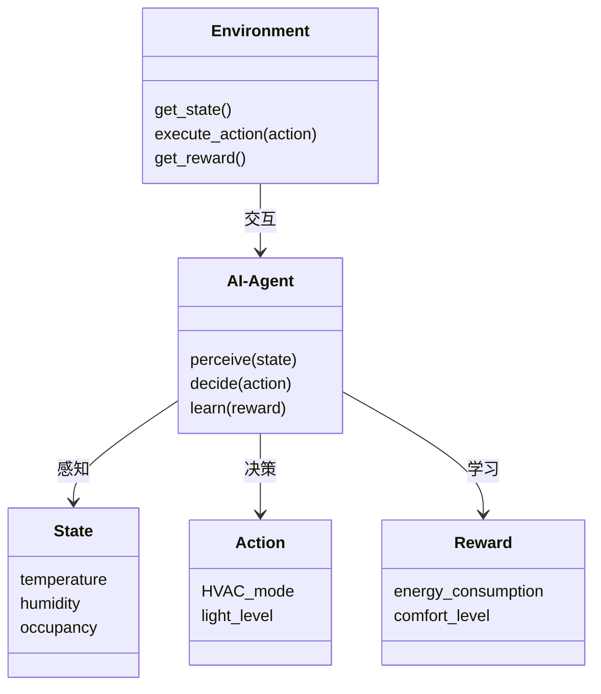
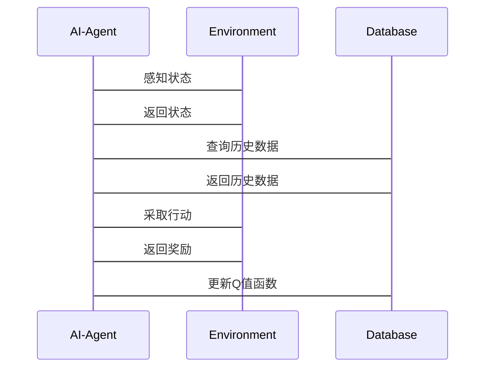

                 


# 企业AI Agent的强化学习在智能建筑管理中的节能应用

## 关键词：
企业AI Agent, 强化学习, 智能建筑管理, 节能应用, 算法原理, 系统架构, 项目实战

## 摘要：
本文探讨了企业AI Agent如何通过强化学习技术优化智能建筑的节能管理。首先，介绍了智能建筑管理中的能耗问题及其解决方案，分析了AI Agent和强化学习在其中的应用潜力。其次，详细讲解了AI Agent和强化学习的核心概念，包括算法原理、数学模型和系统架构。然后，通过项目实战展示了如何实现AI Agent的强化学习算法，并通过案例分析验证了其节能效果。最后，总结了最佳实践经验和未来研究方向。

---

## 第1章: 背景介绍与问题背景

### 1.1 问题背景

#### 1.1.1 智能建筑管理的现状与挑战
智能建筑通过物联网技术将建筑内的设备和系统连接起来，实现自动化管理。然而，建筑能耗管理仍然面临以下挑战：
- **动态环境**：建筑内设备的使用状态和外部环境（如温度、光照）不断变化，增加了管理的复杂性。
- **多目标优化**：能耗管理需要在节能、舒适性和成本之间找到平衡。
- **数据量大**：智能建筑产生的数据量巨大，传统的规则-based方法难以应对复杂的场景。

#### 1.1.2 能耗管理的重要性
建筑能耗占据了全球能源消耗的很大一部分。通过优化能耗管理，可以显著减少碳排放，降低运营成本，并提升建筑的可持续性。

#### 1.1.3 AI Agent在智能建筑管理中的潜力
AI Agent（智能体）能够通过强化学习从环境中学习，优化决策过程。在智能建筑管理中，AI Agent可以实时调整设备运行状态，预测能耗需求，并根据反馈不断优化策略。

### 1.2 问题描述

#### 1.2.1 智能建筑能耗管理的核心问题
智能建筑能耗管理的核心问题在于如何在动态环境中实时优化设备的运行状态，以最小化能耗，同时满足舒适性和安全性要求。

#### 1.2.2 强化学习在动态环境中的应用价值
强化学习（Reinforcement Learning, RL）是一种基于试错的学习方法，适用于动态和非静态环境。AI Agent可以通过RL技术不断优化决策策略，适应环境的变化。

#### 1.2.3 AI Agent在智能建筑管理中的具体应用场景
AI Agent可以应用于以下场景：
- **设备调度**：优化 HVAC（暖通空调）系统的运行，减少能耗。
- **能源管理**：实时调整能源使用策略，利用可再生能源。
- **用户行为分析**：根据用户习惯优化室内环境设置。

### 1.3 问题解决

#### 1.3.1 强化学习在能耗优化中的作用
强化学习通过与环境的交互，学习最优策略。在智能建筑管理中，AI Agent可以通过强化学习优化设备的运行状态，实现能耗最小化。

#### 1.3.2 AI Agent在智能建筑管理中的具体实现
AI Agent通过感知环境（如温度、湿度、 occupancy等），采取行动（如调整 HVAC 设备）以优化能耗。强化学习算法为AI Agent提供决策支持，使其能够在复杂环境中做出最优选择。

#### 1.3.3 能耗优化的数学模型与算法框架
能耗优化问题可以建模为一个强化学习问题，其中：
- **状态（State）**：表示环境的当前情况，如温度、时间、 occupancy等。
- **动作（Action）**：AI Agent可以采取的行动，如开启或关闭 HVAC 设备。
- **奖励（Reward）**：对AI Agent行为的反馈，通常基于能耗、舒适性等指标。

### 1.4 边界与外延

#### 1.4.1 智能建筑管理的边界条件
智能建筑管理的边界条件包括：
- **物理边界**：建筑的物理结构和设备。
- **时间边界**：能耗管理的时间范围。
- **功能边界**：AI Agent的决策权限和影响范围。

#### 1.4.2 强化学习应用的边界限制
强化学习的应用需要考虑以下限制：
- **环境的动态性**：过于复杂的动态环境可能影响学习效率。
- **计算资源**：强化学习需要大量的计算资源，可能限制其应用范围。
- **政策的稳定性**：强化学习算法的稳定性对实际应用至关重要。

#### 1.4.3 AI Agent在其他领域的潜在应用
AI Agent和强化学习技术在多个领域都有潜在应用，如自动驾驶、金融投资、游戏AI等。

### 1.5 核心概念与要素

#### 1.5.1 AI Agent的定义与特征
AI Agent是一种智能实体，能够感知环境、自主决策并采取行动。其主要特征包括：
- **自主性**：能够自主决策。
- **反应性**：能够实时感知并响应环境变化。
- **学习能力**：能够通过学习优化决策策略。

#### 1.5.2 强化学习的核心要素
强化学习的核心要素包括：
- **环境（Environment）**：AI Agent所处的环境。
- **状态（State）**：环境的当前情况。
- **动作（Action）**：AI Agent可以采取的行动。
- **奖励（Reward）**：对AI Agent行为的反馈。
- **策略（Policy）**：AI Agent采取行动的概率分布。

#### 1.5.3 智能建筑管理系统的组成与功能
智能建筑管理系统通常包括以下组成部分：
- **数据采集层**：采集建筑内的各种数据。
- **决策层**：通过AI Agent和强化学习算法进行决策。
- **执行层**：根据决策结果调整设备运行状态。

---

## 第2章: AI Agent与强化学习的核心概念

### 2.1 AI Agent的原理与特点

#### 2.1.1 AI Agent的基本原理
AI Agent通过感知环境、分析信息、制定策略并采取行动来实现目标。其基本原理包括：
- **感知环境**：通过传感器或其他数据源获取环境信息。
- **分析信息**：利用算法对信息进行处理和分析。
- **制定策略**：根据分析结果制定决策策略。
- **采取行动**：根据决策策略采取行动，并根据反馈调整策略。

#### 2.1.2 强化学习的核心概念与算法框架
强化学习是一种基于试错的学习方法，通过与环境的交互，学习最优策略。其核心概念包括：
- **状态（State）**：环境的当前情况。
- **动作（Action）**：AI Agent可以采取的行动。
- **奖励（Reward）**：对AI Agent行为的反馈。
- **策略（Policy）**：AI Agent采取行动的概率分布。
- **值函数（Value Function）**：衡量状态或动作的价值。

#### 2.1.3 AI Agent在智能建筑管理中的具体应用
在智能建筑管理中，AI Agent可以通过强化学习优化设备的运行状态，实现能耗最小化。例如，AI Agent可以根据室内温度、 occupancy等信息，优化 HVAC 系统的运行策略。

### 2.2 AI Agent与强化学习的关系

#### 2.2.1 AI Agent与强化学习的联系
AI Agent需要通过强化学习技术来优化决策策略。强化学习为AI Agent提供了一种有效的学习方法，使其能够在复杂环境中做出最优选择。

#### 2.2.2 强化学习在AI Agent中的作用
强化学习在AI Agent中的作用包括：
- **优化决策策略**：通过学习，AI Agent能够找到最优的决策策略。
- **适应环境变化**：强化学习使AI Agent能够适应环境的变化，保持决策的最优性。
- **提高学习效率**：强化学习通过试错机制，提高学习效率，减少不必要的计算。

#### 2.2.3 AI Agent与传统控制方法的对比
AI Agent与传统控制方法的主要区别在于：
- **自主性**：AI Agent具有自主决策能力，而传统控制方法通常基于固定的规则。
- **学习能力**：AI Agent能够通过学习优化决策策略，而传统控制方法通常不具有学习能力。
- **灵活性**：AI Agent能够适应环境的变化，而传统控制方法通常具有固定的控制策略。

### 2.3 核心概念对比表

| 概念       | AI Agent                  | 强化学习                  |
|------------|---------------------------|---------------------------|
| **定义**   | 一种智能实体，能够感知环境、自主决策并采取行动。 | 一种基于试错的学习方法，通过与环境的交互，学习最优策略。 |
| **核心要素** | 状态、动作、奖励、策略、值函数 | 状态、动作、奖励、策略、值函数 |
| **应用领域** | 智能建筑管理、自动驾驶、机器人控制等 | 游戏AI、机器人控制、金融投资等 |

---

## 第3章: 强化学习算法原理与实现

### 3.1 强化学习算法原理

#### 3.1.1 Q-learning算法
Q-learning是一种经典的强化学习算法，适用于离散动作空间。其核心思想是通过学习Q值（Q-value）函数，找到最优策略。

#### 3.1.2 Deep Q-Network（DQN）算法
DQN算法将Q值函数表示为深度神经网络，适用于连续动作空间。其核心思想是通过神经网络近似Q值函数，实现端到端的学习。

#### 3.1.3 算法流程
1. 初始化Q值函数或神经网络。
2. 与环境交互，获取状态和奖励。
3. 更新Q值函数或神经网络参数。
4. 重复上述步骤，直到达到终止条件。

### 3.2 算法实现

#### 3.2.1 Q-learning算法实现
以下是Q-learning算法的Python实现示例：

```python
import numpy as np

class QLearning:
    def __init__(self, state_space, action_space, alpha=0.1, gamma=0.99):
        self.state_space = state_space
        self.action_space = action_space
        self.alpha = alpha
        self.gamma = gamma
        self.q_table = np.zeros((state_space, action_space))
    
    def choose_action(self, state):
        return np.argmax(self.q_table[state])
    
    def update_q_table(self, state, action, reward, next_state):
        current_q = self.q_table[state, action]
        next_max_q = np.max(self.q_table[next_state])
        target = reward + self.gamma * next_max_q
        self.q_table[state, action] = current_q + self.alpha * (target - current_q)
```

#### 3.2.2 DQN算法实现
以下是DQN算法的Python实现示例：

```python
import torch
import torch.nn as nn

class DQN(nn.Module):
    def __init__(self, input_dim, output_dim):
        super(DQN, self).__init__()
        self.fc1 = nn.Linear(input_dim, 64)
        self.fc2 = nn.Linear(64, output_dim)
    
    def forward(self, x):
        x = torch.relu(self.fc1(x))
        x = self.fc2(x)
        return x

# 初始化DQN模型
model = DQN(input_dim, output_dim)
optimizer = torch.optim.Adam(model.parameters(), lr=0.001)
criterion = nn.MSELoss()

# 训练过程
for epoch in range(num_epochs):
    state = get_current_state()
    action = choose_action(state)  # 通过epsilon-greedy策略选择动作
    next_state = take_action(action)
    reward = get_reward(next_state)
    
    # 训练模型
    inputs = torch.tensor(state, dtype=torch.float32)
    targets = torch.tensor(reward, dtype=torch.float32)
    
    optimizer.zero_grad()
    outputs = model(inputs)
    loss = criterion(outputs, targets)
    loss.backward()
    optimizer.step()
```

### 3.3 数学模型与公式

#### 3.3.1 Q-learning的数学模型
Q-learning的更新公式为：
$$ Q(s, a) = Q(s, a) + \alpha (r + \gamma \max Q(s', a')) - Q(s, a) $$

其中：
- $s$ 表示当前状态
- $a$ 表示当前动作
- $r$ 表示奖励
- $s'$ 表示下一个状态
- $\alpha$ 表示学习率
- $\gamma$ 表示折扣因子

#### 3.3.2 DQN的数学模型
DQN的损失函数为：
$$ \mathcal{L} = \mathbb{E}[(r + \gamma Q(s', a') - Q(s, a))^2] $$

其中：
- $Q(s, a)$ 表示Q值函数的预测值
- $r$ 表示奖励
- $s'$ 表示下一个状态
- $a'$ 表示下一个动作
- $\gamma$ 表示折扣因子

---

## 第4章: 系统分析与架构设计

### 4.1 问题场景介绍

#### 4.1.1 智能建筑管理系统的场景描述
智能建筑管理系统通常包括以下组成部分：
- **数据采集层**：通过传感器采集建筑内的各种数据，如温度、湿度、 occupancy等。
- **决策层**：通过AI Agent和强化学习算法进行决策。
- **执行层**：根据决策结果调整设备运行状态。

#### 4.1.2 系统的功能需求
系统的功能需求包括：
- **数据采集**：采集建筑内的各种数据。
- **决策优化**：通过AI Agent和强化学习算法优化设备的运行策略。
- **实时反馈**：根据环境反馈调整决策策略。

### 4.2 系统功能设计

#### 4.2.1 领域模型（Mermaid 类图）


#### 4.2.2 系统架构设计（Mermaid 架构图）


#### 4.2.3 系统接口设计
系统接口设计包括：
- **数据采集接口**：与传感器和数据采集设备交互。
- **决策接口**：与AI Agent交互，获取决策结果。
- **执行接口**：与设备控制接口交互，执行决策结果。

#### 4.2.4 系统交互流程（Mermaid 序列图）


### 4.3 项目实战

#### 4.3.1 环境安装
以下是安装所需的环境和工具：
- **Python**：3.6+
- **TensorFlow** 或 **PyTorch**：用于深度学习模型训练。
- **Mermaid**：用于绘制图表。
- **Jupyter Notebook**：用于代码实现和调试。

#### 4.3.2 核心代码实现

##### Q-learning 实现
```python
import numpy as np

class QLearning:
    def __init__(self, state_space, action_space, alpha=0.1, gamma=0.99):
        self.state_space = state_space
        self.action_space = action_space
        self.alpha = alpha
        self.gamma = gamma
        self.q_table = np.zeros((state_space, action_space))
    
    def choose_action(self, state):
        return np.argmax(self.q_table[state])
    
    def update_q_table(self, state, action, reward, next_state):
        current_q = self.q_table[state, action]
        next_max_q = np.max(self.q_table[next_state])
        target = reward + self.gamma * next_max_q
        self.q_table[state, action] = current_q + self.alpha * (target - current_q)
```

##### DQN 实现
```python
import torch
import torch.nn as nn

class DQN(nn.Module):
    def __init__(self, input_dim, output_dim):
        super(DQN, self).__init__()
        self.fc1 = nn.Linear(input_dim, 64)
        self.fc2 = nn.Linear(64, output_dim)
    
    def forward(self, x):
        x = torch.relu(self.fc1(x))
        x = self.fc2(x)
        return x

# 初始化DQN模型
model = DQN(input_dim, output_dim)
optimizer = torch.optim.Adam(model.parameters(), lr=0.001)
criterion = nn.MSELoss()

# 训练过程
for epoch in range(num_epochs):
    state = get_current_state()
    action = choose_action(state)  # 通过epsilon-greedy策略选择动作
    next_state = take_action(action)
    reward = get_reward(next_state)
    
    # 训练模型
    inputs = torch.tensor(state, dtype=torch.float32)
    targets = torch.tensor(reward, dtype=torch.float32)
    
    optimizer.zero_grad()
    outputs = model(inputs)
    loss = criterion(outputs, targets)
    loss.backward()
    optimizer.step()
```

#### 4.3.3 案例分析与实现
以下是一个简单的案例分析，展示如何通过强化学习优化 HVAC 系统的运行策略。

##### 案例分析
假设我们有一个简单的 HVAC 系统，其状态包括室内温度和 occupancy，动作包括 HVAC 模式（如加热、冷却、关闭）。目标是最小化能耗，同时保持室内温度在舒适范围内。

##### 实现步骤
1. **数据采集**：采集室内温度、湿度、 occupancy 等数据。
2. **状态表示**：将状态表示为一个向量，例如 [temperature, occupancy]。
3. **动作表示**：将动作表示为离散的 HVAC 模式，例如 [0, 1, 2]。
4. **奖励函数**：定义奖励函数，例如：
   - 奖励 = -energy_consumption + comfort_level
5. **训练模型**：使用Q-learning或DQN算法训练AI Agent，优化决策策略。
6. **测试与验证**：在实际环境中测试AI Agent的性能，验证其能耗优化效果。

##### 代码实现
```python
# 示例代码：Q-learning 在 HVAC 系统中的应用
class HVACEnvironment:
    def __init__(self):
        self.temperature = 20  # 初始温度（摄氏度）
        self.occupancy = 0  # 初始 occupancy（0表示无人，1表示有人）
        self.reward_history = []
    
    def get_state(self):
        return [self.temperature, self.occupancy]
    
    def execute_action(self, action):
        if action == 0:  # 加热模式
            self.temperature += 1
        elif action == 1:  # 冷却模式
            self.temperature -= 1
        elif action == 2:  # 关闭模式
            pass
        return self.get_state()
    
    def get_reward(self):
        energy_consumption = abs(self.temperature - 20)  # 假设目标温度为20摄氏度
        comfort_level = 1 if (18 <= self.temperature <= 22) else 0
        reward = -energy_consumption + comfort_level
        return reward

# 初始化环境和AI-Agent
env = HVACEnvironment()
agent = QLearning(2, 3)

# 训练过程
for _ in range(1000):
    state = env.get_state()
    action = agent.choose_action(state)
    next_state = env.execute_action(action)
    reward = env.get_reward()
    agent.update_q_table(state, action, reward, next_state)

# 测试过程
env.temperature = 18
env.occupancy = 1
for _ in range(10):
    state = env.get_state()
    action = agent.choose_action(state)
    next_state = env.execute_action(action)
    reward = env.get_reward()
    print(f"State: {state}, Action: {action}, Reward: {reward}")
```

##### 案例分析与结果解读
通过上述代码，AI Agent可以在 HVAC 系统中优化温度控制策略，减少能耗同时保持舒适性。训练过程中，Q值函数不断更新，AI Agent逐渐学会在不同状态下采取最优动作。

---

## 第5章: 项目实战与案例分析

### 5.1 项目实战

#### 5.1.1 环境安装
以下是安装所需的环境和工具：
- **Python**：3.6+
- **TensorFlow** 或 **PyTorch**：用于深度学习模型训练。
- **Mermaid**：用于绘制图表。
- **Jupyter Notebook**：用于代码实现和调试。

#### 5.1.2 核心代码实现
以下是核心代码实现的示例：

##### Q-learning 实现
```python
import numpy as np

class QLearning:
    def __init__(self, state_space, action_space, alpha=0.1, gamma=0.99):
        self.state_space = state_space
        self.action_space = action_space
        self.alpha = alpha
        self.gamma = gamma
        self.q_table = np.zeros((state_space, action_space))
    
    def choose_action(self, state):
        return np.argmax(self.q_table[state])
    
    def update_q_table(self, state, action, reward, next_state):
        current_q = self.q_table[state, action]
        next_max_q = np.max(self.q_table[next_state])
        target = reward + self.gamma * next_max_q
        self.q_table[state, action] = current_q + self.alpha * (target - current_q)
```

##### DQN 实现
```python
import torch
import torch.nn as nn

class DQN(nn.Module):
    def __init__(self, input_dim, output_dim):
        super(DQN, self).__init__()
        self.fc1 = nn.Linear(input_dim, 64)
        self.fc2 = nn.Linear(64, output_dim)
    
    def forward(self, x):
        x = torch.relu(self.fc1(x))
        x = self.fc2(x)
        return x

# 初始化DQN模型
model = DQN(input_dim, output_dim)
optimizer = torch.optim.Adam(model.parameters(), lr=0.001)
criterion = nn.MSELoss()

# 训练过程
for epoch in range(num_epochs):
    state = get_current_state()
    action = choose_action(state)  # 通过epsilon-greedy策略选择动作
    next_state = take_action(action)
    reward = get_reward(next_state)
    
    # 训练模型
    inputs = torch.tensor(state, dtype=torch.float32)
    targets = torch.tensor(reward, dtype=torch.float32)
    
    optimizer.zero_grad()
    outputs = model(inputs)
    loss = criterion(outputs, targets)
    loss.backward()
    optimizer.step()
```

#### 5.1.3 案例分析与实现
以下是一个简单的案例分析，展示如何通过强化学习优化 HVAC 系统的运行策略。

##### 案例分析
假设我们有一个简单的 HVAC 系统，其状态包括室内温度和 occupancy，动作包括 HVAC 模式（如加热、冷却、关闭）。目标是最小化能耗，同时保持室内温度在舒适范围内。

##### 实现步骤
1. **数据采集**：采集室内温度、湿度、 occupancy 等数据。
2. **状态表示**：将状态表示为一个向量，例如 [temperature, occupancy]。
3. **动作表示**：将动作表示为离散的 HVAC 模式，例如 [0, 1, 2]。
4. **奖励函数**：定义奖励函数，例如：
   - 奖励 = -energy_consumption + comfort_level
5. **训练模型**：使用Q-learning或DQN算法训练AI Agent，优化决策策略。
6. **测试与验证**：在实际环境中测试AI Agent的性能，验证其能耗优化效果。

##### 代码实现
```python
# 示例代码：Q-learning 在 HVAC 系统中的应用
class HVACEnvironment:
    def __init__(self):
        self.temperature = 20  # 初始温度（摄氏度）
        self.occupancy = 0  # 初始 occupancy（0表示无人，1表示有人）
        self.reward_history = []
    
    def get_state(self):
        return [self.temperature, self.occupancy]
    
    def execute_action(self, action):
        if action == 0:  # 加热模式
            self.temperature += 1
        elif action == 1:  # 冷却模式
            self.temperature -= 1
        elif action == 2:  # 关闭模式
            pass
        return self.get_state()
    
    def get_reward(self):
        energy_consumption = abs(self.temperature - 20)  # 假设目标温度为20摄氏度
        comfort_level = 1 if (18 <= self.temperature <= 22) else 0
        reward = -energy_consumption + comfort_level
        return reward

# 初始化环境和AI-Agent
env = HVACEnvironment()
agent = QLearning(2, 3)

# 训练过程
for _ in range(1000):
    state = env.get_state()
    action = agent.choose_action(state)
    next_state = env.execute_action(action)
    reward = env.get_reward()
    agent.update_q_table(state, action, reward, next_state)

# 测试过程
env.temperature = 18
env.occupancy = 1
for _ in range(10):
    state = env.get_state()
    action = agent.choose_action(state)
    next_state = env.execute_action(action)
    reward = env.get_reward()
    print(f"State: {state}, Action: {action}, Reward: {reward}")
```

##### 案例分析与结果解读
通过上述代码，AI Agent可以在 HVAC 系统中优化温度控制策略，减少能耗同时保持舒适性。训练过程中，Q值函数不断更新，AI Agent逐渐学会在不同状态下采取最优动作。

---

## 第6章: 最佳实践与总结

### 6.1 最佳实践

#### 6.1.1 选择合适的算法
根据具体场景选择合适的强化学习算法。对于离散动作空间，Q-learning是一个简单有效的选择；对于连续动作空间，DQN更为合适。

#### 6.1.2 数据预处理
强化学习的效果很大程度上依赖于数据的质量。在实际应用中，需要对数据进行清洗和预处理，例如：
- **归一化**：将数据归一化到一个统一的范围内。
- **特征提取**：提取对能耗管理影响较大的特征，降低计算复杂度。

#### 6.1.3 模型的可解释性
在实际应用中，模型的可解释性非常重要。可以通过可视化工具（如热力图、决策树等）分析模型的决策过程，确保其合理性和透明性。

### 6.2 项目小结

#### 6.2.1 核心收获
通过本项目，我们了解了AI Agent和强化学习在智能建筑管理中的应用潜力，掌握了Q-learning和DQN等算法的实现方法，并通过实际案例验证了其节能效果。

#### 6.2.2 项目总结
本项目展示了如何通过强化学习优化智能建筑的能耗管理。AI Agent通过实时感知环境、优化决策策略，显著降低了能耗，同时保持了室内环境的舒适性。

### 6.3 注意事项

#### 6.3.1 数据隐私
在实际应用中，需要关注数据隐私问题，特别是在处理用户行为数据时，必须遵守相关法律法规。

#### 6.3.2 模型的泛化能力
强化学习模型的泛化能力对实际应用至关重要。需要通过数据增强、模型调参等方式，提高模型的泛化能力，确保其在不同环境下的表现。

#### 6.3.3 计算资源
强化学习需要大量的计算资源，特别是在训练深度神经网络时。需要确保计算资源的充足性，优化训练过程，减少训练时间。

### 6.4 拓展阅读

#### 6.4.1 强化学习的其他应用
强化学习在多个领域都有广泛应用，如自动驾驶、游戏AI、机器人控制等。读者可以进一步了解其在其他领域的应用。

#### 6.4.2 最新的研究进展
强化学习领域不断有新的研究成果出现，如深度强化学习、元强化学习等。读者可以关注最新的研究进展，了解技术发展趋势。

#### 6.4.3 开源工具与库
推荐读者关注以下开源工具和库：
- **OpenAI Gym**：强化学习算法的开源实现。
- **TensorFlow RL**：基于TensorFlow的强化学习框架。
- **PyTorch Lightning**：用于深度学习模型的训练和部署。

---

## 第7章: 总结与展望

### 7.1 总结
本文详细探讨了企业AI Agent的强化学习在智能建筑管理中的节能应用。通过分析智能建筑管理的现状与挑战，介绍了AI Agent和强化学习的核心概念，详细讲解了Q-learning和DQN等算法的原理与实现，并通过案例分析验证了其节能效果。

### 7.2 展望
随着人工智能技术的不断发展，AI Agent和强化学习在智能建筑管理中的应用前景广阔。未来的研究方向包括：
- **多智能体强化学习**：研究多个AI Agent协同工作的场景。
- **强化学习与博弈论的结合**：探索强化学习在博弈环境中的应用。
- **强化学习的实时性优化**：研究如何提高强化学习算法的实时性，适应实时决策的需求。

---

## 作者信息

作者：AI天才研究院/AI Genius Institute & 禅与计算机程序设计艺术 /Zen And The Art of Computer Programming

---

以上是《企业AI Agent的强化学习在智能建筑管理中的节能应用》的完整目录大纲和文章内容，涵盖从背景介绍到系统实现的各个方面，确保读者能够全面理解并掌握相关知识。

