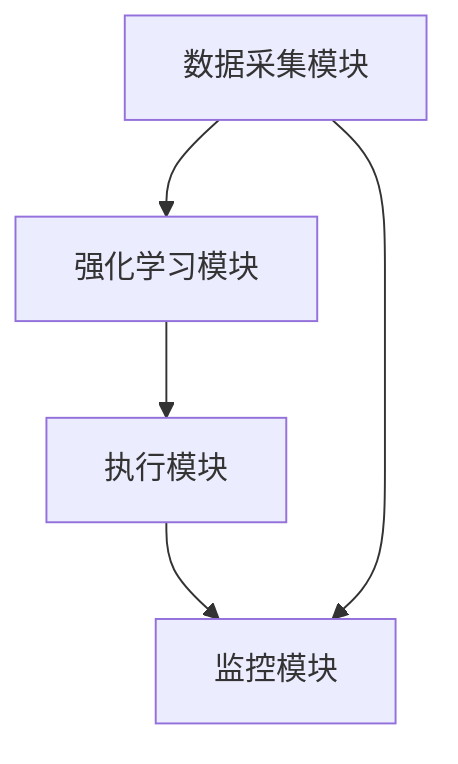

                 


# 企业AI Agent的强化学习在智能建筑能源管理中的应用

> 关键词：AI Agent，强化学习，智能建筑，能源管理，优化算法

> 摘要：本文探讨了企业AI Agent如何利用强化学习技术优化智能建筑的能源管理。通过详细分析强化学习算法的原理及其在能源管理中的应用场景，本文旨在揭示AI Agent在智能建筑能源管理中的潜力和优势。结合数学模型和系统架构设计，本文提供了一个从理论到实践的完整框架，展示了如何通过强化学习实现智能建筑的高效能源管理。

---

## 第一部分: 强化学习与AI Agent基础

### 第1章: AI Agent与强化学习概述

#### 1.1 AI Agent的基本概念
- **定义**：AI Agent是一种智能实体，能够感知环境并采取行动以实现特定目标。
- **核心特征**：
  - 自主性：无需外部干预，自主决策。
  - 反应性：能够实时感知环境并做出反应。
  - 目标导向：基于目标驱动行为。
- **与传统AI的区别**：
  - 传统AI（如专家系统）依赖规则和数据，而AI Agent具备自主性和目标导向性。

#### 1.2 强化学习的基本原理
- **定义**：强化学习是一种通过试错机制，学习最优策略以最大化累积奖励的算法。
- **核心要素**：
  - 状态（State）：环境的当前情况。
  - 动作（Action）：AI Agent采取的行动。
  - 奖励（Reward）：对行动的反馈，用于指导学习。
  - 策略（Policy）：决定在给定状态下采取哪个动作的规则。
  - Q值（Q-value）：衡量状态-动作对的价值。
- **与监督学习的区别**：
  - 监督学习依赖于标记数据，而强化学习通过与环境互动获得反馈。

#### 1.3 AI Agent在智能建筑中的应用背景
- **智能建筑的定义与特点**：
  - 智能建筑：通过自动化技术实现高效管理的建筑，具备能源管理、安全监控等功能。
  - 特点：智能化、自动化、高效性。
- **能源管理在智能建筑中的重要性**：
  - 节能减排：减少能源消耗，降低碳排放。
  - 成本优化：降低运营成本。
  - 智能调度：优化能源使用，提高效率。
- **AI Agent在能源管理中的潜力**：
  - 实时决策：快速响应环境变化。
  - 多目标优化：平衡能源消耗与舒适度。
  - 自适应学习：根据历史数据优化策略。

---

### 第2章: 强化学习的核心算法

#### 2.1 Q-learning算法
- **基本原理**：
  - Q-learning是一种基于值函数的强化学习算法。
  - 通过更新Q表（Q-table）来学习最优策略。
- **数学模型**：
  $$ Q(s, a) = r + \gamma \max_{a'} Q(s', a') $$
  - 其中，$s$是当前状态，$a$是当前动作，$r$是奖励，$\gamma$是折扣因子，$s'$是下一个状态。
- **实现步骤**：
  1. 初始化Q表。
  2. 与环境互动，获取状态和奖励。
  3. 更新Q值：$ Q(s, a) = Q(s, a) + \alpha (r + \gamma \max Q(s', a') - Q(s, a)) $。
  4. 重复步骤2-3，直到收敛。
- **优缺点**：
  - 优点：简单易实现，适用于离散动作空间。
  - 缺点：在高维状态空间中表现不佳，收敛速度慢。

#### 2.2 Deep Q-Networks (DQN)算法
- **基本原理**：
  - DQN通过深度神经网络近似Q值函数，适用于高维状态空间。
  - 使用两个网络：主网络（primary network）和目标网络（target network）。
- **网络结构**：
  - 输入层：接收状态输入。
  - 隐藏层：提取特征。
  - 输出层：输出每个动作的Q值。
- **训练过程**：
  1. 环境互动，收集经验。
  2. 从经验中采样 mini-batch 进行训练。
  3. 更新主网络，逐步逼近目标网络。
  4. 周期性更新目标网络。
- **数学模型**：
  - 损失函数：$$ \mathcal{L} = \mathbb{E}[ (y - Q(s,a))^2 ] $$
  - 其中，$ y = r + \gamma \max Q_{target}(s', a') $。
- **优缺点**：
  - 优点：适用于复杂环境，表现优于Q-learning。
  - 缺点：计算复杂，需要大量训练数据。

#### 2.3 强化学习在能源管理中的优势
- **动态环境下的决策优势**：
  - 强化学习能够适应环境变化，实时优化策略。
- **多目标优化的实现**：
  - 通过奖励函数设计，平衡能源消耗与舒适度。
- **实时反馈的高效性**：
  - 强化学习通过即时反馈优化决策，提高效率。

---

### 第3章: AI Agent在智能建筑能源管理中的应用场景

#### 3.1 智能建筑能源管理的典型场景
- **HVAC系统优化**：
  - HVAC（暖通空调）系统是建筑中主要的能源消耗部分。
  - 通过强化学习优化 HVAC 的运行策略，降低能耗。
- **照明系统节能**：
  - 根据光照强度和人流量，智能调节照明亮度。
  - 通过强化学习实现最优节能策略。
- **可再生能源的调度**：
  - 利用强化学习优化可再生能源的存储和使用，提高能源利用效率。

#### 3.2 强化学习在能源管理中的优势
- **动态环境下的决策优势**：
  - 强化学习能够实时调整策略，适应环境变化。
- **多目标优化的实现**：
  - 通过设计合理的奖励函数，优化能源消耗与舒适度之间的平衡。
- **实时反馈的高效性**：
  - 强化学习通过即时反馈优化决策，提高能源管理效率。

---

### 第4章: 强化学习算法在能源管理中的数学模型

#### 4.1 状态空间的构建
- **状态空间的定义**：
  - 状态是环境的当前情况，可以是连续或离散的。
  - 在能源管理中，状态可能包括温度、光照强度、时间等。
- **状态空间的维度**：
  - 维度越高，算法的复杂性越大。
  - 需要根据具体问题选择合适的状态表示。

#### 4.2 动作空间的设计
- **动作空间的定义**：
  - 动作是AI Agent可以采取的行动，可以是连续或离散的。
  - 在能源管理中，动作可能包括调节 HVAC 的温度、开关照明设备等。
- **动作空间的维度**：
  - 动作空间的维度影响算法的复杂性和性能。
  - 需要根据具体问题设计合适动作空间。

#### 4.3 奖励函数的设计
- **奖励函数的定义**：
  - 奖励函数定义了AI Agent行动的价值。
  - 在能源管理中，奖励函数可以定义为：$$ r = -\text{能耗} + \text{舒适度} $$
  - 通过设计奖励函数，引导AI Agent在能耗和舒适度之间找到平衡。
- **奖励函数的优化**：
  - 需要根据具体问题调整奖励函数的参数。
  - 确保奖励函数能够反映实际目标。

---

### 第5章: 智能建筑能源管理系统的架构设计

#### 5.1 系统整体架构
- **系统模块划分**：
  - 数据采集模块：收集环境数据。
  - 强化学习模块：实现强化学习算法。
  - 执行模块：根据强化学习结果执行动作。
  - 监控模块：实时监控系统运行状态。
- **系统功能设计**：
  - 数据采集：采集环境数据，如温度、光照强度等。
  - 强化学习：基于数据，学习最优策略。
  - 执行：根据策略执行动作，如调节 HVAC 温度。
  - 监控：实时监控系统运行状态，确保正常运行。

#### 5.2 系统功能模块实现
- **数据采集模块**：
  - 使用传感器采集环境数据。
  - 数据预处理：清洗、归一化等。
- **强化学习模块**：
  - 实现强化学习算法，如DQN。
  - 训练模型，优化策略。
- **执行模块**：
  - 根据强化学习结果，执行相应动作。
  - 如调节 HVAC 温度，开关照明设备。
- **监控模块**：
  - 实时监控系统运行状态。
  - 提供可视化界面，便于观察和调整。

#### 5.3 系统架构图（Mermaid）



---

## 第6章: 项目实战

### 6.1 环境安装
- **安装Python环境**：
  - 安装Python 3.8及以上版本。
  - 安装必要的库，如TensorFlow、Keras、OpenAI Gym。
- **安装强化学习框架**：
  - 使用TensorFlow或Keras实现强化学习算法。
  - 使用OpenAI Gym进行环境模拟。

### 6.2 核心代码实现

#### 6.2.1 DQN算法实现

```python
import numpy as np
import gym
from tensorflow.keras import layers

# 定义环境
env = gym.make('EnergyManagement-v0')  # 假设我们已经定义了一个EnergyManagement环境

# 定义神经网络
def create_model():
    model = tf.keras.Sequential()
    model.add(layers.Dense(64, activation='relu', input_dim=env.observation_space.shape[0]))
    model.add(layers.Dense(env.action_space.n, activation='linear'))
    model.compile(optimizer='adam', loss='mse')
    return model

# 初始化模型
model = create_model()
target_model = create_model()

# 训练过程
for episode in range(num_episodes):
    state = env.reset()
    while not done:
        action = np.argmax(model.predict(state))
        next_state, reward, done, info = env.step(action)
        target = model.predict(next_state)
        target[0][action] = reward + gamma * np.max(target_model.predict(next_state))
        model.fit(state, target, epochs=1, verbose=0)
        state = next_state
```

#### 6.2.2 案例分析

```python
# 案例：HVAC系统优化
# 假设环境定义了一个HVAC系统，状态包括温度、时间等
# 动作包括调节 HVAC 的温度
# 奖励函数定义为：r = -能耗 + 舒适度
# 通过强化学习优化 HVAC 的运行策略，降低能耗同时保证舒适度
```

---

## 第7章: 最佳实践与总结

### 7.1 最佳实践
- **奖励函数设计**：
  - 奖励函数需要明确反映目标，避免模糊性。
  - 逐步调整奖励函数的参数，观察系统表现。
- **算法选择**：
  - 根据问题复杂度选择合适的算法。
  - 离散动作空间优先选择Q-learning，连续动作空间选择DQN。
- **系统优化**：
  - 定期更新模型，保持系统性能。
  - 监控系统运行状态，及时调整参数。

### 7.2 小结
- 本文详细探讨了强化学习在智能建筑能源管理中的应用。
- 通过理论分析和实际案例，展示了AI Agent在能源管理中的潜力和优势。
- 结合数学模型和系统架构设计，提供了一个从理论到实践的完整框架。

### 7.3 注意事项
- 强化学习模型需要大量数据支持，确保数据质量和数量。
- 系统设计时需要考虑实时性和响应速度。
- 定期监控和维护系统，确保正常运行。

### 7.4 拓展阅读
- "Deep Reinforcement Learning" by DeepMind。
- "Reinforcement Learning: Theory and Algorithms" by Sutton and Barto。

---

## 作者

**作者：AI天才研究院/AI Genius Institute & 禅与计算机程序设计艺术 /Zen And The Art of Computer Programming**

---

通过本文，读者可以全面了解强化学习在智能建筑能源管理中的应用，从基础理论到实际案例，再到系统设计和优化，为相关领域的研究和实践提供了有价值的参考。

