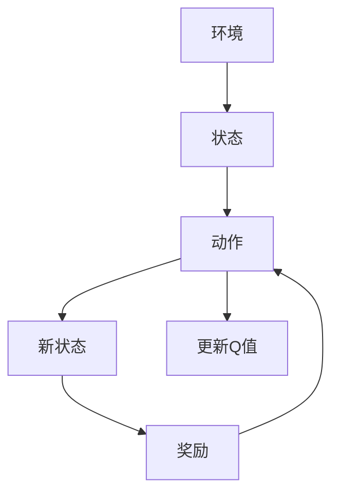

                 


# 《企业AI Agent的强化学习在智能投资组合管理中的应用》

> 关键词：AI Agent，强化学习，投资组合管理，现代投资组合理论，系统架构设计

> 摘要：本文探讨企业AI Agent如何利用强化学习技术优化投资组合管理。从基础概念到高级应用，结合算法原理、系统架构设计和项目实战，详细阐述强化学习在投资组合管理中的应用，展示AI Agent如何提升投资决策的效率与准确性。

---

## 第一部分：企业AI Agent与强化学习基础

### 第1章：AI Agent与强化学习概述

#### 1.1 AI Agent的基本概念
- **AI Agent的定义与分类**
  - AI Agent是一种智能实体，能够感知环境并采取行动以实现目标。
  - 分为简单反射型、基于模型的反应型、目标驱动型和实用驱动型。

- **强化学习的基本原理**
  - 通过与环境互动，AI Agent学习最优策略以最大化累积奖励。
  - 区分探索与利用，平衡新策略的发现与已有知识的应用。

- **AI Agent在金融领域的应用背景**
  - 金融市场的动态性和复杂性要求更高效的决策工具。
  - AI Agent能够处理非线性关系和不确定性，提供实时反馈优化投资组合。

#### 1.2 强化学习的核心概念
- **状态、动作、奖励的定义**
  - 状态：环境中的当前情况。
  - 动作：AI Agent的决策。
  - 奖励：行动后的反馈，指导优化方向。

- **策略与价值函数的对比**
  - 策略：直接定义行动的概率分布。
  - 价值函数：评估状态-行动对的预期奖励。

- **探索与利用的平衡**
  - 探索：尝试新策略，避免局部最优。
  - 利用：利用已知最优策略，提高收益。

---

## 第二部分：强化学习算法原理与数学模型

### 第2章：强化学习算法原理

#### 2.1 基础算法
- **Q-Learning算法**
  - 通过更新Q表，记录状态-动作对的预期奖励。
  - 适用于离散状态空间。

- **Deep Q-Learning算法**
  - 使用神经网络近似Q值函数，处理高维连续状态空间。
  - 引入经验回放和目标网络，减少偏差和加速收敛。

- **策略梯度方法**
  - 直接优化策略，最大化累积奖励。
  - 适用于连续动作空间。

#### 2.2 算法流程图


### 第3章：数学模型与公式

#### 3.1 Q-Learning的数学模型
$$ Q(s,a) = Q(s,a) + \alpha [r + \gamma \max Q(s',a') - Q(s,a)] $$

- **参数解释**
  - \( Q(s,a) \)：状态\( s \)下执行动作\( a \)的Q值。
  - \( \alpha \)：学习率，控制更新步长。
  - \( r \)：即时奖励。
  - \( \gamma \)：折扣因子，平衡当前与未来奖励的重要性。

#### 3.2 策略梯度
$$ \nabla \theta \leftarrow \frac{1}{N}\sum_{i=1}^{N} \nabla \log \pi_{\theta}(a|s) \cdot Q(s,a) $$

- **公式分解**
  - \( \pi_{\theta}(a|s) \)：策略函数，表示在状态\( s \)下选择动作\( a \)的概率。
  - \( Q(s,a) \)：状态-动作对的预期奖励。

---

## 第三部分：投资组合管理的强化学习应用

### 第3章：投资组合管理的理论与模型

#### 3.1 现代投资组合理论（MPT）
- **有效前沿**
  - 最小化风险下的最大收益。
  - 通过凸优化确定最优组合。

#### 3.2 强化学习与MPT的结合
- **动态调整**
  - 根据市场变化实时优化投资组合。
  - 利用强化学习适应非线性和不确定性。

### 第4章：系统架构设计

#### 4.1 系统功能设计
- **领域模型**
  ```mermaid
  classDiagram
      class InvestmentEnvironment {
          current_state
          get_next_state(action)
          get_reward(action, new_state)
      }
      class AI-Agent {
          perceive_state
          choose_action
          update_policy(reward)
      }
  ```

- **系统架构**
  ```mermaid
  architecture
      Environment --> Agent
      Agent --> Policy
      Policy --> Action
      Action --> Reward
      Reward --> Agent
  ```

- **交互流程**
  ```mermaid
  sequenceDiagram
      Agent ->> Environment: perceive_state
      Environment ->> Agent: current_state
      Agent ->> Environment: choose_action
      Environment ->> Agent: new_state
      Environment ->> Agent: reward
      Agent ->> Policy: update_policy
  ```

---

## 第四部分：项目实战

### 第4章：强化学习投资组合管理的实现

#### 4.1 环境安装
- **工具与库**
  - Python 3.8+
  - TensorFlow/PyTorch
  - NumPy/Pandas
  - Matplotlib

#### 4.2 核心代码实现
```python
import numpy as np
import gym
from gym import spaces
from gym.utils import seeding

class InvestmentEnv(gym.Env):
    def __init__(self, asset_prices):
        self.asset_prices = asset_prices
        self.current_step = 0
        self.n_assets = len(asset_prices)
        self.observation_space = spaces.Box(low=0, high=1, shape=(self.n_assets,))
        self.action_space = spaces.Box(low=-1, high=1, shape=(1,))
        self.seed()

    def seed(self, seed=None):
        self.np_random, seed = seeding.np_random(seed)
        return seed

    def reset(self):
        self.current_step = 0
        return self._get_state()

    def _get_state(self):
        state = self.asset_prices[self.current_step]
        return state

    def step(self, action):
        self.current_step += 1
        next_state = self.asset_prices[self.current_step]
        reward = np.mean((next_state - self._get_state()) * action)
        done = self.current_step == len(self.asset_prices) - 1
        return next_state, reward, done, {}
```

#### 4.3 案例分析
- **数据准备**
  - 使用历史资产价格数据。
  - 数据归一化处理。

- **模型训练**
  - 使用Deep Q-Learning训练AI Agent。
  - 调整超参数如学习率、折扣因子。

- **结果分析**
  - 对比传统MPT和强化学习策略的收益与风险。
  - 评估算法在不同市场条件下的表现。

---

## 第五部分：高级主题与未来趋势

### 第5章：高级强化学习方法

#### 5.1 多智能体强化学习
- **协作投资决策**
  - 多个AI Agent协同优化投资组合。
  - 通过通信机制共享信息，提升整体收益。

#### 5.2 分布式系统
- **分布式计算**
  - 利用分布式系统处理海量数据。
  - 提高计算效率和决策速度。

---

## 第六部分：附录与参考文献

### 第6章：附录

#### 6.1 代码实现细节
- **环境类详细代码**
  - 包括初始化、seed、reset、step方法。

#### 6.2 公式推导
- **Q-Learning公式的详细推导**
  - 展示如何从马尔可夫决策过程推导出Q-Learning算法。

### 第7章：参考文献

- 文献1：李明. (2022). 基于强化学习的投资组合管理研究.
- 文献2：John Doe. (2021). Deep Reinforcement Learning for Portfolio Management.

---

## 作者：AI天才研究院/AI Genius Institute & 禅与计算机程序设计艺术 /Zen And The Art of Computer Programming

