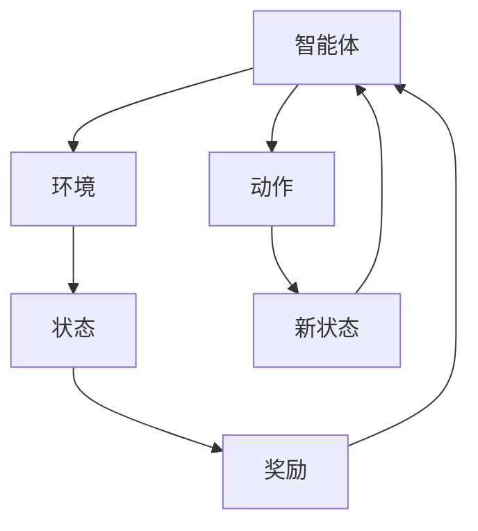
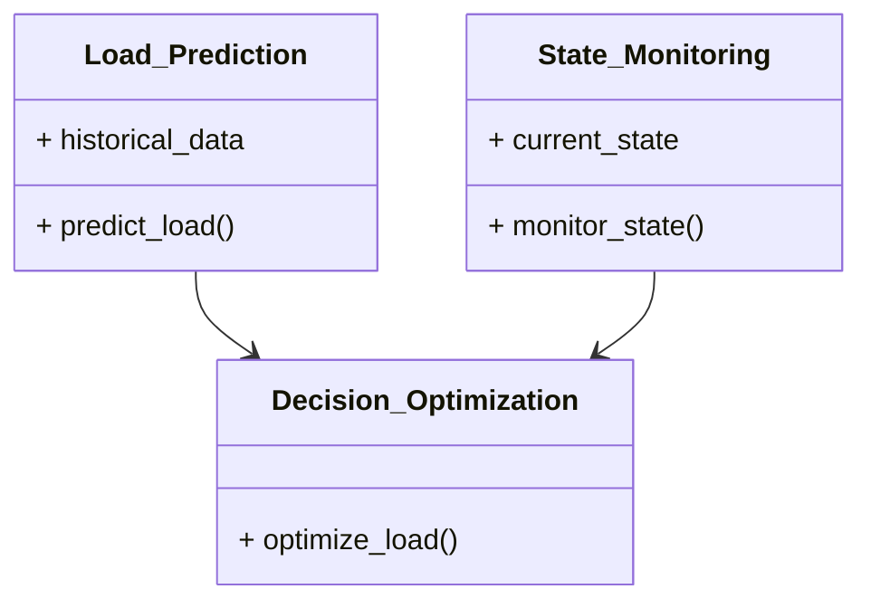

                 


# 企业AI Agent的强化学习在智能电网负载均衡与调度中的应用

> **关键词**: 智能电网, AI Agent, 强化学习, 负载均衡, 调度优化

> **摘要**: 本文深入探讨了企业AI Agent在智能电网负载均衡与调度中的应用，结合强化学习算法，分析了其在智能电网中的设计与实现。通过详细讲解强化学习的原理、算法实现、系统架构设计以及实际项目案例，展示了AI Agent如何通过强化学习实现智能电网的高效优化。本文适合对智能电网和人工智能技术感兴趣的读者阅读。

---

## 第一部分: 企业AI Agent与强化学习概述

### 第1章: 企业AI Agent的定义与应用背景

#### 1.1 智能电网与负载均衡调度的背景
智能电网是一种现代化的电力网络，能够实时监测和管理电力的生成、传输和消耗。其核心目标是通过智能化的技术手段，实现电力系统的高效、可靠和可持续运行。在智能电网中，负载均衡与调度是两个关键问题：负载均衡旨在在电网的不同节点之间合理分配电力负载，以避免局部过载和浪费；调度优化则是通过优化电力的生成和分配，确保电力供应的稳定性和经济性。

在智能电网中，负载均衡和调度优化问题具有以下特点：
- **动态性**: 电力需求和供应会随时间变化，需要实时调整。
- **多目标性**: 需要考虑经济性、可靠性和环保性等多个目标。
- **复杂性**: 涉及大量的变量和约束条件，难以通过传统的方法进行优化。

AI Agent（人工智能代理）作为一种能够感知环境、自主决策的智能体，非常适合用于解决智能电网中的负载均衡与调度问题。AI Agent能够根据电网的实时状态，自主做出最优决策，从而实现电网的高效管理。

#### 1.2 强化学习的基本概念
强化学习（Reinforcement Learning, RL）是一种机器学习范式，通过智能体与环境的交互，学习如何采取一系列行动以最大化累积的奖励。强化学习的核心要素包括：
- **状态（State）**: 智能体所处的环境状况。
- **动作（Action）**: 智能体在特定状态下采取的行为。
- **奖励（Reward）**: 环境对智能体行为的反馈，通常以数值形式表示。
- **策略（Policy）**: 智能体在给定状态下选择动作的概率分布。
- **值函数（Value Function）**: 表示从当前状态开始，按照策略执行能够获得的期望奖励。

强化学习与传统机器学习的区别在于，强化学习强调智能体与环境的交互，通过试错的方式逐步优化策略，而传统机器学习通常通过监督或无监督的方式学习数据的特征。

---

### 第2章: 强化学习在智能电网中的应用前景

#### 2.1 智能电网中的优化问题
智能电网中的优化问题主要包括以下三个方面的内容：
1. **负载均衡问题**: 如何在不同的时间、不同的节点之间合理分配电力负载，以避免局部过载和浪费。
2. **调度优化问题**: 如何优化电力的生成和分配，确保电力供应的稳定性和经济性。
3. **可再生能源的整合问题**: 如何将可再生能源（如风能、太阳能）纳入电力系统，实现绿色能源的最大化利用。

#### 2.2 AI Agent在智能电网中的优势
AI Agent在智能电网中的应用具有以下优势：
1. **自适应性与实时性**: AI Agent能够根据电网的实时状态，快速做出决策，适应电网的动态变化。
2. **多目标优化能力**: AI Agent可以通过强化学习优化多个目标（如经济性、可靠性和环保性）之间的平衡。
3. **分布式决策能力**: AI Agent可以在分布式系统中协同工作，实现局部优化到全局优化的转变。

---

## 第二部分: 强化学习算法原理与数学模型

### 第3章: 强化学习的核心算法

#### 3.1 Q-learning算法
Q-learning是一种经典的强化学习算法，适用于离线学习场景。其核心思想是通过更新Q值表（Q-table）来学习最优策略。Q值表中的每个元素表示从某个状态采取某个动作所能获得的最大期望奖励。

**Q-learning算法步骤**:
1. 初始化Q值表为零。
2. 在每个时间步，智能体根据当前状态选择一个动作。
3. 执行动作，观察环境的奖励，并更新Q值表。
4. 重复上述步骤，直到收敛。

**Q-learning算法的数学表达**:
$$ Q(s, a) \leftarrow Q(s, a) + \alpha [r + \gamma \max_{a'} Q(s', a') - Q(s, a)] $$
其中：
- \( \alpha \) 是学习率，\( 0 < \alpha < 1 \)。
- \( \gamma \) 是折扣因子，\( 0 \leq \gamma \leq 1 \)。

#### 3.2 Deep Q-Network (DQN) 算法
DQN是一种基于深度神经网络的强化学习算法，适用于高维状态空间和动作空间的问题。其核心思想是通过两个神经网络（主网络和目标网络）来近似Q值函数。

**DQN算法步骤**:
1. 初始化主网络和目标网络，参数分别为\( \theta \)和\( \theta' \)。
2. 在每个时间步，智能体根据当前状态选择一个动作。
3. 执行动作，观察环境的奖励，并将状态、动作和奖励存储在经验回放池中。
4. 从经验回放池中随机采样一批经验，更新主网络的参数。
5. 定期更新目标网络的参数。

**DQN算法的数学表达**:
$$ Q(s, a; \theta) \leftarrow Q(s, a; \theta) + \alpha [r + \gamma Q(s', a'; \theta') - Q(s, a; \theta)] $$

---

### 第4章: 强化学习的数学模型与公式

#### 4.1 状态空间与动作空间
- **状态空间（State Space）**: 智能体所处的所有可能状态的集合。
- **动作空间（Action Space）**: 智能体在每个状态下可以采取的所有可能动作的集合。

**状态-动作空间的转换**:
$$ s \in S, a \in A(s) $$

#### 4.2 奖励函数与目标函数
- **奖励函数（Reward Function）**: 根据智能体的动作和环境的反馈，返回一个奖励值。
- **目标函数（Objective Function）**: 强化学习的目标是最优化某种累积奖励。

**累积奖励的定义**:
$$ R = \sum_{t=1}^{\infty} \gamma^{t-1} r_t $$

---

### 第5章: 强化学习算法的实现流程

#### 5.1 算法流程图


#### 5.2 算法实现的代码框架
```python
class Agent:
    def __init__(self, state_space, action_space):
        self.state_space = state_space
        self.action_space = action_space
        # 初始化Q值表或神经网络模型
        self.model = self.build_model()

    def build_model(self):
        # 定义神经网络模型
        pass

    def act(self, state):
        # 根据当前状态选择动作
        pass

    def remember(self, state, action, reward, next_state):
        # 存储经验
        pass

    def replay(self, batch_size):
        # 回放经验并更新模型
        pass
```

---

## 第三部分: AI Agent在智能电网中的设计与实现

### 第6章: AI Agent的设计原理

#### 6.1 多智能体强化学习
在智能电网中，通常需要多个AI Agent协同工作，以实现全局优化。多智能体强化学习（Multi-Agent Reinforcement Learning, MARL）是一种研究多个智能体协作与竞争的强化学习范式。

**多智能体系统的优点**:
1. **分布式决策**: 每个智能体负责局部区域的优化，减少中心化决策的复杂性。
2. **任务分配**: 可以根据智能体的能力和环境的状态动态分配任务。

#### 6.2 AI Agent的通信与协作
在多智能体系统中，智能体之间的通信与协作是实现全局优化的关键。可以通过以下方式实现：
1. **状态共享**: 智能体之间共享环境的状态信息，以提高决策的准确性。
2. **动作协商**: 智能体之间通过协商确定最优动作。
3. **目标协调**: 根据全局目标分解局部目标，确保智能体之间的目标一致。

---

### 第7章: 系统分析与架构设计

#### 7.1 系统功能设计
智能电网AI Agent系统的功能模块包括：
1. **负荷预测模块**: 根据历史数据和天气等因素预测未来的电力需求。
2. **状态监测模块**: 实时监测电网的运行状态，包括电压、电流、负载等。
3. **决策优化模块**: 基于强化学习算法，优化电力的分配和调度。

**系统功能模块的类图**:


---

## 第四部分: 项目实战

### 第8章: 项目实战

#### 8.1 环境搭建
1. 安装Python和必要的库（如NumPy、TensorFlow、Keras）。
2. 安装强化学习框架（如OpenAI Gym）。
3. 配置开发环境（如Jupyter Notebook或VS Code）。

#### 8.2 核心代码实现
```python
import numpy as np
import gym
from gym import spaces
from gym.utils import seeding

class GridWorldEnv(gym.Env):
    def __init__(self, grid_size):
        self.grid_size = grid_size
        self.observation_space = spaces.Tuple([spaces.Discrete(grid_size) for _ in range(2)])
        self.action_space = spaces.Discrete(4)  # 上、下、左、右
        self.seed()

    def seed(self, seed=None):
        self.np_random, seed = seeding.np_random(seed)
        return seed

    def reset(self):
        self.state = (0, 0)
        return self.state

    def step(self, action):
        # 根据动作更新状态
        current_state = self.state
        if action == 0:
            next_state = (current_state[0], current_state[1] + 1)
        elif action == 1:
            next_state = (current_state[0], current_state[1] - 1)
        elif action == 2:
            next_state = (current_state[0] - 1, current_state[1])
        elif action == 3:
            next_state = (current_state[0] + 1, current_state[1])
        # 返回新状态、奖励、是否终止
        return next_state, 0, False, {}

    def render(self):
        pass
```

#### 8.3 案例分析
通过上述代码实现一个简单的强化学习环境，训练智能体在网格世界中导航。通过训练，智能体能够学会在复杂环境中做出最优决策。

---

## 第五部分: 总结与展望

### 第9章: 总结与展望

#### 9.1 全文总结
本文深入探讨了企业AI Agent在智能电网负载均衡与调度中的应用，结合强化学习算法，分析了其在智能电网中的设计与实现。通过详细讲解强化学习的原理、算法实现、系统架构设计以及实际项目案例，展示了AI Agent如何通过强化学习实现智能电网的高效优化。

#### 9.2 未来展望
未来的研究方向包括：
1. **分布式强化学习**: 研究如何在分布式系统中实现强化学习。
2. **多智能体协同优化**: 研究如何在多智能体系统中实现全局优化。
3. **实时性优化**: 研究如何提高强化学习算法的实时性，以适应智能电网的动态变化。

---

## 作者：AI天才研究院/AI Genius Institute & 禅与计算机程序设计艺术 /Zen And The Art of Computer Programming

