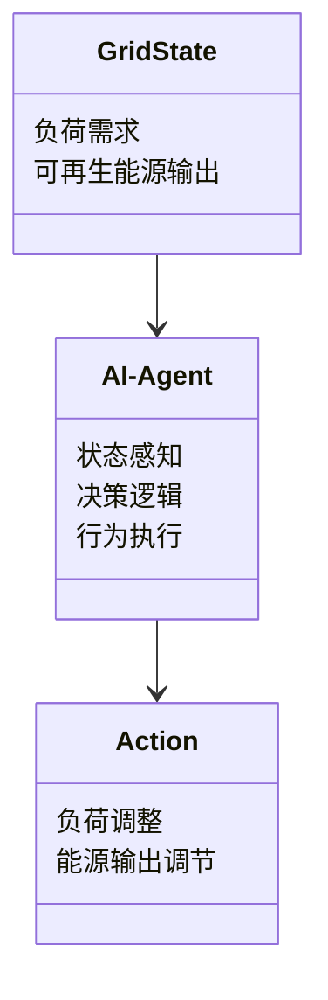
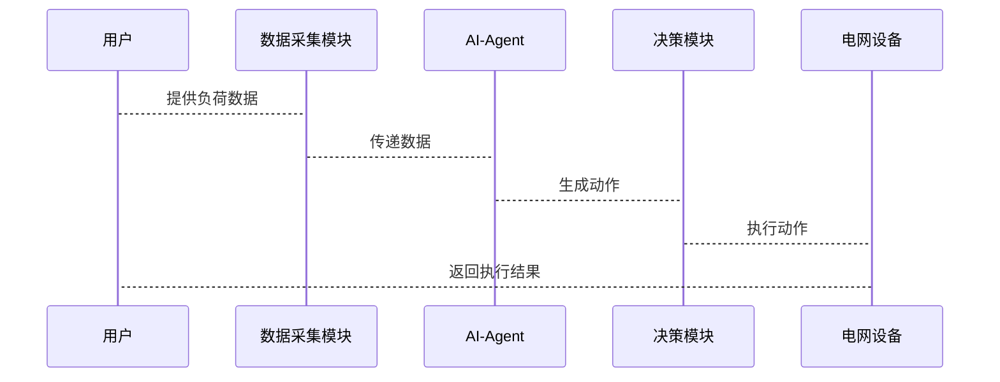

                 


# 企业AI Agent的强化学习在智能电网负载均衡中的应用

> 关键词：智能电网，AI Agent，强化学习，负载均衡，电力系统优化，能源管理

> 摘要：随着智能电网的快速发展，电力系统负载均衡问题变得日益复杂。本文探讨了如何通过AI Agent结合强化学习技术，实现智能电网中的负载均衡优化。文章从智能电网的基本概念出发，详细介绍了AI Agent和强化学习的核心原理，分析了强化学习在负载均衡中的具体应用，并通过实际案例展示了如何构建和训练强化学习模型以解决智能电网中的负载均衡问题。最后，文章总结了当前研究的成果与未来的研究方向。

---

## 第一部分：智能电网与AI Agent概述

### 第1章：智能电网的基本概念

#### 1.1 智能电网的定义与特点
智能电网是一种通过先进信息通信技术、自动控制技术以及能源管理技术，实现电力系统各个环节的智能化运行与管理的新型电力系统。其核心特点包括：
- **智能化**：利用AI、大数据等技术实现电网的智能决策与优化。
- **分布式**：支持分布式能源（如太阳能、风能）的接入与管理。
- **实时性**：能够实时监测和调整电网运行状态。
- **高效性**：通过优化配置实现能源的高效利用。

#### 1.2 AI Agent的定义与特点
AI Agent（人工智能代理）是一种能够感知环境、自主决策并采取行动的智能实体。其特点包括：
- **自主性**：能够在没有外部干预的情况下自主运行。
- **反应性**：能够实时感知环境变化并做出响应。
- **学习能力**：通过与环境的交互不断优化自身的决策策略。

#### 1.3 负载均衡问题
在智能电网中，负载均衡是指在电力系统中合理分配电力负荷，以避免某些区域过载而其他区域欠载的情况。解决负载均衡问题能够提高电力系统的稳定性和经济性。

---

### 第2章：强化学习的基本原理与算法

#### 2.1 强化学习的核心概念
强化学习是一种通过智能体与环境交互来学习最优策略的机器学习方法。其核心概念包括：
- **状态（State）**：智能体所处的环境状态。
- **动作（Action）**：智能体根据当前状态采取的行动。
- **奖励（Reward）**：智能体采取行动后所获得的反馈，用于指导学习方向。

#### 2.2 常见强化学习算法
- **Q-Learning**：基于值函数的强化学习算法，适用于离散状态和动作空间。
- **Deep Q-Networks (DQN)**：通过深度神经网络近似值函数的强化学习算法，适用于连续状态空间。
- **Policy Gradient Methods**：直接优化策略参数的强化学习方法。

#### 2.3 强化学习的数学模型
Q-Learning的数学公式：
$$ Q(s,a) = Q(s,a) + \alpha [r + \gamma \max Q(s',a') - Q(s,a)] $$

其中：
- $Q(s,a)$ 表示在状态 $s$ 下采取动作 $a$ 的价值。
- $\alpha$ 是学习率。
- $r$ 是奖励。
- $\gamma$ 是折扣因子。
- $Q(s',a')$ 是下一个状态的最大价值。

---

### 第3章：AI Agent在智能电网负载均衡中的应用

#### 3.1 智能电网负载均衡问题的背景
智能电网中的负载均衡问题主要体现在以下几个方面：
- **分布式能源接入**：随着可再生能源的广泛应用，电网需要能够动态调整负荷分配。
- **实时性要求高**：电力系统的负载变化速度快，需要实时调整。
- **多目标优化**：需要在经济性、可靠性和环保性之间找到平衡。

#### 3.2 AI Agent在负载均衡中的角色
AI Agent在智能电网中的负载均衡问题中扮演着决策者的角色，负责根据实时电网状态采取最优行动，例如：
- 调整分布式能源的输出功率。
- 优化负荷分配策略。
- 实时监控电网状态并做出响应。

#### 3.3 强化学习在负载均衡中的具体应用
- **状态空间的构建**：包括电网负荷、可再生能源输出、用户需求等。
- **动作空间的设计**：包括调整负荷分配、调节分布式能源输出等。
- **奖励函数的定义**：通常基于电网的稳定性、经济性和环保性等多目标。

---

## 第二部分：系统分析与架构设计

### 第4章：问题场景与系统功能设计

#### 4.1 问题场景介绍
智能电网中的负载均衡问题通常涉及以下几个关键因素：
- 用户负荷需求。
- 可再生能源的输出。
- 电网的传输容量。

#### 4.2 系统功能设计
- **数据采集**：实时采集电网负荷、分布式能源输出等数据。
- **状态识别**：根据实时数据识别当前电网状态。
- **决策制定**：基于强化学习算法生成最优动作。
- **反馈与优化**：根据执行结果调整策略，优化未来决策。

#### 4.3 领域模型与类图


---

### 第5章：系统架构与接口设计

#### 5.1 系统架构设计


#### 5.2 系统接口设计
- **输入接口**：实时数据采集接口。
- **输出接口**：负荷调整指令接口。
- **反馈接口**：电网状态反馈接口。

#### 5.3 交互流程图


---

## 第三部分：项目实战

### 第6章：环境安装与核心代码实现

#### 6.1 环境安装
- 安装Python环境。
- 安装必要的库（如TensorFlow、Keras）。
- 配置强化学习环境。

#### 6.2 核心代码实现
```python
import numpy as np
import gym

# 定义强化学习环境
class GridBalanceEnv(gym.Env):
    def __init__(self):
        # 状态空间：负荷需求、可再生能源输出
        self.observation_space = gym.spaces.Box(low=0, high=1000, shape=(2,))
        # 动作空间：负荷调整量
        self.action_space = gym.spaces.Box(low=-100, high=100, shape=(1,))
        self.current_state = None

    def step(self, action):
        # 执行动作并返回新的状态、奖励和终止标志
        self.current_state = self.current_state + action
        # 计算奖励
        reward = -abs(self.current_state[0] - self.current_state[1])
        done = False
        return self.current_state, reward, done, {}

    def reset(self):
        # 初始化状态
        self.current_state = np.array([500, 500])
        return self.current_state
```

#### 6.3 代码解读与分析
- **GridBalanceEnv类**：定义了强化学习环境，包括状态空间和动作空间。
- **step函数**：根据当前状态和动作计算新的状态、奖励和终止标志。
- **reset函数**：初始化环境状态。

---

### 第7章：实际案例分析与总结

#### 7.1 实际案例分析
通过训练强化学习模型，AI Agent能够根据实时电网状态动态调整负荷分配，从而实现负载均衡。例如：
- 在负荷需求增加时，AI Agent会优先调整分布式能源输出，以减少对传统电网的依赖。
- 在负荷需求减少时，AI Agent会降低分布式能源输出，避免能源浪费。

#### 7.2 案例分析结果
- **优化效果**：负载均衡模型能够显著提高电网的稳定性和经济性。
- **训练过程**：通过大量数据训练，AI Agent的决策能力逐步提升。

---

## 第四部分：总结与展望

### 第8章：总结与最佳实践

#### 8.1 本章总结
本文详细探讨了AI Agent结合强化学习技术在智能电网负载均衡中的应用，通过理论分析和实际案例展示了强化学习在智能电网中的巨大潜力。

#### 8.2 最佳实践
- **数据质量**：强化学习模型的性能高度依赖于数据的质量和多样性。
- **算法选择**：根据具体问题选择合适的强化学习算法。
- **系统设计**：合理设计系统架构，确保系统的实时性和稳定性。

#### 8.3 注意事项
- 强化学习模型需要持续优化，以适应电网环境的变化。
- 系统设计时需要考虑多种目标的平衡（如经济性、可靠性）。

---

## 作者

作者：AI天才研究院/AI Genius Institute & 禅与计算机程序设计艺术 /Zen And The Art of Computer Programming

---

本文通过详细分析智能电网中的负载均衡问题，探讨了AI Agent结合强化学习技术的应用潜力。通过理论分析和实际案例，展示了如何利用强化学习优化智能电网的运行效率。未来的研究可以进一步探索多目标优化、分布式计算等方向，以进一步提升智能电网的性能。

