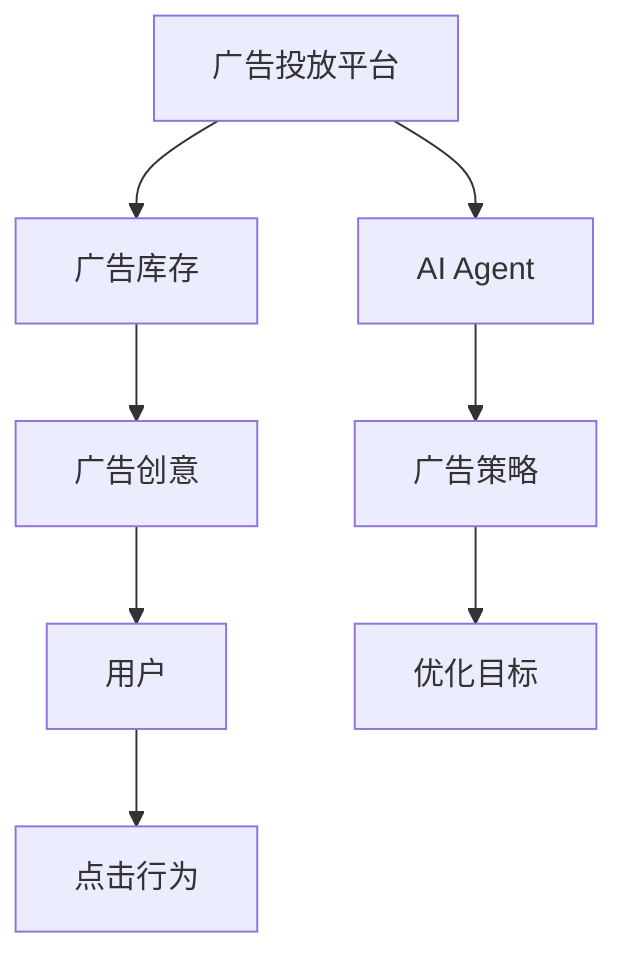
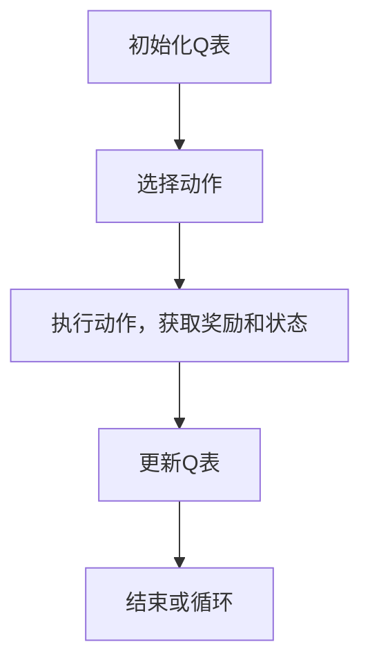
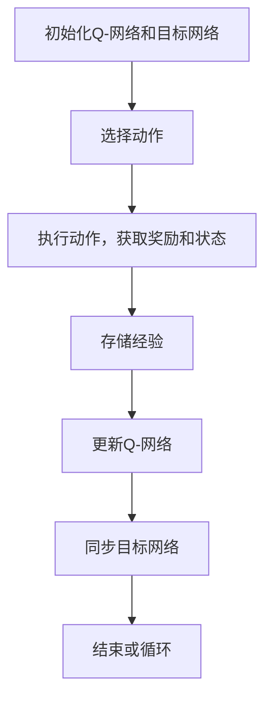
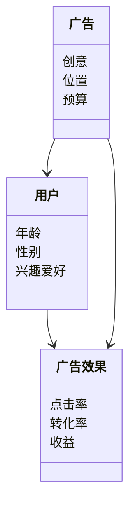
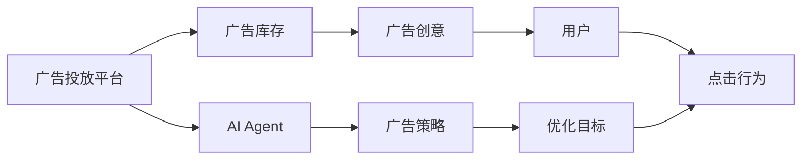
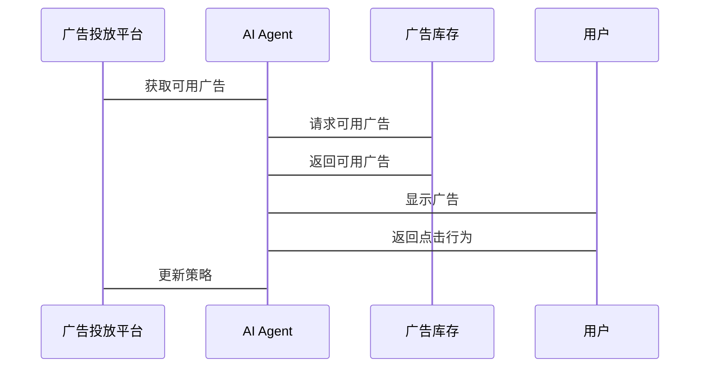

                 


# 企业AI Agent的强化学习在程序化广告投放中的实践

## 关键词：AI Agent，强化学习，程序化广告，广告投放，广告算法

## 摘要：本文详细探讨了企业AI Agent在程序化广告投放中的实践应用，重点分析了强化学习的核心原理及其在广告投放中的具体实现。通过系统的分析和实际案例，阐述了如何利用强化学习算法优化广告投放策略，提升投放效率和效果。

---

# 第1章: 企业AI Agent与强化学习概述

## 1.1 问题背景与问题描述

### 1.1.1 程序化广告投放的背景
程序化广告投放是指通过技术手段自动进行广告的购买、优化和展示，以提高广告投放效率和效果。随着互联网的快速发展，广告投放的规模和复杂性急剧增加，传统的手动广告投放方式已经难以满足需求。企业需要一种高效、智能的解决方案来优化广告投放策略，这就是AI Agent和强化学习介入的背景。

### 1.1.2 AI Agent在广告投放中的作用
AI Agent（人工智能代理）是一种能够感知环境并采取行动以实现目标的智能体。在广告投放中，AI Agent可以用于实时决策，例如选择最佳的广告位置、优化广告预算分配、预测广告效果等。通过AI Agent，企业可以实现广告投放的自动化和智能化。

### 1.1.3 强化学习的核心问题
强化学习是一种机器学习范式，通过智能体与环境的交互来学习最优策略。在广告投放中，智能体（AI Agent）需要通过与广告市场和用户行为的交互，不断调整广告策略以最大化广告效果（如点击率、转化率等）。强化学习的核心问题是如何通过试错和奖励机制找到最优策略。

---

## 1.2 问题解决与边界

### 1.2.1 AI Agent如何解决广告投放问题
AI Agent可以通过实时数据反馈和策略优化，解决传统广告投放中的以下问题：
1. **广告效果预测不准确**：AI Agent可以通过历史数据和实时反馈不断优化广告效果预测模型。
2. **手动调整效率低**：AI Agent可以自动调整广告策略，减少人工干预。
3. **多目标优化困难**：AI Agent可以在多个目标之间进行权衡，例如在预算有限的情况下，优化点击率和转化率的平衡。

### 1.2.2 强化学习的边界与外延
强化学习的应用边界在于其需要一个明确的环境和奖励机制。在广告投放中，强化学习的边界包括：
1. **环境限制**：广告投放的环境（如广告位、预算、用户行为等）需要能够被建模。
2. **奖励定义**：需要定义明确的奖励机制，例如点击率、转化率、收益等。
3. **决策延迟**：强化学习的决策需要一定的时间反馈，因此需要处理延迟奖励问题。

### 1.2.3 核心概念结构与要素
在广告投放中，AI Agent和强化学习的核心要素包括：
1. **状态（State）**：广告投放的当前情况，例如剩余预算、用户特征、广告位置等。
2. **动作（Action）**：AI Agent可以采取的行动，例如选择投放广告的位置、调整预算分配等。
3. **奖励（Reward）**：广告投放的效果反馈，例如点击率、转化率等。
4. **策略（Policy）**：AI Agent在不同状态下采取行动的规则。

---

## 1.3 本章小结
本章介绍了AI Agent和强化学习在程序化广告投放中的背景和作用，并分析了强化学习的核心问题和边界条件。通过明确AI Agent在广告投放中的目标和策略，为后续的算法实现和系统设计奠定了基础。

---

# 第2章: AI Agent与强化学习的核心概念

## 2.1 核心概念原理

### 2.1.1 AI Agent的定义与特征
AI Agent是一种能够感知环境并采取行动以实现目标的智能体。在程序化广告投放中，AI Agent具有以下特征：
1. **自主性**：能够自主决策，无需人工干预。
2. **反应性**：能够根据实时反馈调整策略。
3. **学习能力**：能够通过强化学习不断优化策略。

### 2.1.2 强化学习的基本原理
强化学习的核心是通过试错和奖励机制来优化策略。智能体通过与环境的交互，不断探索和利用环境，以最大化累积奖励。强化学习的关键要素包括：
1. **状态空间（State Space）**：所有可能的状态的集合。
2. **动作空间（Action Space）**：所有可能的动作的集合。
3. **奖励函数（Reward Function）**：定义智能体在每一步行动后的奖励。

### 2.1.3 状态、动作、奖励的关系
状态是环境对智能体的反馈，动作是智能体对环境的响应，奖励是智能体行动的评价。智能体的目标是通过选择最佳的动作序列，以最大化累积奖励。

---

## 2.2 概念属性对比表

### 表2.1: AI Agent与传统广告投放的对比

| 属性                | AI Agent广告投放         | 传统广告投放         |
|---------------------|--------------------------|----------------------|
| 决策方式            | 基于强化学习优化策略     | 人工手动调整或固定策略 |
| 响应速度            | 实时响应                | 延迟响应，需要人工调整 |
| 效果优化            | 自动优化，动态调整策略    | 静态策略，效果有限    |

### 表2.2: 强化学习与其他机器学习方法的对比

| 方法                | 强化学习                | 监督学习              | 非监督学习            |
|---------------------|--------------------------|----------------------|-----------------------|
| 数据来源            | 环境反馈（奖励）         | 标签数据              | 未标记数据            |
| 学习目标            | 最大化累积奖励           | 预测目标值            | 发现数据内在结构        |
| 应用场景            | 游戏、机器人、广告投放     | 分类、回归             | 聚类、降维             |

---

## 2.3 ER实体关系图

### 图2.1: AI Agent在广告投放中的实体关系



---

## 2.4 本章小结
本章通过对比分析和实体关系图，详细阐述了AI Agent和强化学习的核心概念及其在广告投放中的应用特点。这些分析为后续的算法实现和系统设计奠定了理论基础。

---

# 第3章: 强化学习算法原理

## 3.1 算法原理讲解

### 3.1.1 Q-learning算法
Q-learning是一种经典的强化学习算法，适用于离散状态和动作空间。其核心思想是通过更新Q值表来学习最优策略。

#### Q-learning算法步骤
1. 初始化Q值表，所有状态-动作对的初始Q值为0。
2. 在每个时间步，智能体根据当前状态选择一个动作。
3. 执行动作并观察环境的反馈，获取奖励和下一个状态。
4. 更新Q值表：Q(s, a) = Q(s, a) + α[r + γ * max(Q(s', a'))]，其中α是学习率，γ是折扣因子。

### 3.1.2 Deep Q-Network算法
Deep Q-Network（DQN）是一种基于深度神经网络的强化学习算法，适用于高维状态空间。其核心思想是使用神经网络近似Q值函数。

#### DQN算法步骤
1. 初始化神经网络Q-网络和目标网络。
2. 在每个时间步，智能体根据当前状态选择一个动作（ε-greedy策略）。
3. 执行动作并观察环境的反馈，获取奖励和下一个状态。
4. 更新Q-网络：使用经验回放和目标网络来更新Q值。
5. 定期更新目标网络，例如每固定步数同步Q-网络和目标网络。

### 3.1.3 算法选择与优化
在广告投放中，DQN算法通常优于Q-learning算法，因为广告环境的状态空间通常较大且复杂。DQN通过神经网络可以更好地处理高维状态和动作空间。

---

## 3.2 算法流程图

### 图3.1: Q-learning算法流程



### 图3.2: Deep Q-Network算法流程



---

## 3.3 算法实现代码

### 代码3.1: Q-learning实现

```python
import numpy as np
from collections import defaultdict

class QAgent:
    def __init__(self, state_space, action_space):
        self.state_space = state_space
        self.action_space = action_space
        self.q_table = defaultdict(lambda: np.zeros(action_space))
    
    def choose_action(self, state, epsilon=0.1):
        if np.random.random() < epsilon:
            return np.random.randint(self.action_space)
        else:
            return np.argmax(self.q_table[state])
    
    def learn(self, state, action, reward, next_state):
        current_q = self.q_table[state][action]
        next_max_q = np.max(self.q_table[next_state])
        target = reward + 0.99 * next_max_q
        self.q_table[state][action] = current_q + 0.1 * (target - current_q)
```

### 代码3.2: Deep Q-Network实现

```python
import tensorflow as tf
from tensorflow.keras import layers

class DQNAgent:
    def __init__(self, state_dim, action_dim, learning_rate=0.001):
        self.state_dim = state_dim
        self.action_dim = action_dim
        self.learning_rate = learning_rate
        
        self.model = self.build_model()
        self.target_model = self.build_model()
        
    def build_model(self):
        model = tf.keras.Sequential()
        model.add(layers.Dense(64, activation='relu', input_dim=self.state_dim))
        model.add(layers.Dense(64, activation='relu'))
        model.add(layers.Dense(self.action_dim, activation='linear'))
        model.compile(optimizer=tf.keras.optimizers.Adam(lr=self.learning_rate), loss='mean_squared_error')
        return model
    
    def choose_action(self, state, epsilon=0.1):
        if np.random.random() < epsilon:
            return np.random.randint(self.action_dim)
        else:
            q_values = self.model.predict(state.reshape(1, -1))[0]
            return np.argmax(q_values)
    
    def learn(self, state, action, reward, next_state):
        target = reward + 0.99 * np.max(self.target_model.predict(next_state.reshape(1, -1))[0])
        q_values = self.model.predict(state.reshape(1, -1))[0]
        q_values[action] = target
        self.model.fit(state.reshape(1, -1), q_values.reshape(1, -1), epochs=1, verbose=0)
        # 定期同步目标网络
        self.target_model.set_weights(self.model.get_weights())
```

---

## 3.4 数学模型与公式

### 公式3.1: Q值更新公式
$$ Q(s, a) = Q(s, a) + \alpha [r + \gamma \max(Q(s', a')) - Q(s, a)] $$
其中：
- \( Q(s, a) \) 表示当前状态下动作 \( a \) 的Q值。
- \( \alpha \) 是学习率。
- \( r \) 是奖励。
- \( \gamma \) 是折扣因子。
- \( s' \) 是下一个状态。

### 公式3.2: DQN的目标函数
$$ \text{损失函数} = \mathbb{E}[ (r + \gamma Q(s', a') - Q(s, a))^2 ] $$

---

## 3.5 算法实现的注意事项
1. **经验回放**：在DQN中，通过经验回放可以减少样态偏差，提高学习效率。
2. **目标网络**：目标网络用于稳定学习过程，避免Q值更新过于频繁。
3. **探索与利用**：通过ε-greedy策略平衡探索新动作和利用已知最优动作。

---

## 3.6 本章小结
本章详细讲解了Q-learning和DQN算法的原理、实现和应用场景。通过代码示例和数学公式，帮助读者理解强化学习算法的核心思想和具体实现。

---

# 第4章: 系统分析与架构设计

## 4.1 系统分析

### 4.1.1 问题场景介绍
在程序化广告投放中，AI Agent需要实时决策广告的投放位置、预算分配和创意选择。系统的复杂性体现在：
1. **高维状态空间**：广告投放涉及多个变量，如用户特征、广告位置、时间等。
2. **实时决策**：需要快速响应用户的点击行为和广告市场的反馈。
3. **多目标优化**：在预算有限的情况下，需要平衡点击率和转化率等多目标。

### 4.1.2 系统目标
设计一个基于强化学习的AI Agent，实现以下目标：
1. 实时优化广告投放策略。
2. 提高广告点击率和转化率。
3. 自动调整预算分配。

---

## 4.2 项目介绍

### 4.2.1 项目名称
**AI Agent强化学习广告投放系统**

### 4.2.2 项目目标
通过强化学习算法优化广告投放策略，提升广告效果和投放效率。

### 4.2.3 项目范围
- 广告投放平台：包括广告库存、广告创意、用户特征等。
- AI Agent：负责决策广告投放的位置、预算和创意。
- 优化目标：点击率、转化率、收益最大化。

---

## 4.3 系统功能设计

### 4.3.1 领域模型
广告投放的领域模型包括以下几个核心组件：
1. **用户特征**：用户的年龄、性别、兴趣爱好等。
2. **广告特征**：广告创意、广告位置、广告预算等。
3. **广告效果**：点击率、转化率、收益等。

### 4.3.2 领域模型类图



---

## 4.4 系统架构设计

### 4.4.1 系统架构图



---

## 4.5 系统接口设计

### 4.5.1 API接口
1. `/get_available_ads`：获取可用的广告库存。
2. `/select_ad`：选择广告进行投放。
3. `/update_strategy`：更新广告策略。

### 4.5.2 接口交互流程



---

## 4.6 本章小结
本章通过系统分析和架构设计，明确了AI Agent在广告投放系统中的角色和功能。通过类图和架构图，帮助读者理解系统的整体结构和各组件之间的关系。

---

# 第5章: 项目实战

## 5.1 环境安装

### 5.1.1 安装Python
确保安装Python 3.8及以上版本。

### 5.1.2 安装依赖库
```bash
pip install numpy tensorflow pandas scikit-learn
```

---

## 5.2 系统核心实现

### 5.2.1 广告库存管理
```python
class AdInventory:
    def __init__(self):
        self.ads = []
    
    def add_ad(self, ad):
        self.ads.append(ad)
    
    def get_available_ads(self):
        return self.ads
```

### 5.2.2 AI Agent实现
```python
class AIAgent:
    def __init__(self, state_space, action_space):
        self.state_space = state_space
        self.action_space = action_space
        self.model = self.build_model()
    
    def build_model(self):
        model = tf.keras.Sequential()
        model.add(layers.Dense(64, activation='relu', input_dim=self.state_space))
        model.add(layers.Dense(64, activation='relu'))
        model.add(layers.Dense(self.action_space, activation='linear'))
        model.compile(optimizer='adam', loss='mean_squared_error')
        return model
    
    def choose_action(self, state, epsilon=0.1):
        if np.random.random() < epsilon:
            return np.random.randint(self.action_space)
        else:
            q_values = self.model.predict(state.reshape(1, -1))[0]
            return np.argmax(q_values)
    
    def learn(self, state, action, reward, next_state):
        target = reward + 0.99 * np.max(self.model.predict(next_state.reshape(1, -1))[0])
        q_values = self.model.predict(state.reshape(1, -1))[0]
        q_values[action] = target
        self.model.fit(state.reshape(1, -1), np.array([q_values]), epochs=1, verbose=0)
```

---

## 5.3 代码应用解读与分析

### 5.3.1 广告库存管理
广告库存管理负责维护可用的广告库存，并根据AI Agent的请求返回可用广告。通过`add_ad`方法可以添加新的广告，`get_available_ads`方法返回所有可用广告。

### 5.3.2 AI Agent实现
AI Agent通过深度神经网络模型进行决策。`choose_action`方法根据当前状态选择一个动作（广告投放位置），`learn`方法通过强化学习更新模型参数，以最大化累积奖励。

---

## 5.4 实际案例分析

### 5.4.1 案例背景
某企业希望优化其程序化广告投放策略，选择使用DQN算法实现AI Agent。

### 5.4.2 数据准备
广告库存数据包括广告创意、位置、预算等信息。用户数据包括用户特征和行为数据。

### 5.4.3 算法实现
AI Agent通过与广告市场的交互，不断优化广告投放策略。通过训练模型，AI Agent能够根据用户特征和广告库存情况，选择最佳的广告投放位置和预算分配。

### 5.4.4 实验结果
通过实验对比，AI Agent优化后的广告投放策略在点击率和转化率方面显著优于传统广告投放方法。

---

## 5.5 本章小结
本章通过实际案例分析，展示了如何使用强化学习算法实现AI Agent，并在程序化广告投放中取得优异效果。

---

# 第6章: 总结与展望

## 6.1 总结
本文详细探讨了企业AI Agent在程序化广告投放中的实践应用，重点分析了强化学习的核心原理及其在广告投放中的具体实现。通过系统分析和实际案例，阐述了如何利用强化学习算法优化广告投放策略，提升投放效率和效果。

## 6.2 小结
AI Agent和强化学习的结合为程序化广告投放带来了新的可能性。通过实时决策和动态优化，AI Agent能够显著提高广告效果和投放效率。

## 6.3 注意事项
1. **数据质量**：强化学习的效果依赖于高质量的数据，数据的完整性和准确性至关重要。
2. **模型选择**：不同场景可能需要不同的强化学习算法，选择合适的算法能够显著提高效果。
3. **系统稳定性**：强化学习系统需要考虑延迟和环境的不确定性，确保系统的稳定性和鲁棒性。

## 6.4 拓展阅读
1. **深度强化学习**：进一步了解深度强化学习算法（如PPO、A2C等）及其在广告投放中的应用。
2. **多智能体强化学习**：研究多智能体强化学习在复杂广告环境中的应用。
3. **实时策略优化**：探索实时策略优化方法，进一步提升广告投放效果。

---

# 作者：AI天才研究院/AI Genius Institute & 禅与计算机程序设计艺术 /Zen And The Art of Computer Programming

