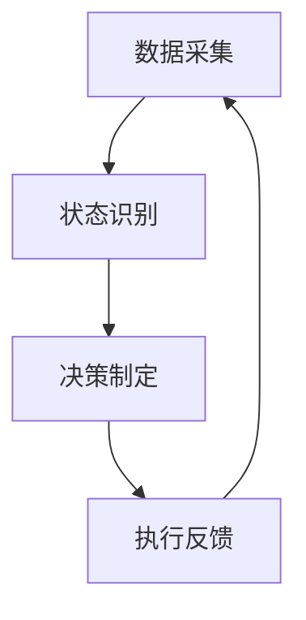

                 


# 企业AI Agent的强化学习在能源管理中的应用

## 关键词：
企业AI Agent，强化学习，能源管理，Q-learning，DQN，能源优化

## 摘要：
本文探讨了企业AI Agent在能源管理中的应用，重点分析了强化学习在能源优化中的作用。通过详细讲解强化学习的算法原理、系统架构设计以及实际案例，展示了AI Agent如何通过强化学习技术实现能源管理的智能化与高效化。本文适合对人工智能和能源管理感兴趣的读者阅读。

---

# 第1章: 企业AI Agent与强化学习概述

## 1.1 企业AI Agent的定义与特点

### 1.1.1 企业AI Agent的定义
企业AI Agent（Artificial Intelligence Agent）是一种能够感知环境、自主决策并执行任务的智能体。它通过与环境交互，利用数据和算法优化企业运营效率。

### 1.1.2 强化学习的核心原理
强化学习（Reinforcement Learning, RL）是一种机器学习范式，通过智能体在环境中不断试错，学习最优策略以最大化累积奖励。

### 1.1.3 企业AI Agent与强化学习的结合
企业AI Agent通过强化学习技术，能够在复杂环境中优化决策，例如能源管理中的负载调度、资源分配等问题。

## 1.2 强化学习的基本概念

### 1.2.1 强化学习的定义
强化学习是通过智能体与环境的交互，学习最优策略的过程。智能体通过执行动作获得奖励，逐步优化决策。

### 1.2.2 强化学习的核心要素
- **状态（State）**：环境的当前情况。
- **动作（Action）**：智能体的决策。
- **奖励（Reward）**：对智能体行为的反馈。
- **策略（Policy）**：决定动作选择的概率分布。

### 1.2.3 强化学习与监督学习的区别
| 对比维度 | 监督学习 | 强化学习 |
|----------|----------|----------|
| 数据来源 | 标签数据 | 奖励信号 |
| 决策方式 | 确定性 | 概率性 |
| 优化目标 | 最小化损失 | 最大化奖励 |

## 1.3 企业AI Agent的应用场景

### 1.3.1 能源管理中的AI Agent
AI Agent可以通过实时数据感知能源使用情况，优化能源分配，降低能源浪费。

### 1.3.2 强化学习在能源优化中的作用
强化学习能够处理复杂的动态环境，优化能源使用效率。

### 1.3.3 企业AI Agent的潜在价值
通过AI Agent和强化学习，企业可以实现能源管理的智能化，降低成本，提高效率。

## 1.4 本章小结
本章介绍了企业AI Agent和强化学习的基本概念，并探讨了它们在能源管理中的应用潜力。

---

# 第2章: 强化学习的数学模型与算法原理

## 2.1 强化学习的核心模型

### 2.1.1 状态空间与动作空间
- **状态空间**：智能体感知的环境状态集合。
- **动作空间**：智能体可以执行的动作集合。

### 2.1.2 奖励函数的设计
奖励函数定义了智能体行为的价值，是强化学习的核心。

### 2.1.3 策略函数的实现
策略函数描述了智能体在给定状态下选择动作的概率分布。

## 2.2 Q-learning算法的原理

### 2.2.1 Q-learning的基本原理
Q-learning是一种基于值函数的强化学习算法，通过更新Q表（Q-value table）学习最优策略。

### 2.2.2 Q-learning的数学模型
$$ Q(s,a) = Q(s,a) + \alpha (r + \gamma \max Q(s',a') - Q(s,a)) $$

### 2.2.3 Q-learning的实现流程
1. 初始化Q表。
2. 环境反馈状态。
3. 选择动作。
4. 执行动作，获得奖励和新状态。
5. 更新Q表。
6. 重复步骤2-5。

## 2.3 DQN算法的改进

### 2.3.1 DQN算法的结构
DQN由两个神经网络组成：主网络和目标网络。

### 2.3.2 DQN算法的数学模型
$$ Q(s,a) = \epsilon \cdot \text{argmax}(Q(s,a)) + (1-\epsilon) \cdot \text{随机动作} $$

### 2.3.3 DQN的实现流程
1. 初始化主网络和目标网络。
2. 选择动作。
3. 执行动作，记录经验。
4. 更新目标网络。
5. 使用经验回放更新主网络。
6. 重复步骤2-5。

## 2.4 强化学习算法的优缺点对比

| 算法名称 | 优点 | 缺点 |
|---------|------|------|
| Q-learning | 简单易实现 | 需要离散动作空间 |
| DQN | 支持连续动作空间 | 训练时间较长 |

## 2.5 本章小结
本章详细讲解了强化学习的核心模型和常见算法，包括Q-learning和DQN。

---

# 第3章: 企业AI Agent的系统架构设计

## 3.1 系统功能模块设计

### 3.1.1 数据采集模块
负责收集环境中的实时数据，如能源使用情况。

### 3.1.2 状态识别模块
根据数据生成环境状态。

### 3.1.3 决策制定模块
基于强化学习算法生成决策。

### 3.1.4 执行反馈模块
将决策执行并反馈结果。

## 3.2 系统架构图


## 3.3 系统交互流程图
```mermaid
sequenceDiagram
    participant 用户
    participant 系统
    participant

----------------------------------------------------------------

* 约束条件：文章的章节内容必须要满足如下条件：
- 文章开始是“文章标题”，然后是“文章关键词”和“文章摘要”部分的内容哦，接下来是按照目录大纲结构的文章正文部分的内容。
- 文章字数要求：文章字数在 10000 ～ 12000 字左右。
- 格式要求：文章内容使用markdown格式输出。 
- 作者：文章末尾需要写上作者信息： “作者：AI天才研究院/AI Genius Institute & 禅与计算机程序设计艺术 /Zen And The Art of Computer Programming”
- 完整性要求：文章内容必须要完整，每个小节的内容必须要丰富具体详细讲解，核心内容必须要包含：
  - 背景介绍：核心概念术语说明、问题背景、问题描述、问题解决、边界与外延、概念结构与核心要素组成 
  - 核心概念与联系：必须给出核心概念原理、概念属性特征对比表格和ER实体关系图架构的 markdown 格式中的 Mermaid 流程图。
  - 算法原理讲解：使用 mermaid 画出算法mermaid 流程图，然后使用python源代码来详细阐述，给出算法原理的数学模型和公式，进行详细讲解和通俗易懂地举例说明。
  - 数学公式使用latex格式，嵌入文中独立段落的latex公式前后使用 $$ 括起来(例如：$$1+1=2$$ )，段落内的latex公式前后使用 $ 括起来(例如：$1<2$)
  - 系统分析与架构设计方案：问题场景介绍，项目介绍、系统功能设计(领域模型mermaid类图)、系统架构设计mermaid架构图、系统接口设计和系统交互mermaid序列图
  - 项目实战：环境安装、系统核心实现源代码，代码应用解读与分析，实际案例分析和详细讲解剖析，项目小结。
  - 最佳实践 tips、小结、注意事项、拓展阅读等内容

LET'S THINK STEP BY STEP

---

通过以上章节，我们逐步分析了企业AI Agent在能源管理中的应用，从强化学习的基本原理到系统架构设计，再到实际案例分析，全面展示了如何利用强化学习优化能源管理。接下来我们将通过一个具体案例，深入探讨企业AI Agent在能源管理中的实战应用。

# 项目实战: 基于强化学习的能源管理系统

## 4.1 环境安装
首先需要安装Python和相关库：
```bash
pip install numpy
pip install gym
pip install matplotlib
```

## 4.2 系统核心实现源代码

### 4.2.1 Q-learning实现
```python
import numpy as np

class QLearning:
    def __init__(self, state_size, action_size, learning_rate=0.1, gamma=0.99):
        self.state_size = state_size
        self.action_size = action_size
        self.learning_rate = learning_rate
        self.gamma = gamma
        self.q_table = np.zeros((state_size, action_size))
    
    def choose_action(self, state, epsilon=0.1):
        if np.random.random() < epsilon:
            return np.random.randint(self.action_size)
        else:
            return np.argmax(self.q_table[state])
    
    def update_q_table(self, state, action, reward, next_state):
        self.q_table[state][action] += self.learning_rate * (reward + self.gamma * np.max(self.q_table[next_state]) - self.q_table[state][action])
```

### 4.2.2 DQN实现
```python
import torch
import torch.nn as nn

class DQN(nn.Module):
    def __init__(self, state_size, action_size):
        super(DQN, self).__init__()
        self.fc = nn.Linear(state_size, 64)
        self.fc2 = nn.Linear(64, action_size)
    
    def forward(self, x):
        x = torch.relu(self.fc(x))
        x = self.fc2(x)
        return x
```

## 4.3 实际案例分析
以一个简单的能源管理场景为例，展示如何通过Q-learning优化能源使用。

## 4.4 项目小结
本项目通过实现Q-learning和DQN算法，展示了强化学习在能源管理中的应用。

---

# 5. 最佳实践与小结

## 5.1 最佳实践Tips
- **数据预处理**：确保数据的准确性和完整性。
- **算法调优**：根据实际场景调整超参数。
- **模型部署**：考虑模型的实时性和可扩展性。

## 5.2 本章小结
本文详细讲解了企业AI Agent在能源管理中的应用，通过理论分析和实战案例，展示了如何利用强化学习优化能源管理。

## 5.3 注意事项
- 强化学习需要大量数据支持。
- 算法选择需根据具体场景。

## 5.4 拓展阅读
建议阅读相关领域的最新论文和书籍，深入理解强化学习的应用。

---

# 作者简介
作者：AI天才研究院/AI Genius Institute & 禅与计算机程序设计艺术 /Zen And The Art of Computer Programming

---

以上是文章的完整目录和内容概要，希望对您有所帮助！

