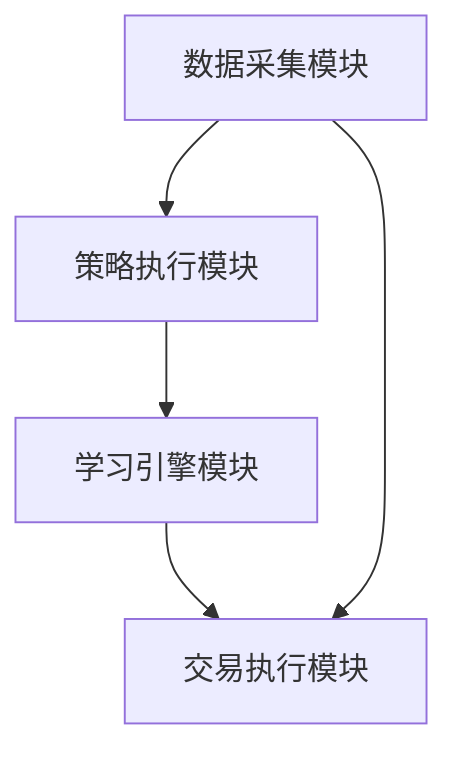

                 

# 企业AI Agent的强化学习在自动化交易策略中的应用

## 关键词：企业AI Agent、强化学习、自动化交易策略、金融交易、机器学习、算法优化

## 摘要：  
本文深入探讨了企业AI Agent在自动化交易策略中的应用，重点分析了强化学习算法在金融交易中的优势与挑战。通过详细讲解Q-learning、Deep Q-Networks（DQN）等核心算法的原理与实现，结合实际案例分析，展示了如何利用AI Agent构建高效、智能的自动化交易系统。文章还从系统架构设计、项目实战等方面，全面解析了强化学习在金融交易中的实际应用，为读者提供了从理论到实践的完整指南。

---

# 第一部分: 强化学习与AI Agent基础

## 第1章: 强化学习的基本原理

### 1.1 AI Agent的定义与特征
AI Agent（人工智能代理）是指能够感知环境、做出决策并采取行动的智能实体。在企业场景中，AI Agent可以用于自动化交易、库存管理、客户服务等多个领域。其核心特征包括：

1. **自主性**：能够在没有外部干预的情况下自主决策。
2. **反应性**：能够根据环境变化实时调整行为。
3. **目标导向**：以特定目标为导向，优化决策以实现目标。
4. **学习能力**：通过与环境交互不断优化自身策略。

### 1.2 强化学习的核心概念
强化学习（Reinforcement Learning, RL）是一种机器学习范式，通过智能体与环境的交互，智能体学习如何通过试错的方式优化自身策略，以最大化累计奖励。其核心要素包括：

1. **状态（State）**：环境在某一时刻的描述。
2. **动作（Action）**：智能体在某一状态下采取的行为。
3. **奖励（Reward）**：智能体采取动作后获得的反馈，用于指导学习。
4. **策略（Policy）**：智能体选择动作的概率分布。
5. **价值函数（Value Function）**：衡量状态或动作价值的函数。

### 1.3 强化学习在自动化交易中的应用
自动化交易是指通过算法自动执行买卖决策，减少人为干预。强化学习在自动化交易中的优势在于其能够通过与市场的交互不断优化交易策略。例如：

1. **高频交易**：通过快速决策捕捉短期价格波动。
2. **策略优化**：根据市场反馈动态调整交易策略。
3. **风险控制**：通过学习市场行为，降低交易风险。

---

## 第2章: 强化学习算法的数学模型与实现

### 2.1 Q-learning算法
Q-learning是一种经典的强化学习算法，适用于离散动作空间和状态空间的场景。其核心思想是通过更新Q表（Q-table）来记录状态-动作对的最优价值。

#### Q-learning的数学模型
$$ Q(s,a) = Q(s,a) + \alpha [r + \gamma \max Q(s',a') - Q(s,a)] $$  
其中：
- $Q(s,a)$：当前状态下采取动作$a$的Q值。
- $\alpha$：学习率。
- $r$：奖励。
- $\gamma$：折扣因子。
- $s'$：下一状态。

#### Q-learning的实现步骤
1. 初始化Q表。
2. 与环境交互，获取当前状态$s$和奖励$r$。
3. 更新Q表：$Q(s,a) = Q(s,a) + \alpha [r + \gamma \max Q(s',a') - Q(s,a)]$。
4. 重复步骤2-3，直到收敛。

### 2.2 Deep Q-Networks (DQN)
DQN是Q-learning的深度学习扩展，通过神经网络近似Q值函数，适用于连续动作空间和高维状态空间的场景。

#### DQN的网络结构
- **输入层**：接收状态$s$。
- **隐藏层**：通过神经网络计算Q值。
- **输出层**：输出动作$a$的Q值。

#### DQN的实现步骤
1. 初始化经验回放池（Experience Replay Buffer）。
2. 采样经验：从经验池中随机采样一批状态-动作-奖励-状态元组。
3. 训练神经网络：通过梯度下降优化Q值函数。
4. 更新目标网络：定期更新目标网络参数，以稳定训练。

### 2.3 策略梯度方法
策略梯度（Policy Gradient）是一种直接优化策略的强化学习方法，适用于连续动作空间的场景。

#### 策略梯度的数学模型
$$ \nabla \theta = \frac{1}{N}\sum_{i=1}^{N} \nabla \log \pi_\theta(a|s) Q(s,a) $$  
其中：
- $\pi_\theta(a|s)$：策略函数，表示在状态$s$下选择动作$a$的概率。
- $Q(s,a)$：状态-动作对的价值函数。

---

## 第3章: 自动化交易策略的设计与实现

### 3.1 交易系统的总体架构
自动化交易系统通常由以下几个模块组成：
1. **数据采集模块**：从金融市场获取实时数据。
2. **策略执行模块**：根据策略生成交易信号。
3. **学习引擎模块**：利用强化学习优化交易策略。

#### 交易系统的架构图

### 3.2 策略设计的核心要素
1. **状态空间**：包括当前价格、历史价格、成交量等。
2. **动作空间**：包括买入、卖出、持有等动作。
3. **奖励函数**：通常设计为最终的收益或收益的变化。

---

## 第4章: 强化学习在交易中的实际应用

### 4.1 高频交易中的强化学习
高频交易依赖于快速决策和高频执行。强化学习可以通过分析历史数据，快速优化交易策略，捕捉市场中的微小波动。

### 4.2 风险控制中的强化学习
强化学习可以通过学习市场的风险特征，动态调整交易策略，降低整体风险。

### 4.3 多资产配置中的强化学习
强化学习可以用于多资产配置，通过优化资产权重，实现风险-收益的最优平衡。

---

## 第5章: 项目实战

### 5.1 环境搭建
1. **安装必要的库**：如TensorFlow、Keras、NumPy等。
2. **数据准备**：获取金融市场的历史数据。

### 5.2 算法实现
1. **Q-learning的实现**：编写Q表更新的代码。
2. **DQN的实现**：搭建神经网络模型并进行训练。

### 5.3 案例分析
通过具体案例分析，展示强化学习在交易策略优化中的实际效果。

---

## 第6章: 最佳实践与注意事项

### 6.1 最佳实践
1. **数据质量**：确保数据的准确性和完整性。
2. **模型调参**：合理调整学习率、折扣因子等超参数。
3. **风险控制**：制定合理的风险管理策略。

### 6.2 注意事项
1. **市场变化**：模型需要不断更新以适应市场的变化。
2. **法律合规**：确保交易策略符合相关法律法规。

---

## 第7章: 小结与展望

### 7.1 小结
本文详细介绍了强化学习在企业AI Agent中的应用，重点分析了Q-learning、DQN等算法的原理与实现，并结合实际案例展示了如何利用这些算法优化交易策略。

### 7.2 展望
未来，随着AI技术的不断发展，强化学习在金融交易中的应用将更加广泛和深入。通过结合更多的市场数据和更复杂的模型，强化学习将为企业AI Agent在自动化交易策略中的应用提供更强大的支持。

---

## 作者：AI天才研究院/AI Genius Institute & 禅与计算机程序设计艺术 /Zen And The Art of Computer Programming

---

### 总结  
本文通过系统化的分析和详细的技术讲解，展示了强化学习在企业AI Agent中的重要应用。从算法原理到实际案例，从系统设计到项目实战，为读者提供了全面的视角。希望本文能够为从事相关领域的研究人员和实践者提供有价值的参考。

