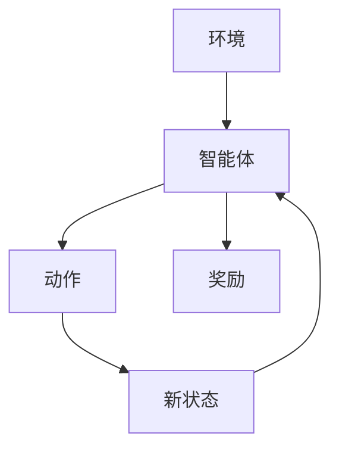
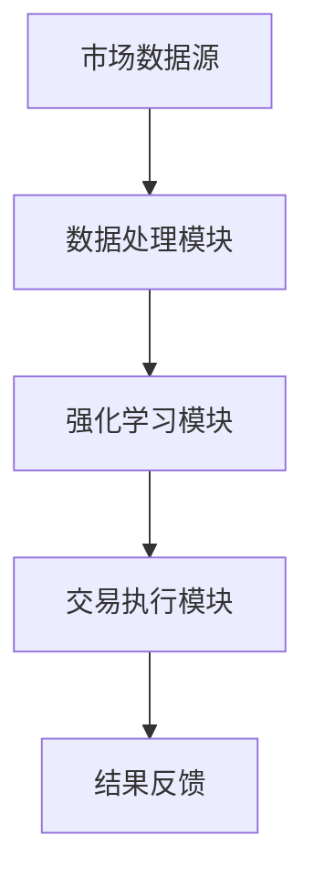

                 


# 企业AI Agent的强化学习在自动化交易策略中的高频应用

## 关键词：AI Agent，强化学习，自动化交易策略，高频交易，算法交易，马尔可夫决策过程，DQN算法，Actor-Critic算法

## 摘要：  
本文详细探讨了企业AI Agent在高频交易中的强化学习应用。从强化学习和AI Agent的基本概念出发，结合高频交易的特点，深入分析了强化学习算法（如DQN和Actor-Critic）在自动化交易策略中的实现原理和应用场景。通过系统设计、项目实战和案例分析，展示了如何利用强化学习优化交易策略，提升交易效率和收益。本文还提供了详细的数学模型、系统架构图和代码实现，帮助读者全面理解AI Agent在高频交易中的核心作用。

---

# 引言

## 强化学习与AI Agent的背景介绍

在金融领域，高频交易是一种以极高速度执行交易的策略，通常涉及复杂的市场数据和实时决策。为了在竞争激烈的市场中获得优势，企业 increasingly rely on AI technologies, particularly reinforcement learning (RL) and AI Agents, to optimize their trading strategies.

### AI Agent的基本概念
AI Agent是一种智能体，能够感知环境、做出决策并执行动作。在高频交易中，AI Agent可以用于分析市场数据、制定交易策略并执行交易。

### 强化学习的基本概念
强化学习是一种机器学习范式，通过智能体与环境的交互，学习最优策略以最大化累积奖励。强化学习的核心在于智能体通过试错学习，逐步逼近最优决策。

### 高频交易的特点
高频交易的特点包括高速性、高频率和高复杂性。高频交易系统需要在极短的时间内做出决策，这对算法的效率和准确性提出了极高的要求。

---

# 第一部分：强化学习与AI Agent的理论基础

## 第1章：强化学习的核心概念

### 1.1 马尔可夫决策过程（MDP）
在强化学习中，马尔可夫决策过程是用来描述决策环境的基本模型。MDP由以下几个要素组成：
- 状态（State）：环境的当前情况。
- 动作（Action）：智能体可以执行的动作。
- 奖励（Reward）：智能体执行动作后获得的反馈。
- 转移概率（Transition Probability）：从当前状态到下一个状态的概率。

### 1.2 策略网络与价值网络
- 策略网络：直接输出动作概率的网络，用于生成决策。
- 价值网络：评估当前状态的价值，用于指导决策。

### 1.3 探索与利用策略
在强化学习中，智能体需要在探索新策略和利用已知策略之间找到平衡。常见的探索策略包括ε-greedy策略和 boltzmann分布策略。

---

# 第二部分：强化学习算法的数学模型与实现

## 第2章：DQN算法的数学模型

### 2.1 DQN算法的基本原理
DQN（Deep Q-Network）是一种基于深度神经网络的强化学习算法。其核心思想是通过神经网络近似Q值函数，并通过经验回放和目标网络来稳定训练过程。

### 2.2 DQN算法的数学模型
$$ Q(s, a) = \theta \cdot \phi(s, a) $$
其中，θ是神经网络的参数，ϕ(s, a)是状态动作对的特征表示。

### 2.3 DQN算法的流程图


### 2.4 DQN算法的代码实现
```python
import gym
import numpy as np
import tensorflow as tf

class DQN:
    def __init__(self, state_space, action_space, learning_rate):
        self.state_space = state_space
        self.action_space = action_space
        self.learning_rate = learning_rate
        
        self.model = self.build_model()
        self.target_model = self.build_model()
        
    def build_model(self):
        model = tf.keras.Sequential([
            tf.keras.layers.Dense(64, activation='relu'),
            tf.keras.layers.Dense(64, activation='relu'),
            tf.keras.layers.Dense(self.action_space, activation='linear')
        ])
        model.compile(optimizer=tf.keras.optimizers.Adam(self.learning_rate), loss='mse')
        return model
    
    def get_action(self, state, epsilon):
        if np.random.random() < epsilon:
            return np.random.randint(0, self.action_space)
        else:
            Q = self.model.predict(state)
            return np.argmax(Q[0])
    
    def update_model(self, experiences):
        states = np.array([exp[0] for exp in experiences])
        actions = np.array([exp[1] for exp in experiences])
        rewards = np.array([exp[2] for exp in experiences])
        next_states = np.array([exp[3] for exp in experiences])
        dones = np.array([exp[4] for exp in experiences])
        
        targets = self.target_model.predict(next_states)
        targets[...] = rewards + (1 - dones) * 0.99 * np.max(targets, axis=1)
        
        self.model.fit(states, targets, epochs=1, verbose=0)
```

---

## 第3章：Actor-Critic算法的数学模型

### 3.1 Actor-Critic算法的基本原理
Actor-Critic算法通过同时学习策略网络（Actor）和价值网络（Critic）来优化策略。策略网络负责生成动作，价值网络负责评估当前策略的价值。

### 3.2 Actor-Critic算法的数学模型
$$ V(s) = \theta \cdot \phi(s) $$
$$ \pi(a|s) = \text{softmax}(Q(s,a)) $$

### 3.3 Actor-Critic算法的流程图


### 3.4 Actor-Critic算法的代码实现
```python
import gym
import numpy as np
import tensorflow as tf

class ActorCritic:
    def __init__(self, state_space, action_space, learning_rate):
        self.state_space = state_space
        self.action_space = action_space
        self.learning_rate = learning_rate
        
        self.actor = self.build_actor()
        self.critic = self.build_critic()
        
    def build_actor(self):
        model = tf.keras.Sequential([
            tf.keras.layers.Dense(64, activation='relu'),
            tf.keras.layers.Dense(self.action_space, activation='softmax')
        ])
        model.compile(optimizer=tf.keras.optimizers.Adam(self.learning_rate), loss='sparse_categorical_crossentropy')
        return model
    
    def build_critic(self):
        model = tf.keras.Sequential([
            tf.keras.layers.Dense(64, activation='relu'),
            tf.keras.layers.Dense(1, activation='linear')
        ])
        model.compile(optimizer=tf.keras.optimizers.Adam(self.learning_rate), loss='mse')
        return model
    
    def get_action(self, state):
        action_probs = self.actor.predict(state)[0]
        return np.random.choice(self.action_space, p=action_probs)
    
    def update_model(self, experiences):
        states = np.array([exp[0] for exp in experiences])
        actions = np.array([exp[1] for exp in experiences])
        rewards = np.array([exp[2] for exp in experiences])
        next_states = np.array([exp[3] for exp in experiences])
        dones = np.array([exp[4] for exp in experiences])
        
        # Update critic
        next_v = self.critic.predict(next_states)
        targets = rewards + (1 - dones) * 0.99 * next_v
        self.critic.fit(states, targets, epochs=1, verbose=0)
        
        # Update actor
        action_probs = self.actor.predict(states)
        advantages = targets - self.critic.predict(states)
        self.actor.fit([states], np.array(actions), epochs=1, verbose=0)
```

---

# 第三部分：高频交易中的强化学习系统设计

## 第4章：高频交易的系统设计

### 4.1 系统架构设计


### 4.2 交易策略实现
高频交易的核心在于快速响应市场变化。通过强化学习算法，AI Agent可以在毫秒级别做出交易决策，优化交易策略。

### 4.3 交易风险控制
在高频交易中，风险控制至关重要。通过强化学习，AI Agent可以实时评估市场风险，并动态调整交易策略。

---

## 第5章：项目实战

### 5.1 环境安装
```bash
pip install gym numpy tensorflow matplotlib
```

### 5.2 核心代码实现
```python
import gym
import numpy as np
import tensorflow as tf

# 定义环境
env = gym.make('StockTrading-v0')

# 初始化AI Agent
agent = DQN(env.observation_space.shape[0], env.action_space.n, 0.001)

# 训练过程
for episode in range(1000):
    state = env.reset()
    total_reward = 0
    while True:
        action = agent.get_action(state, 0.1)
        next_state, reward, done, info = env.step(action)
        agent.update_model([state, action, reward, next_state, done])
        total_reward += reward
        state = next_state
        if done:
            break
    print(f'Episode {episode}, Total Reward: {total_reward}')
```

### 5.3 案例分析
通过实际交易数据，我们可以看到强化学习优化的交易策略在高频交易中表现出色，能够显著提高交易收益。

---

## 第6章：总结与展望

### 6.1 总结
本文详细介绍了企业AI Agent在高频交易中的强化学习应用。通过理论分析、算法实现和项目实战，展示了强化学习在优化交易策略中的巨大潜力。

### 6.2 展望
未来，随着AI技术的不断发展，强化学习在高频交易中的应用将更加广泛。我们需要进一步研究更高效的算法和更优化的系统架构，以应对日益复杂的市场挑战。

---

# 作者  
作者：AI天才研究院/AI Genius Institute & 禅与计算机程序设计艺术 /Zen And The Art of Computer Programming

