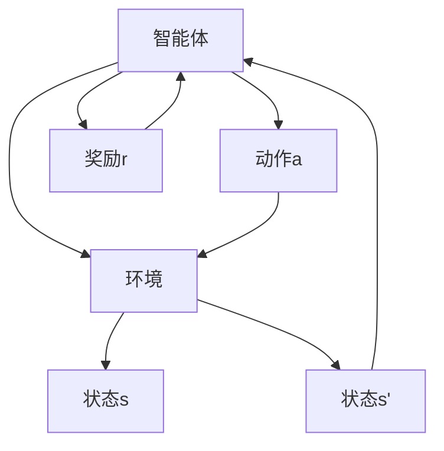
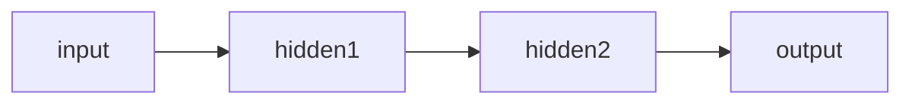
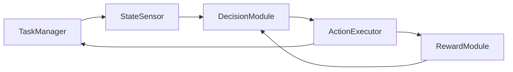

                 


# 企业AI Agent的强化学习在自动化运维中的应用

> 关键词：企业AI Agent, 强化学习, 自动化运维, 系统架构, 项目实战

> 摘要：本文详细探讨了企业AI Agent在自动化运维中的应用，重点分析了强化学习在其中的关键作用。通过理论与实践相结合的方式，文章详细讲解了强化学习的基本原理、算法实现、系统架构设计以及实际项目中的应用场景，帮助读者全面理解并掌握企业AI Agent在自动化运维中的应用技术。

---

## 第一部分: 企业AI Agent与强化学习概述

### 第1章: 企业AI Agent与强化学习概述

#### 1.1 企业AI Agent的基本概念

##### 1.1.1 什么是企业AI Agent

企业AI Agent是一种能够感知环境、自主决策并执行任务的智能实体。它通过强化学习等技术，能够在复杂环境中优化操作流程，提高效率。

**定义：**  
企业AI Agent是一种智能体，具备以下特征：  
- **自主性：** 能够自主决策，无需人工干预。  
- **反应性：** 能够实时感知环境并做出反应。  
- **目标导向：** 以特定目标为导向，优化操作流程。  

##### 1.1.2 AI Agent的核心特征

| 特征 | 描述 |
|------|------|
| 自主性 | 能够独立决策，无需外部干预。 |
| 反应性 | 能够实时感知环境并做出反应。 |
| 目标导向 | 以特定目标为导向，优化操作流程。 |
| 学习能力 | 能够通过强化学习不断优化策略。 |

##### 1.1.3 强化学习在AI Agent中的作用

强化学习通过与环境的交互，不断优化策略，使AI Agent能够在复杂环境中做出最优决策。它是实现AI Agent自主性、目标导向和学习能力的核心技术。

#### 1.2 强化学习的基本原理

##### 1.2.1 强化学习的定义与特点

- **定义：** 强化学习是一种通过试错方式来学习策略的方法，智能体通过与环境交互，逐步优化其行为策略以最大化累积奖励。  
- **特点：**  
  - 基于试错学习。  
  - 通过奖励函数引导行为。  
  - 适用于复杂动态环境。

##### 1.2.2 强化学习的核心要素

| 要素 | 描述 |
|------|------|
| 状态空间 (State Space) | 环境中的各种状态，表示智能体所处的环境。 |
| 动作空间 (Action Space) | 智能体可执行的动作。 |
| 奖励函数 (Reward Function) | 对智能体行为的评价，引导其学习目标。 |
| 策略 (Policy) | 智能体在给定状态下的动作选择策略。 |

##### 1.2.3 强化学习与监督学习的区别

| 方面 | 监督学习 | 强化学习 |
|------|---------|----------|
| 数据来源 | 标签数据 | 奖励信号 |
| 目标 | 最小化误差 | 最大化累积奖励 |
| 交互方式 | 非交互式 | 交互式 |

#### 1.3 企业AI Agent在自动化运维中的应用背景

##### 1.3.1 自动化运维的现状与挑战

- **现状：** 当前自动化运维主要依赖脚本和工具，效率有限，难以应对复杂场景。  
- **挑战：**  
  - 环境动态变化，难以预测。  
  - 任务复杂，需要智能决策。  
  - 系统耦合度高，需要协调多个组件。  

##### 1.3.2 AI Agent在运维中的潜在价值

- **提升效率：** AI Agent能够自动处理复杂任务，减少人工干预。  
- **增强决策能力：** 通过强化学习优化决策，提高系统稳定性。  
- **降低风险：** 智能决策减少人为错误，降低系统故障风险。  

##### 1.3.3 强化学习在运维自动化中的优势

- **适应性：** 强化学习能够适应动态变化的环境，优化决策策略。  
- **可扩展性：** 适用于复杂场景，能够处理多目标优化问题。  
- **高效性：** 通过强化学习快速找到最优解决方案。  

---

## 第二部分: 强化学习算法原理

### 第2章: 强化学习算法基础

#### 2.1 强化学习的核心算法

##### 2.1.1 Q-learning算法

Q-learning是一种基于值函数的强化学习算法，通过更新Q表（Q-value table）来学习最优策略。

**公式：**  
$$ Q(s, a) \leftarrow Q(s, a) + \alpha [r + \gamma \max Q(s', a') - Q(s, a)] $$  

其中：  
- \( Q(s, a) \)：状态s下动作a的Q值。  
- \( \alpha \)：学习率。  
- \( r \)：奖励值。  
- \( \gamma \)：折扣因子。  
- \( s' \)：下一步状态。  

**流程图：**



##### 2.1.2 Deep Q-Network (DQN)算法

DQN通过深度神经网络近似Q值函数，解决了Q-learning在高维状态空间中的计算问题。

**核心结构：**  
- **输入：** 状态s。  
- **输出：** 各动作的Q值。  

**网络结构图：**



##### 2.1.3 Policy Gradient方法

Policy Gradient通过直接优化策略来最大化期望奖励，适用于连续动作空间。

**策略梯度公式：**  
$$ \nabla \theta \leftarrow \frac{1}{N} \sum_{i=1}^{N} \nabla \log \pi_\theta(a|s) Q_\theta(s, a) $$  

#### 2.2 强化学习的数学模型

##### 2.2.1 状态空间与动作空间

- **状态空间 (S):** 所有可能的状态集合。  
- **动作空间 (A):** 所有可能的动作集合。  

##### 2.2.2 奖励函数的设计

奖励函数是强化学习的核心，用于引导智能体的行为。

**示例：**  
$$ r(s, a, s') = \begin{cases} 
1 & \text{if } s' \text{是目标状态} \\
0 & \text{否则}
\end{cases} $$  

##### 2.2.3 动作价值函数 (Q-value function)

Q值函数表示在状态s下执行动作a的预期奖励。

$$ Q(s, a) = \mathbb{E}[r + \gamma Q(s', a')] $$  

#### 2.3 强化学习算法的实现步骤

##### 2.3.1 环境与智能体的交互


##### 2.3.2 状态、动作、奖励的传递

- 状态s传递给智能体，智能体选择动作a并执行。  
- 环境返回新的状态s'和奖励r。  

##### 2.3.3 策略更新与模型训练

- 根据奖励更新Q值或策略参数。  
- 通过反向传播优化神经网络模型。  

---

## 第三部分: 企业AI Agent的设计与实现

### 第3章: 企业AI Agent的设计原理

#### 3.1 AI Agent的体系结构

##### 3.1.1 单智能体与多智能体架构

- **单智能体：** 单一智能体完成所有任务。  
- **多智能体：** 多个智能体协同完成任务，适用于复杂场景。  

**对比表：**

| 特性 | 单智能体 | 多智能体 |
|------|----------|----------|
| 优势 | 简单易实现 | 协作能力强 |
| 劣势 | 适应性差 | 协调复杂 |

##### 3.1.2 分层架构设计

- **感知层：** 采集环境数据。  
- **决策层：** 制定决策策略。  
- **执行层：** 执行具体操作。  

##### 3.1.3 基于强化学习的决策层设计

- 决策层通过强化学习优化策略，实现最优决策。  

#### 3.2 强化学习在AI Agent中的应用

##### 3.2.1 状态表示与特征提取

- 状态表示：将环境信息转化为状态向量。  
- 特征提取：提取关键特征，降低维度。  

##### 3.2.2 动作选择与策略优化

- 动作选择：基于当前状态选择最优动作。  
- 策略优化：通过强化学习不断优化策略参数。  

##### 3.2.3 奖励机制的设计与实现

- 设计奖励函数，确保奖励与目标一致。  

#### 3.3 企业AI Agent的关键技术

##### 3.3.1 状态空间压缩技术

- 使用降维技术（如PCA）压缩状态空间。  

##### 3.3.2 动作选择的高效性优化

- 通过优先队列优化动作选择效率。  

##### 3.3.3 奖励函数的动态调整

- 根据环境变化动态调整奖励函数。  

---

## 第四部分: 系统架构与实现

### 第4章: 系统架构设计

#### 4.1 系统模块划分

##### 4.1.1 任务管理模块

- **功能：** 管理任务队列，分配任务给智能体。  
- **接口：** 提供任务添加、删除和查询功能。  

##### 4.1.2 状态感知模块

- **功能：** 实时感知系统状态，收集环境数据。  
- **接口：** 提供状态数据接口，供决策模块调用。  

##### 4.1.3 策略执行模块

- **功能：** 执行决策模块生成的策略，输出执行结果。  
- **接口：** 提供执行操作接口，供任务管理模块调用。  

##### 4.1.4 奖励机制模块

- **功能：** 根据执行结果生成奖励信号。  
- **接口：** 提供奖励信号接口，供决策模块优化策略。  

#### 4.2 系统架构设计

##### 4.2.1 系统交互流程



##### 4.2.2 系统功能设计

- **任务管理：** 负责任务的分配与调度。  
- **状态感知：** 实时采集系统状态数据。  
- **决策模块：** 基于强化学习优化决策策略。  
- **策略执行：** 执行决策模块生成的策略。  
- **奖励机制：** 根据执行结果生成奖励信号。  

---

## 第五部分: 项目实战

### 第5章: 项目实战

#### 5.1 环境搭建

##### 5.1.1 安装依赖

```bash
pip install numpy matplotlib tensorflow
```

#### 5.2 核心代码实现

##### 5.2.1 强化学习算法实现

```python
import numpy as np

class QLearning:
    def __init__(self, state_space_size, action_space_size, alpha=0.1, gamma=0.9):
        self.Q = np.zeros((state_space_size, action_space_size))
        self.alpha = alpha
        self.gamma = gamma

    def choose_action(self, state):
        return np.argmax(self.Q[state, :])

    def update_Q(self, state, action, reward, next_state):
        self.Q[state, action] += self.alpha * (reward + self.gamma * np.max(self.Q[next_state, :]) - self.Q[state, action])

# 示例用法
ql = QLearning(5, 3)
state = 0
action = ql.choose_action(state)
reward = 1
next_state = 2
ql.update_Q(state, action, reward, next_state)
```

##### 5.2.2 系统交互实现

```python
class SystemInterface:
    def __init__(self):
        self.state = 0
        self.reward = 0

    def get_state(self):
        return self.state

    def execute_action(self, action):
        # 模拟执行动作
        self.state = (self.state + action) % 5
        return 1 if action == 2 else 0

    def get_reward(self):
        return self.reward

# 示例用法
system = SystemInterface()
agent = QLearning(5, 3)
state = system.get_state()
action = agent.choose_action(state)
reward = system.execute_action(action)
next_state = system.get_state()
agent.update_Q(state, action, reward, next_state)
```

#### 5.3 案例分析

##### 5.3.1 案例背景

假设我们有一个需要优化的任务调度系统，需要通过强化学习优化任务分配策略。

##### 5.3.2 案例实现

```python
import numpy as np

class TaskScheduler:
    def __init__(self, tasks, agents):
        self.tasks = tasks
        self.agents = agents
        self.current_task = 0

    def get_current_task(self):
        return self.current_task

    def assign_task(self, agent_id):
        if self.current_task < len(self.tasks):
            self.current_task += 1
            return True
        return False

    def get_reward(self):
        return 1 if self.current_task < len(self.tasks) else -1

# 示例用法
tasks = ['task1', 'task2', 'task3', 'task4', 'task5']
agents = 2
scheduler = TaskScheduler(tasks, agents)
agent = QLearning(5, 3)

for _ in range(10):
    state = scheduler.get_current_task()
    action = agent.choose_action(state)
    reward = scheduler.execute_action(action)
    next_state = scheduler.get_current_task()
    agent.update_Q(state, action, reward, next_state)
```

---

## 第六部分: 最佳实践与小结

### 第6章: 最佳实践与小结

#### 6.1 最佳实践

- **环境建模：** 精心设计状态空间和动作空间，确保模型能够准确反映实际情况。  
- **奖励设计：** 设计合理的奖励函数，引导智能体朝着目标方向优化。  
- **模型调优：** 通过实验不断调整模型参数，提高学习效率。  

#### 6.2 小结

本文详细介绍了企业AI Agent的强化学习在自动化运维中的应用，从理论到实践，全面讲解了强化学习的基本原理、系统架构设计以及实际项目中的实现细节。通过本文的学习，读者能够掌握如何将强化学习应用于企业运维场景，提升系统的智能化水平。

---

## 作者

作者：AI天才研究院/AI Genius Institute & 禅与计算机程序设计艺术 /Zen And The Art of Computer Programming

