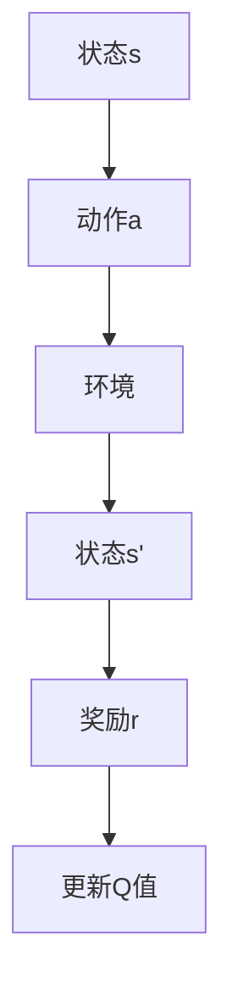
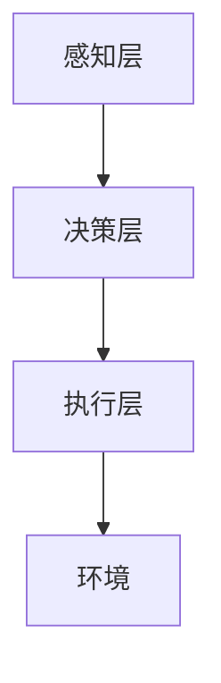

                 


# 企业AI Agent的强化学习在金融交易中的应用

## 关键词：AI Agent，强化学习，金融交易，算法，系统架构

## 摘要：  
本文探讨了企业AI Agent在金融交易中的应用，重点分析了强化学习在金融交易中的潜力与实现。通过详细讲解强化学习的基本原理、算法实现、系统架构设计，以及实际案例分析，本文为读者提供了从理论到实践的全面指导。文章旨在帮助读者理解如何利用强化学习构建高效的AI Agent，以优化金融交易策略并提升投资回报。

---

## 第1章: AI Agent与强化学习概述

### 1.1 AI Agent的基本概念  
AI Agent（人工智能代理）是一种能够感知环境、自主决策并执行任务的智能体。它能够根据当前状态和历史信息做出最优决策，适用于复杂的动态环境。  

#### 1.1.1 什么是AI Agent  
AI Agent是一种智能系统，能够：  
- **感知环境**：通过传感器或数据源获取信息。  
- **自主决策**：基于感知信息，选择最优动作。  
- **执行任务**：通过执行器或API与外部环境交互。  

#### 1.1.2 AI Agent的核心特征  
1. **自主性**：无需外部干预，自主决策。  
2. **反应性**：能够实时感知环境变化并调整策略。  
3. **目标导向**：以特定目标为导向，优化决策过程。  
4. **学习能力**：通过经验改进性能。  

#### 1.1.3 AI Agent的分类与应用场景  
AI Agent主要分为两类：  
- **简单反射型**：基于规则的简单决策，适用于静态环境。  
- **学习型**：通过机器学习算法优化决策，适用于动态环境。  

应用场景：  
- 金融交易：股票买卖、资产配置。  
- 自动驾驶：路径规划、障碍规避。  
- 游戏AI：策略优化、复杂决策。  

---

### 1.2 强化学习的基本原理  
强化学习（Reinforcement Learning，RL）是一种通过试错机制优化决策的机器学习方法。  

#### 1.2.1 强化学习的定义与特点  
- **定义**：智能体通过与环境交互，学习最优策略以最大化累计奖励。  
- **特点**：  
  1. **试错性**：通过不断尝试动作，学习最优策略。  
  2. **延迟奖励**：奖励可能在多个动作后才获得。  
  3. **动态性**：环境状态可能随时间变化。  

#### 1.2.2 强化学习的核心要素  
1. **状态（State）**：智能体所处的环境情况。  
2. **动作（Action）**：智能体采取的决策行为。  
3. **奖励（Reward）**：环境对动作的反馈，用于指导学习。  

#### 1.2.3 强化学习与监督学习的区别  
| 对比项 | 监督学习 | 强化学习 |
|-------|---------|----------|
| 数据来源 | 标签化数据 | 环境反馈 |
| 目标 | 最小化预测误差 | 最大化累计奖励 |
| 交互方式 | 单向输入 | 双向交互 |

---

### 1.3 强化学习在金融交易中的潜力  
#### 1.3.1 金融交易中的决策问题  
- 股票交易：何时买入、卖出，如何优化投资组合。  
- 资产配置：如何在不同资产间分配资金以最大化收益。  
- 风险控制：如何在高风险环境下降低损失。  

#### 1.3.2 强化学习在金融交易中的优势  
1. **动态适应性**：能够实时调整策略，适应市场变化。  
2. **数据驱动**：基于大量历史数据学习最优策略。  
3. **自动化决策**：减少人为干预，提高交易效率。  

#### 1.3.3 当前强化学习在金融中的应用现状  
- 初期应用：简单的股票交易策略优化。  
- 现阶段：复杂资产配置、风险控制。  
- 未来趋势：多智能体协同、实时高频交易。  

---

## 第2章: 强化学习算法原理与实现  

### 2.1 Q-Learning算法  
#### 2.1.1 Q-Learning的基本原理  
Q-Learning是一种基于值函数的强化学习算法，通过学习状态-动作对的值函数来优化决策。  

#### 2.1.2 Q-Learning的数学模型  
$$ Q(s, a) = Q(s, a) + \alpha (r + \gamma \max Q(s', a') - Q(s, a)) $$  
其中：  
- $Q(s, a)$：当前状态$s$和动作$a$的值函数。  
- $\alpha$：学习率，控制更新步长。  
- $\gamma$：折扣因子，平衡当前与未来奖励。  

#### 2.1.3 Q-Learning的优缺点  
- **优点**：简单易实现，适合离散动作空间。  
- **缺点**：收敛速度慢，不适用于高维状态空间。  

---

### 2.2 Deep Q-Learning  
#### 2.2.1 深度Q网络的原理  
Deep Q-Learning通过深度神经网络近似值函数，能够处理高维复杂状态。  

#### 2.2.2 DQN算法的流程图  


#### 2.2.3 DQN算法的数学模型  
$$ Q(s, a) = Q(s, a) + \alpha (r + \gamma \max Q(s', a') - Q(s, a)) $$  

---

### 2.3 策略梯度方法  
#### 2.3.1 策略梯度的基本原理  
策略梯度方法直接优化策略，通过梯度上升最大化累计奖励。  

#### 2.3.2 Policy Gradient的数学模型  
$$ \nabla \theta J(\theta) = \mathbb{E}[ \nabla \log \pi_\theta(a|s) Q(s,a) ] $$  

---

## 第3章: 金融交易中的强化学习应用  

### 3.1 金融交易的典型问题  
#### 3.1.1 股票交易中的买卖决策  
- 状态：股票价格、市场情绪。  
- 动作：买入、卖出、持有。  
- 奖励：收益或损失。  

#### 3.1.2 资产配置问题  
- 状态：不同资产的收益率、风险。  
- 动作：调整资产比例。  
- 奖励：投资组合的收益。  

---

## 第4章: 企业AI Agent的系统架构与实现  

### 4.1 系统架构设计  
#### 4.1.1 分层架构  
1. **感知层**：数据采集与预处理。  
2. **决策层**：强化学习模型。  
3. **执行层**：策略执行与反馈。  

#### 4.1.2 组件间的关系  


---

## 第5章: 项目实战  

### 5.1 环境搭建  
- **工具与库**：Python、TensorFlow、Keras、OpenAI Gym。  
- **数据准备**：股票价格数据、市场指标。  

### 5.2 代码实现  
#### 5.2.1 Q-Learning实现  
```python
import numpy as np
import gym

env = gym.make('StockTrading-v0')
env.reset()

Q = np.zeros((env.observation_space.shape[0], env.action_space.n))
alpha = 0.1
gamma = 0.95

for episode in range(1000):
    state, _ = env.reset()
    total_reward = 0
    while True:
        action = np.argmax(Q[state])
        next_state, reward, done, _ = env.step(action)
        Q[state][action] += alpha * (reward + gamma * np.max(Q[next_state]) - Q[state][action])
        total_reward += reward
        state = next_state
        if done:
            break
    print(f'Episode {episode}, Total Reward: {total_reward}')
```

---

## 第6章: 总结与展望  

### 6.1 本章小结  
本文详细探讨了企业AI Agent在金融交易中的应用，重点分析了强化学习的算法原理与实际案例。通过系统架构设计与项目实战，展示了强化学习在金融交易中的巨大潜力。

### 6.2 未来展望  
1. **多智能体协同**：优化多智能体协同决策，提升交易效率。  
2. **高频交易优化**：提升实时决策能力，应对高频交易挑战。  
3. **模型解释性提升**：优化模型可解释性，增强用户信任。  

---

## 作者：AI天才研究院/AI Genius Institute & 禅与计算机程序设计艺术 /Zen And The Art of Computer Programming

