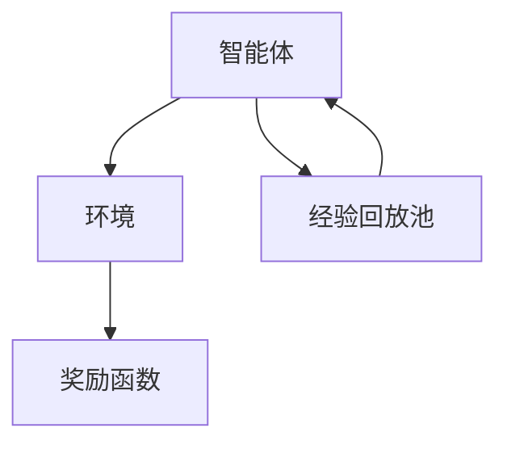
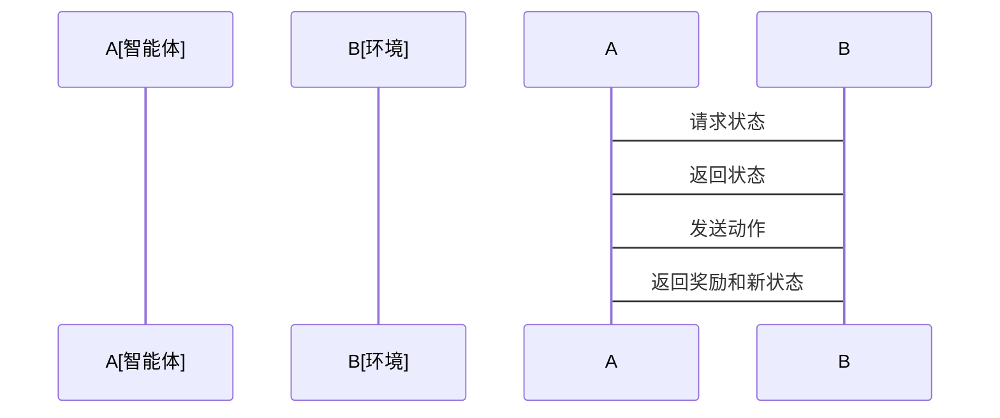

                 


# 企业AI Agent的强化学习应用：优化决策过程

> 关键词：企业AI Agent，强化学习，决策优化，系统架构，项目实战

> 摘要：本文详细探讨了企业AI Agent在强化学习中的应用，从理论基础到算法实现，再到系统架构设计和项目实战，为企业优化决策过程提供深度分析和实践指导。

---

# 第1章: 强化学习与AI Agent概述

## 1.1 强化学习的核心概念

### 1.1.1 强化学习的定义

强化学习（Reinforcement Learning, RL）是一种机器学习范式，通过智能体与环境的交互，学习如何采取行动以最大化累积奖励。其核心在于通过试错机制，让智能体学会在不同状态下做出最优决策。

$$
\text{强化学习的目标：} \quad \max_{\pi} \mathbb{E}[R]
$$

### 1.1.2 强化学习与监督学习的区别

| 方面 | 监督学习 | 强化学习 |
|------|----------|----------|
| 数据 | 标签数据 | 环境反馈 |
| 目标 | 分类/回归 | 最大化累积奖励 |
| 决策 | 确定性 | 概率性 |

### 1.1.3 强化学习在企业决策中的应用

强化学习广泛应用于资源分配、库存管理、市场营销等领域，帮助企业优化决策过程。例如，在库存管理中，强化学习可以预测最佳订货时机，减少缺货和过剩成本。

---

## 1.2 AI Agent的定义与特点

### 1.2.1 AI Agent的基本定义

AI Agent（智能体）是指能够感知环境、自主决策并执行任务的实体。它可以是一个软件程序或物理设备，具备以下核心特点：

1. **自主性**：无需外部干预，自主完成任务。
2. **反应性**：能够实时感知环境并做出反应。
3. **目标导向**：基于目标驱动行为。

### 1.2.2 AI Agent的核心特点

- **状态感知**：通过传感器或数据源获取环境信息。
- **决策能力**：基于当前状态和历史经验，选择最优动作。
- **学习能力**：通过与环境交互，不断优化决策策略。

### 1.2.3 强化学习在AI Agent中的作用

强化学习为AI Agent提供了从经验中学习的能力，使其能够在动态环境中自适应调整策略，实现最优决策。

---

## 1.3 强化学习与AI Agent的结合

### 1.3.1 强化学习在AI Agent中的应用场景

- **资源分配**：动态分配计算资源，提高利用率。
- **路径规划**：优化物流路径，降低成本。
- **风险管理**：识别潜在风险，制定应对策略。

### 1.3.2 AI Agent与强化学习的结合方式

- **基于模型的强化学习**：构建环境模型，模拟决策过程。
- **无模型强化学习**：直接与环境交互，无需环境模型。

### 1.3.3 企业AI Agent强化学习的应用前景

随着技术进步，AI Agent在企业中的应用将更加广泛，尤其是在复杂决策场景中，强化学习能够显著提升决策效率和准确性。

---

## 1.4 本章小结

本章介绍了强化学习的基本概念、与监督学习的区别，以及AI Agent的定义和特点。同时，探讨了强化学习在AI Agent中的应用，为企业优化决策过程提供了理论基础。

---

# 第2章: 强化学习的核心算法原理

## 2.1 马尔可夫决策过程（MDP）

### 2.1.1 MDP的基本概念

马尔可夫决策过程（MDP）是强化学习的核心模型，描述了智能体与环境交互的动态过程。其核心要素包括状态、动作、转移概率和奖励函数。

### 2.1.2 MDP的状态与动作

- **状态（State）**：描述环境的当前情况。
- **动作（Action）**：智能体在某一状态下做出的行为。

### 2.1.3 MDP的数学模型

$$
P(s' | s, a) \quad \text{表示从状态} \, s \, \text{执行动作} \, a \, \text{后转移到状态} \, s' \, \text{的概率。}
$$

---

## 2.2 Q-learning算法

### 2.2.1 Q-learning的基本原理

Q-learning是一种无模型强化学习算法，通过更新Q值表（Q-table）学习最优策略。Q值表示在状态s下执行动作a的期望奖励。

### 2.2.2 Q-learning的算法流程

1. 初始化Q表，所有状态-动作对的Q值设为0。
2. 在每个时间步，选择当前状态s的动作a。
3. 执行动作a，观察新状态s'，并获得奖励r。
4. 更新Q表：$Q(s, a) = Q(s, a) + \alpha (r + \gamma \max Q(s', a'))$。

### 2.2.3 Q-learning的代码实现

```python
import numpy as np

class QLearning:
    def __init__(self, state_num, action_num, alpha=0.1, gamma=0.9):
        self.Q = np.zeros((state_num, action_num))
        self.alpha = alpha
        self.gamma = gamma

    def choose_action(self, state):
        return np.argmax(self.Q[state])

    def update_Q(self, state, action, reward, next_state):
        self.Q[state, action] += self.alpha * (reward + self.gamma * np.max(self.Q[next_state]) - self.Q[state, action])
```

---

## 2.3 Deep Q-Network（DQN）算法

### 2.3.1 DQN的基本原理

DQN通过深度神经网络近似Q值函数，解决高维状态空间下的强化学习问题。其核心思想是使用两个网络：主网络和目标网络。

### 2.3.2 DQN的算法流程

1. 初始化主网络和目标网络，权重相同。
2. 在每个时间步，选择当前状态s的动作a。
3. 执行动作a，观察新状态s'，并获得奖励r。
4. 更新经验回放池。
5. 随机采样经验，更新主网络权重，使其逼近目标网络。

### 2.3.3 DQN的代码实现

```python
import torch
import torch.nn as nn

class DQN:
    def __init__(self, state_dim, action_dim, hidden_dim=64, lr=0.001):
        self.net = nn.Sequential(
            nn.Linear(state_dim, hidden_dim),
            nn.ReLU(),
            nn.Linear(hidden_dim, action_dim)
        )
        self.target_net = nn.Sequential(
            nn.Linear(state_dim, hidden_dim),
            nn.ReLU(),
            nn.Linear(hidden_dim, action_dim)
        )
        self.optimizer = torch.optim.Adam(self.net.parameters(), lr=lr)

    def choose_action(self, state):
        with torch.no_grad():
            return torch.argmax(self.net(state)).item()

    def update(self, batch):
        states, actions, rewards, next_states = batch
        current_q = self.net(states).gather(1, actions)
        next_q = self.target_net(next_states).max(1)[0].detach()
        target = rewards + self.gamma * next_q
        loss = nn.MSELoss()(current_q, target)
        self.optimizer.zero_grad()
        loss.backward()
        self.optimizer.step()
```

---

## 2.4 策略梯度（Policy Gradient）方法

### 2.4.1 策略梯度的基本原理

策略梯度方法直接优化策略，通过梯度上升最大化累积奖励。其核心思想是通过概率分布的梯度更新策略。

### 2.4.2 策略梯度的算法流程

1. 初始化策略参数θ。
2. 在每个时间步，根据策略θ选择动作a。
3. 执行动作a，观察新状态s'，并获得奖励r。
4. 计算策略的梯度，并更新θ。

### 2.4.3 策略梯度的代码实现

```python
import torch

class PolicyGradient:
    def __init__(self, state_dim, action_dim, hidden_dim=64, lr=0.001):
        self.net = nn.Sequential(
            nn.Linear(state_dim, hidden_dim),
            nn.ReLU(),
            nn.Linear(hidden_dim, action_dim)
        )
        self.optimizer = torch.optim.Adam(self.net.parameters(), lr=lr)

    def choose_action(self, state):
        with torch.no_grad():
            action_probs = torch.softmax(self.net(state), dim=1)
            action = torch.multinomial(action_probs, 1).item()
            return action

    def update(self, batch):
        states, actions, rewards = batch
        optimizer.zero_grad()
        action_probs = torch.softmax(self.net(states), dim=1)
        loss = -torch.mean(torch.log(action_probs.gather(1, actions)) * rewards)
        loss.backward()
        self.optimizer.step()
```

---

## 2.5 Actor-Critic算法

### 2.5.1 Actor-Critic的基本原理

Actor-Critic算法结合了策略梯度和值函数的优势，通过同时优化策略和值函数来加速学习。其核心思想是利用值函数作为基准，减少策略更新的方差。

### 2.5.2 Actor-Critic的算法流程

1. 初始化策略网络（Actor）和值函数网络（Critic）。
2. 在每个时间步，Actor选择动作a。
3. 执行动作a，观察新状态s'，并获得奖励r。
4. 根据Critic的值估计，更新Actor和Critic的参数。

### 2.5.3 Actor-Critic的代码实现

```python
import torch

class ActorCritic:
    def __init__(self, state_dim, action_dim, hidden_dim=64, lr=0.001):
        self.actor = nn.Sequential(
            nn.Linear(state_dim, hidden_dim),
            nn.ReLU(),
            nn.Linear(hidden_dim, action_dim)
        )
        self.critic = nn.Sequential(
            nn.Linear(state_dim, hidden_dim),
            nn.ReLU(),
            nn.Linear(hidden_dim, 1)
        )
        self.actor_optimizer = torch.optim.Adam(self.actor.parameters(), lr=lr)
        self.critic_optimizer = torch.optim.Adam(self.critic.parameters(), lr=lr)

    def choose_action(self, state):
        with torch.no_grad():
            action_probs = torch.softmax(self.actor(state), dim=1)
            action = torch.multinomial(action_probs, 1).item()
            return action

    def update(self, batch):
        states, actions, rewards = batch
        # 计算Critic的目标值
        values = self.critic(states).squeeze()
        target = rewards + self.gamma * self.critic(torch.tensor(next_states)).squeeze()
        critic_loss = nn.MSELoss()(values, target)
        self.critic_optimizer.zero_grad()
        critic_loss.backward()
        self.critic_optimizer.step()

        # 计算Actor的损失
        action_probs = torch.softmax(self.actor(states), dim=1)
        actor_loss = -torch.mean(torch.log(action_probs.gather(1, actions)) * (target - values.detach()))
        self.actor_optimizer.zero_grad()
        actor_loss.backward()
        self.actor_optimizer.step()
```

---

## 2.6 本章小结

本章详细介绍了强化学习的核心算法，包括Q-learning、DQN、策略梯度和Actor-Critic方法，并通过代码实现和数学公式进行了深入讲解。这些算法为企业AI Agent的应用提供了理论基础和技术支持。

---

# 第3章: AI Agent的强化学习应用

## 3.1 AI Agent的类型与特点

### 3.1.1 基于规则的AI Agent

基于规则的AI Agent通过预定义的规则做出决策，适用于规则明确的场景。例如，在某些简单的库存管理中，可以使用预定义的补货规则。

### 3.1.2 基于模型的AI Agent

基于模型的AI Agent通过构建环境模型，预测未来状态，优化决策过程。例如，在复杂的供应链管理中，可以使用模型预测市场需求。

### 3.1.3 基于强化学习的AI Agent

基于强化学习的AI Agent通过与环境交互，不断优化决策策略，适用于动态变化的复杂场景。例如，在金融投资中，AI Agent可以通过强化学习优化投资组合。

---

## 3.2 强化学习在AI Agent中的应用

### 3.2.1 资源分配

强化学习可以通过状态-动作-奖励模型，优化资源分配策略。例如，在云计算中，AI Agent可以通过强化学习动态分配计算资源，提高资源利用率。

### 3.2.2 路径规划

强化学习可以应用于路径规划问题，优化物流路径。例如，在智能物流系统中，AI Agent可以通过强化学习选择最优配送路径，降低配送成本。

### 3.2.3 风险管理

强化学习可以应用于风险管理领域，优化风险控制策略。例如，在金融领域，AI Agent可以通过强化学习识别潜在风险，制定风险应对策略。

---

## 3.3 本章小结

本章分析了AI Agent的类型与特点，并探讨了强化学习在资源分配、路径规划和风险管理等领域的应用，为企业优化决策过程提供了实践指导。

---

# 第4章: 企业AI Agent的系统架构设计

## 4.1 系统功能设计

### 4.1.1 领域模型设计

领域模型是系统功能设计的核心，通过分析问题场景，构建领域模型。例如，在库存管理中，可以通过状态、动作和奖励模型，设计领域模型。

### 4.1.2 功能模块设计

系统功能模块设计包括状态感知、动作选择和奖励计算等功能模块。例如，在AI Agent中，状态感知模块负责感知环境状态，动作选择模块负责选择最优动作，奖励计算模块负责计算累积奖励。

### 4.1.3 功能流程设计

功能流程设计描述了系统各模块之间的交互流程。例如，在强化学习系统中，AI Agent通过感知环境状态，选择动作，执行动作，获得奖励，更新Q值表或神经网络权重。

---

## 4.2 系统架构设计

### 4.2.1 系统架构设计图

系统架构设计图展示了系统各组件之间的关系。例如，在强化学习系统中，包括智能体、环境、奖励函数和经验回放池等组件。



---

## 4.3 接口设计

### 4.3.1 系统接口设计

系统接口设计包括智能体与环境之间的交互接口，以及智能体内部各模块之间的接口。例如，在AI Agent中，智能体与环境之间的接口负责传递状态、动作和奖励信息。

### 4.3.2 接口交互图

接口交互图描述了系统各接口之间的交互流程。例如，在强化学习系统中，智能体通过接口感知环境状态，选择动作，执行动作，获得奖励，更新Q值表或神经网络权重。



---

## 4.4 本章小结

本章详细介绍了企业AI Agent的系统架构设计，包括领域模型设计、系统架构设计和接口设计，为企业实现强化学习应用提供了系统化的指导。

---

# 第5章: 企业AI Agent的项目实战

## 5.1 环境安装与配置

### 5.1.1 环境需求

- Python 3.7+
- PyTorch 1.9+
- numpy 1.20+

### 5.1.2 安装步骤

```bash
pip install torch numpy
```

---

## 5.2 系统核心实现

### 5.2.1 强化学习算法实现

#### Q-learning实现

```python
class QLearning:
    def __init__(self, state_num, action_num, alpha=0.1, gamma=0.9):
        self.Q = np.zeros((state_num, action_num))
        self.alpha = alpha
        self.gamma = gamma

    def choose_action(self, state):
        return np.argmax(self.Q[state])

    def update_Q(self, state, action, reward, next_state):
        self.Q[state, action] += self.alpha * (reward + self.gamma * np.max(self.Q[next_state]) - self.Q[state, action])
```

#### DQN实现

```python
import torch
import torch.nn as nn

class DQN:
    def __init__(self, state_dim, action_dim, hidden_dim=64, lr=0.001):
        self.net = nn.Sequential(
            nn.Linear(state_dim, hidden_dim),
            nn.ReLU(),
            nn.Linear(hidden_dim, action_dim)
        )
        self.target_net = nn.Sequential(
            nn.Linear(state_dim, hidden_dim),
            nn.ReLU(),
            nn.Linear(hidden_dim, action_dim)
        )
        self.optimizer = torch.optim.Adam(self.net.parameters(), lr=lr)

    def choose_action(self, state):
        with torch.no_grad():
            return torch.argmax(self.net(state)).item()

    def update(self, batch):
        states, actions, rewards, next_states = batch
        current_q = self.net(states).gather(1, actions)
        next_q = self.target_net(next_states).max(1)[0].detach()
        target = rewards + 0.9 * next_q
        loss = nn.MSELoss()(current_q, target)
        self.optimizer.zero_grad()
        loss.backward()
        self.optimizer.step()
```

---

## 5.3 代码实现与解读

### 5.3.1 Q-learning代码解读

Q-learning代码实现了一个简单的强化学习算法，通过Q表记录状态-动作对的Q值，并通过更新Q表实现策略优化。

### 5.3.2 DQN代码解读

DQN代码实现了基于深度神经网络的强化学习算法，通过经验回放和目标网络，解决了高维状态空间下的强化学习问题。

---

## 5.4 案例分析与实践

### 5.4.1 案例分析

以库存管理为例，假设企业需要动态调整库存量，以最小化成本。AI Agent可以通过强化学习选择最优补货策略，实现库存优化。

### 5.4.2 代码实现

```python
import numpy as np

class InventoryAgent:
    def __init__(self, state_dim, action_dim, alpha=0.1, gamma=0.9):
        self.Q = np.zeros((state_dim, action_dim))
        self.alpha = alpha
        self.gamma = gamma

    def choose_action(self, state):
        return np.argmax(self.Q[state])

    def update_Q(self, state, action, reward, next_state):
        self.Q[state, action] += self.alpha * (reward + self.gamma * np.max(self.Q[next_state]) - self.Q[state, action])

# 初始化环境
state_dim = 5
action_dim = 3
agent = InventoryAgent(state_dim, action_dim)

# 训练过程
for episode in range(1000):
    state = np.random.randint(0, state_dim)
    action = agent.choose_action(state)
    next_state = np.random.randint(0, state_dim)
    reward = np.random.randn()  # 假设奖励函数
    agent.update_Q(state, action, reward, next_state)
```

---

## 5.5 项目小结

本章通过具体的项目实战，详细讲解了强化学习算法在企业AI Agent中的实现，并通过案例分析，展示了如何将强化学习应用于实际问题中。

---

# 第6章: 强化学习在企业AI Agent中的最佳实践

## 6.1 小结与总结

强化学习为企业AI Agent提供了强大的决策优化能力，通过与环境交互，不断优化决策策略，实现最优决策。

---

## 6.2 注意事项

1. **环境设计**：强化学习的效果依赖于环境设计，需要确保环境能够准确反映问题场景。
2. **奖励函数**：奖励函数的设计直接影响学习效果，需要合理设计奖励机制。
3. **算法选择**：根据问题场景选择合适的强化学习算法，避免盲目使用流行算法。

---

## 6.3 拓展阅读

- 《Reinforcement Learning: Theory and Algorithms》
- 《Deep Reinforcement Learning》
- 《AI Agent与强化学习应用》

---

# 作者：AI天才研究院 & 禅与计算机程序设计艺术

---

**全文完**

