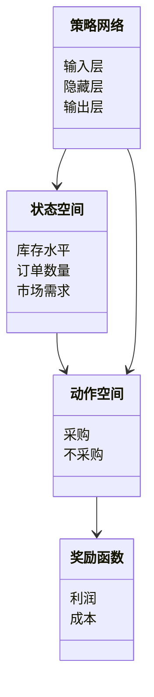
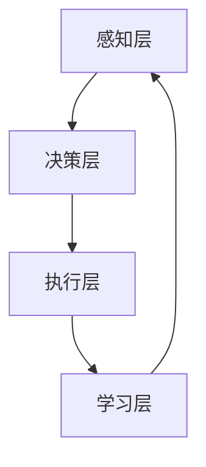

                 

<think>
好的，我将按照您的要求，逐步构建一个详细的技术博客文章。让我们先从标题和关键词开始。

---

# 企业AI Agent的强化学习应用：持续优化决策

**关键词**：AI Agent, 强化学习, 企业决策优化, 系统架构设计, 数学模型

**摘要**：  
随着人工智能技术的快速发展，AI Agent在企业中的应用越来越广泛。本文将深入探讨AI Agent在企业中的强化学习应用，分析其核心概念、算法原理、系统架构设计以及实际应用场景。通过结合数学模型和系统架构图，详细解读强化学习在企业AI Agent中的具体应用，帮助读者理解如何通过强化学习优化企业决策过程。

---

## 目录

1. [企业AI Agent与强化学习概述](#企业ai-agent与强化学习概述)
   - [1.1 AI Agent的基本概念](#ai-agent的基本概念)
   - [1.2 强化学习的核心原理](#强化学习的核心原理)
   - [1.3 企业AI Agent的应用背景](#企业ai-agent的应用背景)

2. [强化学习算法基础](#强化学习算法基础)
   - [2.1 强化学习的核心算法](#强化学习的核心算法)
   - [2.2 算法原理与数学模型](#算法原理与数学模型)
   - [2.3 算法优缺点对比](#算法优缺点对比)

3. [企业AI Agent的强化学习应用分析](#企业ai-agent的强化学习应用分析)
   - [3.1 企业AI Agent的核心需求](#企业ai-agent的核心需求)
   - [3.2 企业AI Agent的强化学习场景](#企业ai-agent的强化学习场景)
   - [3.3 企业AI Agent的强化学习挑战](#企业ai-agent的强化学习挑战)

4. [企业AI Agent的强化学习系统架构设计](#企业ai-agent的强化学习系统架构设计)
   - [4.1 系统架构概述](#系统架构概述)
   - [4.2 领域模型设计](#领域模型设计)
   - [4.3 系统架构图](#系统架构图)
   - [4.4 接口设计与交互流程](#接口设计与交互流程)

5. [项目实战：基于强化学习的企业AI Agent实现](#项目实战基于强化学习的企业ai-agent实现)
   - [5.1 环境安装与配置](#环境安装与配置)
   - [5.2 核心算法实现](#核心算法实现)
   - [5.3 代码应用解读](#代码应用解读)
   - [5.4 实际案例分析](#实际案例分析)

6. [总结与展望](#总结与展望)
   - [6.1 本章总结](#本章总结)
   - [6.2 未来研究方向](#未来研究方向)

7. [作者信息](#作者信息)

---

## 1. 企业AI Agent与强化学习概述

### 1.1 AI Agent的基本概念

AI Agent（人工智能代理）是指能够感知环境、自主决策并执行任务的智能实体。AI Agent的核心目标是通过与环境的交互，实现预定的目标，例如优化决策、提高效率或降低成本。

#### 1.1.1 AI Agent的定义与特点
- **定义**：AI Agent是一种能够感知环境、执行动作并优化决策的智能系统。
- **特点**：
  - **自主性**：能够在没有外部干预的情况下自主决策。
  - **反应性**：能够实时感知环境变化并做出反应。
  - **学习能力**：通过经验不断优化自身的决策策略。

#### 1.1.2 强化学习的基本概念
强化学习是一种机器学习范式，通过智能体与环境的交互，学习最优策略以最大化累计奖励。与监督学习和无监督学习不同，强化学习强调动态决策和长期目标的优化。

#### 1.1.3 企业AI Agent的应用背景
随着企业数字化转型的深入，AI Agent在企业中的应用越来越广泛。例如，在智能客服、供应链优化、风险管理等领域，AI Agent通过强化学习不断优化决策，提升企业效率和竞争力。

---

### 1.2 强化学习的核心原理

强化学习的核心是通过智能体与环境的交互，学习最优策略。以下是强化学习的核心概念：

#### 1.2.1 强化学习的基本框架
- **状态（State）**：智能体所处的环境状态。
- **动作（Action）**：智能体在状态下的决策。
- **奖励（Reward）**：智能体执行动作后获得的反馈。
- **策略（Policy）**：智能体在状态下的动作选择规则。
- **价值函数（Value Function）**：评估状态或动作的价值。

#### 1.2.2 状态、动作、奖励的定义
- **状态**：例如，在供应链优化中，状态可以是库存水平、订单数量等。
- **动作**：例如，采购或不采购某种商品。
- **奖励**：例如，获得的利润或减少的成本。

#### 1.2.3 策略与价值函数的解释
- **策略**：确定智能体在状态下的动作选择概率分布。
- **价值函数**：评估状态或动作的价值，帮助智能体做出最优决策。

---

### 1.3 企业AI Agent的应用前景

#### 1.3.1 企业AI Agent的潜在应用场景
- **智能客服**：通过强化学习优化对话流程，提高客户满意度。
- **供应链优化**：通过强化学习优化库存管理和订单调度。
- **风险管理**：通过强化学习识别和规避潜在风险。

#### 1.3.2 强化学习在企业决策优化中的优势
- **动态适应性**：能够根据环境变化实时调整决策。
- **长期优化**：通过累积奖励优化长期目标。
- **复杂决策**：适用于多变量、高复杂度的决策问题。

#### 1.3.3 当前技术挑战与未来方向
- **技术挑战**：
  - 状态空间复杂性。
  - 动作空间多样性。
  - 奖励函数设计难度。
- **未来方向**：
  - 更加高效的算法设计。
  - 多智能体协同优化。
  - 与大数据和云计算的深度融合。

---

## 2. 强化学习算法基础

### 2.1 强化学习的核心算法

#### 2.1.1 Q-learning算法
Q-learning是一种经典的强化学习算法，适用于离线学习场景。

- **核心思想**：通过更新Q值表，学习状态-动作对的最优价值。
- **更新公式**：
  $$ Q(s,a) = Q(s,a) + \alpha (r + \gamma \max Q(s',a') - Q(s,a)) $$

#### 2.1.2 Deep Q-Network (DQN)算法
DQN通过深度神经网络近似Q值函数，适用于高维状态空间。

- **核心思想**：使用经验回放和目标网络，稳定学习过程。
- **网络结构**：包括输入层、隐藏层和输出层，输出层的大小为状态数×动作数。

#### 2.1.3 Policy Gradient方法
Policy Gradient通过直接优化策略，找到最优动作分布。

- **核心思想**：通过梯度上升方法，最大化动作选择的概率。
- **优化目标**：
  $$ \max_{\theta} \mathbb{E}[R | \theta] $$

---

### 2.2 算法原理与数学模型

#### 2.2.1 Q-learning的数学公式
$$ Q(s,a) = Q(s,a) + \alpha (r + \gamma \max Q(s',a') - Q(s,a)) $$

- **α**：学习率，控制更新步长。
- **γ**：折扣因子，平衡当前奖励与未来奖励。

#### 2.2.2 DQN的网络结构与损失函数
DQN的损失函数：
$$ \mathcal{L} = \mathbb{E}[(y_i - Q_i)^2] $$
其中，$$ y_i = r_i + \gamma Q_{target}(s_i') $$

#### 2.2.3 Policy Gradient的优化目标
$$ \mathcal{J} = \mathbb{E}[\log \pi(a|s)] $$

---

### 2.3 算法优缺点对比

| 算法 | 优点 | 缺点 |
|------|------|------|
| Q-learning | 简单易实现 | 适合离线学习，不适用于在线 |
| DQN | 适合高维状态 | 计算复杂，需要经验回放 |
| Policy Gradient | 直接优化策略 | 收敛速度较慢 |

---

## 3. 企业AI Agent的强化学习应用分析

### 3.1 企业AI Agent的核心需求

#### 3.1.1 智能决策的需求分析
- **实时性**：需要快速做出决策。
- **准确性**：需要高精度的决策结果。
- **可解释性**：需要理解决策背后的原因。

#### 3.1.2 强化学习在决策优化中的作用
- **动态调整**：根据环境变化实时优化决策。
- **长期目标**：通过累积奖励优化整体效益。

#### 3.1.3 企业AI Agent的边界与外延
- **边界**：AI Agent的决策范围和权限。
- **外延**：与外部系统的交互和数据共享。

---

### 3.2 企业AI Agent的强化学习场景

#### 3.2.1 智能客服中的对话优化
- **场景描述**：通过强化学习优化客服对话流程，提高客户满意度。
- **具体实现**：定义状态为用户情绪，动作为回复内容，奖励为客户评分。

#### 3.2.2 供应链管理中的库存优化
- **场景描述**：通过强化学习优化库存管理和订单调度。
- **具体实现**：定义状态为库存水平，动作为采购或不采购，奖励为利润。

#### 3.2.3 财务决策中的风险控制
- **场景描述**：通过强化学习优化财务决策，降低风险。
- **具体实现**：定义状态为市场波动，动作为投资或保守，奖励为收益。

---

### 3.3 企业AI Agent的强化学习挑战

#### 3.3.1 状态空间的复杂性
- **问题**：高维状态空间导致计算复杂度高。
- **解决方案**：使用深度学习近似状态价值。

#### 3.3.2 动作空间的多样性
- **问题**：多动作选择导致决策困难。
- **解决方案**：使用策略网络优化动作分布。

#### 3.3.3 奖励函数的设计难度
- **问题**：复杂的业务需求导致奖励函数难以定义。
- **解决方案**：与业务专家合作，逐步调整奖励函数。

---

## 4. 企业AI Agent的强化学习系统架构设计

### 4.1 系统架构概述

企业AI Agent的强化学习系统架构包括以下几个部分：

1. **感知层**：负责感知环境状态。
2. **决策层**：负责根据状态选择动作。
3. **执行层**：负责执行动作并反馈结果。
4. **学习层**：负责更新强化学习模型。

---

### 4.2 领域模型设计

以下是企业AI Agent的领域模型设计：



---

### 4.3 系统架构图

以下是企业AI Agent的强化学习系统架构图：



---

### 4.4 接口设计与交互流程

以下是系统交互流程：

1. 感知层接收环境状态。
2. 决策层根据状态选择动作。
3. 执行层执行动作并反馈结果。
4. 学习层更新强化学习模型。

---

## 5. 项目实战：基于强化学习的企业AI Agent实现

### 5.1 环境安装与配置

需要安装以下工具和库：

- Python 3.8+
- TensorFlow或PyTorch
- OpenAI Gym

---

### 5.2 核心算法实现

以下是基于DQN的强化学习算法实现代码：

```python
import gym
import numpy as np

class DQNAgent:
    def __init__(self, state_space, action_space, learning_rate=0.01, gamma=0.99):
        self.state_space = state_space
        self.action_space = action_space
        self.learning_rate = learning_rate
        self.gamma = gamma
        self.Q = np.zeros((state_space, action_space))
    
    def take_action(self, state):
        return np.argmax(self.Q[state, :])
    
    def update(self, state, action, reward, next_state):
        target = reward + self.gamma * np.max(self.Q[next_state, :])
        self.Q[state, action] += self.learning_rate * (target - self.Q[state, action])
```

---

### 5.3 代码应用解读

- **类初始化**：初始化Q值表，状态空间和动作空间大小。
- **take_action**：选择动作，基于当前Q值表。
- **update**：更新Q值表，基于当前奖励和未来价值。

---

### 5.4 实际案例分析

以供应链管理为例，假设状态空间为库存水平，动作空间为采购或不采购，奖励函数为利润。通过DQN算法优化库存管理，实现利润最大化。

---

## 6. 总结与展望

### 6.1 本章总结

本文详细探讨了企业AI Agent的强化学习应用，从基本概念到算法实现，再到系统架构设计，全面解读了强化学习在企业决策优化中的应用。通过实际案例分析，展示了强化学习在企业中的巨大潜力。

### 6.2 未来研究方向

- **算法优化**：研究更高效的强化学习算法。
- **多智能体协同**：探索多智能体协同优化的场景。
- **与大数据结合**：研究强化学习与大数据的深度融合。

---

## 作者信息

作者：AI天才研究院/AI Genius Institute & 禅与计算机程序设计艺术 /Zen And The Art of Computer Programming

---

希望这个详细的思考过程和最终的博客文章内容能够满足您的要求！如果需要进一步调整或补充，请随时告诉我。

