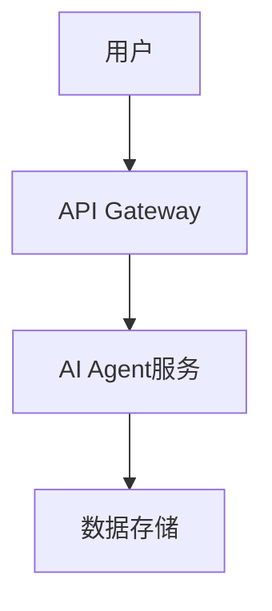
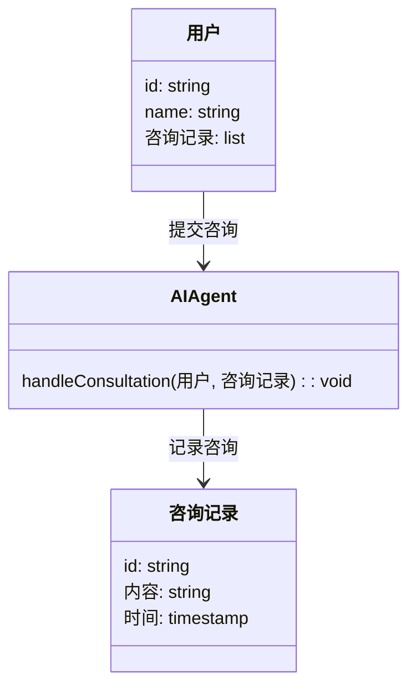
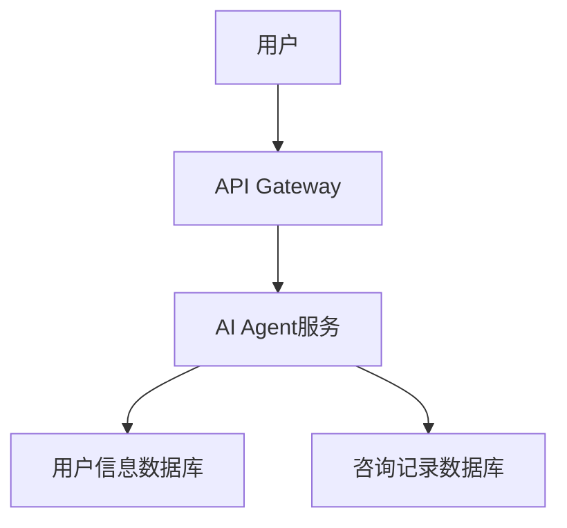
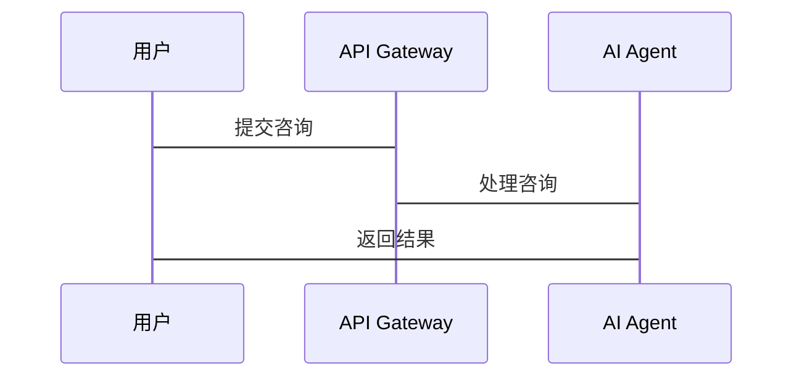

                 


# 企业AI Agent的微服务架构优化策略

## 关键词：微服务架构, AI Agent, 企业架构优化, 分布式计算, 负载均衡

## 摘要：本文详细探讨了在企业环境中优化AI Agent的微服务架构的关键策略。从核心概念到算法原理，从系统设计到项目实战，系统阐述了AI Agent在微服务架构中的角色、优化策略及其实际应用，为企业的技术决策者提供了深度的技术指导。

---

# 第一部分: 企业AI Agent的微服务架构优化背景

## 第1章: 企业AI Agent与微服务架构概述

### 1.1 AI Agent的基本概念

#### 1.1.1 AI Agent的定义与核心功能
AI Agent（人工智能代理）是指能够感知环境、自主决策并执行任务的智能实体。其核心功能包括：
- **感知环境**：通过传感器或API获取外部信息。
- **自主决策**：基于历史数据和实时信息进行推理和决策。
- **执行任务**：通过API或执行器完成特定任务。

#### 1.1.2 AI Agent在企业中的应用场景
AI Agent在企业中的典型应用包括：
- **智能客服**：通过自然语言处理与客户交互。
- **自动化运维**：监控系统并自动修复问题。
- **智能推荐**：为用户提供个性化推荐。

#### 1.1.3 微服务架构的基本概念
微服务架构是一种将应用程序分解为小型、独立服务的设计模式。每个服务都可以独立开发、部署和扩展，且通过HTTP协议进行通信。

### 1.2 问题背景与挑战

#### 1.2.1 传统AI Agent架构的局限性
传统AI Agent架构通常采用单体式设计，存在以下问题：
- **扩展性差**：难以适应业务规模的快速增长。
- **维护复杂**：单点故障风险高，维护成本高。

#### 1.2.2 微服务架构的优势与适用场景
微服务架构的优势在于：
- **高扩展性**：支持横向扩展，应对流量高峰。
- **快速迭代**：团队可以独立开发和部署功能模块。

#### 1.2.3 企业AI Agent优化的必要性
随着企业数字化转型的推进，AI Agent需要处理的任务日益复杂，对实时性和响应速度的要求不断提高，传统的单体架构已无法满足需求。

### 1.3 问题描述与目标

#### 1.3.1 企业AI Agent微服务化的关键问题
- **服务拆分**：如何将AI Agent功能模块化。
- **服务通信**：服务之间如何高效交互。
- **服务治理**：如何管理大量服务。

#### 1.3.2 微服务架构优化的目标
- **提高可用性**：确保服务故障不会导致整个系统崩溃。
- **提升性能**：减少延迟，提高响应速度。
- **增强扩展性**：支持业务的快速扩展。

#### 1.3.3 优化策略的边界与外延
- **边界**：聚焦于AI Agent的微服务化，不涉及其他系统。
- **外延**：优化策略可扩展至整个企业的微服务架构。

### 1.4 核心概念与联系

#### 1.4.1 AI Agent与微服务架构的关系
AI Agent作为微服务架构中的一个服务，通过与其他服务交互完成任务。

#### 1.4.2 核心概念属性对比表格
| 概念       | 属性                 |
|------------|----------------------|
| AI Agent   | 感知、决策、执行功能 |
| 微服务架构 | 独立服务、松耦合     |

#### 1.4.3 ER实体关系图架构
```mermaid
er
  actor 用户
  actor 服务A
  actor 服务B
  entity 任务
  entity 状态
  用户 --> 服务A: 调用服务
  用户 --> 服务B: 调用服务
  服务A --> 任务: 创建任务
  服务B --> 状态: 更新状态
```

---

## 第2章: 微服务架构的核心原理

### 2.1 微服务架构的原理与实现

#### 2.1.1 微服务架构的原理
微服务架构通过将系统分解为多个小型服务，每个服务负责特定功能，通过HTTP协议进行通信。

#### 2.1.2 微服务架构的实现方式
- **容器化**：使用Docker容器打包服务。
- **API Gateway**：统一入口，管理API请求。

#### 2.1.3 微服务架构的关键特征
- **独立部署**：每个服务独立部署和扩展。
- **松耦合**：服务之间通过API通信，互不干扰。

### 2.2 AI Agent在微服务架构中的角色

#### 2.2.1 AI Agent在微服务中的功能定位
AI Agent作为独立的服务，负责特定的业务逻辑处理，如数据处理和决策制定。

#### 2.2.2 AI Agent与微服务组件的交互关系


#### 2.2.3 AI Agent在微服务架构中的价值
- **提升效率**：通过模块化设计提高开发效率。
- **增强灵活性**：支持不同功能的独立优化。

### 2.3 微服务架构优化的核心策略

#### 2.3.1 微服务拆分策略
- **按功能拆分**：将功能相关的代码打包成独立服务。
- **按数据拆分**：根据数据访问范围拆分服务。

#### 2.3.2 服务间通信机制
- **RESTful API**：常用HTTP方法进行通信。
- **gRPC**：适合需要高性能的场景。

#### 2.3.3 服务发现与负载均衡
- **服务发现**：通过注册中心发现可用服务。
- **负载均衡**：使用如Nginx实现流量分发。

---

## 第3章: AI Agent微服务架构的算法原理

### 3.1 分布式计算与通信机制

#### 3.1.1 分布式计算的基本原理
分布式计算通过将任务分解到多个节点并行处理，提高计算效率。

#### 3.1.2 服务间通信算法
- **RPC（远程过程调用）**：通过调用远程函数实现通信。
- **HTTP REST API**：通过HTTP协议传递数据。

#### 3.1.3 通信协议的选择
- **HTTP 1.1**：适用于简单的请求。
- **HTTP 2.0**：支持多路复用，提高效率。

### 3.2 负载均衡算法

#### 3.2.1 轮询算法
- **实现**：依次将请求分配给不同的服务实例。
- **代码示例**：
  ```python
  class LoadBalancer:
      def __init__(self, services):
          self.services = services
          self.index = 0
      
      def balance(self):
          service = self.services[self.index % len(self.services)]
          self.index += 1
          return service
  ```

#### 3.2.2 加权轮询算法
- **实现**：根据权重分配请求。
- **代码示例**：
  ```python
  class WeightedLoadBalancer:
      def __init__(self, services, weights):
          self.services = services
          self.weights = weights
          self.total_weight = sum(weights)
      
      def balance(self):
          import random
          rand = random.random() * self.total_weight
          for i in range(len(self.weights)):
              if rand < self.weights[i]:
                  return self.services[i]
              rand -= self.weights[i]
  ```

#### 3.2.3 最近最少使用算法
- **实现**：记录每个服务的负载，将请求分配给负载最小的服务。
- **代码示例**：
  ```python
  class LeastLoadedBalancer:
      def __init__(self, services):
          self.services = services
          self.loads = [0] * len(services)
      
      def balance(self):
          min_load = min(self.loads)
          for i in range(len(self.loads)):
              if self.loads[i] == min_load:
                  return self.services[i]
          return self.services[0]
  ```

---

## 第4章: 企业AI Agent微服务架构的系统分析与设计

### 4.1 问题场景介绍

#### 4.1.1 业务场景
企业需要一个智能客服系统，通过AI Agent处理客户咨询。

#### 4.1.2 项目介绍
开发一个智能客服系统，使用微服务架构优化AI Agent。

### 4.2 系统功能设计

#### 4.2.1 领域模型类图


### 4.3 系统架构设计

#### 4.3.1 系统架构图


#### 4.3.2 系统接口设计
- **用户接口**：提交咨询请求。
- **API Gateway**：接收请求并路由到AI Agent服务。
- **AI Agent服务**：处理请求并存储记录。

#### 4.3.3 系统交互序列图


---

## 第5章: 项目实战

### 5.1 环境安装

#### 5.1.1 安装Docker
```bash
curl -fsSL https://get.docker.com | bash -s docker
```

#### 5.1.2 安装Kubernetes
```bash
curl -s "https://raw.githubusercontent.com/kubernetes/kubernetes/master/.../install.sh" | bash
```

### 5.2 核心代码实现

#### 5.2.1 AI Agent服务代码
```python
from fastapi import FastAPI

app = FastAPI()

@app.post("/consult")
async def handle_consult(user: dict, consultation: str):
    # 处理咨询逻辑
    return {"status": "success", "message": "咨询已处理"}
```

#### 5.2.2 Docker部署
```dockerfile
FROM python:3.9
WORKDIR /app
COPY requirements.txt .
RUN pip install -r requirements.txt
COPY main.py .
CMD ["uvicorn", "main:app", "--host", "0.0.0.0", "--port", "8000"]
```

### 5.3 代码解读与分析

#### 5.3.1 AI Agent服务解读
- **FastAPI框架**：用于构建高性能的API。
- **Docker容器**：实现服务的独立部署。

### 5.4 实际案例分析

#### 5.4.1 案例分析
部署智能客服系统，通过微服务架构实现高可用性。

### 5.5 项目小结

#### 5.5.1 经验总结
- **模块化设计**：提高系统的灵活性和可维护性。
- **容器化部署**：确保服务的独立性和一致性。

---

## 第6章: 最佳实践与注意事项

### 6.1 最佳实践 tips

#### 6.1.1 性能调优
- **缓存优化**：减少重复计算。
- **异步处理**：提高处理效率。

#### 6.1.2 安全性增强
- **身份验证**：使用JWT进行身份验证。
- **权限控制**：基于角色的访问控制。

#### 6.1.3 可扩展性设计
- **模块化设计**：便于新增功能模块。
- **水平扩展**：通过增加节点提高处理能力。

### 6.2 小结与注意事项

#### 6.2.1 小结
本文详细探讨了企业AI Agent的微服务架构优化策略，从核心概念到算法实现，从系统设计到项目实战，全面阐述了优化的思路和方法。

#### 6.2.2 注意事项
- **避免过度拆分**：合理拆分服务，避免拆分过细导致维护复杂。
- **关注服务通信效率**：优化服务间的通信机制，减少延迟。

### 6.3 拓展阅读

#### 6.3.1 进一步学习
- **《微服务设计》**：深入理解微服务架构的设计原则。
- **《分布式系统》**：学习分布式系统的设计与优化。

---

# 结语

企业AI Agent的微服务架构优化是一个复杂但值得探索的领域。通过合理的架构设计和算法优化，可以显著提升系统的性能和可用性，为企业创造更大的价值。

---

# 作者：AI天才研究院/AI Genius Institute & 禅与计算机程序设计艺术 /Zen And The Art of Computer Programming

