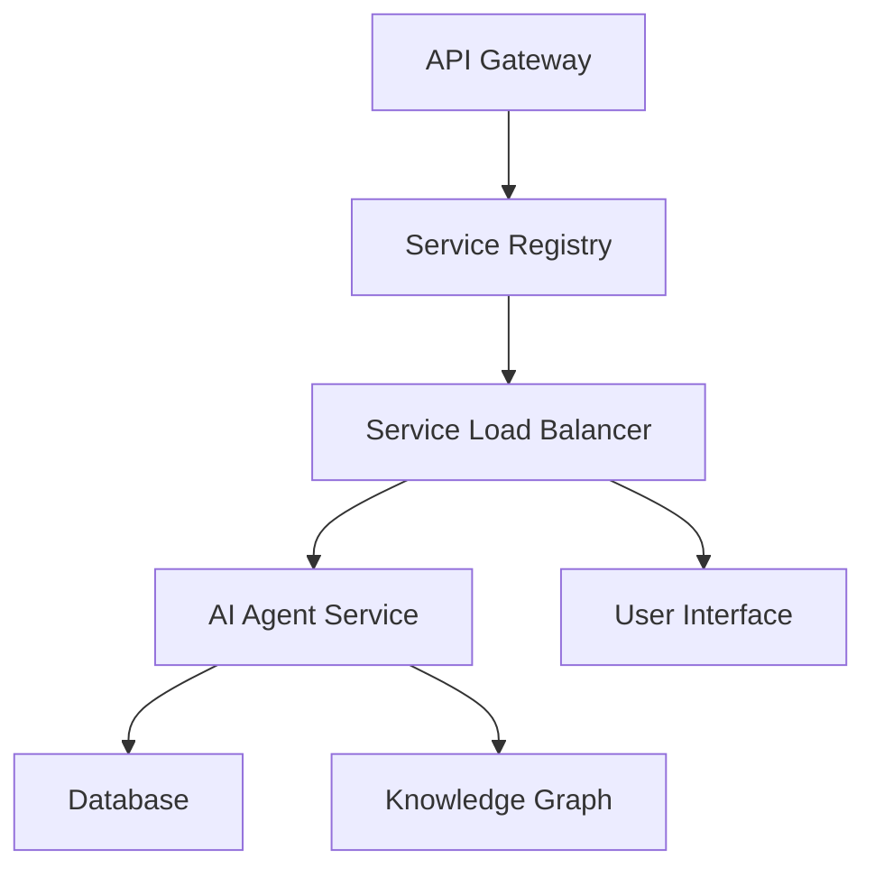
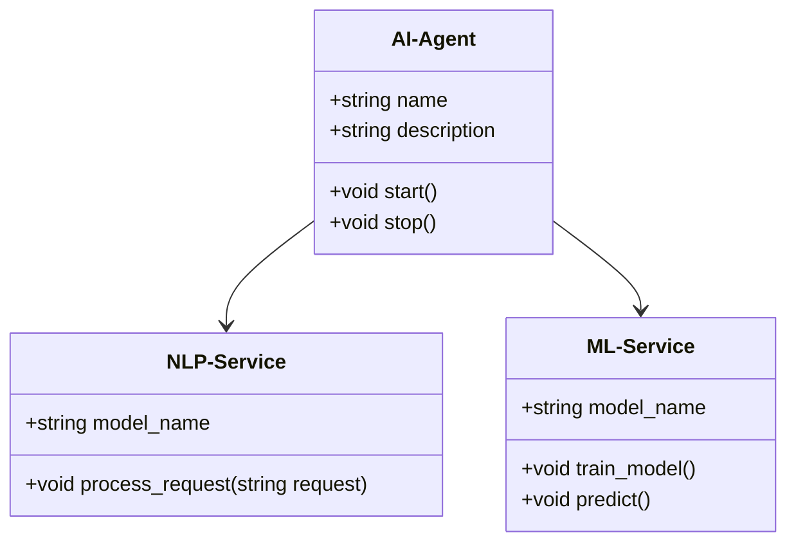
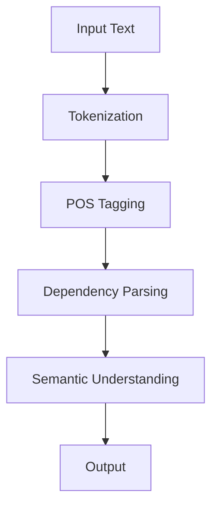

                 


# 企业AI Agent的微服务架构设计

> 关键词：企业AI Agent，微服务架构，系统设计，算法原理，项目实战

> 摘要：本文深入探讨了企业AI Agent的微服务架构设计，从背景介绍、核心技术、系统架构到算法实现和项目实战，全面分析了如何在企业环境中构建高效的AI Agent系统。通过详细的技术解析和实际案例，展示了如何利用微服务架构的优势，结合先进的AI算法，实现企业智能化转型。

---

# 第一部分: 企业AI Agent的背景与概念

## 第1章: 企业AI Agent与微服务架构概述

### 1.1 企业AI Agent的背景与概念

#### 1.1.1 什么是AI Agent
AI Agent（人工智能代理）是指能够感知环境、自主决策并执行任务的智能实体。在企业场景中，AI Agent通常以虚拟助手或自动化系统的形式出现，用于处理复杂业务流程、优化决策、提升效率。

#### 1.1.2 企业AI Agent的特点与优势
- **智能化**：通过NLP和机器学习技术，实现对复杂业务场景的理解和决策。
- **自主性**：能够在无须人工干预的情况下，独立完成任务。
- **可扩展性**：支持多种业务场景和用户需求，适应企业的快速变化。
- **实时性**：能够快速响应用户需求，提供即时反馈。

#### 1.1.3 微服务架构的定义与特点
微服务架构是一种将应用程序分解为小型、独立服务的设计模式，每个服务都能独立运行并相互协作。其特点包括：
- **松耦合**：服务之间通过API进行通信，避免了紧密耦合。
- **可扩展性**：每个服务可以根据需求独立扩展。
- **技术多样性**：允许使用不同的技术栈开发不同的服务。

---

## 第2章: 企业AI Agent的应用场景

### 2.1 企业智能化转型的需求
随着市场竞争的加剧，企业需要通过智能化手段提升效率、降低成本、优化决策。AI Agent在其中扮演了关键角色，能够自动化处理复杂的业务流程。

### 2.2 AI Agent在企业中的典型应用场景
- **客户支持**：通过自然语言处理技术，为客户提供智能咨询服务。
- **业务流程自动化**：自动化处理订单、审批、调度等流程。
- **数据分析与决策支持**：通过机器学习模型，为企业提供数据驱动的决策支持。

### 2.3 微服务架构在企业AI Agent中的作用
微服务架构能够将AI Agent的功能模块化，使得每个服务都能独立运行并协作完成复杂的任务。这种架构模式不仅提高了系统的可维护性，还提升了系统的扩展性和灵活性。

---

# 第二部分: 企业AI Agent的核心技术与原理

## 第3章: AI Agent的核心技术原理

### 3.1 自然语言处理（NLP）
自然语言处理是AI Agent实现人机交互的核心技术之一。通过NLP技术，AI Agent能够理解和生成自然语言文本，从而实现与用户的有效交互。

#### 3.1.1 Transformer模型的原理与实现
Transformer模型是一种基于注意力机制的深度学习模型，广泛应用于机器翻译和自然语言理解任务。其核心思想是通过自注意力机制捕捉文本中的长距离依赖关系。

#### 3.1.2 BERT模型的应用与优化
BERT（Bidirectional Encoder Representations from Transformers）是一种预训练语言模型，通过双向训练技术，能够更好地捕捉文本的语义信息。在企业AI Agent中，BERT模型可以用于文本的理解和生成任务。

#### 3.1.3 GPT系列模型的对比与选择
GPT（Generative Pre-trained Transformer）系列模型是一种生成式语言模型，能够生成连贯且自然的文本。在企业AI Agent中，GPT模型可以用于对话生成和内容生成任务。

### 3.2 机器学习与深度学习
机器学习和深度学习技术是AI Agent实现智能化决策的核心技术。通过这些技术，AI Agent能够从历史数据中学习模式和规律，从而做出预测和决策。

#### 3.2.1 监督学习与无监督学习的对比
- **监督学习**：基于标注数据进行学习，适用于分类、回归等任务。
- **无监督学习**：基于未标注数据进行学习，适用于聚类、降维等任务。

#### 3.2.2 强化学习在AI Agent中的应用
强化学习是一种通过与环境交互来学习策略的技术。在企业AI Agent中，强化学习可以用于决策优化和策略选择任务。

#### 3.2.3 深度学习模型的数学公式与实现
深度学习模型的数学公式主要基于神经网络的前向传播和反向传播算法。以下是一个简单的神经网络模型公式：

$$
y = \sigma(wx + b)
$$

其中，$w$是权重，$x$是输入，$b$是偏置，$\sigma$是激活函数。

### 3.3 知识图谱与推理引擎
知识图谱是一种以图结构形式表示知识的工具，推理引擎则是基于知识图谱进行推理的技术。在企业AI Agent中，知识图谱可以用于知识表示和推理，推理引擎可以用于基于知识图谱的推理任务。

---

## 第4章: 微服务架构的核心技术

### 4.1 服务发现与注册
服务发现是指客户端通过某种机制找到并调用服务的过程。在微服务架构中，服务发现通常通过注册中心来实现。

#### 4.1.1 注册中心的实现
以下是一个简单的服务注册中心实现示例：

```python
class ServiceRegistry:
    def __init__(self):
        self.services = {}

    def register_service(self, service_name, service_address):
        self.services[service_name] = service_address

    def get_service_address(self, service_name):
        return self.services.get(service_name, None)
```

### 4.2 负载均衡与容错机制
负载均衡是指将请求分摊到多个服务实例上的技术。容错机制则是指当某个服务出现故障时，系统能够自动切换到其他可用服务。

#### 4.2.1 负载均衡算法
常见的负载均衡算法包括轮询算法、随机算法、加权算法等。以下是一个简单的轮询算法实现：

```python
class LoadBalancer:
    def __init__(self, service_instances):
        self.service_instances = service_instances
        self.index = 0

    def get_next_instance(self):
        instance = self.service_instances[self.index]
        self.index = (self.index + 1) % len(self.service_instances)
        return instance
```

### 4.3 API Gateway与网关设计
API Gateway是微服务架构中的一个关键组件，负责处理请求路由、认证授权、速率限制等功能。

#### 4.3.1 API Gateway的实现
以下是一个简单的API Gateway实现示例：

```python
class APIGateway:
    def __init__(self, service_registory):
        self.service_registory = service_registory

    def route_request(self, request):
        service_name = request.service
        service_address = self.service_registory.get_service_address(service_name)
        if service_address:
            return f"Request routed to {service_address}"
        else:
            return f"Service {service_name} is not available"
```

---

# 第三部分: 企业AI Agent的系统架构设计

## 第5章: 企业AI Agent的系统架构

### 5.1 系统架构设计概述
在设计企业AI Agent的系统架构时，需要考虑系统的可扩展性、可维护性和性能。以下是一个典型的企业AI Agent系统架构图：



### 5.2 微服务架构下的AI Agent设计
在微服务架构下，AI Agent的功能可以划分为多个独立的服务，每个服务负责不同的任务。

#### 5.2.1 功能模块划分
以下是一个典型的企业AI Agent功能模块划分图：



### 5.3 本章小结
通过将企业AI Agent的功能划分为多个独立的服务，并通过微服务架构进行管理和协调，可以实现系统的高效运行和灵活扩展。

---

## 第6章: 企业AI Agent的算法与数学模型

### 6.1 自然语言处理算法
自然语言处理是AI Agent实现人机交互的核心技术之一。以下是一个简单的自然语言处理算法流程图：



#### 6.1.1 Transformer模型的数学公式
以下是一个简单的Transformer模型的数学公式：

$$
\text{Attention}(Q, K, V) = \text{softmax}\left(\frac{QK^T}{\sqrt{d_k}}\right)V
$$

其中，$Q$是查询向量，$K$是键向量，$V$是值向量，$d_k$是向量的维度。

---

## 第7章: 企业AI Agent的项目实战

### 7.1 环境安装
在进行企业AI Agent的开发之前，需要安装以下环境：

- Python 3.8+
- Jupyter Notebook
- TensorFlow 2.0+
- Keras 2.2.5+
- Flask 2.0+

### 7.2 系统核心实现
以下是一个简单的AI Agent服务实现示例：

```python
from flask import Flask
import json

app = Flask(__name__)

@app.route('/api/agent', methods=['POST'])
def process_request():
    data = json.loads(request.data)
    # 处理请求
    response = {
        'status': 'success',
        'result': 'Processed request'
    }
    return json.dumps(response)

if __name__ == '__main__':
    app.run(debug=True)
```

### 7.3 实际案例分析
以下是一个企业AI Agent的实际案例分析：

- **问题场景**：客户咨询订单状态。
- **解决方案**：AI Agent通过NLP技术理解客户的问题，并调用订单查询服务返回结果。

### 7.4 项目小结
通过实际项目的实现，可以更好地理解企业AI Agent的微服务架构设计和算法实现。

---

# 第四部分: 企业AI Agent的最佳实践与总结

## 第8章: 企业AI Agent的最佳实践

### 8.1 设计原则
在设计企业AI Agent时，需要遵循以下原则：
- **模块化设计**：将功能划分为独立的服务。
- **松耦合设计**：服务之间通过API进行通信。
- **可扩展性设计**：确保系统能够适应未来的业务需求。

### 8.2 注意事项
在实际开发中，需要注意以下事项：
- **数据安全**：确保系统的数据安全性和隐私保护。
- **性能优化**：通过缓存、优化算法等方式提升系统性能。
- **容错机制**：确保系统的容错性和高可用性。

### 8.3 拓展阅读
以下是一些推荐阅读的资料：
- 《微服务设计》
- 《深度学习实战》
- 《自然语言处理入门》

---

## 作者信息

作者：AI天才研究院/AI Genius Institute & 禅与计算机程序设计艺术 /Zen And The Art of Computer Programming

